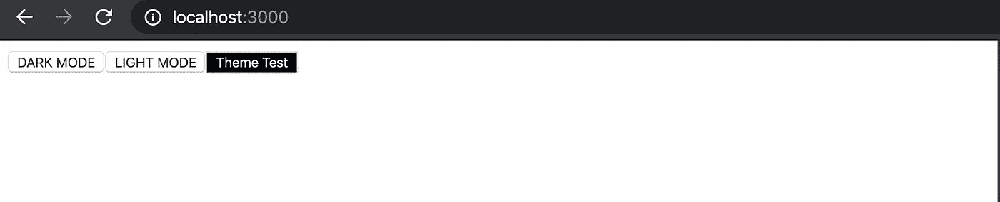
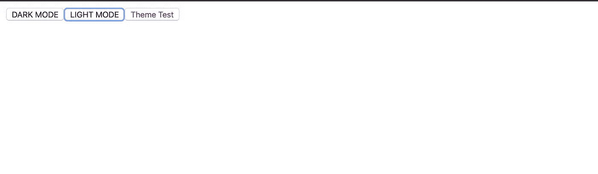

# 在 Next.js 中的暗主题和亮主题之间切换

> 原文：<https://betterprogramming.pub/%EF%B8%8F-switch-between-dark-light-themes-in-next-js-244c30c7d99a>

## 使用样式组件和使用暗模式


Elliott Engelmann 在 [Unsplash](https://unsplash.com/s/photos/dark?utm_source=unsplash&utm_medium=referral&utm_content=creditCopyText) 上拍摄的照片

这里，我将使用一个样板文件 [Next.js](https://nextjs.org/) 项目，它是使用 [create-next-app](https://github.com/zeit/create-next-app) 创建的。

```
npx create-next-app project-name
```

接下来，在项目目录中的任意位置创建一个主题文件。我调用我的`theme.js`并把它放在顶层目录中。

在这里，我们将风格分为浅色和深色主题。我有背景和字体颜色。浅色主题有白色背景和紫色字体，深色主题有黑色背景和白色字体。简单！

现在，我们可以将[样式化组件](https://styled-components.com/)添加到我们的项目中。

```
npm i styled-components
```

我们还想添加[使用黑暗主题](https://github.com/donavon/use-dark-mode)。这使得我们可以轻松地在暗主题和亮主题之间切换。

```
npm i use-dark-mode
```

将主题实现到我们整个应用程序的最佳方式是使用`/pages/_app.js`文件。你可以在 Next.js 的网站上阅读更多关于这个[的内容。](https://nextjs.org/docs/advanced-features/custom-app)

基本上，`_app.js`会将所有其他页面换行。如果没有这个文件，您需要创建它。下面是一个将我们的主题应用到整个应用程序的例子:

[样式组件](https://styled-components.com/)提供了一个方便的`<ThemeProvider/>`来接收`theme`道具。这个`theme`属性被传递给我们应用程序中的所有组件。

接下来，我们使用接受默认布尔值的`useDarkMode`创建一个`darkMode`对象。[使用黑暗模式](https://github.com/donavon/use-dark-mode)读取浏览器的`localStorage`并返回一个保存当前选中主题的`darkMode`对象。

由于 Next.js 在服务器上合并了我们的应用程序，并且我们的主题存储在浏览器中，这可能会在渲染时导致一些不稳定的行为。因此，为了避免这种情况，我们使用`useEffect`将页面包装在一个`isMounted`条件中，这个条件在客户端变成了`true`。

我还创建了两个按钮来切换黑暗和光明的主题。你可以通过`darkMode`对象的`darkMode.enable`和`darkMode.disable`方法使用一个开关或任何组件。

让我们使用[样式化组件](https://styled-components.com/)创建一个`<Button/>`组件。

由于我们的`<ThemeProvider/>`，这个组件将收到我们在`theme.js`中创建的主题作为道具。

让我们把`<Button/>`加到`/pages/index.js`上。我已经删除了样板代码，并代之以这个简单的页面。

测试你的主题！



🌙深色模式



☀️光模式

就是这样！享受您的多主题 Next.js 应用程序！

[](https://github.com/skolhustick/next-dark-mode) [## skolhustick/下一个黑暗模式

### 这是一个用 create-next-app 引导的 Next.js 项目。首先，运行开发服务器:打开…

github.com](https://github.com/skolhustick/next-dark-mode)