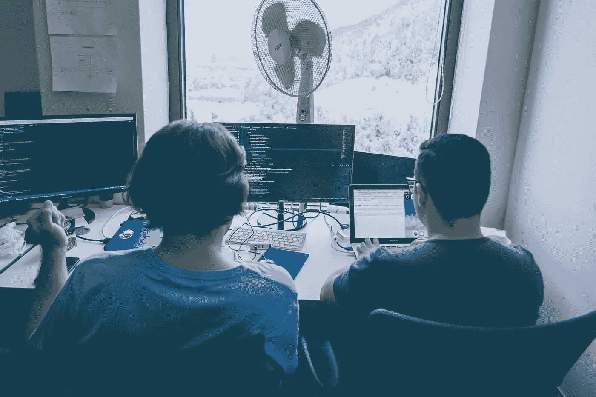

# 逃离代码审查地狱的一个重要技巧

> 原文：<https://betterprogramming.pub/1-crucial-tip-to-escape-code-review-hell-ae59cb3baa47>

## 如何进行更快更有效的代码评审

阿尔瓦罗·雷耶斯在 [Unsplash](https://unsplash.com/?utm_source=unsplash&utm_medium=referral&utm_content=creditCopyText) 上拍摄的照片

两周前，我把我的代码提交给了评审。它仍然没有被批准。

我在第六次修订代码。前一天，我已经修复了负责我正在修改的代码库的工程师留下的评论。今天，又有一轮关于新零件的评论。

*他为什么不检查所有的代码？*

我累了。我给他发了信息。“嘿，我能和你当面聊聊我的公关吗？”

"当然，随时到我的办公桌来."

我走到他靠窗的桌子旁，拉过一把椅子。他调出了我的代码审查。他很有帮助地向我展示了他的评论，并感谢我迄今为止所做的改变。

然后我们讨论了我的代码的实际设计。

我向他解释了我想做的事情。他指出了一种他认为更好的构建代码的不同方式，因为它遵循了他的代码库的风格。“看起来不错。只要做出改变，我就会批准。”

我屁股坐在最近的沙发上，做了修改，然后把它送了回去。他几分钟内就批准了。

# 提高代码评审的一个技巧是面对面进行(或者通过视频电话)。

自从那次经历之后，我有了同样的机会——为整个公司评审面向客户的 API 代码。我每天至少评审一个来自不同人的代码评审。

许多代码评审不需要任何交互。它们简单明了。一个功能变化。逻辑上的改变。

但是每当我得到一个真正试图改变事情的评论——实现一些新功能或者修改核心框架——我都会特意去和作者聊天。

我会理解他们想做什么，为什么，然后提出一些更大的结构性变革。大的重构完成后，我们会做小代码风格的 nits。

代码审查时间可以减少一半。

# 你的评论很慢，因为评论者不理解你的目标。

代码告诉你到底发生了什么，但不告诉你为什么。

但是一个问题总是有多个解决方案。我会问某人他们实际上在做什么。一旦我知道了原因，我就可以提出更好的解决方案。

如果你只关注树木，修复森林会花费你更长的时间。在修复所有代码风格问题之前，您需要获得正确的结构。代码评审工具并不总是理解上下文的最佳工具。有时人们链接整个规范文档。但是你的评审者不应该阅读你的整个项目来评审你的代码——他们是在为你服务。

当你与某人面对面交谈时，你的通信带宽从 1 Mbps 到 1 Gbps。

# 你的评论很慢，因为它们是异步的。

异步通信很方便。但是效率不高。

我并不主张每次代码审查都需要开会。你可以让它非侵入性和快速。

当我们回到办公室时，如果我审查坐在我旁边的同事的代码，我会把我的椅子转过来进行审查。现在每个人都在远程工作，我打赌更多的人被困在代码审查地狱，因为没有那么多面对面的快速聊天。

使快速空闲呼叫正常化。代码审查不需要花很长时间。

尝试结对编程代码审查。

# **人们面对面比通过短信更友好。**

这是互联网的真理。

代码审查并不像在线聊天室那样糟糕，但是你确实会通过文本失去共鸣和语气。当人们只是对你的代码吹毛求疵时，你可能会认为他们是在发牢骚，或者他们试图证明他们的优越性。你最好和某人面对面地交谈，而不是和他斗气，然后留下消极的、攻击性的代码评审评论。

这个建议是双向的。

如果你得到一个令人沮丧的代码审查，或者如果你是被审查者挫败的那个人，和另一边的人谈谈。