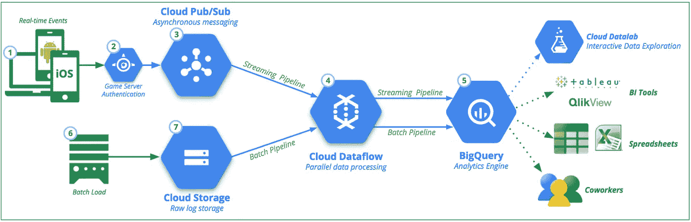
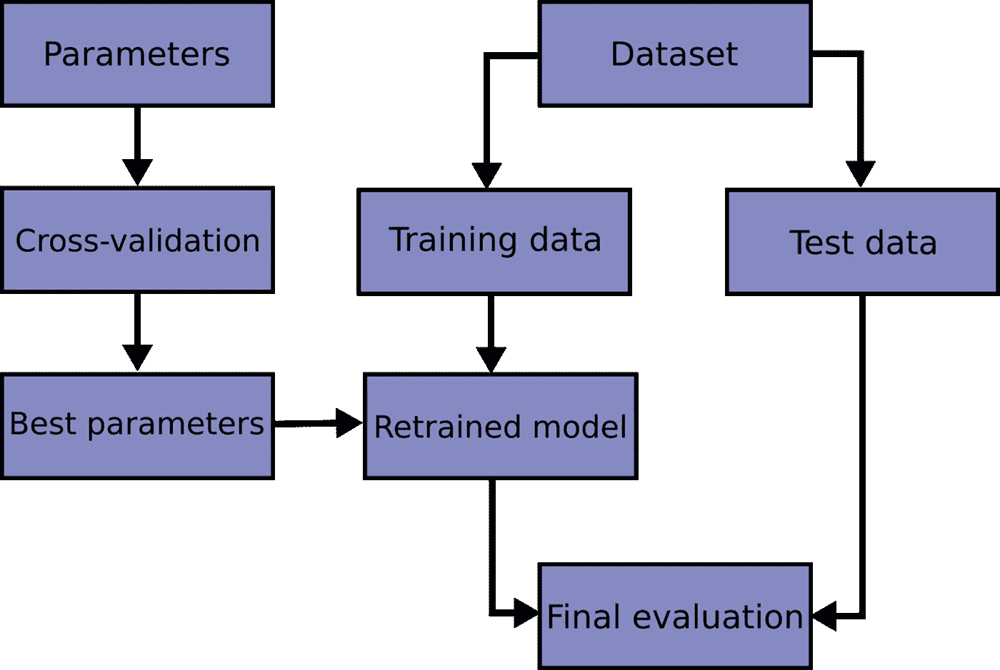
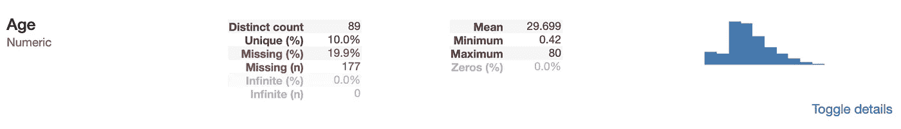
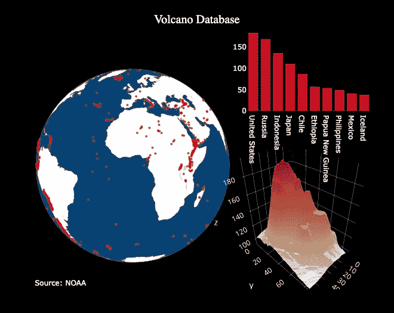
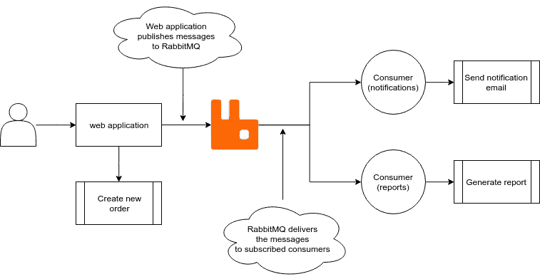

# 关于 Python 编程和机器学习的 10 篇精彩文章

> 原文：<https://betterprogramming.pub/10-amazing-articles-on-python-programming-and-machine-learning-week-3-a425a9159bff>

## 流式数据管道、fklearn、交叉验证等等

# 1.让我们建立一个流数据管道

用于实时数据管道的[阿帕奇波束](https://beam.apache.org/)和[数据流](https://cloud.google.com/dataflow/docs/)。

丹尼尔·福利。

> “今天的帖子是基于我最近在工作中做的一个项目。我真的很兴奋能实现它，并把它写成一篇博文，因为它给了我一个机会去做一些数据工程，也做了一些对我的团队非常有价值的事情。
> 
> 不久前，我发现我们的系统中存储了大量与我们的一个数据产品相关的用户日志数据。"

[阅读全文。](https://towardsdatascience.com/lets-build-a-streaming-data-pipeline-e873d671fc57)

# 2.通过建造一个来了解区块链

了解区块链工作方式的最快方法是建造一个。

丹尼尔·范·弗莱明。

> “在您开始之前…
> 
> 请记住，区块链是一个不可变的顺序记录链，称为块。它们可以包含交易、文件或任何你喜欢的数据，真的。但重要的是，它们是用哈希链接在一起的。"

[阅读全文。](https://hackernoon.com/learn-blockchains-by-building-one-117428612f46)

# 3.fklearn 简介:Nubank 的机器学习库(第 1 部分)

作者卢卡斯·埃斯特万。

> “Nubank 刚刚开源了 [fklearn](https://github.com/nubank/fklearn) ，我们的机器学习 Python 库！
> 
> 在 Nubank，我们非常依赖机器学习来做出可扩展的数据驱动的决策。虽然有许多其他的 ML 库(例如，我们广泛使用 [Xgboost](https://xgboost.readthedocs.io/en/latest/) 、 [LGBM](https://lightgbm.readthedocs.io/en/latest/) 和 [ScikitLearn](https://scikit-learn.org/stable/) ，但是我们觉得需要一个更高级别的抽象来帮助我们更容易地将这些库应用到我们面临的问题中。
> 
> Fklearn 有效地将这些库包装成一种格式，使得它们在生产中的使用更加有效。"

[阅读全文。](https://medium.com/building-nubank/introducing-fklearn-nubanks-machine-learning-library-part-i-2a1c781035d0)

# 4.时间序列预测的交叉验证策略

> “时间序列建模和预测既棘手又具有挑战性。 [i.i.d(同分布独立性)](https://www.statisticshowto.datasciencecentral.com/iid-statistics/)假设不适用于时间序列数据。
> 
> 对以前的观察有一种隐含的依赖性，同时，除了数据空间中固有的非平稳性之外，从响应变量到滞后变量的数据泄漏更有可能发生。
> 
> 所谓非平稳性，我们指的是观察到的统计数据(如均值和方差)的闪烁变化。当考虑到固有的非线性时，事情变得更加棘手。"

[阅读全文。](https://hub.packtpub.com/cross-validation-strategies-for-time-series-forecasting-tutorial/)

# 5.Python 中机器学习的 Numpy 基本指南

ML 的精华库。

作者西达尔特·迪克希特。

> “为什么这对你有用？
> 
> 好吧，因为我们大多数人倾向于忘记(在那些已经实现了 ML 算法的情况下)各种库函数，并最终使用纯粹的逻辑为预先存在的函数编写代码，这是浪费时间和精力，在这种情况下，如果一个人理解被有效使用的库的细微差别，这就变得至关重要。
> 
> 因此，Numpy 作为机器学习的基本库之一，需要一篇自己的文章。"

[阅读全文。](https://becominghuman.ai/an-essential-guide-to-numpy-for-machine-learning-in-python-5615e1758301)

# 6.如果你喜欢旅行，让 Python 帮你刮到最好的廉价航班！

法比奥·内维斯

> “简而言之，这个项目的目标是建立一个 web scraper，它将运行并执行具有灵活日期(在您选择的日期前后最多三天)的航班价格搜索，用于特定的目的地。
> 
> 它将结果保存在 Excel 中，并通过电子邮件发送快速统计数据。显然，目标是帮助我们找到最好的交易！"

[阅读全文。](https://towardsdatascience.com/if-you-like-to-travel-let-python-help-you-scrape-the-best-fares-5a1f26213086)

# 7.使用 Pandas-Profiling 加速您的探索性数据分析

只需一行代码就能直观地了解数据的结构。

作者卢卡斯·弗雷。

> “第一次导入新数据集时，首先要做的是了解数据。
> 
> 这包括确定特定预测值的范围、识别每个预测值的数据类型以及计算每个预测值缺失值的数量或百分比等步骤。"

[阅读全文。](https://towardsdatascience.com/speed-up-your-exploratory-data-analysis-with-pandas-profiling-88b33dc53625)

# 8.Python 中数据可视化的下一个层次

如何用一行 Python 代码制作出好看的、全交互的情节？

威尔·科尔森。

> “沉没成本谬论是人类遭受的许多有害的认知偏见之一。它[指的是我们倾向于](https://youarenotsosmart.com/2011/03/25/the-sunk-cost-fallacy/)继续将时间和资源投入到一个失败的事业中，因为我们已经在追求中花费了——沉没了——太多的时间。”

[阅读全文。](https://towardsdatascience.com/the-next-level-of-data-visualization-in-python-dd6e99039d5e)

# 9.具有 RabbitMQ 的分布式系统

> “在本文中，我们将讨论分布式系统的好处，以及如何使用 [RabbitMQ](https://www.rabbitmq.com/) 迁移到分布式系统。然后，我们将学习 RabbitMQ 的基础知识，以及如何使用 Python 与它进行交互。”

[阅读全文。](https://apirobot.me/posts/distributed-systems-with-rabbitmq)

# 10.用黑色随意格式化 Python

在涵盖七个 PyPI 库的系列文章中，了解更多关于解决常见 Python 问题的信息。

作者 Moshe Zadka(社区版主)。

> “Python 是当今使用的最流行的编程语言之一，这是有充分理由的:它是开源的，用途广泛(如 web 编程、商业应用、游戏、科学编程等等)，并且有一个充满活力的专门社区支持它。
> 
> 这个社区是我们在 [Python 包索引](https://pypi.org/) (PyPI)中提供如此大范围、多样化软件包的原因，以扩展和改进 Python 并解决出现的不可避免的小故障。"

[阅读全文](https://opensource.com/article/19/5/python-black)。

# **其他伟大的数据科学和数据工程资源**

*   [软件工程师面试学习指南](https://www.coriers.com/the-interview-study-guide-for-software-engineers/)
*   [学习数据科学:我们排名前 25 的数据科学课程](https://www.coriers.com/25-of-the-best-data-science-courses-online/)