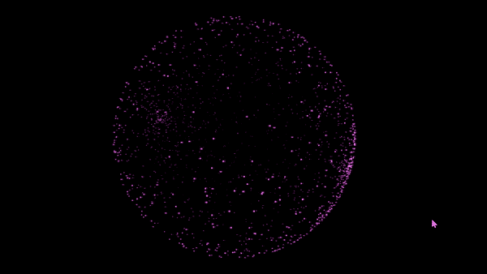
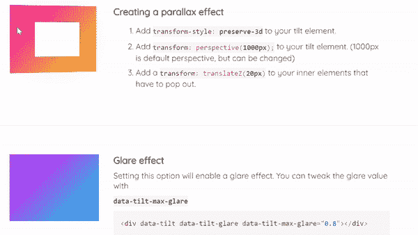
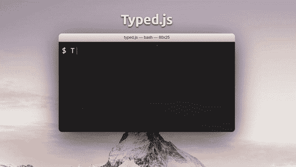
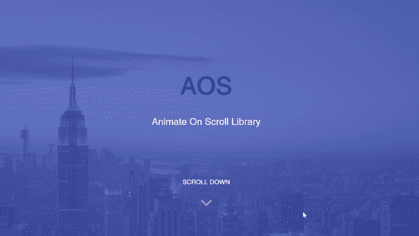
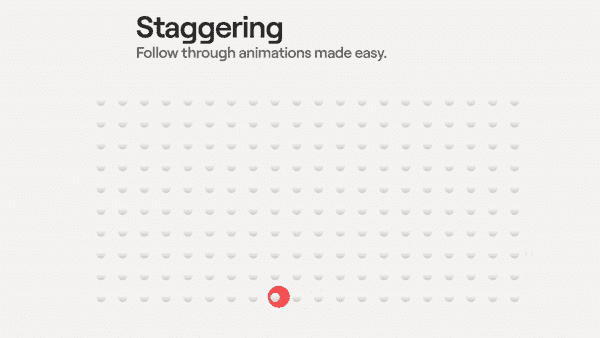
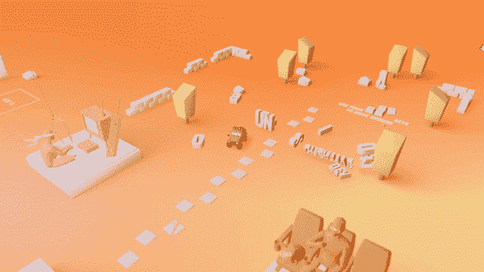
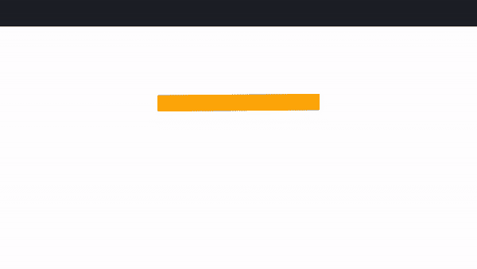
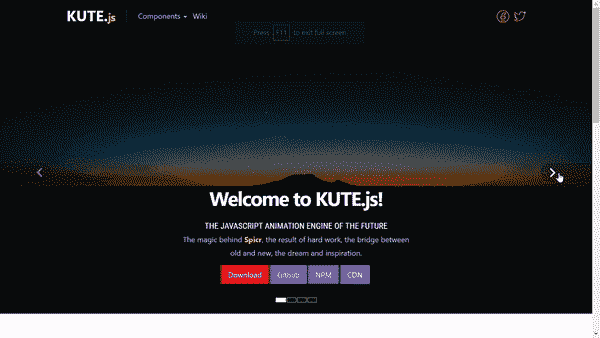
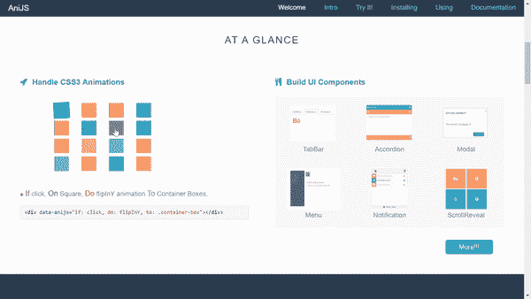
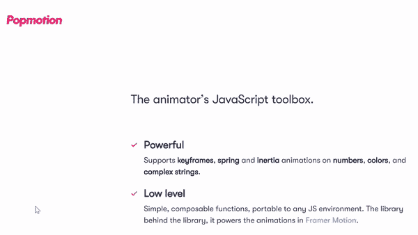

# 2021 年将使用的 10 个令人惊叹的 JavaScript 动画库

> 原文：<https://betterprogramming.pub/10-amazing-javascript-animation-libraries-to-use-in-2021-4ed8862d64ed>

## 构建漂亮的 web 应用程序

由 [Unsplash](https://unsplash.com/s/photos/javascript-library?utm_source=unsplash&utm_medium=referral&utm_content=creditCopyText) 上的[美元吉尔](https://unsplash.com/@dollargill?utm_source=unsplash&utm_medium=referral&utm_content=creditCopyText)拍摄的照片。

JavaScript 库对于任何 web 开发人员来说都是非常有价值的工具。使用 CSS 可以很容易地添加简单的动画，但是一旦涉及到更复杂或更高级的效果，JavaScript 是更好的工具。
在可以找到的无穷无尽的库当中，这里是 2021 年使用的十个最好的 JavaScript 动画库。

# 1. **GSAP**

来源:[绿袜子](https://greensock.com/)

[GSAP](https://greensock.com/) 是来自 GreenSock 的一个坚实的动画库，让你创建高级动画来打动你的用户。这些动画在每个设备上都很好看，在所有主流浏览器上都运行良好。

以下是使用 GSAP 的网站的快速展示:

来源:[YouTube 上的 green socklearning](https://www.youtube.com/channel/UCFPckx3BFK_GvJag82CjDlg)

# 2.香草-tilt.js

来源: [Vanilla.tilt.js](https://micku7zu.github.io/vanilla-tilt.js/)

[Vanilla-tilt . js](https://micku7zu.github.io/vanilla-tilt.js/)**是从 [Tilt.js (jQuery 版本)](http://gijsroge.github.io/tilt.js/)分叉出来的轻量级 3D tilt JavaScript 库。这个库用普通的 JavaScript 编写，为你网页上的任何元素创建视差 3D 倾斜悬停效果。**

# **3.Typed.js**

****

**来源: [Typed.js](https://mattboldt.com/demos/typed-js/)**

**[Typed.js](https://mattboldt.com/demos/typed-js/) 是一个 JavaScript 打字动画库。它非常易于使用，高度可定制。**

# **4.AOS(卷轴动画)**

****

**来源: [AOS](https://michalsnik.github.io/aos/)**

**[AOS](https://michalsnik.github.io/aos/) 是一个库，允许你将不同的动画(向下滚动时触发)应用到网页的任何元素。**

# **5.Anime.js**

****

**来源: [Anime.js](https://animejs.com/)**

**[anime . js](https://animejs.com/)**是一个轻量级的 JavaScript 动画库。通过一个统一的 API，Anime.js 可以处理 CSS、SVG、DOM 属性和 JavaScript 对象。****

# **6.三. js**

****

**来源:[布鲁诺西蒙](https://bruno-simon.com/)**

**[Three.js](https://threejs.org/) 是一个 JavaScript 库和 API，用于使用 WebGL 创建动画 3D 计算机图形。**

# **7.弹跳. js**

****

**来源: [Steven Monson 在 CodePen 上](https://codepen.io/stevenmonson/full/mepdzz)**

**[Bounce.js](http://bouncejs.com/) 是另一个 JavaScript 库，可以用来生成漂亮的关键帧动画。**

# **8.酷特网**

****

**来源: [KUTE.js](https://thednp.github.io/kute.js/)**

**KUTE.js 是一个 JavaScript 动画引擎，主要用于现代浏览器，但也支持旧浏览器，包括其遗留组件、工具和填充。**

# **9.阿尼伊斯**

****

**资料来源: [AniJS](http://anijs.github.io/)**

**[AniJS](http://anijs.github.io/) 是一个 JS 动画库，它允许你使用“类似句子”的结构，以非常简单的方式向元素添加动画。**

# ****10。Popmotion****

****

**来源: [Popmotion](https://popmotion.io/)**

**Popmotion 是一个轻量级但非常强大的 JavaScript 动画库，因为它支持数字、颜色和复杂字符串的关键帧和弹簧动画。**

# **结论**

**试试这些动画库，让我知道你对它们的看法！**