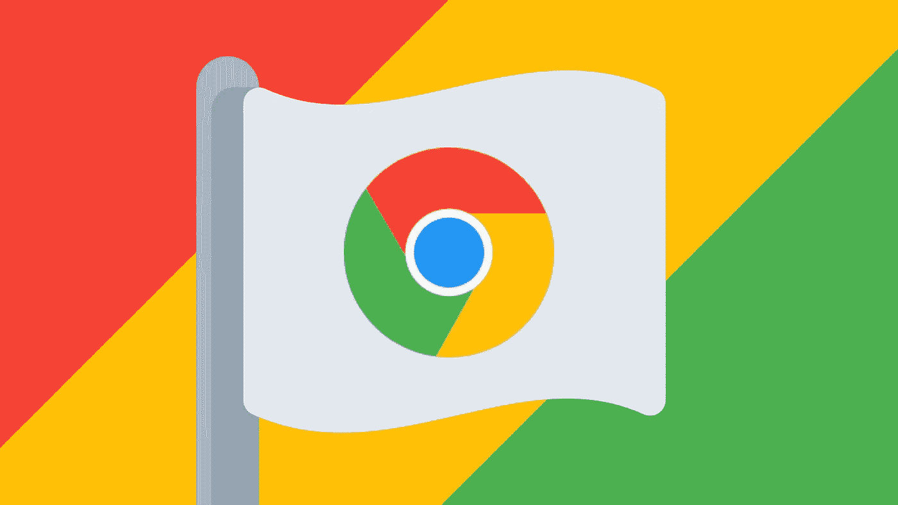
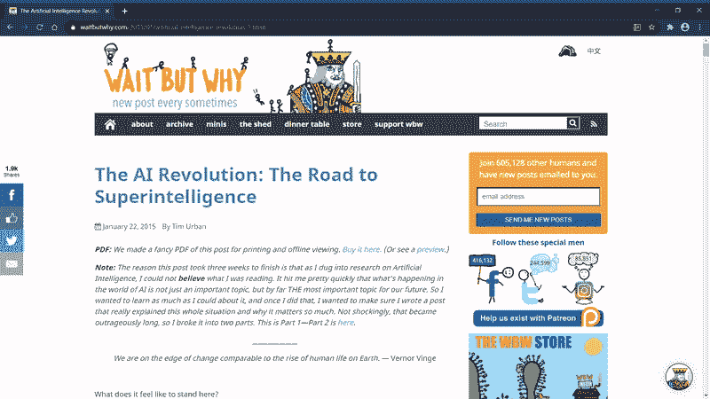
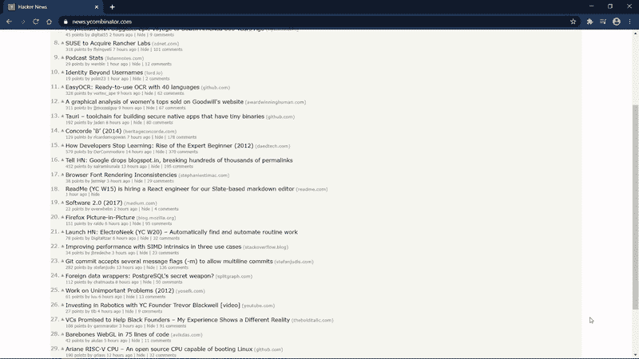
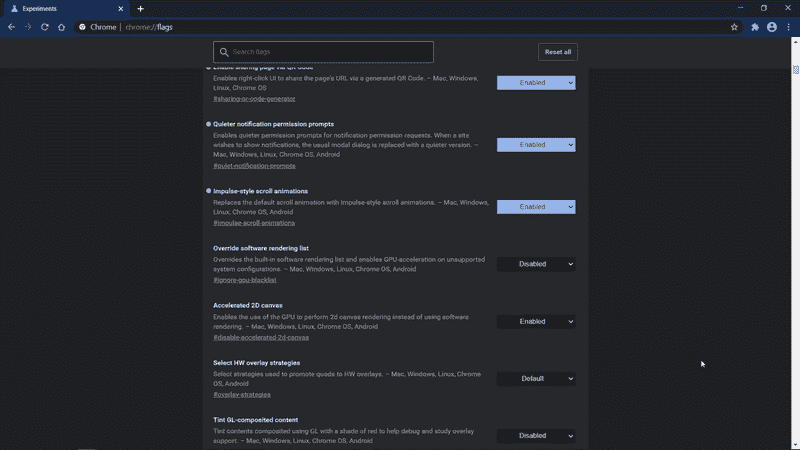
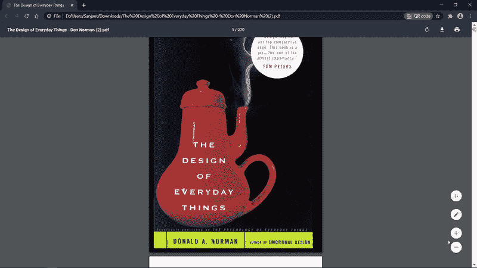
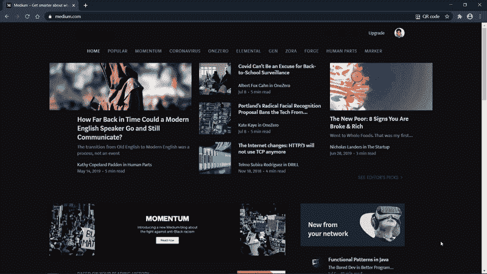
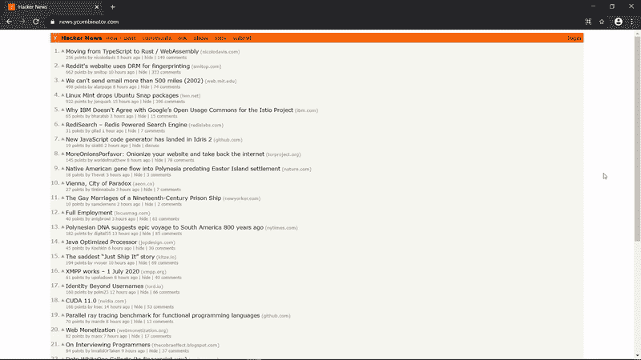
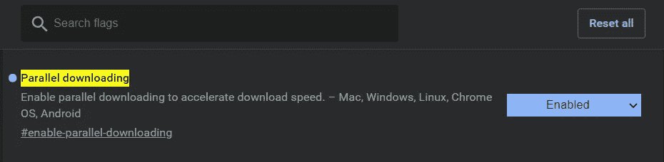

# 你应该马上启用的 10 个很棒的 Chrome 标志

> 原文：<https://betterprogramming.pub/10-awesome-chrome-flags-you-should-enable-right-now-2684e4518cb5>

## 使用这些实验性功能增强您的浏览体验

图片来源:作者

如果你能神奇地用普通 Chrome 用户不知道的功能升级你的浏览器，那不是很酷吗？

下面是十个 Chrome 标志，可以帮助你做到这一点。

Chrome 标志是实验性的功能，默认情况下还没有启用。要启用这些，请参见 **chrome://flags** 。下述标志可能会在不久的将来正式发布。然而，截至发稿时，它们仍在测试中。

# 阅读器模式

阅读器模式消除了不必要的视觉混乱，使阅读不受干扰——当这么多视觉元素争夺我们的注意力时，这一点非常重要。噗，没了。

chrome://flags/#启用阅读器模式

# 聚焦模式

焦点模式在新的框架窗口中打开选项卡，省略选项卡条和搜索栏，以获得更整洁的界面。

chrome://flags/#焦点模式

# 冲动式滚动动画

重建他们的 Edge 平台，微软将他们的自然滚动动作带到了 Chromium。

> “主要的想法是，鼠标滚轮的每一次‘滴答’都试图模仿一个基于物理的世界，在这个世界中，内容开始快速移动(一种冲动)，然后由于摩擦而变慢。”—微软

chrome://flags/#脉冲滚动动画

# 选项卡组

标签组用于对多个标签进行分组和管理，例如不同类型的奶酪。

chrome://flags/#tab-groups

# PDF 双联视图

PDF 双联视图用于一次查看两页的 PDF。有意思。

chrome://flags/# pdf-双联视图

# 对网页内容强制使用黑暗模式

这迫使所有的网站都使用深色主题——即使是那些还没有的网站，比如 Medium。是的，看着你，中等。

chrome://flags/#启用-强制-黑暗

# 更安静的通知权限提示

这是一个简单的功能，可以减少干扰您流程的权限提示。

chrome://flags/# quiet-通知-提示

# 选项卡悬停卡

选项卡悬停卡在悬停时显示选项卡预览。当你打开了超过 30 个标签，却无法再阅读标签标题时，它可能会派上用场。

chrome://flags/# tab-hover-cards**T8**chrome://flags/# tab-hover-card-images

# 通过二维码实现页面共享

此标志允许您共享带有 QR 码的网页，以便轻松地将内容发送到您的手机。当然，它配有一个很棒的恐龙吉祥物。

**注意:**截至发稿时，这似乎只适用于 [Chrome 金丝雀](https://www.google.com/intl/en_uk/chrome/canary/)。

chrome://flags/#共享-二维码-生成器

# 并行下载

Chrome 可以建立多个连接来分部分下载单个文件，从而提高下载速度。

chrome://flags/# enable-并行下载

# 结论

还有更多的 Chrome 标志正在测试中，更多的功能即将推出。如果你喜欢生活在边缘，看看 Chrome Canary——网络的前沿。

**感谢阅读。**