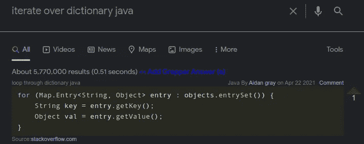
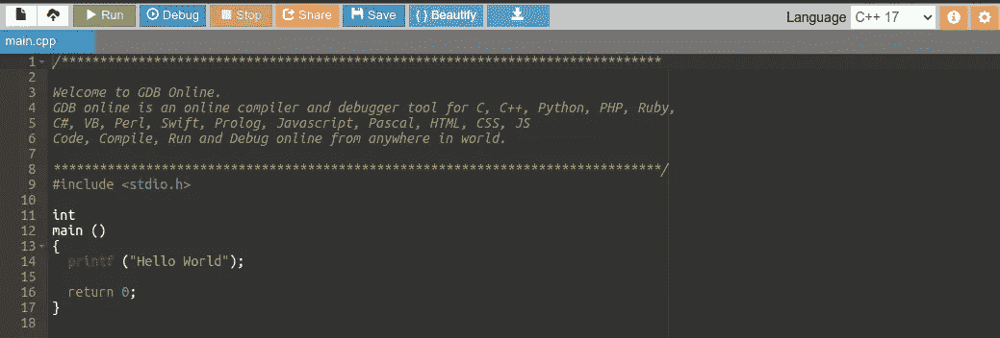
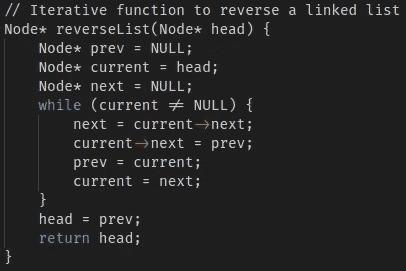
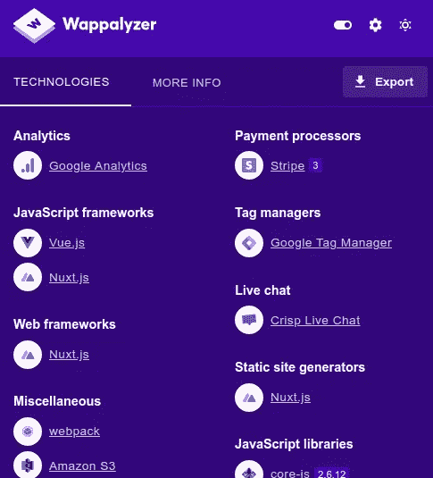
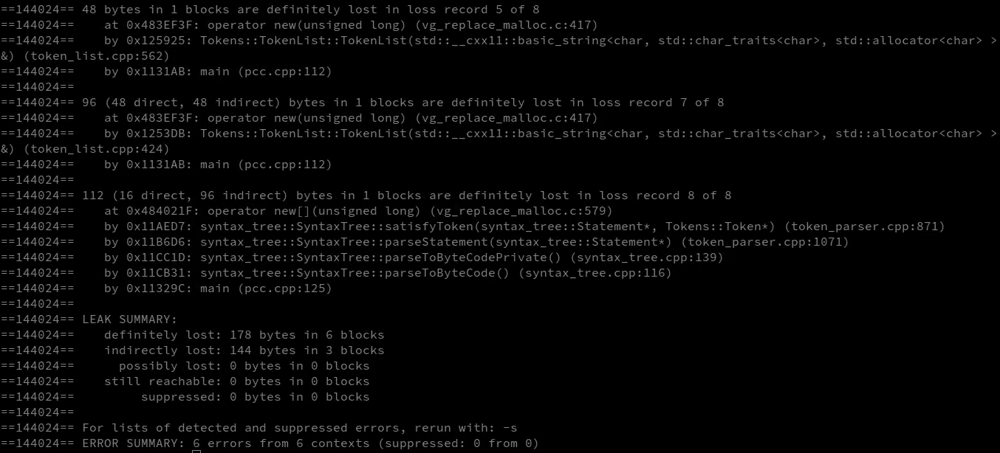
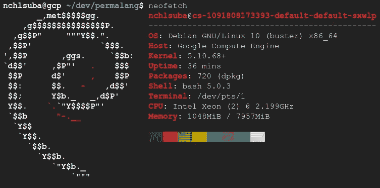
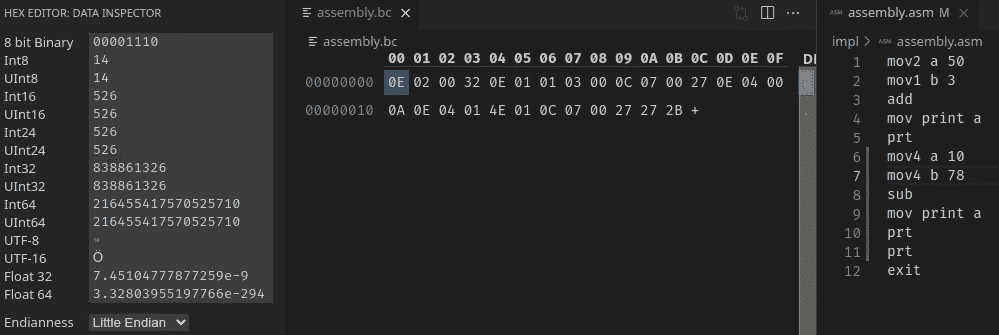

# 10 个非常棒的免费开发工具和网站

> 原文：<https://betterprogramming.pub/10-awesome-free-productivity-tools-and-websites-for-developers-47310707fda2>

## 检测内存错误，创建令人惊叹的用户界面，等等

由[谷仓图片](https://unsplash.com/@barnimages?utm_source=medium&utm_medium=referral)在 [Unsplash](https://unsplash.com?utm_source=medium&utm_medium=referral) 上拍摄

作为软件开发人员，我们不断地处理解决问题和学习新技术。然而，时间是有限的，所以你必须选择如何有效地投资。这就是为什么手动执行愚蠢单调的任务会大大降低生产力，增加开发时间。

幸运的是，有很多很棒的工具可以自动化那些无聊的重复任务，比如测试、为切换用例处理程序编写代码，或者建立一个开发环境。将长时间的无脑工作留给自动化工具，可以让你更专注于实际问题的解决，而不是做机器人的工作。

我否认我不是我要上市的任何公司的附属公司。还有，我要讲的所有工具都可以免费使用。

# 代码 Grepper

[Code Grepper](https://www.codegrepper.com/) 是一个基于社区的问答系统，它允许开发者获得他们的问题和难题的即时答案。它由一个浏览器扩展组成，提供它认为可能与您的搜索相关的代码片段。

您不仅可以查看其他开发人员的回答，还可以为您的搜索查询保存一段代码。这样你可以帮助其他可能有同样问题的人，甚至是你未来的自己，以防你再次寻找同样的东西。

许多人认为它是 TL；栈溢出的 DR 版本；其他人鄙视它，说它只是抄袭者的工具。在我看来，它本身并不坏，也不是好的:这取决于你是否负责任地使用这些建议，并确保你理解代码实际上做了什么。

代码 Grepper 演示。

# 引导程序

大多数 web 开发人员已经知道了 [Bootstrap](https://getbootstrap.com/) ，这是一个免费的开源 CSS 框架，可以让您访问大量的 CSS 和 JavaScript 用户界面设计模板。另一方面，后端开发人员可能不知道 Bootstrap 对他们有多大好处，特别是因为它减轻了从头编写 UI 代码的负担，这是后端开发人员通常讨厌的任务。

以下是产品定价页面的模板示例:

引导模板示例。

# 在线编译器和调试器

有时，您可能碰巧需要运行或调试一些代码，但是您不想仅仅为了这些而设置开发环境。这就是在线编译器派上用场的地方:您可以快速运行和调试代码，而无需安装任何依赖项或接触您的系统。

有许多选择，但我推荐的是[在线 GDB](https://www.onlinegdb.com/) ，一个支持许多语言的在线调试器和编译器，包括 C、Java、Python、Rust 等等。

在线 GDB 演示。

# 人工智能代码完成引擎

你有没有经历过编写冗长重复的 switch-case 处理程序，或者看起来没完没了的枚举，甚至无聊的代码文档的挫败感？忘记这种感觉与现代人工智能完成引擎。这种工具可以大大提高你的工作效率，尤其是在人类打字速度遇到瓶颈的时候。

此外，人工智能可以提出不同的建议，有时甚至比你更好的方法来解决特定的问题。虽然有时可能有点可怕，但这是一个供您使用的非常棒的工具。

有许多人工智能完成引擎，其中我试过[风筝](https://www.kite.com/)、[塔布宁](https://www.tabnine.com/)和 [GitHub 副驾驶](https://copilot.github.com/)。截至目前，GitHub Copilot 似乎是最好的、更强大的代码和文档完成工具。

GitHub Copilot 演示。

# 浏览器远程 IDE

假设您的开发环境在云上，或者您只是不想在本地机器上设置它。那么基于浏览器的远程 ide 可能是一个很好的选择，因为它们允许你在任何地方通过利用远程服务器的高性能和存储来开发和运行你的程序，只要你有一个像样的互联网连接。

我个人推荐亚马逊的 [Cloud9 IDE](https://aws.amazon.com/cloud9/) 或者 VSCode 的[远程开发扩展包](https://code.visualstudio.com/docs/remote/remote-overview)，这是我实际使用的工具。

# 瓦帕里斯

有时，您可能需要知道某个网站使用了哪些技术，这可能是因为您想知道它是如何工作的，或者是为了合法地利用潜在的漏洞。 [Wappalyzer](https://www.wappalyzer.com/) 是一个浏览器扩展，可以让你免费获得网站使用哪些框架和库的信息，甚至联系方式和监控变化，但只对付费用户开放。

Wappalyzer 网站上的 Wappalyzer 演示。

# 瓦尔格兰

当使用低级程序时，最乏味的错误源于内存错误和泄漏，例如，访问未初始化的指针或溢出缓冲区。Valgrind 是一个内存分析工具，可以在程序运行时检测泄漏和其他问题。

Valgrind 是 C 和 C++开发人员的必备工具，因为他们经常需要直接在内存上工作。即使是专业工程师也会犯错误，而那些关于记忆的错误通常是最难察觉的；当你得到一个看似随机的[分段错误](https://en.wikipedia.org/wiki/Segmentation_fault)或者一个意想不到的结果时，你只会在它们发生很久之后才发现它们。有时，它们甚至会传播数月而不被注意，直到您尝试使用程序的某个特定功能。在这种情况下，如何知道代码的哪一部分导致了错误(如果有的话)？

瓦尔格兰演示。

# 云壳

假设您无法访问您的物理机器，或者您只是出于某种原因(包括性能或潜在威胁)不想在本地运行 shell。那么云壳就是要走的路。在所有选项中，我更喜欢的是 [Google Cloud Shell](https://cloud.google.com/shell) ，这是一个免费的基于 Debian 的 Bash shell，允许你在普通的本地机器上做任何你想做的事情。

当您的计算机没有足够的资源来运行某些程序时，云外壳会特别有用。通过利用强大的远程服务器，您可以并行处理您的工作并节省大量时间。另外，请注意，即使很小的云容器也可以比您的本地机器运行得更快。例如，一个只有 2 个 vCPUs 的免费 Google Cloud Shell 可以在 20 秒内编译[这个编译器](https://github.com/nic-obert/permalang)，而我的英特尔 i7 8 核 PC 需要 27 秒，这要归功于它强大的英特尔至强处理器。

谷歌云壳演示。

# 十六进制编辑器

大多数软件开发人员不经常使用十六进制编辑器，要么是因为他们的工作不需要它，要么是因为他们不知道它们有多大用处。作为一个喜欢构建编译器的程序员，我总是发现自己在使用 [VSCode 的十六进制编辑器扩展](https://marketplace.visualstudio.com/items?itemName=ms-vscode.hexeditor)检查生成的二进制文件。我很少在这方面使用在线工具，但如果必须的话，我会用 [HexEd.it](https://hexed.it/) (它甚至有一个黑暗的主题)。

如果你使用除了纯文本之外的任何文件，你很可能会喜欢十六进制编辑器。通过让您看到文件在内存中的实际样子，它们在调试中给了您很大的帮助，特别是在字节序和数据格式问题上。

十六进制编辑器扩展演示。

# GitHub Gists

作为一个编程相关的媒体写手，我经常需要在文章中展示代码。尽管 Medium 有一个内置的代码特性，但它还远非完美。这就是为什么我使用 [GitHub Gists](https://docs.github.com/en/github/writing-on-github/editing-and-sharing-content-with-gists/creating-gists) 的原因，这是一种简单而令人敬畏的方式，可以在互联网上分享格式化的和颜色突出的代码片段。

GitHub 为大多数主要的编程语言提供了语法高亮，并为你的 gists 提供了免费的存储空间。此外，它们可以作为 HTML 元素嵌入到网页中，并且目前许多平台都支持它们，包括 Medium。

GitHub Gists 演示。

# 结论

利用处理简单但耗时的任务的生产力工具，通过让您专注于解决问题的部分，而不是成为自动机，极大地提高了您的开发效率。毕竟，程序员的工作应该是一项脑力密集型任务，而不应该是你打字有多快或者你的机器有多强大。

> 时间是有限的:明智地选择如何在最重要的事情上投资。

我希望你喜欢这篇文章。如果你使用了任何其他你认为值得一提的好工具，请在评论中分享。

感谢阅读！

如果你对软件开发人员的更多免费工具感兴趣，我建议你看看下面这个故事:

 [## 7 家面向软件开发人员的免费云托管服务提供商

### AWS、Pythonanywhere 等等

better 编程. pub](/7-free-cloud-hosting-service-providers-for-software-developers-99ed433ccdc6)