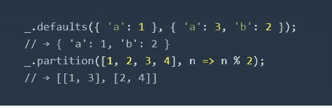
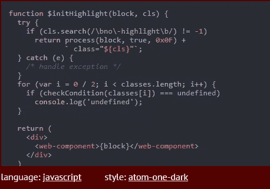
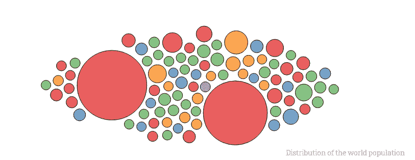
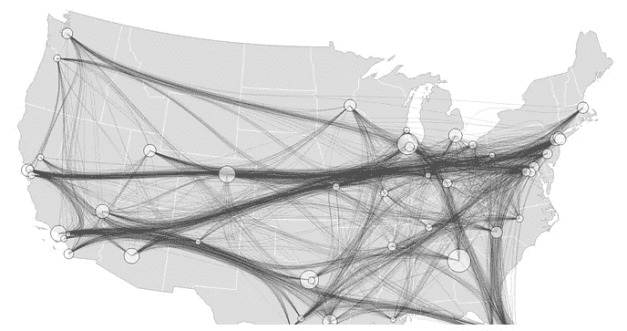
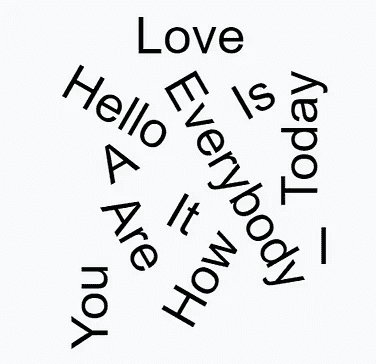
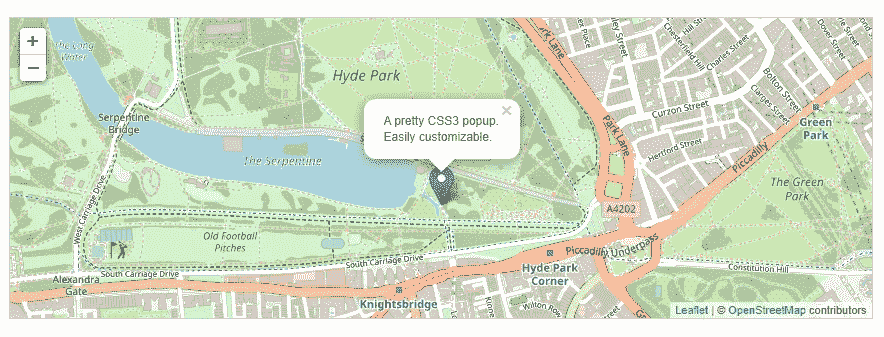

# 2020 年面向前端开发人员的 10 个出色的 JavaScript 库

> 原文：<https://betterprogramming.pub/10-awesome-javascript-libraries-for-front-end-developers-in-2020-d450b9ed66d1>

## 3D、更好的日期、字符串操作、图表等等\


苏珊·霍尔特·辛普森在 [Unsplash](https://unsplash.com/s/photos/building-blocks?utm_source=unsplash&utm_medium=referral&utm_content=creditCopyText) 上的照片

这篇文章最初发表在智能编码器的[上。](https://thesmartcoder.dev/10-awesome-javascript-libraries-for-front-end-developers-in-2021/)

JavaScript 运行网络。您可以在浏览器中使用它，可以在服务器上使用它，也可以在移动应用程序中使用它。

虽然 JavaScript 本身很棒，但通过重要的生态系统，它会变得更好。虽然开发人员可以在每次开始新项目时重新发明轮子，但这是一个糟糕的策略，通常使用第三方库是有意义的。这样一个库有一个明确的目的，并希望在开发过程中为您处理特定的问题或挑战——无论是操纵数据、创建令人惊叹的可视化，还是帮助您进行函数式编程。

我不是说你应该什么都用图书馆。尤其是事业刚起步的时候，为了学习，自己编点东西还是不错的。但是在许多项目中，在有意义的地方使用库是一个好策略。

有很多好的 JavaScript 库。我在这里写了十个我觉得非常有用的东西。我从众多选择中选择了这些，因为它们被很好地记录，相当受欢迎，存在了一段时间，并在 2020 年积极维护。

# 1.拉姆达

[Ramda](https://github.com/ramda/ramda) 是一个很酷的用于函数式编程的 JavaScript 库，目前在 GitHub 上有 18000 颗星。JavaScript 的优点之一是开发人员可以选择喜欢函数式编程还是面向对象编程。两种哲学都有优点和缺点，但是如果你喜欢函数式编程，你绝对应该看看 Ramda。

主要特点是:

*   不变性和无副作用的功能
*   自动定制的功能
*   参数排列到 Ramda 函数中，方便使用

# 2.洛达什

Lodash 仍然是最流行和最有用的 JavaScript 库之一。它消除了处理字符串、数组、对象等的麻烦。它目前在 GitHub 上有 43000 颗星。

有用的功能有:

*   迭代字符串、对象和数组
*   创建复合函数
*   操纵和测试值



# 3.瞬间

如果您必须处理操作、验证、解析或格式化日期，那么 [Moment](https://github.com/moment/moment) 可能是最好的 JavaScript 库。它是轻量级的，成熟的，在 GitHub 上有 43，000+颗星。它在浏览器和 [Node.js](https://nodejs.org/en/) 中都有效。

这里有几个你可以用 Moment 做什么的例子:

```
moment().startOf('day').fromNow(); //8 hours ago
moment('2019-15-11').isValid() //false
moment('2019-02-21').isValid() //true
```

# 4.高亮显示. js

[highlight . js](https://github.com/highlightjs/highlight.js)是一个在浏览器和服务器上都可以使用的语法高亮库。它几乎适用于任何降价，并带有自动语言检测功能。

Highlight.js 会在

```
 标签之间搜索编程代码，尝试自动检测语言，高亮显示语法。它还支持不同的配色方案。
```

下面是一个 JavaScript 代码片段和代码编辑器中一个常见主题的示例:



例如，如果你有一个文档站点或博客，它就是一个有用的库。

# 5.D3

[D3](https://github.com/d3/d3) 是最流行的数据可视化库，目前有 89，500(！)GitHub 上的明星。它使用 web 标准，并利用现代浏览器的强大功能，帮助您用 HTML、SVG 和 CSS 赋予数据生命。

下面是一些你可以用 D3.js 做什么的例子:



D3 示例

它有一个陡峭的学习曲线，但是如果你有纪律去学习它，你可以用 D3 做令人敬畏的事情。

# 6.三. js

Three.js 是一个出色的 JavaScript 库，它使用 WebGL 作为主要渲染器，但也支持其他渲染器，如 Canvas 2D、SVG 和 CSS3D。它在 GitHub 上有 58，000 颗星星，你可以用它来创造非常酷的东西。

以下是几个可能的例子:


Three.js 示例

# 7.Voca

Voca 是一个很棒的操纵字符串的 JavaScript 库。它是长期支持的，目前在 GitHub 上有 2800 颗星。您可以使用它来操作字符串，如更改大小写、修剪、填充、slugify、拉丁化、截断、转义等。

其他功能包括:

*   一套完整的函数来操作，截断，格式化，转义和查询字符串
*   易于阅读和搜索的[文档](https://vocajs.com/)
*   [支持](https://saucelabs.com/u/panzerdp)多种环境，例如 Chrome、Firefox、Node.js
*   100%代码覆盖率，无依赖性

# 8.不可变的. js

使用不可变的数据结构有一些主要的优势，比如简化的应用程序开发，没有防御性复制，以及高级的记忆概念。

不可变的. js 给你不可变的数据结构，比如列表、堆栈、映射、集合等等。

# 9.锤子. js

[Hammer.js](https://github.com/hammerjs/hammer.js) 是一个 JavaScript 库，拥有 20，900 个 GitHub Stars，为你的网络应用带来多点触控手势。它很小，没有任何依赖关系，可以识别触摸、鼠标或指针事件做出的手势。默认情况下，它为点击、双击、滑动、按压等操作添加了识别器。但是您可以定义自己的识别器集。

以下是 singleTap 和 doubleTap 的示例:

# 10.传单

[传单](https://github.com/Leaflet/Leaflet)对于创建移动友好的交互式地图来说是一个很棒的 JavaScript 库。它是开源的，在 GitHub 上有 26，700 颗星，非常轻量级，并且拥有大多数开发人员需要的所有功能。

它可以在所有主流的移动和桌面平台上开箱即用，可以通过插件进行扩展，并且有一个文档完善的简单 API。

下面是一个结合 OpenStreetMap 的例子:



我希望你喜欢这些库，并能在你的一个项目中使用它们！