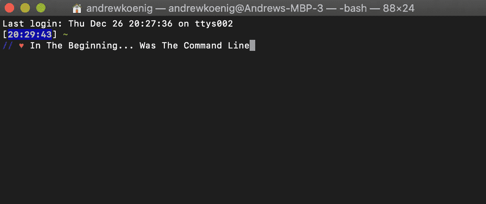

# 每个初级软件工程师都应该知道的 10 个基本 CLI 命令

> 原文：<https://betterprogramming.pub/10-basic-cli-commands-every-junior-software-engineer-should-know-67e827e51f89>

## 还有高级软件工程师

由[卡尔 J](https://unsplash.com/@scamartist?utm_source=unsplash&utm_medium=referral&utm_content=creditCopyText) 在 [Unsplash](https://unsplash.com/s/photos/knowledge?utm_source=unsplash&utm_medium=referral&utm_content=creditCopyText) 上拍摄的照片

尽管使用命令行是工程师日常生活中不可或缺的一部分，但 CLI 在编码教程和训练营中经常被忽略。强大的黑匣子让许多初级开发人员感到恐惧，但事实并非如此！

使用命令行时要记住的一点是，技术没有自己的思想。它总是等待你的命令，这意味着你在控制！

一旦您熟悉了正确的命令，世界(或终端)就是您的了。让我们开始吧！

(注意:本博客仅适用于 Unix、Mac 或 Linux 环境)

# 什么是 CLI？

CLI 代表命令行界面。命令行界面接受文本命令，并相应地执行操作系统功能。

使用 CLI 曾经是一个人操作计算机的唯一方式，但现在，用户大多通过图形用户界面(GUI)与计算机进行交互，例如单击桌面上的文件夹。

也就是说，GUI 所能做的是有限的，因此，软件开发人员使用 CLI 来完全自由和高精度地导航他们的计算机。

让我们来看看您现在可以练习的一些命令。

# 1.打印工作目录

登录时你的默认目录是你的主目录，但是在某些时候，当你通过命令行界面浏览你的文件系统时，你可能会迷路，忘记你当前所在的目录，也就是文件夹。(您当前的目录也称为*工作目录)*。

使用`pwd` 命令可以查看你当前工作的目录。

# 2.更改目录(光盘)

`$ cd`:使用`cd`命令导航到特定目录。`cd`命令将您希望访问的目录路径作为参数(`$ cd Photos/vacation`)并将您移动到该文件夹。

如果您想在一个目录中向上导航(例如，从`Photos/vacation`到`Photos`，您可以使用`$ cd ..`命令。

要从任何地方导航回您的主目录，使用不带参数的`$ cd`命令。

# 3.列出文件和目录

一旦你导航到一个特定的目录，你可能想要看到该目录下所有文件和文件夹的列表。

为此，使用`ls`命令。您还可以将一个特定的目录作为参数传递给`ls`，以查看该目录中的所有文件和文件夹，如下所示:`$ ls Books/fiction`。

# 4.创建文件(触摸)

`$ touch`:`touch`**命令以一个名称作为参数，在工作目录下创建一个同名的新文件。创建的文件将是空的。**

# **5.创建目录(mkdir)**

**`$ mkdir`:如果你想创建一个新文件夹，使用`mkdir` 命令。**

**`$ mkdir`命令将一个名称作为参数，然后在您当前所在的任何目录下创建一个同名的新文件夹。**

# **6。删除文件 ( **rm)****

**`$ rm`:这个`rm`命令以一个文件名作为参数，删除那个文件。如果您想删除一个目录以及它可能包含的任何子目录或文件，使用`$ rm -r`命令。**

**注意，一旦你`rm`了一个文件，这个动作就不能撤销了。必要时采取预防措施。**

# **7.移动或重命名文件或目录(mv)**

**`$ mv`:要从 CLI 重命名一个文件，使用`mv`命令并传递两个参数，第一个是您希望重命名的文件，第二个是您希望给它的新名称:`$ mv oldname.txt newname.txt`。**

**请注意，如果有一个预先存在的文件与您正在使用的新名称同名，您将会覆盖该文件。**

**要将文件从一个目的地移动到另一个目的地，将源文件作为第一个参数传递，将所需的目录目的地作为第二个参数传递:`$ mv harry.txt wizard/`。**

# **8.复制目录(cp)**

**`$ cp`:要复制一个文件或目录，使用您想要复制的文件旁边的`cp`命令(`dan_abramov.txt`)，并跟随您想要将该文件或目录复制到的目的地:`$ cp dan_abramov.txt React/`。**

**您也可以复制多个文件，只要您传递的最后一个参数是您希望将所有前面的文件复制到的目标目录。**

# **9.清除您的 CLI(清除)**

**在一个漫长而高效的编码会议之后，你可能会发现你的命令行界面变得杂乱无章。要完全清除你的命令行，使用`clear` 命令。**

# **10.手册页(手册)**

**`$ man`:`man`**命令调用任何 CLI 命令的手册页。****

****例如，如果你想更详细地研究上面的任何命令，你可以通过阅读它们的`man`页面来实现。请注意，该手册有时会让人觉得是为机器人而不是人类编写的，但它仍然是一个有用的资源。****

****例如，要了解`ls` 命令，您可以输入`$ man ls`。要随时退出手册，请键入`q`退出。****

# ****只是 CL-冰山的一角****

****我想强调的是，这些只是您可以使用的一小部分 CLI 命令。还有很多很多供你使用。话虽如此，这 10 个很常见，你应该很熟悉！****

****使用命令行一开始可能会令人害怕，但是你用得越多，就越不害怕。从尝试这些命令开始，请记住，一切都在您的掌控之中！CLI 等待您的命令。****