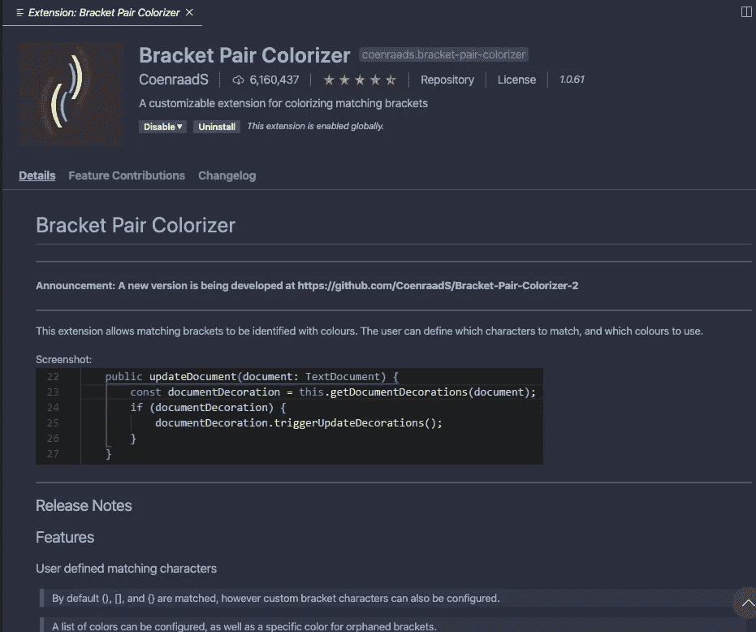
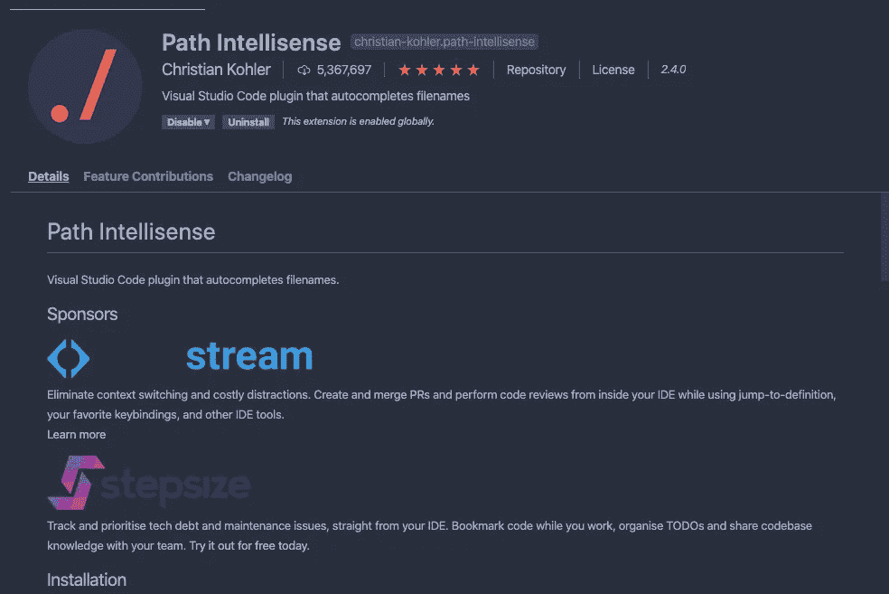
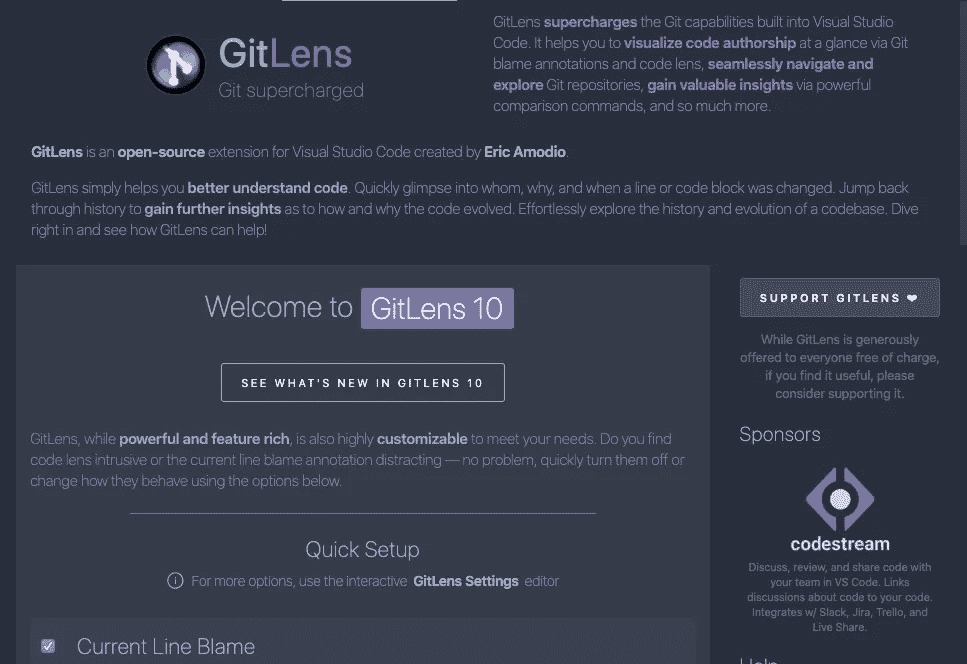
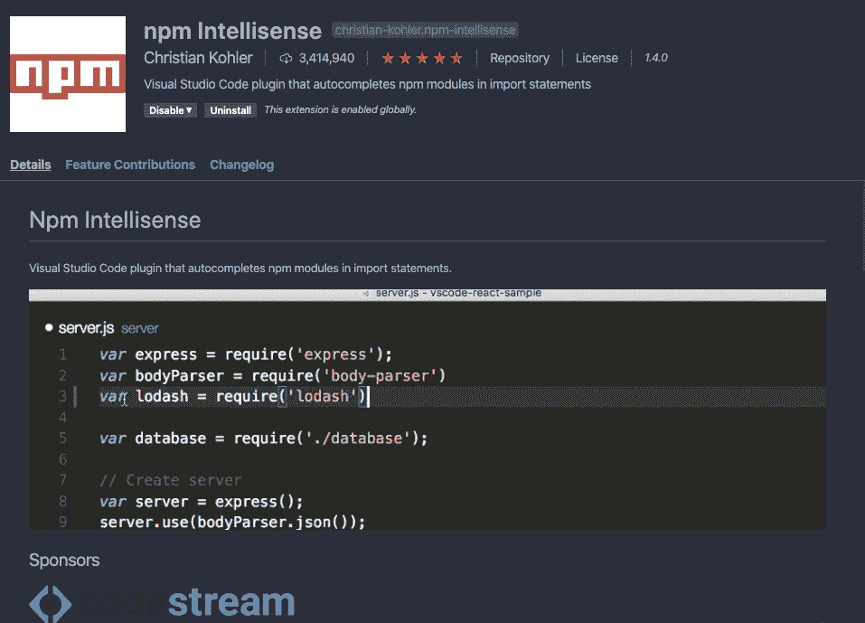
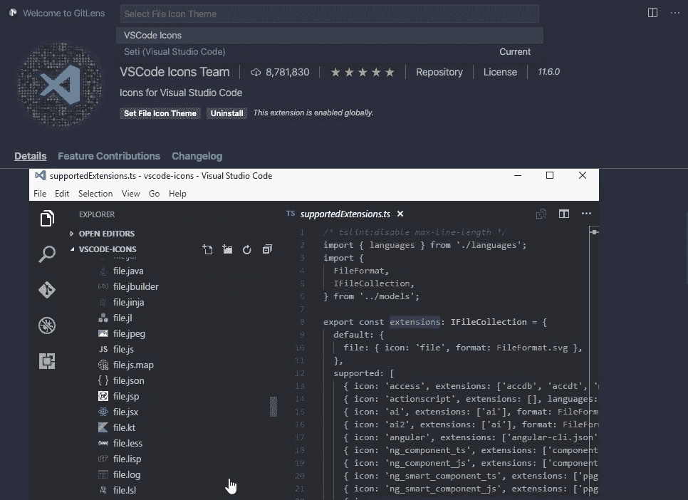
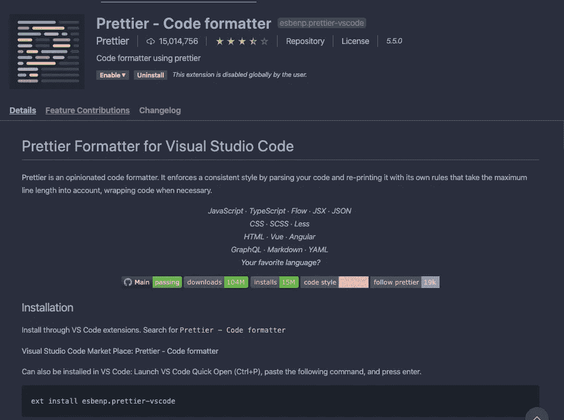
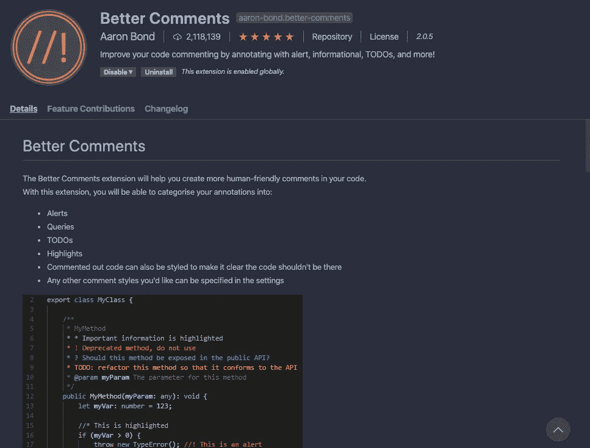

# 10 个最佳 VS 代码扩展，让您的开发生活更轻松

> 原文：<https://betterprogramming.pub/10-best-vs-code-extensions-to-make-your-developer-life-better-64330f5e4cda>

## 这些是我用来不使工作复杂化的工具

杰森·霍根在 [Unsplash](https://unsplash.com/s/photos/freedom?utm_source=unsplash&utm_medium=referral&utm_content=creditCopyText) 上的照片

> “要坚韧，要有野心，要明确自己想要什么。”

# 括号对着色机

**科恩拉德的括号对着色。**

它的工作很简单，配对应该是相同的颜色。

简单到极致，但非常强大。任何处理大量代码的人，一个接一个地嵌套，都会真正体会到这是多么有帮助。

你无法避免陷入寻找另一对的麻烦中，即使是高级开发人员也经历过，这个扩展将会拯救你。

你可以[通过你的 VSCode 本身下载这个扩展](https://marketplace.visualstudio.com/items?itemName=CoenraadS.bracket-pair-colorizer)，你可以在左侧面板找到内置的 marketplace。

# 书签

亚历山德罗弗拉格纳尼的书签。

[这个](https://marketplace.visualstudio.com/items?itemName=alefragnani.Bookmarks)也是我最喜欢的扩展之一。它帮助我跟踪我需要返回的代码，甚至是我写的代码(在团队中工作时)。

它所做的只是标记一些代码块，仅此而已。但是，当您处理一个文件中的数万行时，它的意义就更大了。

# 路径智能感知

克里斯蒂安·科勒的路径智能感知

我一直在做的项目包含数百个文件和数万行代码。没错。我知道！

试图记住每个人在哪里，是愚蠢的。(向那些做了的人致敬，你太棒了)但对我来说，我不能。

导入依赖文件将要求您包含其路径， [Path Intellisense](https://marketplace.visualstudio.com/items?itemName=christian-kohler.path-intellisense) 将自动为您填充。这就是它所做的一切，但它是神奇的。

# 待办事项树

托多树。

[待办事项树](https://marketplace.visualstudio.com/items?itemName=Gruntfuggly.todo-tree)将显示在左侧导航的旁边，这样您就可以很容易地看到自己的待办事项列表。

这可能没有 Pair Colorizer 或 Path Intellisense 酷，但如果你像我一样想在看到细节之前看到更大的东西，那么这个扩展可能会派上用场。

# JS (ES6)代码片段

Charalampos Karypidis 的 JS(ES6)代码片段。

无论是 ES6 或 ES7 或 PHP 或其他语言，[如果你想尽可能高效地工作，这些方便的代码片段扩展](https://marketplace.visualstudio.com/items?itemName=xabikos.JavaScriptSnippets)绝对需要放在你的工具箱里。

只需使用 2-3 个字符，您就可以编写一整块代码，我们都知道，无论是哪种语言，我们都会重复输入某些表达式或行。很高兴这个扩展将为您实现自动化，因此您可以只关注重要的代码。

# Git 镜头

埃里克·阿莫迪奥的 GITLens。

[根据定义，GitLens](https://marketplace.visualstudio.com/items?itemName=eamodio.gitlens) 增强了 VSCode 中的 GIT 功能。通过 GIT 责备注释，它将有助于可视化代码作者。

从技术上讲，你会一行一行地看到代码的作者，谁编辑了谁，谁创造了谁，最重要的是谁搞乱了谁。

在我自己的工作经验中，这个扩展救了我一命。

在某个特性搞砸后，我团队中的某个人把责任推到我身上。我能够通过发送一个导致整个混乱的代码块的截屏来为自己辩护，以及把它搞砸的开发人员(不是吹牛，但那不是我)。

老实说，这真的很令人满意，不是因为不是我的错，而是那个指责我的开发者的错。

# NPM 智能感知

克里斯蒂安·科勒的 NPM 智能感知。

如果你正在使用 NPM，尤其是在使用 ReactJS 和 NodeJS 的时候，那么 [NPM 智能感知](https://marketplace.visualstudio.com/items?itemName=christian-kohler.npm-intellisense)会给你很大帮助。

导入包也意味着你必须知道它的路径，这个扩展会自动提示路径代码在。你所要做的就是按回车键。

NPM 就像整个宇宙。你不想一点一点地处理它。让 NPM 智能感知为您做这项工作。

# VS 代码图标

VSCode 图标团队的 VSCode 图标

使用文件名左边的图标会自动让你知道那个文件是什么，而不是从技术上看扩展名——这就是为什么我个人觉得 [VS 代码图标扩展名](https://marketplace.visualstudio.com/items?itemName=vscode-icons-team.vscode-icons)非常有用。

都在细节里。在查看文件结构时，即使是像在文件中添加一个图标这样的微小变化，也会自动让您了解项目包含的语言和工具。

如果你能看到大量的 JS 图标，那么很明显你将会处理大量的 JavaScript，同时如果你看到大量的 TS 图标，那么你肯定要为一些打字稿做好准备，祝你好运。

# 较美丽

更漂亮—代码格式化程序

根据定义，T2 是一个固执己见的代码格式化者。默认情况下，它会通过删除和添加空格以某种格式解析您的代码，从而形成一致的风格，以使您的代码正确且可读。

凌乱的代码很难读懂，甚至想格式化甚至想一段一段的组织起来都会很费时间。

拥有这种延伸肯定会让你放松，这样你就可以专注于重要的事情。

# 更好的评论

亚伦·邦德的评论更好。

开发人员经常会忘记一些事情。可能有太多的代码需要处理，实际上很难记住所有的东西，尤其是在处理跨多个团队的大型项目时。

因此，`//Comments`很重要。它们不仅会提醒您一些重要的信息，比如记录一个函数是做什么的，而且对于添加您可能想告诉其他开发人员的某个代码块的上下文也很有价值。

我一直在维护几个项目，相信我，这些评论多次救了我的命。

很难理解其他开发人员如何思考，他们如何设计或构建他们的代码，有时会有一个学习曲线或需要一些时间，但使用注释会让其他人的生活变得更好。

需要更多的理由来使用[更好的评论扩展](https://marketplace.visualstudio.com/items?itemName=aaron-bond.better-comments)？

感谢阅读。