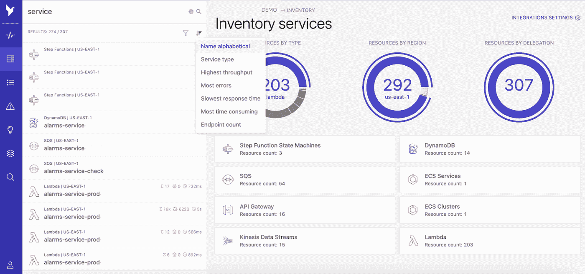

# 软件工程的 10 个挑战性方面

> 原文：<https://betterprogramming.pub/10-challenging-aspects-of-software-engineering-928b4a776c94>

## 有些活动我们没有花足够的时间去做

来自 [Pexels](https://www.pexels.com/photo/man-working-on-laptop-while-woman-takes-notes-3153199/?utm_content=attributionCopyText&utm_medium=referral&utm_source=pexels) 的 [Canva 工作室](https://www.pexels.com/@canvastudio?utm_content=attributionCopyText&utm_medium=referral&utm_source=pexels)的照片

工程时间是一种稀缺资源。我们经常不得不平衡许多任务和经常相互冲突的优先事项。然而，对于一些活动来说，分配更多的时间是有益的。在这篇文章中，我们将看看其中的十个。

# 1.备份和防止意外删除

你有过过早删除一些东西却发现没有备份的经历吗？一个好的经验法则是在删除任何东西之前检查三次。这可能涉及到交叉检查我们是否在正确的环境、区域、数据库模式或 S3 桶中。

此外，有许多方法可以减轻无意删除的影响:

*   您可以在云存储桶上启用版本控制(例如，AWS S3)
*   您可以配置自动备份
*   你可以限制访问，这样只有少数人可以删除东西
*   许多数据库具有额外的数据恢复功能，如时间旅行，允许您“及时返回”并在数据被删除之前运行查询(例如，[雪花](https://docs.snowflake.com/en/user-guide/data-time-travel.html)，[数据块](https://databricks.com/blog/2019/02/04/introducing-delta-time-travel-for-large-scale-data-lakes.html)， [BigQuery](https://cloud.google.com/bigquery/docs/time-travel) )。

# 2.命名事物

所有主要的云提供商都提供对象存储服务。他们中的大多数(AWS S3 或 GCP GCS)将数据存储在桶中。微软为他们的 Azure Blob 存储选择了命名“容器”而不是“桶”。

为什么这个命名会让人困惑？

这是因为容器通常与 Docker 图像的运行实例相关联，而与存储 BLOB 对象无关。这个例子表明，即使是世界上最大的技术公司有时也会做出令人困惑的命名决定。

我的一位同事经常重复这句话，这句话很好地概括了这一点:

> "计算机科学中只有两个难题:缓存失效和事物命名."— [菲尔·卡尔顿](https://www.karlton.org/2017/12/naming-things-hard/)

# 3.代码审查

伟大的技术产品很少是在真空中创造出来的——当几个聪明人在解决具有挑战性的问题时相互支持，它们就会出现。这就是反馈和代码审查如此重要的原因。它们作为建设性讨论的基础，从而产生更好的工程过程和更好的代码。

*   **不要**:写“LGTM！”并在收到请求一分钟后批准该请求。
*   **做**:花尽可能多的时间去理解代码及其背后的意图，并质疑是否一切都如预期的那样工作。

大多数创建拉动式请求的工程师真诚地希望听到您的全面反馈，并从您的经验中学习。他们依靠你来找出他们可能没有想到的错误和问题。

# 4.问题定义

你在职业生涯中大概遇到过很多次。有人给了你一张票，上面写着:“去 XYZ”，却没有说明原因。预先假定 XYZ 是问题的正确解决方案，你应该简单地去做。但是当你开始深入实际问题时，你会注意到 XYZ 可能不是最佳方案。

*   **不要:**创建一个规定了特定方法的标签，例如“构建一个收集关于 X 的数据的脚本，并将该数据作为 Excel 文件电子邮件附件与客户 ABC 共享。”
*   **Do:** 创建一个定义问题的标签:“客户端 ABC 需要每天接收关于 X 的数据。与客户交谈，找出以可靠和安全的方式共享这些数据的最佳界面。”

票证或用户故事定义问题和涉及的利益相关者总是很有帮助的。它可能会建议潜在的解决方案，但不会明确规定必须做什么，除非你真的对此有把握。一旦问题被定义，工程师们足够聪明来找出解决问题的最佳方法。

# 5.架构和设计决策

架构决策通常会产生深远的影响。事情一旦实施，要“撤销”它们是很昂贵的(例如，耗时的迁移项目)。

然而，我们经常没有花时间去评估足够多的选项，也没有征求反馈。最流行的工具不一定是解决手头问题的最佳工具。

*   **不要:**匆忙实施第一份设计草案或最流行的工具。
*   **Do:** 花时间评估哪些架构或设计是解决手头问题的好选择。运行概念验证。向其他工程师、利益相关者和外部顾问寻求反馈。在实践中测试各种选项，然后决定哪种效果最好。

# 6.与其他团队合作

有时候，就共同标准达成一致是成功的一半。无法与其他团队沟通可能会导致摩擦和冲突。

例如，近年来，许多数据团队在云数据仓库、数据接收平台和基于 SQL 的转换工具上投入了大量资金。然后，他们开始提倡，从现在开始，每个人都应该使用 SQL 来解决他们所有的分析问题。

根据这个建议，有人可能会认为我们不再需要分布式集群，如 Dask 或 Spark。但是在试图标准化 SQL 时，我们忘记了其他团队。数据科学家和量化研究者呢？

SQL 不足以解决他们的问题。当您需要为 API、流程自动化和许多其他有趣的用例提供数据以供使用时，情况也是如此，这些用例不仅利用数据进行报告。对于这些用例，Python 将是更好的选择。

同样， [Paul Singman](https://medium.com/u/d810baa7423b?source=post_page-----928b4a776c94--------------------------------) 在[的这篇文章](https://medium.com/whispering-data/the-end-of-etl-as-we-know-it-92166c19084c)中建议，在软件工程师和数据团队之间就通用数据定义和接口达成一致有时可以消除对 ETL 工作的需求。请注意，这仅在基于发布-订阅架构构建工具的少数情况下可行。

# 7.给予它应得的赞扬

给予赞扬或赞美有时可能会感到尴尬，但我们都在某种程度上渴望得到认可。看到一句简单的“干得好！”所带来的积极影响是令人着迷的。不过，要小心虚假的赞美；人们可以看出恭维是不是真诚的。

# 8.雇用

如今，寻找和管理工程人才很有挑战性。但是过早地招聘然后解雇员工会损害公司文化和团队士气。许多人采用[“到底是还是不是”](https://interworks.com/blog/bjahanshahi/2015/05/28/hiring-its-hell-yes-or-no/)的方法。无论你选择哪种策略，建议你花点时间，对你想要建立的团队有个明确的目标。

# 9.阅读日志

工程中的一些问题源于没有正确阅读日志。

一个真实的故事:在我的第一个咨询项目中，我们在 Hadoop 集群上工作，我很难找出为什么我的 Spark 工作失败了。我问了一个同事，他给我指出了一个带有错误消息的 Java 堆栈跟踪，我似乎在日志文件中忽略了这一点。

我不得不承认他是对的——答案就在日志里；我没有花足够的时间通读。

如果你想避免类似的尴尬情况，又恰好使用无服务器，可以看看 [Dashbird](https://dashbird.io/) 。该平台允许您过滤所有无服务器 AWS 资源的日志。

您不需要在代码中设置任何定制的日志处理程序。Dashbird 会自动从 CloudWatch APIs 中直接获取日志，因此您无需进行任何设置。

然后，您可以从 UI 中实时搜索所有日志，包括 X 射线跟踪。

Dashbird.io 中的全局日志搜索—图片由作者提供

# 10.交流

您知道大多数 IT 项目都是由于沟通问题而失败的吗？我们拥有比历史上任何时候都多的沟通工具，然而在沟通不足和过度沟通之间找到平衡仍然是一个挑战。

*   **不要:**每二十分钟发五十条短信。
*   **做:**思考需要沟通的内容，写下来，并找出沟通的最佳渠道:电子邮件(如果 1-2 天的回复时间可以的话)、电话(如果需要讨论或分享屏幕)，或即时消息(如果它很重要，或阻止你的事情)。

# 结论

本文讨论了工程中十个具有挑战性的方面，我们有时没有投入足够的时间。这些包括删除和命名事物，阅读日志，给出反馈和表扬，定义问题，设计架构，雇佣，最后是团队内部和其他团队的交流。

感谢您的阅读！