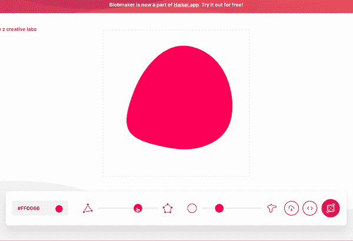
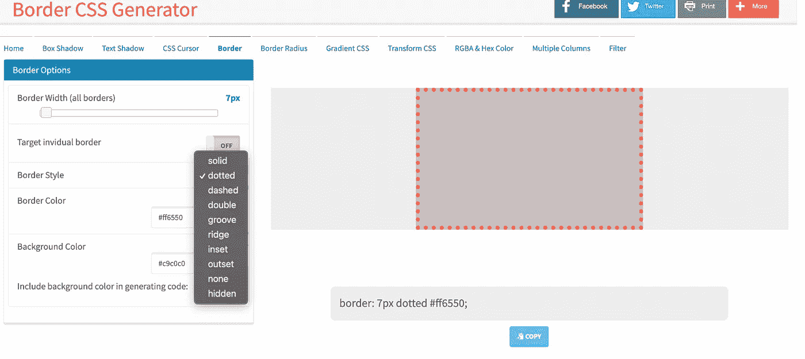
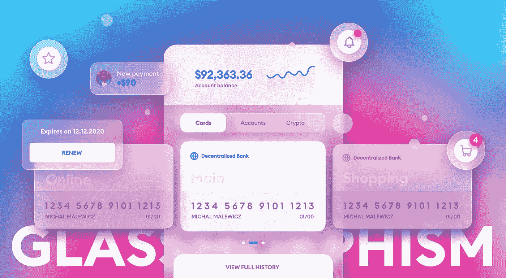
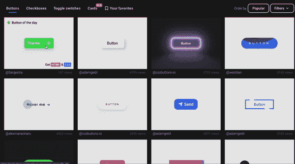
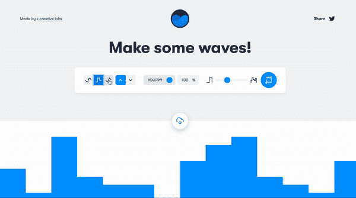
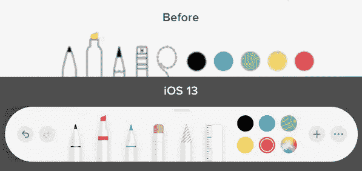
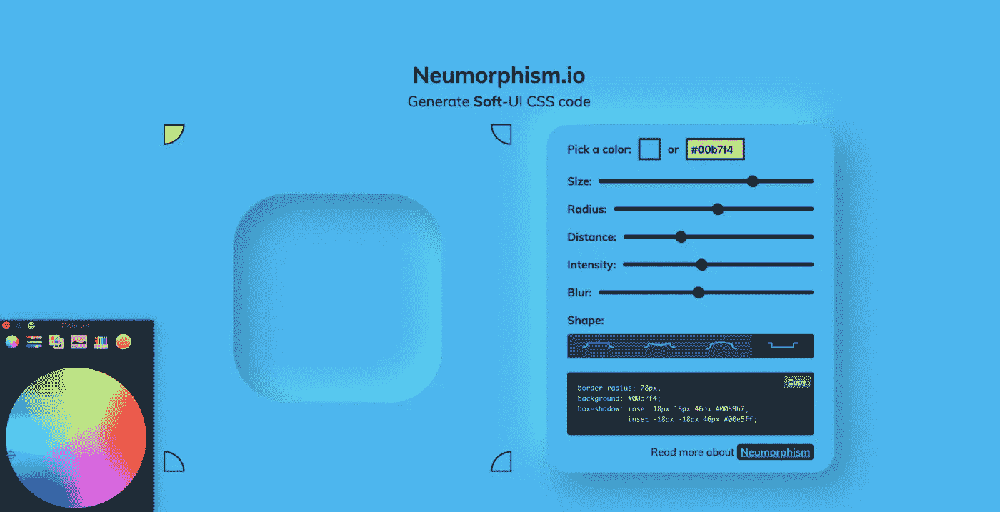
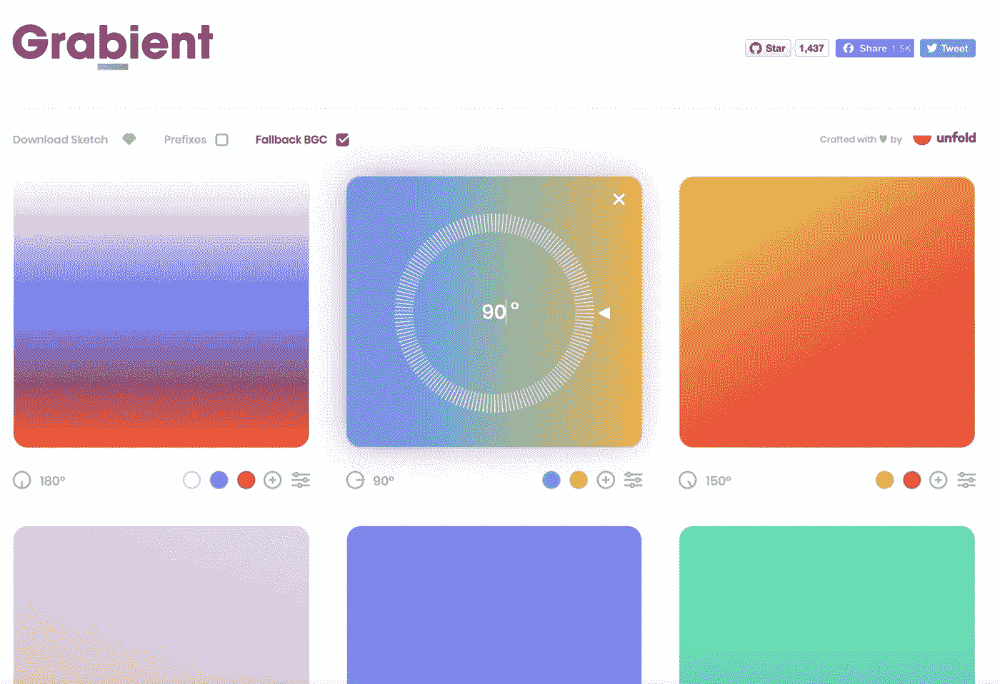

# Web 开发人员的 10 个代码生成工具

> 原文：<https://betterprogramming.pub/10-code-generation-tools-for-web-devs-673d98789952>

## 轻松创建现代时尚设计的前端工具

斯科特·韦伯在 [Unsplash](https://unsplash.com/s/photos/colors?utm_source=unsplash&utm_medium=referral&utm_content=creditCopyText) 上拍摄的 BG 照片

前端开发是目前科技行业最热门的工作之一。重点是伟大的设计和流畅的用户体验，这种对即使是最小项目的设计的关注的转变使这项工作变得更加重要，同时也更加艰难。

实现复杂的设计和直观的用户界面，在第一次访问时就能抓住任何人的注意力，并不是一件容易的事情。所以，这里有一个开发工具的列表，可以帮助你立刻生成最有用的设计和趋势的代码片段。

# 1.Blobmaker

[Blobmaker](https://www.blobmaker.app/) 是一个免费的代码生成设计工具，可以让你快速创建随机的、独特的、看起来有机的 SVG 形状。Blobmaker 可以根据随机数据轻松创建独特的斑点形状。它允许您在复杂度(点数)和对比度(点与点之间的差异)方面进行尝试，以创建不同类型的 SVG 形状。你也可以通过点击一个按钮来产生随机的斑点。最好的部分是你可以下载 blob 或者复制 SVG 代码在你的项目中使用。

# 2.CSS 生成器

CSSGenerator 是一个简单但非常方便的工具，可以根据您的需要快速获得 CSS 代码片段。它提供了一个交互式 UI，您可以在其中调整正在使用的属性的外观和感觉，因为该工具可以即时可视化每个属性。它具有属性默认允许的所有自定义设置。您可以简单地复制粘贴代码来创建所需的效果。它还通过添加 WebKit 或 Mozkit 等特定属性来处理浏览器兼容性。

为 CSS 边框属性生成代码段。

# 3.花式边框半径

边框半径是一个简单方便的 css 属性，你可以很快地写出来。但是，你是否曾经想要实现一个非常具体的大小和形状的边界半径，并花了太多的时间来摆弄这些值，以获得确切的期望值。这个[工具](https://9elements.github.io/fancy-border-radius/full-control.html)可以让你在 8 个不同的点上试验边界半径的形状和大小，并复制数值以备将来使用。

# 4.玻璃态

Glassmorphism 是一种新的设计趋势，它具有磨砂玻璃效果，使用背景模糊，生动的颜色来突出模糊的透明度，等等。

玻璃态的例子

虽然看起来工作量很大。这个[工具](https://ui.glass/generator/)让你非常容易地创建这个效果，并复制 CSS 供你个人使用。你可以改变背景，调整模糊，边框，不透明度，饱和度等，以适应你的设计风格，并立即获得代码。

# 5.CSS 按钮

这里没什么新东西，但不代表没那么有用。 [CSSbuttons](https://cssbuttons.io/) 是一个工具，你可以在其中获得 100 种独特的 UI 元素的 CSS 样式，如按钮、复选框、卡片和切换开关。您可以在网站上观看这些按钮的现场演示，只需从列表中选择您喜欢的样式，然后复制代码供您使用。

# 6.泛灵论者

Animista 是最好的网站之一，可以生成和定制各种效果的 CSS 动画代码。你可以从他们收集的各种用例中进行选择，如入口、出口、文本等，并使用众多效果对它们进行定制。如果你探索这个工具，你会惊讶于它提供的选项范围和易用性。

# 7.Getwaves

如果你的背景或插图需要波浪效果， [**getwaves**](https://getwaves.io/) 就是你要找的地方。您可以创建各种不同的波形，改变它们的波形、颜色、方向、透明度，甚至间隔来获得想要的形式。一旦准备好了，你就可以下载 SVG 或者复制 SVG 代码。

# 8.方框阴影

如果你曾经想知道如何为你网站上的任何形状实现令人敬畏的多层阴影效果，但发现很难编码，这个[工具](https://www.cssmatic.com/box-shadow)可以帮助你做到这一点。

设置您的首选属性，如阴影层，阿尔法，模糊，传播等，它会立即生成阴影效果的 CSS 代码，您可以复制粘贴任何形状。

生成 css 框阴影

# 9.神经形态

Skeuomorphism 是使 UI 中的项目类似于它们在现实世界中的对应物的设计概念。一个最好的例子是苹果 iOS 13 中的编辑器工具。请注意，与旧设计相比，工具栏中的项目具有很好的 3D 效果，看起来很逼真。

新形态是一种新的方法，将这种用户界面趋势提升了一个档次。这个名字基本上是“新”和“skeuomorphism”的组合在**[neu morphism . io](https://neumorphism.io/)**上，你可以非常容易地创建这种效果，并通过模糊、形状、强度甚至光照角度等属性来调整设计的外观和感觉。****

********

****神经形态代码生成器****

# ****10.Grabient****

****谁不喜欢他们的设计中有很酷的渐变呢！嗯，也许不是每个人，但无论你是不是渐变的粉丝，定制你的渐变以达到设计的精确匹配需要在编写 CSS 时反复试验。****

****[**Grabient**](https://www.grabient.com/) 为你做到这一点。只需选择你的颜色，调整你的角度，你很好地去与代码的期望梯度。****

********

****梯度码发生器****

****我希望这些在你的开发过程中对你有用。如果您正在使用任何其他有用的前端代码生成工具，请在回复中留下它们。****