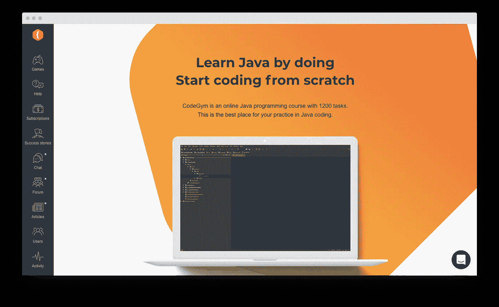
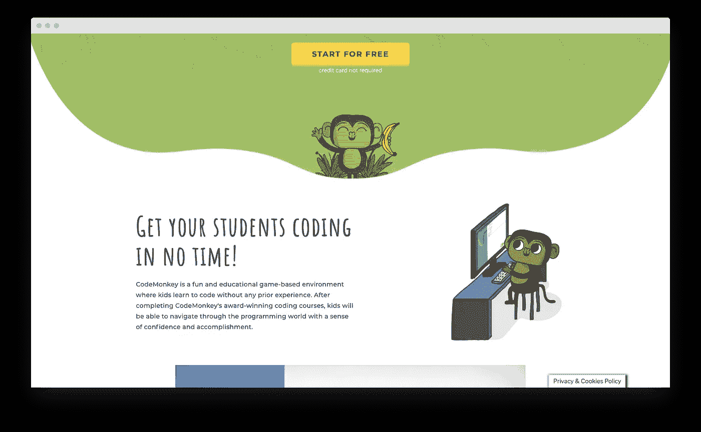
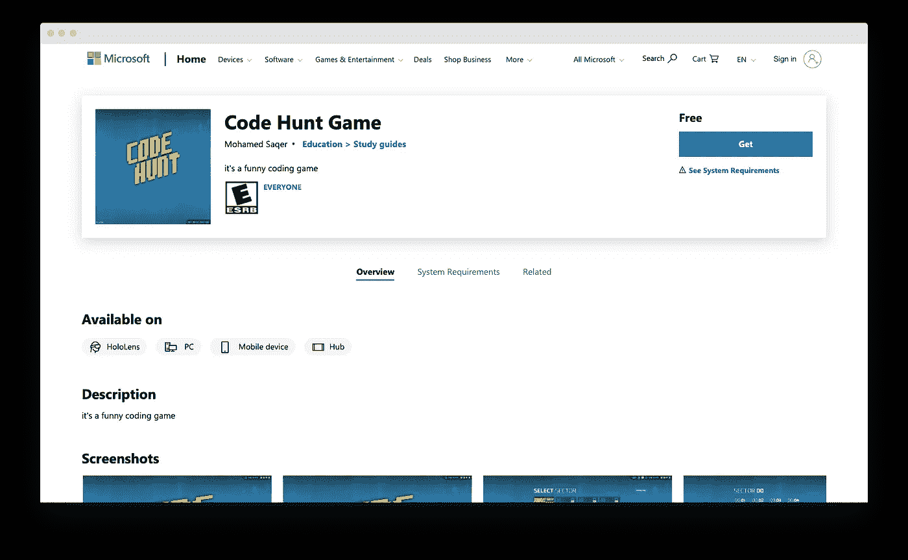
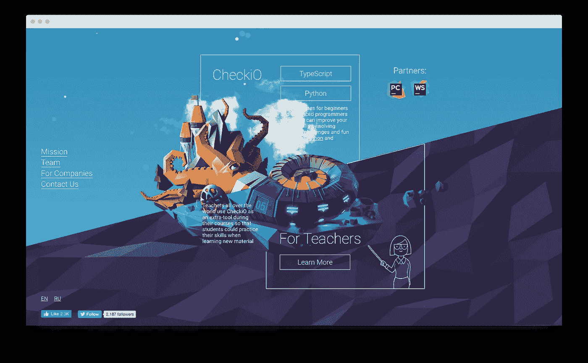
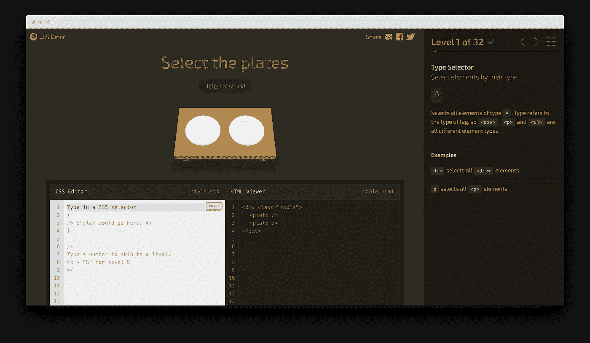
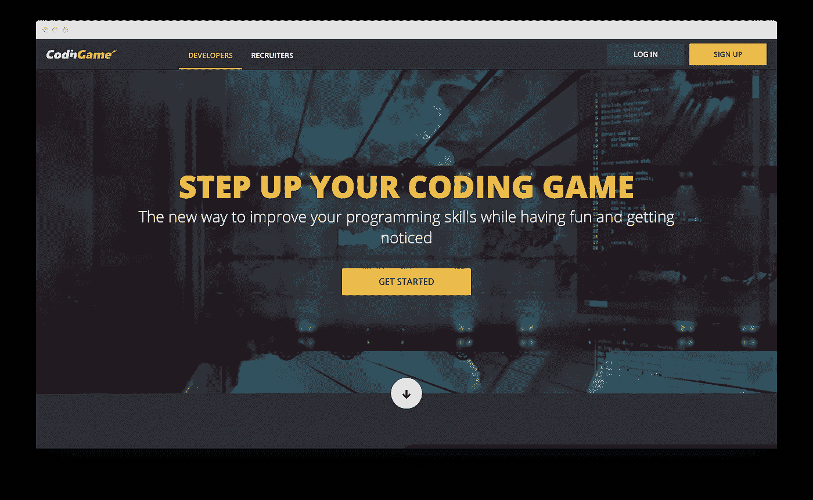
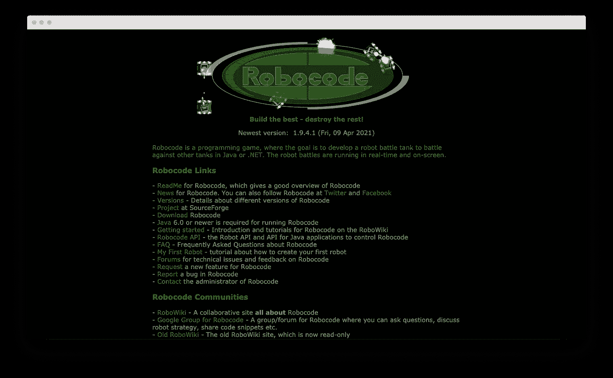
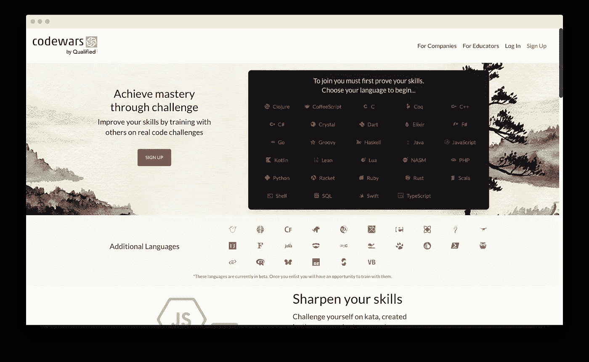
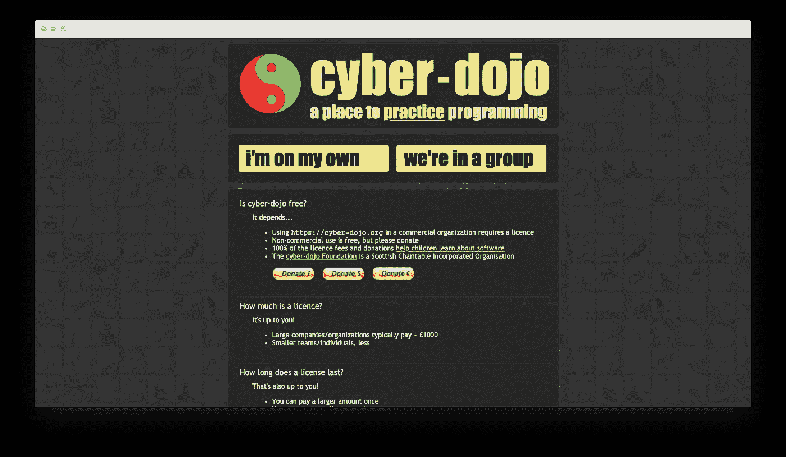

# 塑造你编程技能的 10 个编码游戏

> 原文：<https://betterprogramming.pub/10-coding-games-to-shape-your-programming-skills-618253d592fe>

## 通过游戏化学习被大大低估了

你是否打算学习 Java 但不确定如何入门？如果我们说你需要开始玩编码游戏呢？

你没看错。

虽然游戏传统上与娱乐联系在一起，但最近的趋势表明，游戏化可能会显著改善我们吸收信息的方式。很多领域都出现了很多教育游戏，包括编程课程。

所以，让我们来看看游戏化到底如何帮助我们更好地学习，以及哪些游戏可能会帮助你成为一名程序员！

# 什么是游戏化？

从字面上看，游戏化意味着将一种游戏元素带入一种独立的活动中，比如学习、购物、营销，甚至是执行财务操作。它可能是完整的——作为实现目标的一种方式的游戏——或者是部分的，当游戏元素补充另一个活动时。

游戏化的典型例子是众所周知的应用程序，如:

*   多林果，一款语言学习应用
*   我的星巴克奖励，星巴克的促销产品
*   来自 BBVA 银行的 BBVA 游戏也是为了推广服务
*   简单能源，生态倡议
*   和许多其他人

# 游戏化如何帮助我们学习新技能？

游戏是人们最自然的学习方式，这一点得到了许多研究的支持。[研究表明](https://gamelabeducation.com/en/game-based-learning-natural-way-learn/)与传统的基于讲座的学习相比，基于游戏的学习体验显示出更好的效果，因为这是我们天生感知新信息的方式。独自或与朋友一起玩、试验、尝试和失败，总是比花几个小时阅读书籍、代码和公式更有趣。即使我们长大了，这也不会改变

另一方面，阅读和死记硬背，这是现代世界中我们在学校、大学和工作培训中使用的一种更典型的方法，对人类大脑来说更难感知。当然，传统方法有自己的优势，这就是为什么结合两个世界的优点总是更好的原因。

## 提高你的开发/编程技能的 10 个最好的编码游戏是什么

那么，如果你想以最简单、最有趣的方式迈出编程的第一步，你应该选择或者至少从哪个游戏开始呢？让我们从最好的开始！

# [健身房](https://codegym.cc/)

CodeGym 是一个交互式 Java 学习平台，包括 600 多个小型讲座和 1，200 个任务，帮助您从头开始学习。考虑到 Java 是最受初学者欢迎的编程语言之一，CodeGym 可能是你未来职业生涯的一个很好的开始。

可用的编程语言 : Java

**优点:**

*   实用练习
*   理论与实践紧密结合
*   易于理解的友好的教学风格
*   简单界面
*   非常适合初学者

**缺点:**

*   仅限 Java

**定价:**免费零级，然后每月 49 美元或每年 499 美元。

# [CodeMonkey](https://www.codemonkey.com/)

Code Monkey 是一款流行的交互式益智游戏，可以帮助你直观地学习如何编程。它提供了实践编码的基础知识，以及真正的编程语言和越来越具有挑战性的水平。

**可用的编程语言:** CoffeeScript(类似于 FavaScript)和 Python

**优点:**

*   非常容易开始和理解基础知识
*   适用于儿童(7 岁以上)
*   有 20 种语言版本

**缺点:**

*   有时缺乏坚实的理论
*   目前只有 90 节课

**定价:**每月 6 美元起

# [代码搜索](https://www.microsoft.com/en-us/p/code-hunt-game/9nblggh6d0gs?activetab=pivot:overviewtab)

由微软研究院推出的 Code Hunt 是一款教育游戏，让你学习 C#或 Java 编程语言。它是基于浏览器的应用程序。学习者可以浏览每个部分的简短教程，然后设置代码片段以获得适当的及格分数。

可用编程语言: Java 和 C#

**优点:**

*   它的学习方式有助于找到真正优雅的解决方案，并在你未来的工作中使用它们
*   Code Hunt 有一个庞大的支持社区

**缺点:**

*   太实用(缺乏理论)
*   你不能跳过关卡

**定价:**免费

# [CheckIO](https://checkio.org/) 和[帝国的代号](https://empireofcode.com/)

CheckIO 是一款教你 Javascript 的策略游戏。这是一个基于网络的游戏，让你不仅可以自己学习，还可以使用其他人的解决方案来提高你的分数。

《代码帝国》是 CheckIO 的一个新项目。这是一个建设世界的游戏，让你通过解决不同类型的问题来保卫你的基地。

**可用编程语言:** JavaScript 和 Python

**优点:**

*   极具挑战性的精彩游戏
*   是一个很好的开发人员面试准备工具
*   用户可以分享他们如何解决问题的经验
*   支持 10 多种语言

**缺点:**

*   由于一些用户评论而变慢
*   航海并不总是容易的
*   开始之前最好先了解一些基础知识

**定价:**免费

# [CSS 餐车](https://flukeout.github.io/)

CSS Diner 是一个简单而有趣的游戏，帮助你开始使用 CSS 选择器。

**可用编程语言:** CSS

**优点:**

*   非常容易开始和学习
*   简单的界面，无需花时间去理解

**缺点:**

*   这是一个简单的游戏，只帮助你学习 CSS 的某些方面

**定价:**免费

# [编码名称](https://www.codingame.com/start)

CodinGame 是一套游戏、谜题和挑战，帮助初级、中级甚至专业程序员以最吸引人的方式提高他们的技能，并得到社区的认可。

**可用编程语言:**十多种

**优点:**

*   解决不同类型的任务和问题
*   可以和你的朋友一起玩
*   一个很棒的支持社区，有经验丰富的顾问
*   公司用来寻找、筛选和招募开发人员

**缺点:**

*   并没有传授扎实的技能
*   不适合初学者(至少需要基础知识)

**定价:**免费

# 机器人代码

Robocode 提供了一个简单的界面，可以帮助您创建自己的在线机器人坦克，并与其他玩家实时参与战斗。

**可用编程语言:**主要是 Java，但也有其他语言可用(如 Kotlin，。Net，Scala)。

**优点:**

*   学习编程和提高技能的一种令人上瘾的放松方式
*   可以和你的朋友一起玩

**缺点:**

*   很简单(只有坦克战可用)
*   并没有教会你一项扎实的技能

**定价:**免费

# [代码大战](https://www.codewars.com/)

CodeWars 帮助你从零开始学习到一个经验丰富的程序员的水平。你可以提高你的技能，达到更高的水平。这款游戏模拟了日本武术“形”，你可以通过编程将特定的输入转换成想要的输出。CodeWars 最棒的地方在于，它会根据优化水平奖励你的解决方案，因为每个任务可能有不止一个可能的解决方案。难度越高，你的等级就越高。

**可用编程语言:** 29 种主要编程语言和 26 种附加编程语言可用

**优点:**

*   它适应你的水平和期望的编程语言
*   参与挑战和排名系统
*   能够与他人分享您的解决方案，并通过比较来提高您的技能
*   被公司用来雇佣开发人员

**缺点:**

*   并没有传授扎实的技能
*   不适合初学者(至少需要基本技能)

**定价:**免费

# [赛博道场](https://www.cyber-dojo.org/)

网络道场类似于现实生活中的道场，在那里你可以不断练习和完善你的技能。这个基于 web 的应用程序允许程序员和开发团队仔细考虑编码中涉及的实践，并达到较高的技能水平和对编码技能的掌握。

可用的编程语言:超过 35 种编程语言可用

**优点:**

*   非常简单的界面
*   支持大量的编程语言

**缺点:**

*   并没有传授扎实的技能
*   不适合初学者(至少需要基本技能)
*   数量有限的任务

**定价:**免费(可捐赠)

# 结论

游戏化是一个很好的概念，可以帮助在参与式学习过程中注入更多的热情。它创造了大量的机会来帮助学生更好地学习编程，并且在最近十年里得到了越来越多的赞誉。