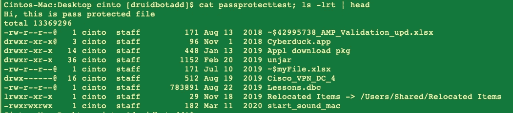
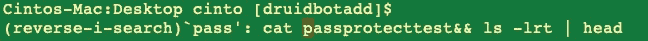
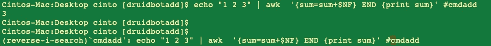
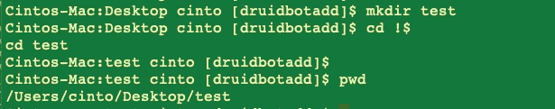
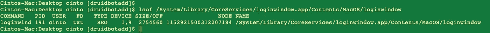

# 10 个很酷的 Linux 技巧，让你的工程生活变得简单

> 原文：<https://betterprogramming.pub/10-cool-linux-tricks-that-can-make-your-engineering-life-easy-6ef6febd8f63>

## 你可以免费获得同事的赞赏


Jr Korpa 在 [Unsplash](https://unsplash.com?utm_source=medium&utm_medium=referral) 上的照片

您是否曾经遇到过这样的情况，您看到您的同事使用一些简单的 Linux 命令来完成需要您击几个键的任务？当你看到时，你会说，“哇！我不知道它可以这么容易地完成。

在本文中，我将向您展示一些亲 Linux 的命令技巧，这些技巧将为您节省大量时间，在某些情况下，还会让您感到非常沮丧。不仅你的朋友或同事会对你刮目相看，而且这也会让工程生活变得简单，因为你需要更少的按键和更少的鼠标点击。

# **追踪您终端上的一切**

在繁忙的调试会话期间，很容易忘记您运行了什么命令，以什么顺序运行这些命令，以及这些命令的输出/日志。你可以随时回去查看历史，但它可能很快变得非常复杂。

如果有一种工具可以记录你在终端上所做的一切会怎么样。并在需要时回放。

嗯，有。

Linux 中的 [**脚本**](https://www-users.cse.umn.edu/~gini/1901-07s/files/script.html) 命令用于制作打字稿或记录所有的终端活动。执行*脚本*命令后，它开始记录打印在屏幕上的所有内容，包括输入和输出，直到您退出。

句法

```
script [options] [file]
```


运行脚本命令

# **创建命令的快捷方式**

在 Linux/Unix 上工作时，我们会使用很多命令。有些很小，有些很大。一个很酷的建议是使用别名来减少你必须输入的数量。

```
alias k=kubectl
k get pod
NAME READY STATUS RESTARTS AGE
pod-0 3/3 Running 0 15h
```

我们可以将这个 alias 命令添加到我们的 bash 概要脚本中，这样这个快捷方式在每个新选项卡上都是可用的，并且您不必每次都键入`alias`命令。

您还可以使用它来修复命令中的拼写错误。

```
alias kubeclt=kubectl
kubeclt get pod
```

# vim 文本编辑器中的密码保护文件

你怀疑有人在窥探你的个人档案。不要再说了！您可以使用`vim`对您的文件进行密码保护。

类型

```
vim +X passprotectedfile
Enter encryption key:
```

在提示符下添加加密密钥，瞧！您的文件受密码保护。

如果有人试图下载你的文件，他们只会得到垃圾字符。你必须在`vim`中输入密码才能访问该文件。

如果您想删除密码，请在`vim`中打开文件，然后键入`:X`，然后将密钥留空。

# 在一个命令中运行多个命令

Linux 提供了一种同时运行多个命令的方法。你可以用`；为此目的的分离器。

```
command_1; command_2; command_3
```



运行多个文件第 1 部分

如果您必须等待前面的命令成功，请使用`&&`操作符

```
command_1 && command_2
```

# 轻松搜索和使用您过去使用过的命令

如果您使用的是现代的 bash shell，那么您可以使用`Ctrl +R`作为快捷键来搜索您的命令历史。您可以调出以前使用过的命令，并再次发出它们。这可能也适用于其他 shells，比如在 emacs 模式下使用`ksh`。使用这个小技巧，您实际上可以大大提高命令行工作负载的速度。

1.  在终端键入`Ctrl +R`
2.  输入搜索词。在下面的例子中，我给出了`pass`
3.  带有搜索关键字的最新命令出现。当您想要运行该命令时，请按 Enter 键



Ctrl + R

您还可以为命令添加标记，以便将来检索。如果你有很长的指挥历史，这是非常有用的。只需使用`#<tag>`在命令末尾添加一个标签。shell 将简单地忽略# <标签>标签，因为它被认为是一个编程语言注释。但是标签将帮助您更容易地搜索命令。



# 重复使用上一个命令中的最后一项！$

在许多情况下，使用前一个命令的参数非常方便。

假设你要创建一个目录，然后`cd`进入新创建的目录。在那里你可以使用！$ options。



！$ command

# 管理交互式响应

有些命令或脚本需要用户交互，如果您知道每次需要输入时都必须输入`Y`，那么您可以使用`Yes`命令

下面是如何使用它

```
yes | command_or_script
```

# 确定哪个进程正在使用文件

有时您需要知道哪个文件正在被哪个文件使用。这里`lsof`命令非常方便。

如果没有任何选项，`**lsof**`命令将列出所有打开的文件(即正在被某个进程访问的文件)。


您还可以使用它来搜索确切的文件。



您可以使用帮助命令检查所有的`lsof`属性

```
lsof -hlsof 4.91latest revision: ftp://lsof.itap.purdue.edu/pub/tools/unix/lsof/
latest FAQ: ftp://lsof.itap.purdue.edu/pub/tools/unix/lsof/FAQ
latest man page: ftp://lsof.itap.purdue.edu/pub/tools/unix/lsof/lsof_manusage: [-?abhlnNoOPRtUvVX] [+|-c c] [+|-d s] [+D D] [+|-f[cgG]]
[-F [f]] [-g [s]] [-i [i]] [+|-L [l]] [+|-M] [-o [o]] [-p s][+|-r [t]] [-s [p:s]] [-S [t]] [-T [t]] [-u s] [+|-w] [-x [fl]] [--] [names]...
```

上面讨论的很酷的技巧应该会很方便，并且几乎可以在所有的 Linux 发行版和 shells 中使用，而不需要安装任何东西。

我知道有更多的 Linux 命令技巧可以用来在终端中节省时间。为什么不在这里与社区中的其他人分享您的 Linux 经验呢？下面的评论区由你决定。

```
Anyone can list all files; /dev warnings disabled; kernel ID check disabled.
```