# 大大改善用户体验的 10 个 CSS 技巧

> 原文：<https://betterprogramming.pub/10-css-tricks-that-greatly-improve-user-experience-5ee52886ca4b>

## 花 1 个小时学习，永远提升你的 web app。

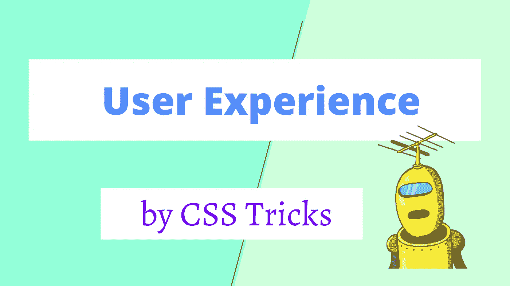

一个成功的 Web App 必须有良好的用户体验。当我们谈到改善用户体验时，你会想到什么？

其实有一点是很容易被开发者忽略的，那就是 CSS。我们可以使用一些 CSS 技巧来改善网页的外观、交互细节和可访问性。

而且这些招数花费不多，不消耗服务器资源。你只需要花两个小时学习，然后你就可以把它应用到你所有的项目中，永远提升用户体验。

# 可点击区域

有时候你的按钮很小，可能会导致用户无法准确点击按钮。手机上经常出现这种现象。

如果用户点击了太多次而没有点击他们想要的按钮，或者点击了错误的按钮，这可能会让他们非常沮丧。

那么如何解决这个问题呢？一些开发人员可能会说:让按钮变大。

但是网页中元素的大小往往是固定的，我们无法轻易调整元素的大小。而且如果按键太大，感觉怪怪的。

更好的解决方案是在不改变按钮原始大小的情况下增加按钮的可点击区域。具体来说:我们可以使用伪元素来增加一个元素的可点击面积。

例如，这里有一个按钮:

```
<button id="btn">btn</button>
```

然后我们可以为它添加一个伪类:

```
#btn::before {
  content: "";
  position: absolute;
  top: -20px;
  right: -20px;
  bottom: -20px;
  left: -20px;
}
```

这时，如果我们点击按钮周围的区域，仍然可以触发按钮的 click 事件。

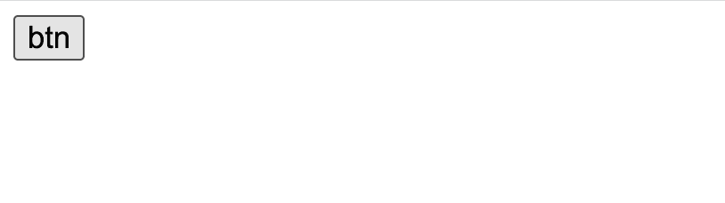

Codepen 演示:

# 平滑滚动

当页面被`#`链接滚动时，默认效果是这样的:

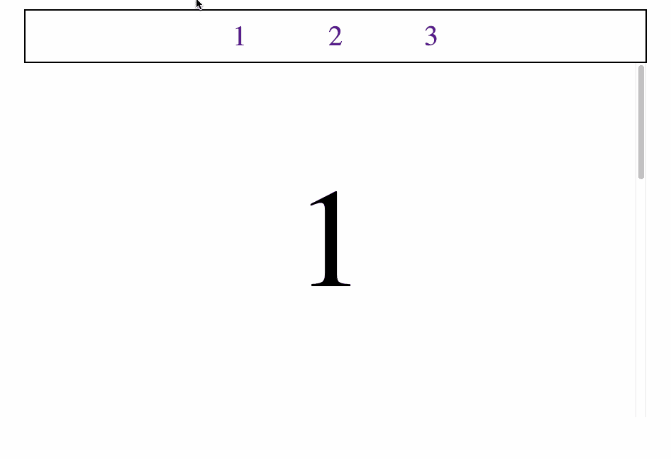

这种突然的跳跃会让人感到不舒服。要解决这个问题，我们可以使用这个 CSS 样式:`sroll-behavior: smooth`。

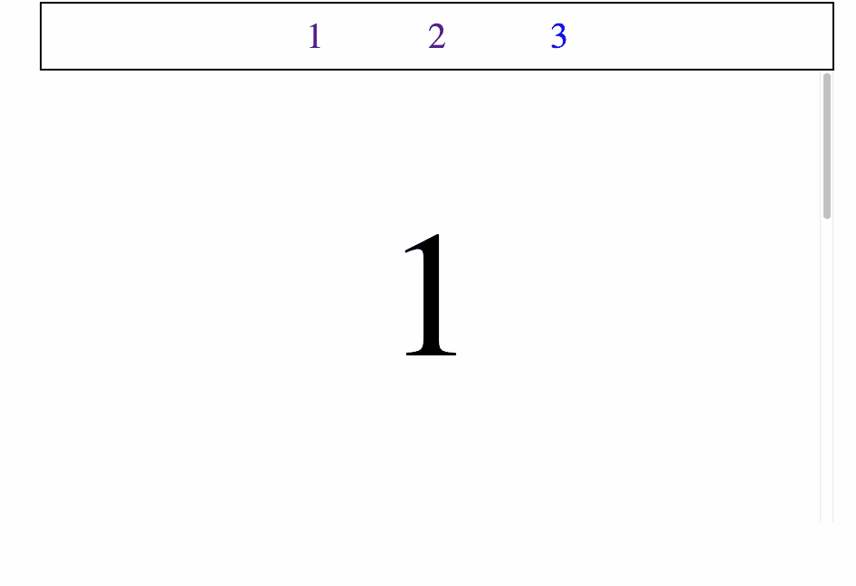

CodePen 演示:

# 选择所有文本

我们的页面经常需要提供一些内容供用户选择，比如电话号码、地址、头衔等。而这些文本应该是一个整体，我们希望当用户点击部分文本时，剩余的文本会被自动选中。

例如:

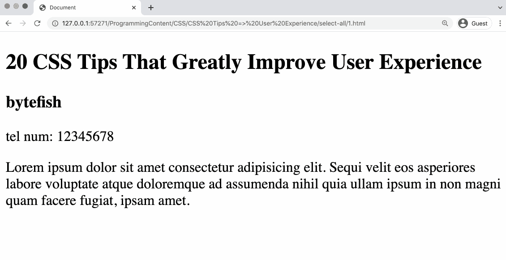

要实现这个效果很简单，只需使用这个 CSS 样式:`user-select: all`。`**user-select**` [CSS](https://developer.mozilla.org/en-US/docs/Web/CSS) 属性控制用户是否可以选择文本。如果它的值是`all`，意味着一个元素的所有内容将被原子地一起选择。

CodePen 演示:

如果你想在选中文本后添加一些额外的样式，可以使用`::selection`。`**::selection**` CSS [伪元素](https://developer.mozilla.org/en-US/docs/Web/CSS/Pseudo-elements)将样式应用于文档中被用户突出显示的部分(比如在文本上单击并拖动鼠标)。

但是你应该记住:只有某些 CSS 属性可以和`::selection`一起使用:

*   `[color](https://developer.mozilla.org/en-US/docs/Web/CSS/color)`
*   `[background-color](https://developer.mozilla.org/en-US/docs/Web/CSS/background-color)`
*   `[text-decoration](https://developer.mozilla.org/en-US/docs/Web/CSS/text-decoration)`及其相关属性
*   `[text-shadow](https://developer.mozilla.org/en-US/docs/Web/CSS/text-shadow)`
*   `[stroke-color](https://developer.mozilla.org/en-US/docs/Web/SVG/Attribute/stroke-color)`、`[fill-color](https://developer.mozilla.org/en-US/docs/Web/SVG/Attribute/fill-color)`和`[stroke-width](https://developer.mozilla.org/en-US/docs/Web/SVG/Attribute/stroke-width)`

CodePen 演示:

# 光标

在不同的场景下使用不同的鼠标风格可以帮助读者感知页面的当前状态，从而提高用户的交互体验。

属性设置鼠标指针，如果有的话，当鼠标指针在一个元素上时显示。

光标设置应该通知用户可以在当前位置执行的鼠标操作，包括文本选择、激活帮助或上下文菜单、复制内容、调整表格大小等等。您可以使用关键字指定光标的*类型*，或者加载要使用的特定图标(使用可选的回退图像和强制关键字作为最终回退)。

示例:

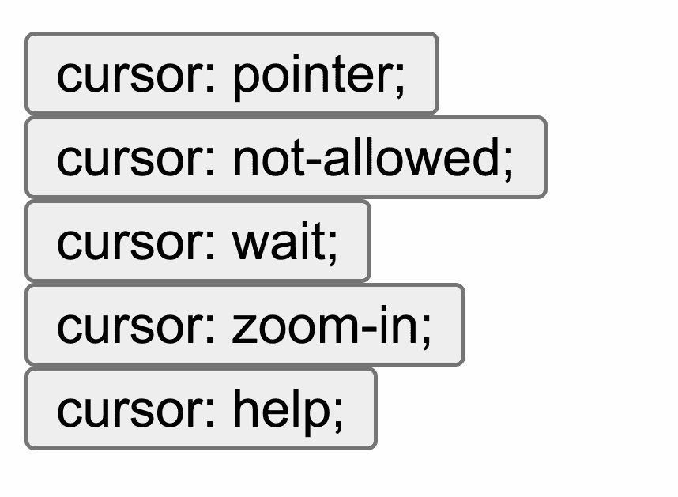

CodePen 演示:

光标有很多种样式，你可以在[的 MDN 文档](https://developer.mozilla.org/en-US/docs/Web/CSS/cursor)中找到它们。

# 文本溢出

现在让我们来看看文本溢出的问题。如果文本容器的内容是从服务器返回的，或者是由用户输入的，那么很难预测文本有多长。

在没有任何预防措施的情况下，您可能会编写如下代码:

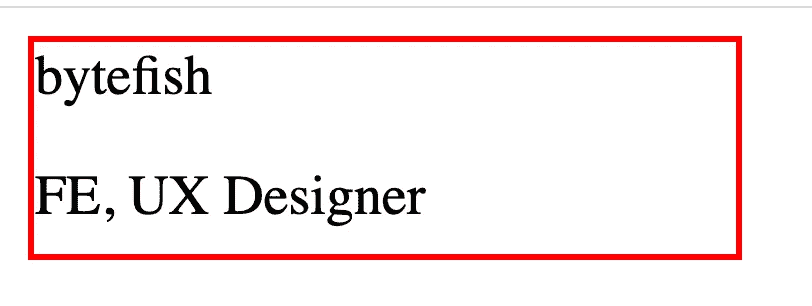

这个容器有一个固定的宽度和高度，包装了名字和生物元素。

但是如果某些用户的 bios 太长，就会导致文本溢出容器，使页面看起来很糟糕。

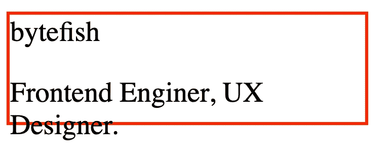

此时，我们可以折叠溢出的文本。这样做就像添加三行 CSS 样式一样简单。

```
white-space: nowrap;overflow: hidden;text-overflow: ellipsis;
```

`white-space: nowrap;`可以使文字不换行。然后我们用`overflow: hidden`隐藏溢出的文字。最后，我们使用`text-overflow: ellipsis`在文本末尾添加一个椭圆，向用户表明有一些隐藏的文本。

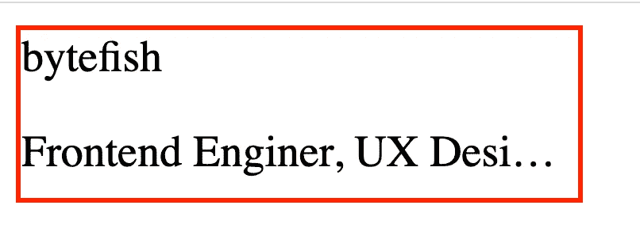

Codepen 演示:

# 图像

现在我们来讨论一下图片的风格。web 应用程序中使用的图像通常由后端提供。您可能已经与后端开发人员达成协议，将图像保持在固定大小。然后你写这样的代码:

网页是这样的:

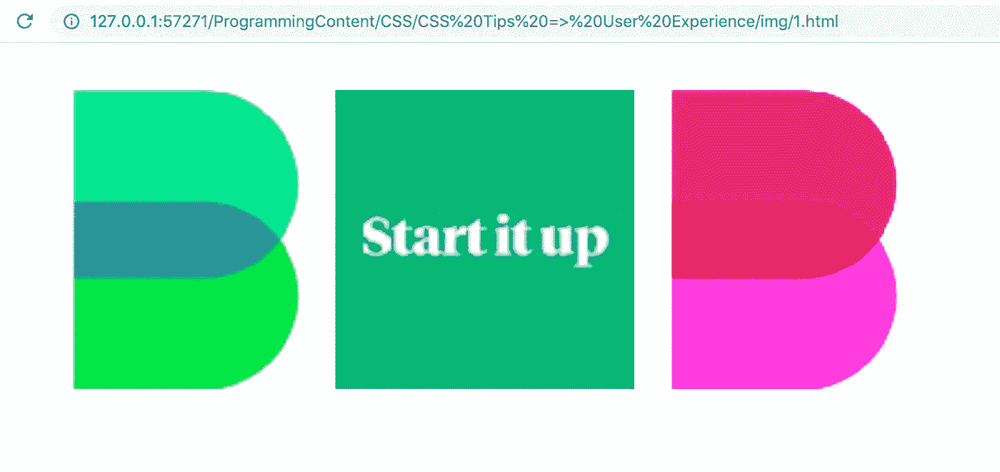

这些图片是按照你期望的样子排列的。

正常情况下没有问题。但是我们写代码的时候，不能假设一切都会按照我们预期的发展。我们需要做好充分准备。如果后端返回的图像不正常，不符合预期的大小，可能大也可能小，那么你的布局就被打乱了。

您可以将其中一个图像的链接替换为:

```
https://miro.medium.com/max/1400/0*zQaS0awtSTOO-JYa.jpg
```

你会发现页面突然变得杂乱:

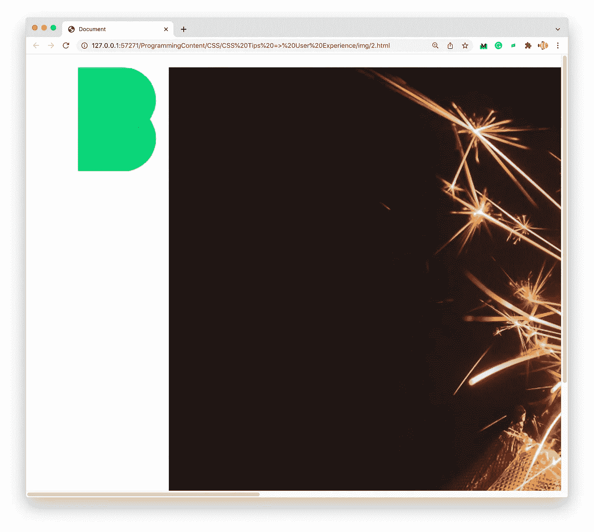

为了防止这个问题并使我们的页面更加健壮，我们可以设置图像的宽度和高度。这样我们就不用担心后端返回的图片大小了。

```
img {
  width: 128px;
  height: 128px;
}
```

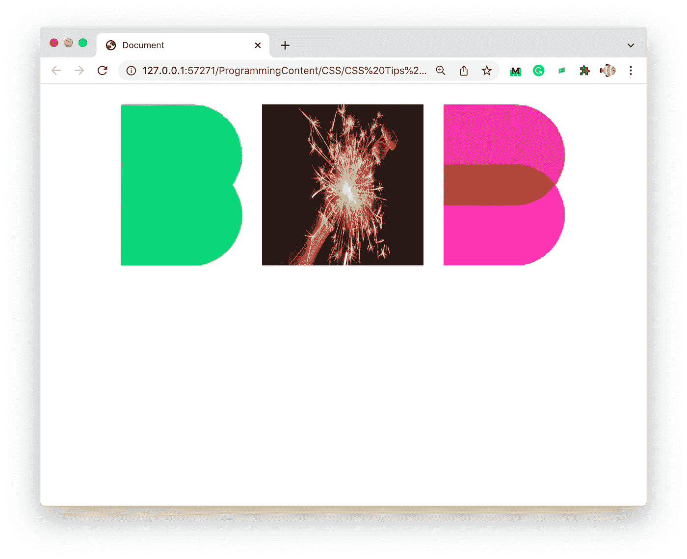

但是上面的写法有一个缺点:如果图像本身的长宽比和我们设定的长宽比不匹配，图像就会被压缩或者拉伸。

为了保持图像的原始纵横比，我们可以使用`object-fit: cover;`。

```
img {
  width: 128px;
  height: 128px;
  object-fit: cover;
}
```

`**object-fit**` [CSS](https://developer.mozilla.org/en-US/docs/Web/CSS) 属性设置如何调整被[替换的元素](https://developer.mozilla.org/en-US/docs/Web/CSS/Replaced_element)的内容，如`[](https://developer.mozilla.org/en-US/docs/Web/HTML/Element/img)`或`[<video>](https://developer.mozilla.org/en-US/docs/Web/HTML/Element/video)`，以适应其容器。

如果值是`cover`，那么被替换的内容的大小将保持其纵横比，同时填充元素的整个内容框。如果对象的长宽比与其框的长宽比不匹配，那么对象将被裁剪以适合它。

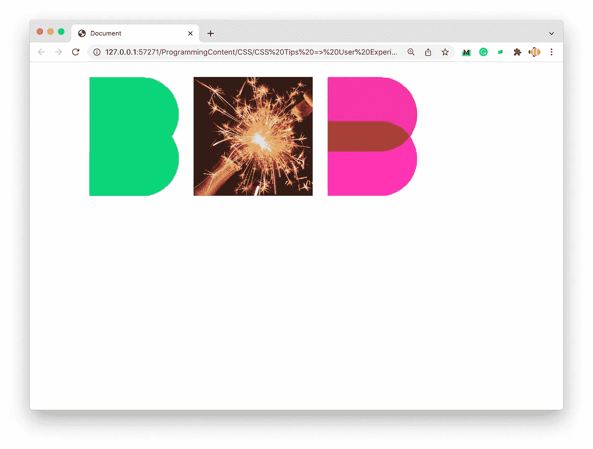

## 没有图像

我们之前讨论的情况都是建立在可以得到图像的前提下。但在实际应用中，可能由于后端服务不稳定，或者用户自身网络信号不好，我们的网页可能无法正确加载图片。

当图片缺失时，浏览器的默认样式不优雅，这里我们可以优化一下。

我们可以给`img`元素添加一个`onerror`事件。如果加载图像时出现错误，那么我们可以通过`onerror`事件向元素添加一个样式，并使用 404 图像。

`img` 元素:

```

```

假设这是我们的 404 图像:

```
https://cdn-images-1.medium.com/max/1600/1*we8wfyztsdo12e2Cww6oVA.jpeg
```

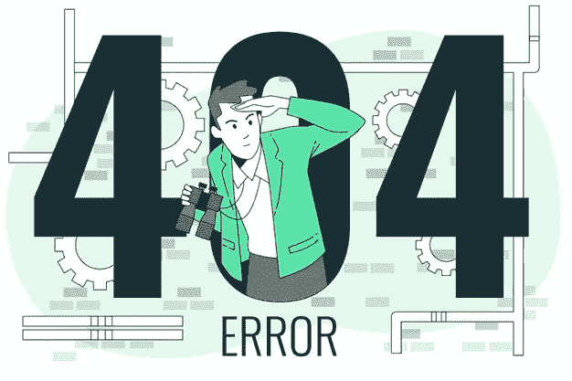

[https://www . free pik . com/free-vector/404-error-with-person-looking-concept-illustration _ 20824298 . htm # query = 404&position = 12&from _ view = keyword](https://www.freepik.com/free-vector/404-error-with-person-looking-concept-illustration_20824298.htm#query=404&position=12&from_view=keyword)

这是 CSS 样式:

```
img.error {
      display: inline-block;
      transform: scale(1);
      content: '';
      color: transparent;
    }img.error::before {
      content: '';
      position: absolute;
      left: 0;
      top: 0;
      width: 100%;
      height: 100%;
      background: #f5f5f5 url('[https://cdn-images-1.medium.com/max/1600/1*we8wfyztsdo12e2Cww6oVA.jpeg'](https://cdn-images-1.medium.com/max/1600/1*we8wfyztsdo12e2Cww6oVA.jpeg')) no-repeat center / 100% 100%;
    }
```

这样，当`img`元素中的图像链接无法加载图像时，将使用我们的 404 图像。

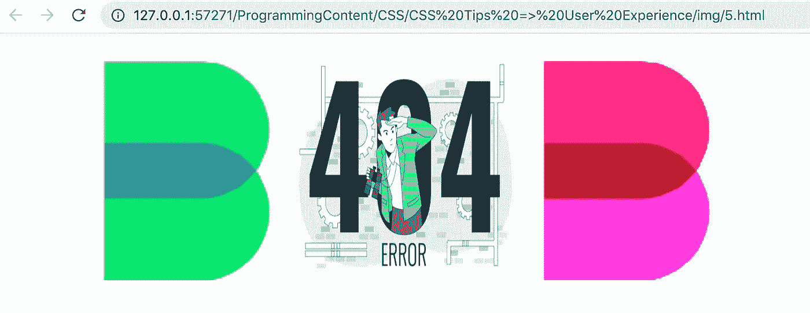

这里还有一点需要优化。在这种情况下，如果原始图像没有正确加载，用户就不知道图像应该是什么样子。为了方便用户理解，我们可以将`img`元素的`alt`属性显示到页面中。

代码:

```
img.error::after {
      content: attr(alt);
      position: absolute;
      left: 0;
      bottom: 0;
      width: 100%;
      line-height: 2;
      background-color: rgba(0, 0, 0, .5);
      color: white;
      font-size: 12px;
      text-align: center;
      white-space: nowrap;
      overflow: hidden;
      text-overflow: ellipsis;
    }
```

假设`img`具有如下的`alt`属性:

```

```

那么它将看起来像这样:

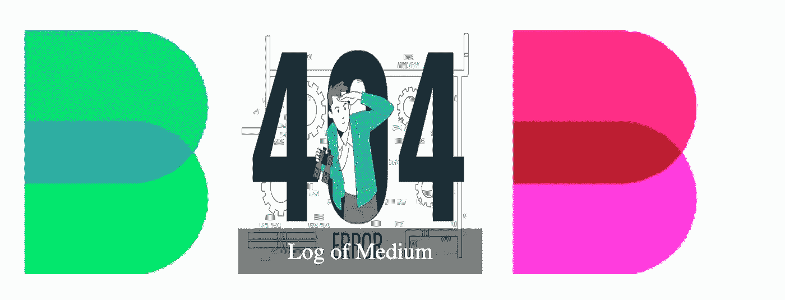

CodePen 演示:

# 色对比度

你在设计色彩组合的时候，有没有考虑过页面的色彩对比？

你要知道世界上有很多色盲和色弱用户。如果你的页面对比度低，可能会导致他们无法正常使用你的产品。无论是出于人文关怀，还是为了留住客户，你都应该设计合适的对比。

WCAG AA 规范规定，所有重要内容的颜色对比度都需要达到或超过`4.5:1`。

这里有一个对比度检查工具:

[](https://webaim.org/resources/contrastchecker/) [## 对比度检查器

### 五个拳击奇才跳得很快。五个拳击奇才跳得很快。在…中输入前景和背景颜色

webaim.org](https://webaim.org/resources/contrastchecker/) 

示例:

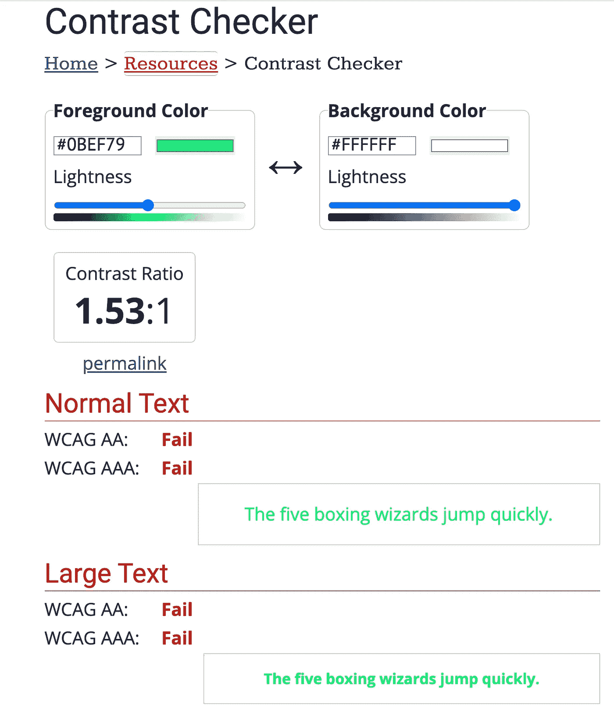

我们还可以使用 Chrome DevTool 来检查元素的颜色对比度。然后我们可以发现，媒体的网页也实践这一原则。

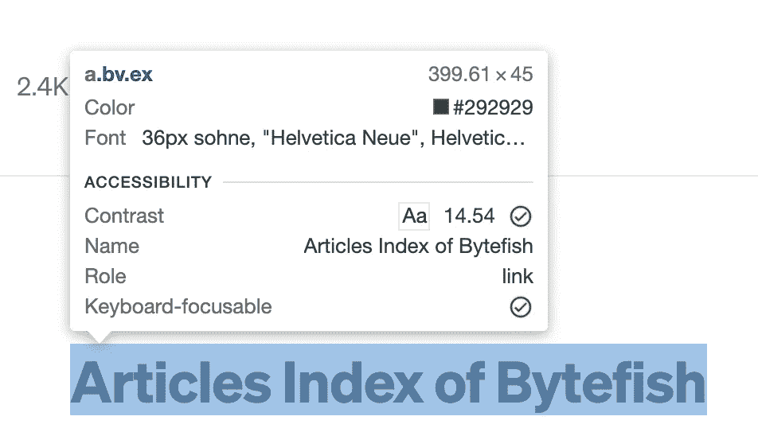

反差是 14.54

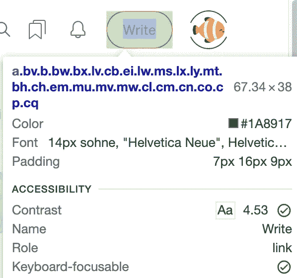

对比度是 4.53

# 最后的

俗话说，细节决定成败。如果你的项目有很多可以提升用户体验的细节，你就能让用户感到舒服，你成功的概率就大一些。

希望这些提示对你有用。如果你因为使用了这些 CSS 技巧而获得了晋升，别忘了为我的文章鼓掌。

# 类似文章

*   [一个设计&来自新媒体首页的 CSS 戏法](https://medium.com/frontend-canteen/a-design-css-trick-from-new-medium-homepage-d92dae2f66e7)