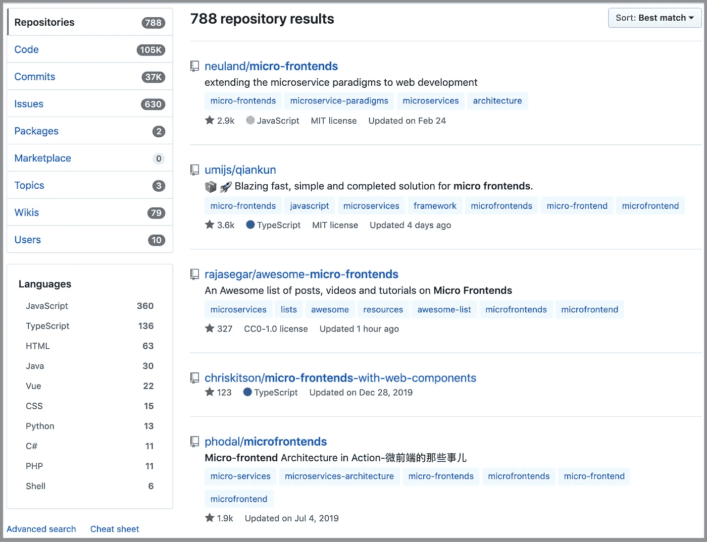
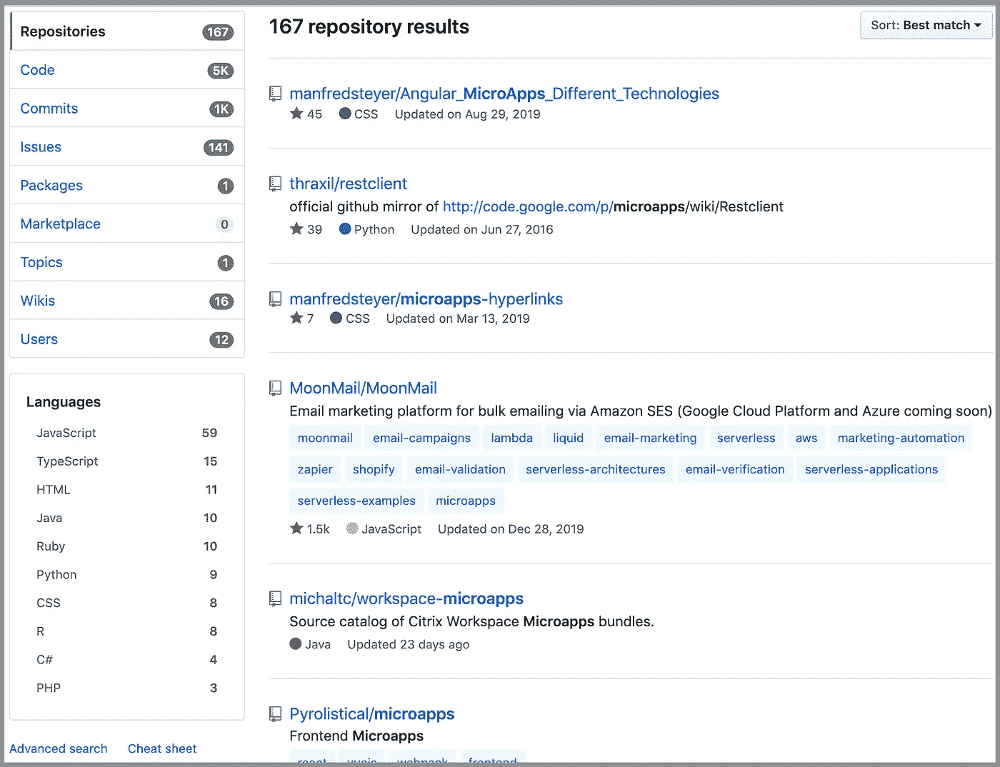
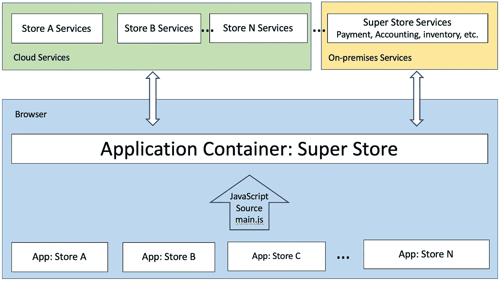
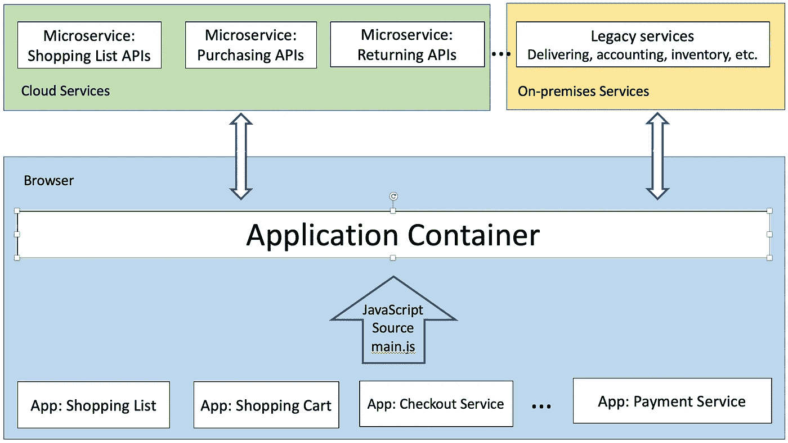
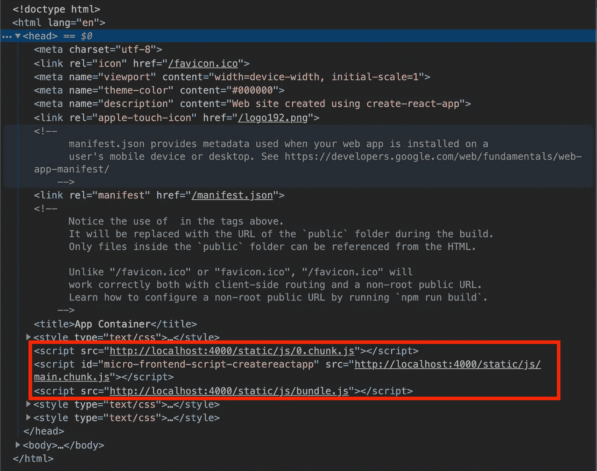
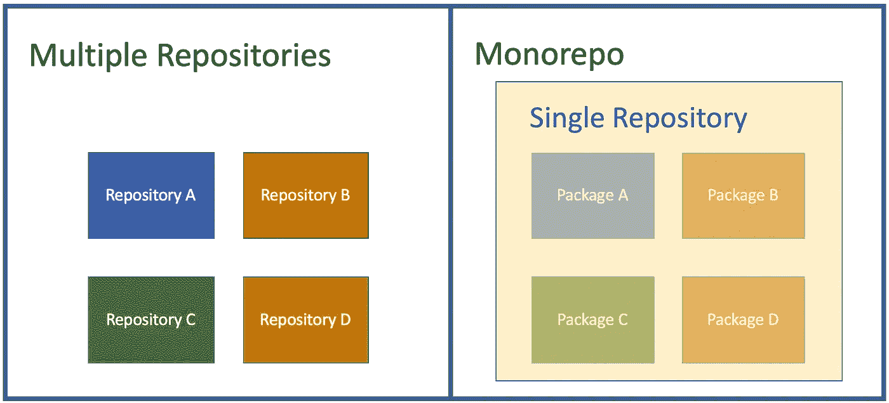
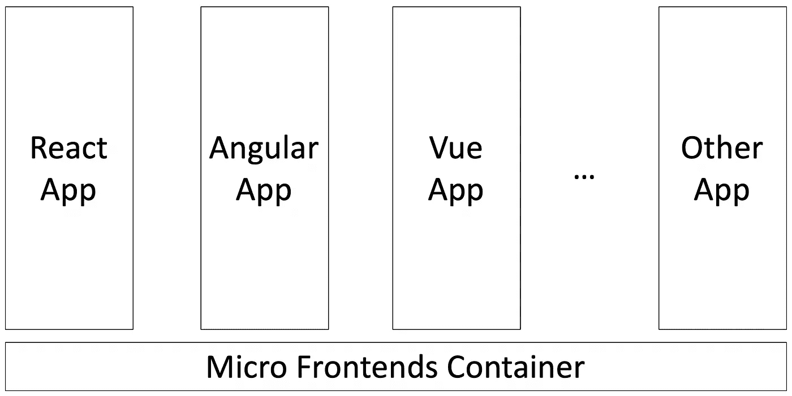

# 微前端方法的 10 个决策点

> 原文：<https://betterprogramming.pub/10-decision-points-for-micro-frontends-approach-4ebb4b59f40>

## 你如何决定微前端是否适合你的项目，如果是，你如何进行？


照片由[上的](https://unsplash.com/@burst?utm_source=unsplash&utm_medium=referral&utm_content=creditCopyText)爆裂[未爆裂](https://unsplash.com/s/photos/decision?utm_source=unsplash&utm_medium=referral&utm_content=creditCopyText)

在一个某些 JavaScript 框架以闪电般的速度变得不受欢迎的时代，前端开发人员一直忙于使用新的、新兴的方法重写应用程序。

我们不顾一切地寻找跳到最新最棒的东西上的可能性，而不用担心遗留代码的包袱。简单地说，我们希望组件解耦。这个吸引人的想法叫做*微前端*。

什么是微前端方法？术语*微前端*最早出现在 2016 年 11 月的 [ThoughtWorks 技术雷达](https://www.thoughtworks.com/radar/techniques/micro-frontends)中。它将微服务的概念扩展到前端开发。

这种方法是通过分解整个应用程序，将基于浏览器的代码拆分成微前端。子应用程序可能由从后端到前端的垂直团队实现。这确保了每个子应用程序都是独立开发、测试和部署的。

我们在项目中采用了 [Cam Jackson](https://camjackson.net/) 的[微前端方法](https://martinfowler.com/articles/micro-frontends.html)。基于我们的第一手经验，我们想分享微前端的十个决策点。

# 1.你会根据受欢迎程度做决定吗？

微前端方法很受欢迎。如果在 GitHub 中搜索“微前端”，有 788 个相关的库。



如果你在 GitHub 中搜索“微应用”，微前端的另一个术语，有 167 个相关的存储库。



总共有大约 1000 个存储库，有各种各样的方法。人气就是需求。这也意味着在这个问题上还没有结论。这是一个难题，但却是一个非常值得期待的解决方案。

# 2.你的用例适合微前端吗？

微前端有五个主要用例:

## 2.1.微前端方法以大规模软件为目标

它将一个整体问题分解成几个更容易处理的部分。

在下面的例子中，一个超市太大而无法发展。拥有一个应用程序容器是有意义的，并且每次当一个单独的存储(软件)准备好时添加一个存储。



## 2.2.微前端方法在遗留代码中非常流行

每天都有新的、酷的、强大的前端技术出现。处理过时但运行良好的现有代码是一件令人头痛的事情。用微前端包起来，运过去。那么不带包袱开始一项新技术是非常非常有诱惑力的。这个模式被 Angular.js 和 Angular 2+反复采用。

## 2.3.微前端方法满足了组织独立性的需要

每个团队都有选择自己方式的自主权。在语言兼容性方面，本质上可以自由选择 JavaScript 或 TypeScript。

一个团队可以选择自己的存储库、第三方工具、公共库、CSS 技术等等。该模型基于团队规模和风格。

## 2.4.可以选择对软件控制较少的微前端方法

这个软件可能来自另一个组织，甚至是另一个公司。

尽管它可能是一个很小的组件，但不管出于什么原因，都不能以正常的方式来托管它。将这种类型的软件作为微前端插入应用程序容器是一种简单的方法。

## 2.5.微前端方法可能是个人偏好

一个人可能仅仅因为热爱这项技术而选择这项技术。他们愿意尝试这项技术，并尽一切努力让它发挥作用。

对于下面的情况，不管是否有许多已被证明的方法，比如 React 的组合模式，它仍然可以使用微前端方法来实现。



你的用例符合这些场景吗？

# 3.需要微前端的好处吗？

微前端有什么好处？

*   每个微前端的代码库变得更小。这种组件方法使得每个微前端的代码更加连贯。从而达到解耦的软件开发目标。
*   每个微前端可以有自己的技术和框架选择。它可以独立实现、测试、升级、更新和部署。它为团队提供了灵活性。
*   微前端鼓励在整个应用程序的基础上构建垂直团队。垂直团队通常包括功能所有者、UX 设计师、产品经理、后端开发人员、前端开发人员和质量保证工程师。

这些好处对你来说重要吗？

# 4.你能忍受从微前端继承的缺点吗？

微前端有哪些弊端？

*   微前端设计用于去耦或松耦合元件。如果你试图在它们之间放置太多的依赖项，可能会导致调试的噩梦。
*   启用微前端的管道是复杂的。渲染外来的未知组件增加了复杂性。它需要技术专家来解决外部加载问题，并且调试过程可能很耗时。此外，您可能会面临单点登录(SSO)、全局 CSS 等问题。
*   每个微前端可能具有重复的代码或功能。例如，React 库可以包含在每个微前端中。这增加了包的大小和内存消耗。
*   在运行时，动态或延迟加载微前端需要额外的时间。
*   由于用户界面是由多个团队设计的，UX 设计可能在微前端之间不一致。

你能忍受这些缺点吗？

# 5.你会选择什么类型的微前端方法？

在可以合理地称为微前端的许多方法中，Cam Jackson 列出了五种类型:

## 5.1.服务器端模板合成

这种方法基于 URL 在服务器端呈现 HTML。 [Microapps](https://github.com/Pyrolistical/microapps) 展示了一个由六个微前端组成的 demo:`Root`、`Angular 1`、`Hyperapp 0`、`React 15`、`Surplus 0`和`Vue 2`。

这是一个简单的方法来说明这个概念。以下设置是 [webpack](https://webpack.js.org/) 服务器配置的一部分:

## 5.2.构建时集成

这种方法将每个微前端发布为一个包，然后让应用程序容器将它们构建为库依赖项。

以下是基于 Cam Jackon 的[微前端演示](https://github.com/micro-frontends-demo)的`package.json`示例:

```
{
  "name": "@feed-me/container",
  "version": "1.0.0",
  "description": "A food delivery web app",
  "dependencies": {
    "@feed-me/browse-restaurants": "^1.2.3",
    "@feed-me/order-food": "^4.5.6",
    "@feed-me/user-profile": "^7.8.9"
  }
}
```

## 5.3.通过 iframes 的运行时集成

代表一个嵌套的浏览上下文，嵌入在另一个 HTML 页面中。这是将应用程序与良好的样式和全局变量隔离结合在一起的最简单的方法。

从 HTML5 开始，`iframe`可以在一定程度上安全地被沙箱化。然而，`iframe`往往会搞乱路由、历史和深层链接。

作为一项古老的技术，`iframe`简单而强大，但也容易被滥用。

## 5.4.通过 JavaScript 的运行时集成

这是我们采用的方法，从 Cam Jackson 的算法改进而来的[。这是一种灵活的 JavaScript 方法。](https://medium.com/better-programming/you-dont-have-to-lose-optimization-for-micro-frontends-60a63d5f94fe)

基于渐进式加载的块计数，使用多个`<script>`标签将每个微前端包含在页面上。一旦加载了最后一个块，就调用一个全局入口点来呈现微前端。



## 5.5.通过 Web 组件进行运行时集成

Web 组件是一套不同的技术，允许你创建可重用的定制元素。它由三种主要技术组成:定制元素、影子 DOM 和 HTML 模板。

它是一种特殊类型的“通过 JavaScript 的运行时集成”。唯一的区别是您更喜欢使用 Web 组件的方式。Cam Jackson 提供了一个 Web 组件微前端的例子:

```
<html>
  <head>
    <title>Feed me!</title>
  </head>
  <body>
    <h1>Welcome to Feed me!</h1>

    *<!-- These scripts don't render anything immediately -->*
    *<!-- Instead they each define a custom element type -->*
    <script src="https://browse.example.com/bundle.js"></script>
    <script src="https://order.example.com/bundle.js"></script>
    <script src="https://profile.example.com/bundle.js"></script>

    <div id="micro-frontend-root"></div>

    <script type="text/javascript">
      *// These element types are defined by the above scripts*
      **const** webComponentsByRoute = {
        '/': 'micro-frontend-browse-restaurants',
        '/order-food': 'micro-frontend-order-food',
        '/user-profile': 'micro-frontend-user-profile',
      };
      **const** webComponentType = webComponentsByRoute[window.location.pathname];

      *// Having determined the right web component custom element type,*
      *// we now create an instance of it and attach it to the document*
      **const** root = document.getElementById('micro-frontend-root');
      **const** webComponent = document.createElement(webComponentType);
      root.appendChild(webComponent);
    </script>
  </body>
</html>
```

从这些选择中，您会选择哪种类型的微前端方法？

# 6.你会选择现有的微前端方法吗？

你可以像我们一样采用 Cam Jackson 的微前端方法。你可以想出你自己的、本土的解决方案，或者你可以选择一些其他的方法。

以下是[牛逼微前端](https://github.com/ChristianUlbrich/awesome-microfrontends)中描述的方法:

*   [Mosaic](https://www.mosaic9.org/)——Project Mosaic 是 Zalando 在微前端方面的成果，是一个完整的框架。
*   [单温泉](https://single-spa.js.org/) : Canopy 的微前端方法是关于组成多个温泉。
*   这是一个开源的“包含电池”的微前端框架。
*   [聚合物项目](https://www.polymer-project.org/):这是谷歌对构建 Web 组件的尝试，这些组件仍然有一些不错的工具。
*   [坚果](https://www.polymer-project.org/):这是一个为微前端而生的框架，网易内部使用。目前支持 Vue、React 等。
*   [讲台](https://podium-lib.io/):这是一个微前端的服务器端构成。
*   [Piral](https://piral.io/) :这是一个使用 React 构建的微前端的下一代门户应用的开源框架。

目前还没有主流的微前端方法。您总是可以从现有的解决方案开始。

# 7.你会有几个微前端？

微前端为您如何执行前端开发带来了另一个维度。

从光谱的一端，我们看到了将应用程序分解成两部分的用例:遗留代码和新开发的代码。另一个极端，我们也看到了做很多小微前端的方法，包括全局类型，时间服务，i18n 服务等。

关于哪种方式是正确的，没有严格的标准。它完全基于您的用例以及您团队的动态。设计微前端时，您可能需要考虑以下因素:

*   是否要在同一个视图中组合多个微前端？
*   要不要把多条路由合并成一个微前端？
*   你想在微前端之间共享数据和/或状态吗？
*   您希望在运行时保留微前端还是在构建时将它们捆绑到一个应用程序中？
*   你的微前端服务可以跨域运行吗？
*   您的微前端服务将部署到云中、内部部署，还是两者都部署？

这些事实将影响您如何设计微前端，以及如何选择微前端框架。

假设您正确地构建了模块，那么您拥有的微前端越多，最终得到的耦合就越少。然而，管理每个微前端也是一种开销。

微前端的数量需要仔细设计。

# 8.你如何构建微前端仓库？

对于微前端项目，微前端可以保存在单独的存储库中，或者 monorepo，这是一种源代码控制模式，其中所有的源代码都保存在单个存储库中。



还有另一种选择:两者结合。

我们已经使用了所有类型的存储库。每一种都有利弊。

## 应用程序容器以及每个微前端都保存在自己的存储库中

对于这个微前端系列，我们使用了两个存储库— [一个用于应用程序容器](https://github.com/JenniferFuBook/app-container)，而[一个用于微前端](https://github.com/JenniferFuBook/micro-frontend)。不同的分支用于不同的目的。

这两个存储库是独立管理的，相互独立。然而，一些分支是相互连接的，需要小心管理，以便在运行时正确匹配。

例如，分块的微前端需要由我们改进版本的应用程序容器启动。对于我们所有的工作，`[concurrently](https://github.com/kimmobrunfeldt/concurrently)`提供了很好的协助。

它帮助我们在一个命令中启动多个可执行文件。此外，保存在 Bash 概要文件中的别名有助于跟踪哪个测试床对应哪个存储库。

## 应用程序容器和所有微前端都保存在一个 monorepo 中，比如 [lerna](https://github.com/lerna/lerna)

集中的位置有助于识别一个存储库中的所有内容。一个包的变化不需要`npm link`就可以反映给其他人。许多流行的开源项目都采用了这种模式，比如 Babel、React、Parcel 等等。

然而，建立单一回购协议需要额外的努力。随着每个软件包的增长和软件包数量的增加，维护开销也会增加。搜索某样东西并不有趣，最终会有一个巨大的列表。

另外，我编辑了一个错误的`package.json`，因为存在多个`package.json`文件。有点讽刺的是，我们使用微前端使一个单一的任务变得可管理，但同时，我们创建了一个单一的报告。

此外，支持 monorepo 的工具可能有限。比如 VS 代码调试只在顶层起作用。我们必须转到每个包才能使用这个内置特性。

## 多个储存库和单一储存库的组合

我们有多个项目采用 monorepos。我们也有多个项目存在于单个存储库中。

在整个公司范围内聚合用户界面的性质使我们处于利用多个存储库和 monorepos 的情况。到目前为止一切顺利，我们能够成功地管理微前端与组合。

你的选择是什么？如果您从头开始构建，那么您更喜欢哪个，多个存储库还是单个存储库？

# 9.你想用多少框架？

严格来说，React 是一个库，而不是一个框架。为了简单起见，我们在这里不严格地使用术语*框架*。

据说微前端架构支持启动用各种框架构建的应用。



这是一种正确的说法，但应该尽量避免。将多个框架放在一起意味着更大的占用空间、更少的优化、更多的升级问题和更多的集成问题。

使用微前端方法来组合多个应用程序(框架)始终是业务需求，以便在团队之间聚合遗留代码以及不同的产品。

你还能做些什么来加速交货？大多数组织不能花费大量的时间使用更新更好的技术来重写新的用户界面。

很多时候，我们别无选择，只能接受部分或全部现有产品。我们已经看到了许多案例，例如在迁移到 Angular 2+时保留 Angular.js 遗留代码，在迁移到 React 时保留 [Backbone.js](https://backbonejs.org/) 遗留代码。

如果你从零开始，尽可能坚持一个选定的框架。框架中包含了许多架构上的考虑。

应该是模型-视图-控制器(MVC)，模型-视图-展示者(MVP)，还是模型-视图-视图-模型(MVVM)？React 只是 MVC 中的视图吗？Angular 是 MVC 还是 MVVM？

这仅仅是开始。还有更多关于依赖管理、DOM 操作、测试、部署、实用程序等问题。

通常需要一个强大的团队、大型社区和多年的改进来构建一个坚实的框架。经验法则是首先探索所选框架的功能。

如果可以选择，你想用多少框架？

# 10.你能承担多少实验工作？

所有框架无缝协作一直是前端开发人员的梦想。

拥有一个聚合的用户界面，用最少的工作量将所有的软件组合在一起，这一直是企业的愿景。

我们选择了 Cam Jackson 的算法，因为其他解决方案不适用于我们现有的软件。我们必须用半自己动手的方式来做这件事。此外，他的工作在我们社区很受欢迎。到目前为止，效果还不错。

事实是，您正在考虑使用微前端方法，因为您已经到达这篇长文章的末尾。

你从这里去哪里？

您可以选择一个现有的解决方案，并让它为您的用例工作，或者您可以更进一步，开拓一些新的解决方案。有了时间和专业知识，软件工程师可以做出惊人的事情。

你能承担多少实验工作？下一件大事可能就是从这个开始的。

# 结论

软件行业一直在寻找一种简单而强大的用户界面开发解决方案。微前端方法是一个有前途的选择。探索愉快！

这项工作的一部分是由乔纳森马贡献。

感谢阅读。我希望这有所帮助。

# 系列

这是一个关于微前端的系列。以下是其他文章的列表:

*   "[将随机 React 应用程序转变为微前端的 5 个步骤](https://medium.com/better-programming/5-steps-to-turn-a-random-react-application-into-a-micro-frontend-946718c147e7)"
*   "[将随机 React 应用程序转变为微前端容器的 3 个步骤](https://medium.com/better-programming/3-steps-to-turn-a-random-react-application-into-a-micro-frontend-container-a80e33b6a066)"
*   "[打造自己的微前端生态](https://medium.com/better-programming/build-your-own-micro-frontend-ecosystem-a05128c74f99)"
*   "[你不必失去对微前端的优化](https://medium.com/better-programming/you-dont-have-to-lose-optimization-for-micro-frontends-60a63d5f94fe)"
*   "[创建多版本 React 应用程序的 6 个步骤](https://medium.com/better-programming/6-steps-to-create-a-multi-version-react-application-1c3e5b5df7e9)"
*   "[使用 Webpack 5 模块联盟的微前端](https://medium.com/better-programming/micro-frontends-using-webpack-5-module-federation-3b97ffb22a0d)"