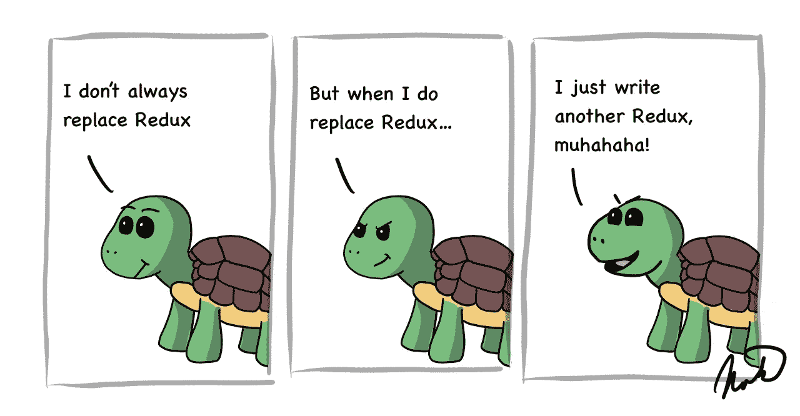
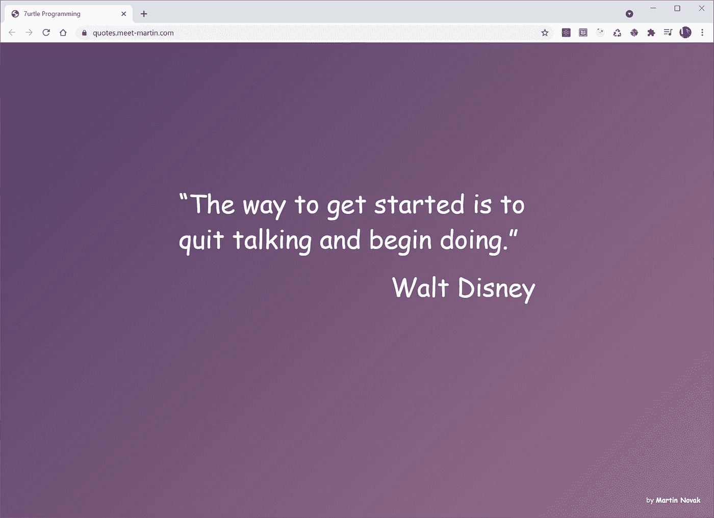
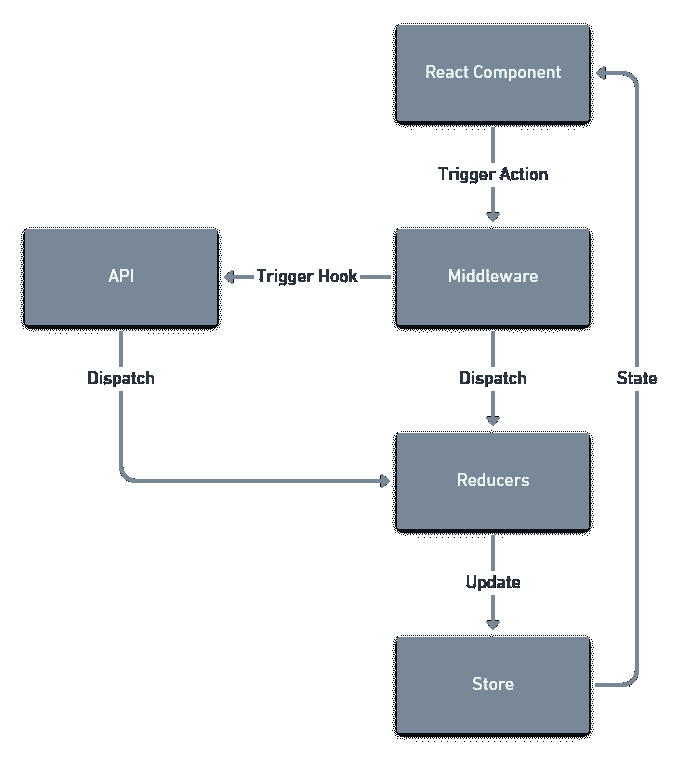
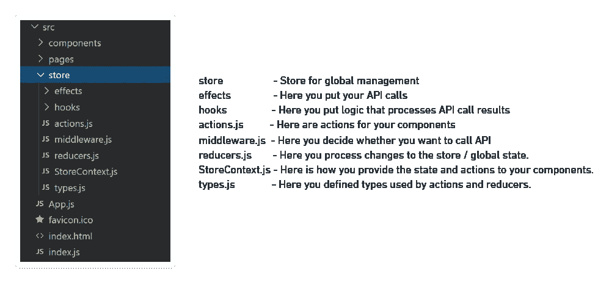
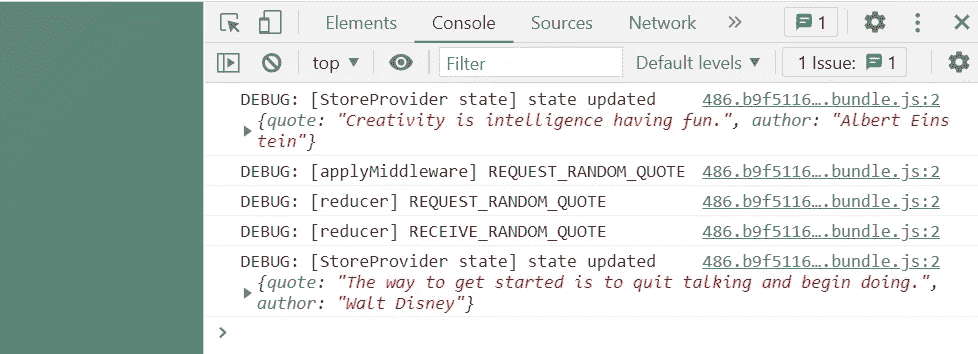

# 放弃 Redux 的 10 个简单步骤

> 原文：<https://betterprogramming.pub/10-easy-steps-to-abandon-redux-for-the-remarkable-react-hooks-124916fc634d>

## 使用 React 钩子进行全局状态管理的简单指南



作者原创作品。

如果您正在开发 React 应用程序，管理全局状态和访问后端的最简单方法是通过 React 钩子。

尽管自从钩子在 React 16.8 中发布以来，已经有很多关于它们的文章，但实际上很难找到一本指南来很好地解释如何利用它们来构建应用程序。

我会给你一个最好的可扩展的方法来管理你的应用程序之间的数据共享，并通过 React 钩子与你的后端 API 一起工作，我在我所有的 React 应用程序中都使用了 React 钩子。

如果您已经熟悉 Redux，那么我的解决方案应该非常相似，只有一些小的不同。我们将为全球范围开发简单的中间件，我们将用 [axios](https://www.npmjs.com/package/axios) 管理所有 API 调用。

# 最终 API:保持组件的干净和简单

我们希望应用程序中的 React 组件能够触发操作，例如更新数据，并且我们还希望它们能够对这些操作的结果或全局状态的任何其他更改做出反应。

我们将通过使用上下文挂钩来实现这个目标，它将使我们的组件看起来像这样:

注意，我们正在从上下文钩子`useContext`加载`state`和`actions`。通过这种方式，我们可以全局地访问我们的所有状态和操作，并且我们遵循关注点分离原则，因为数据存储、数据操作和数据表示都是分开处理的。

如果任何动作触发了对全局状态的更新，所有组件都会立即知道，而无需添加任何额外的逻辑。

别忘了，写聪明的代码，构建聪明的架构，会让你变得聪明伶俐。

# 示例:报价 Web 应用程序

为了更有趣，我们还将构建一个可部署到 [Netlify](https://www.netlify.com/) 的完整应用程序。你可以看到**最终产品工作**这里:
[https://quotes.meet-martin.com/](https://quotes.meet-martin.com/)。



[https://quotes.meet-martin.com/](https://quotes.meet-martin.com/)

这是一个简单的应用程序，它有一个名人语录列表，并使用全局状态管理来接收和显示语录和背景颜色的随机组合。

它甚至引用了华特·迪士尼的一些话，没有哪个糟糕的网站会引用华特·迪士尼的话，所以它一定很神奇。

你可以在这里找到**完整的 GitHub 库**:https://github.com/MeetMartin/quotes。

一旦你完成这篇文章，你就可以自己去发现如何通过在 GitHub 上创建一个 pull 请求来添加更多的报价，并将它们添加到网站上。

# 为什么是全局状态管理？

如果不使用全局状态管理系统，您的应用程序很快就会出现规模问题。如果您的组件想要将信息传递给其他组件，您需要找到自己的方式来构建它。

如果不分离关注点，您的组件将直接访问如下 API:

这种方法限制了组件的可重用性，因为它依赖于获取数据的特定方式。如果不将代码复制粘贴到其他组件中，您也无法重用获取数据的方式。或者，您需要找到某种方法，与需要它的其他组件共享相同的数据。

只有邪恶的软件架构师才会让你编写这样的代码。

# 应用架构

这是全球范围管理的架构，如果你曾经使用过 [Redux](https://react-redux.js.org/) 的话，应该已经很熟悉了。

正如您在第一个示例中看到的，React 组件可以从所有组件和页面共享的存储中访问全局状态。

当您在组件中触发一个动作时，它将通过一个中间件将其传递给 reducer，同时触发一个钩子，该钩子可以执行对某个外部 API 的调用。

然后，Reducers 负责更新存储，所有状态更新会立即传播到所有组件。



这将在代码中导致该存储目录的文件结构:



全局存储文件

是不是很美？这么多文件和代码需要我们分析！

这样做的目的是，您可以在所有应用程序中实际使用这些文件作为模板。我在这里描述了它们，这样你就知道它们是做什么的，它们是如何工作的，以及在哪里插入你自己的创造性代码来使所有的东西都很好地一起工作。

# 从定义类型开始

我们的动作和中间件通过分派类型和数据来更新存储。类型是它们和更新存储的 reducer 之间的连接。我们想要做的每一个数据操作都需要有一个定义好的类型。

当您想通过添加更多操作来扩展应用程序时，这是您通常要编辑的第一个文件。

在我们的应用程序中，我们只有两种类型:`REQUEST_RANDOM_QUOTE`和`RECEIVE_RANDOM_QUOTE`。

`REQUEST_RANDOM_QUOTE`是我们的页面如何让中间件知道它想要请求一个随机报价，而`RECEIVE_RANDOM_QUOTE`是中间件如何让 reducer 知道它有一个新报价。

我们使用这种方法是因为当我们将 actions 和 reducers 联系在一起时，它可以帮助我们避免输入错误。然而，如果你愿意，你可以忽略它，在你的应用程序中只使用`RECEIVE_RANDOM_QUOTE`作为一个字符串，而不使用类型文件。反正都是字符串。

一个聪明的开发人员会使用类型文件，因为其他人都在使用它，其他人不会错。

为您的类型决定一个好的命名约定也是非常重要的。在简单的应用程序中，我通常使用请求/接收，在更复杂的应用程序中，我使用 CRUD(创建/读取/读取 _ 全部/更新/删除)。

# 组件可用的操作

动作是你的组件如何触发变化并将数据传递给中间件和 reducer。

我们的应用程序将只需要一个动作——`requestRandomQuote`——它的名称创建了与类型`REQUEST_RANDOM_QUOTE`的明确连接。

我们的主页将触发该操作，让中间件知道它需要一个新的随机报价:

如果没有有效载荷，我们可以稍后通过简单地调用`actions.requestRandomQuote();`来使用这个动作。

如果我们想传递一些数据，我们也可以实现额外的动作来调用`actions.requestRandomQuoteFrom('Einstein');`。

您提供的任何有效负载对我们的中间件和缩减器都是可用的。

请注意，我们不需要在 actions.js 中创建动作`receiveRandomQuote`，这是因为我们希望类型`RECEIVE_RANDOM_QUOTE`由中间件分派，而不是由我们的任何组件分派。

我们主要创建抽象的动作，这样组件就不需要直接处理调度调用。

# 更新商店的减速器

我们的系统通过向 reducer 发送数据来更新存储中的全局状态。reducer 使用我们之前在交换机中定义的类型来更新状态。

你会发现减压器实际上很容易使用。相信我，我是个工程师。

常量`initialState`具有我们的应用程序的开始状态。

我们使用`console.debug`以便在你的应用程序中，你可以看到每次减速器达到。对于我们在[https://quotes.meet-martin.com/](https://quotes.meet-martin.com/)上的实时应用程序也是如此。



Chrome 浏览器中的控制台检查器。

无论您在中间件中采取什么操作，每次都会到达 Reducer。由于`switch`上的`default`，如果我们打算只触发中间件，我们不必总是更新状态。这就是为什么我们在`RECEIVE_RANDOM_QUOTE`上改变状态，但我们不对`switch`中缺失的`REQUEST_RANDOM_QUOTE`采取任何行动。

我们也在函数式编程领域，所以你可以注意到我们的开关总是返回一个新的状态，而不是编辑原来的状态。

一旦返回新状态，所有读取任何更改值的组件都会被告知状态的更改。神奇！

当您添加一点函数式编程的魔力时，每段代码都会变得更好。

# 联系您的 API 的中间件

中间件捕捉组件中触发的每一个动作，与 reducers 类似，它使用动作的类型来触发自己的挂钩，这些挂钩可以联系您的后端 API。

为了实现中间件，我们将开始使用函数式编程库[@ 7 urtle/lambda(www.7urtle.com)](https://www.7urtle.com/)。在函数式编程中，使用外部 API 被认为是一种副作用，我们将使用 monads 来处理这些副作用，同时保持您的函数纯净。

如果你不理解单子或者不太熟悉函数式编程，也不用担心。代码非常简单，您可以用任何一种方式使用它，或者用您自己的命令式解决方案替换它。然而，如果你想了解更多关于单子的知识，看看 JavaScript 中的[用单子管理副作用](https://www.7urtle.com/javascript-applicative-functor-monads)。

这才是真正有趣的地方。

# 模拟报价效果以获得随机报价

一会儿我们将展示对一个网络函数的真正请求是什么样子的。现在，我们将编写一个简单的代码，模拟执行服务器请求的情况，但实际上，它只是通过使用超时延迟一秒钟来实现异步。

我们将需要两个函数:`getRandomQuote`在它的输入数组中找到一个随机引用，而`requestQuote`将返回我们的结果。

我们的函数`requestQuote`返回 [AsyncEffect](https://www.7urtle.com/documentation-7urtle-lambda#lambda-AsyncEffect) ，这是一个具有惰性求值的单子，可以处理异步副作用。它还返回另一个单子`Maybe`，其中可能包含随机引用的结果。

# 真实报价获得随机报价的效果

在我们的场景中，这可能是对一个 [Netlify 函数](https://www.netlify.com/products/functions/)的请求。Netlify functions 是一个处理服务器后端的简化的 AWS Lambda。

我们的代码如下所示:

你可以看到我用例子添加了很长的注释，但是代码本身非常短。

我们的`getQuoteFromNetlify`是一般`postToFunction`的[功能部分应用](/5-easy-steps-to-master-currying-and-higher-order-functions-in-javascript-85e2a7e2c268)。`postToFunction`再次返回 [AsyncEffect](https://www.7urtle.com/documentation-7urtle-lambda#lambda-AsyncEffect) 持有[可能](https://www.7urtle.com/documentation-7urtle-lambda#lambda-Maybe)的结果数据。当我们转到为我们的效果提供逻辑的`QuoteHook.js`时，我们将会看到这些是如何使用的。

关于这两个单子，需要记住的重要一点是,[asynce effect](https://www.7urtle.com/documentation-7urtle-lambda#lambda-AsyncEffect)类似于 JavaScript Promise，但是在您调用它的方法 trigger 之前，它不会被求值。因此，作为`postToFunction`的一部分，实际上还没有执行服务器调用，这保持了我们函数的纯净。

[也许](https://www.7urtle.com/documentation-7urtle-lambda#lambda-Maybe)是一个单子，当你不能确定你实际上收到了一个值时使用。`Maybe`表示可能有值(是`Just`)或者没有值(是`Nothing`)。这允许我们用一种非常健壮和简单的方式来处理可能的错误状态和问题。

如果您正在使用 Netlify 函数，您也可以通过调用`postToFunction`轻松创建自己的效果。

```
export const myFunction = callToFunction('/your-function-path');
```

如果你使用其他东西，这两个单子在 [@7urtle/lambda 文档](https://www.7urtle.com/documentation-7urtle-lambda)中都有很好的记录。

# 钩子来调用和处理我们的效果

下一步是创建一个钩子来调用和处理我们的效果函数。相同的代码将使用 mock 或 Netlify 函数来处理这两种方法中的任何一种。

感谢函数式编程的魔力，我们又只需要几行代码了。我们的`getQuote`从我们的效果中调用`requestQuote`或`getQuoteFromNetlify`。它触发返回的`AsyncEffect`并记录错误或调用`dispatch`通过我们之前编写的缩减器将数据传递给全局状态。

`AsyncEffect`处理与`axios`调用相关的问题，从随机代码错误到服务器响应 500 或 400 个问题。而`Maybe`是通过[可能是](https://www.7urtle.com/documentation-7urtle-lambda#lambda-maybe)函数(小写的‘m’)来处理的，这个函数允许我们处理不返回数据的服务器。

这里不需要额外的逻辑。如果你愿意，你也可以通知错误的全局状态，并在你的代码中使用`dispatch`而不是`console.error`。

# 将一切联系在一起的实际中间件

实际的中间件文件类似于我们的 reducer。它使用一个开关来检查被调用的类型，并在此基础上调用我们之前声明的钩子。

中间件总是为每个`action`(而不是`dispatch`)调用，如果你不需要调用任何钩子，你可以忽略类型，它会很高兴地继续到缩减器。

出于调试目的，我们再次将`console.debug`添加到代码中，这样您就可以看到应用程序中发生了什么。

# StoreContext 为组件提供状态和动作

我们需要创建的最后一个文件是`StoreContext.js`，它为我们的应用程序提供了全局状态管理。

您实际上并不需要编辑这个文件，所以您可以自由地让它保持原样。

它还包含另一个`console.debug`,每次它改变时都会记录一个新的状态，以便于您检查。

# 将全局状态管理添加到 App.js

这就是你的应用。现在你只需要把你的`StoreContext`加到`App.js`上。

`StoreProvider`只是作为一个组件添加。这使得里面的任何东西都可以使用它。在我们的简单应用程序中，它只是`HomePage`，但是在一个更大的解决方案中，您可以将它放在 React 路由器上。

# 主页

我们的单页应用程序使用`HomePage`来读取当前报价，并以十秒钟的间隔调用`requestRandomQuote`来刷新报价。

您需要将这一行添加到您的组件中，使其能够访问全局状态管理:

```
const { state, actions } = useContext(StoreContext);
```

我通常使用页面作为简单的控制器，从组件的表示中提取读取数据。因此`QuoteComponent`负责显示报价，但不知道数据来自全局状态。

`useEffect` React hook 用于在`HomePage`第一次加载时运行`setInterval`添加开头。它简单地调用`requestRandomQuote`，其结果由我们的 reducer 处理。状态自动更新，我们不需要任何额外的代码来更新`QuoteComponent`。

# 基于报价变化的背景颜色变化

为了展示您的组件可以根据全局状态的变化执行额外的更改，我添加了`Background`组件，它会在每次报价更改时将背景更改为随机颜色。

[React 风格的组件](https://styled-components.com/)被我用来创建实际的背景`div`。

我们利用`useEffect` React 钩子监视`state.quote`改变颜色:

```
useEffect(
  () => setBackgroundColors(randomOf(colors))
, [state.quote]);
```

然后当前的背景颜色被`useState` React 钩子保存在本地状态中，这演示了如何巧妙地将本地和全局状态结合在一起。

```
const [ backgroundColors, setBackgroundColors ] = useState(randomOf(colors));
```

# 结论

这就是让整个应用程序正常工作所需要做的全部工作。

现在想象一下，当您向每个人展示使用 React 钩子、全局状态管理和函数式编程的强大功能可以在 React 中做些什么时，他们会有怎样的印象。

如果有什么不工作，看看在 https://github.com/MeetMartin/quotes 的完整的 GitHub 项目库。

如果这不起作用，那么问题出在你的键盘和椅子之间的某个地方，但是请随意发表评论。我很乐意尽我所能帮助或引导你前进。

另外，请在评论中告诉我这个解决方案对你的效果如何，你的同事是否喜欢它，或者你是否有什么需要改进的地方。