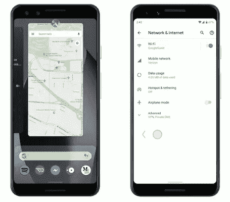
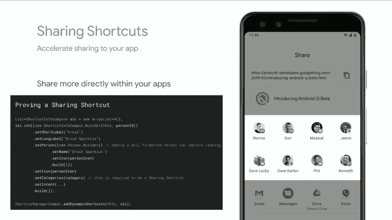
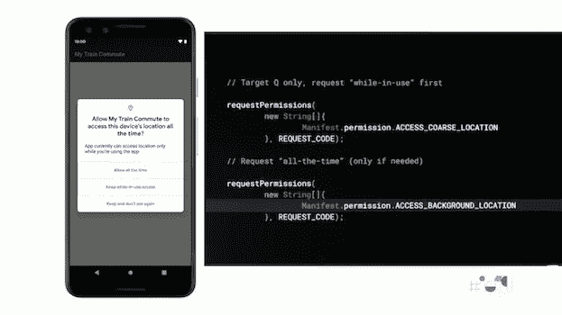
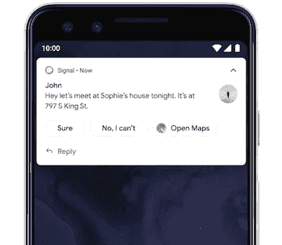
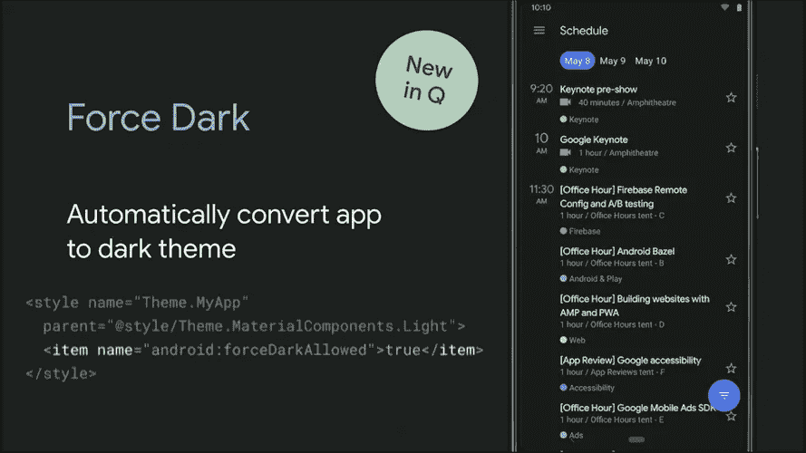
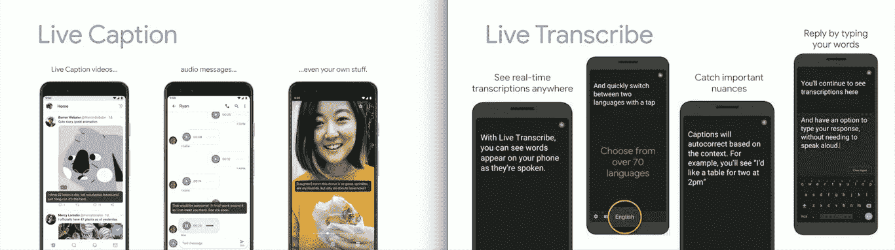
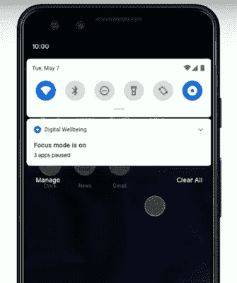

# 关于 Android 10 需要知道的 10 件重要事情

> 原文：<https://betterprogramming.pub/10-essential-things-about-android-10-485434992578>

## 新增内容和淘汰内容的清单

我点了那个背景！

Android 10 终于向公众推出了。谷歌第一次放弃了甜点的名字。但这并不是目前唯一吸引眼球的事情；Pixel 4 的上市日期指日可待。

这里有一个 10 件必不可少的事情的清单，可以让你跟上谷歌的最新发展。

本指南略述了一些技术特性，但是深入了解 Android 生态系统并不是阅读这篇文章的必要条件。

# 新手势导航

来自[谷歌 IO 2019](https://www.youtube.com/watch?v=OCHEjeLC_UY)

谷歌已经决定从 Android 10 开始使用全手势导航。它提供了一个选项，可以返回到以前的 Android P-type 或经典的三按钮导航。

开发人员需要注意新手势的以下事项:

*   **通过透明的导航条按钮，将应用内容横向扩展**以利用额外的屏幕空间。
*   **手势冲突**与之前的手势(如果有的话)需要小心处理。新的“系统返回”手势是从屏幕的左侧或右侧向内滑动。开发人员可以通过指示某些区域需要触摸输入来有选择地删除“后退”手势。
*   **在导航栏和状态栏下面显示 UI**对于 Android 10 强烈推荐，但是对于老版本是可选的。
*   **屏幕底部的系统主页和快速切换手势**不能被取消。

# 更快的共享快捷方式

来自[谷歌 IO 2019](https://www.youtube.com/watch?v=nWbW58RMteI)

[直接分享 API](https://developers.google.com/web/updates/2016/09/navigator-share) 最早是和[安卓棉花糖](https://www.android.com/versions/marshmallow-6-0/)一起推出的。但是装货总是有些延误。新的[快捷方式 API](https://developer.android.com/guide/topics/ui/shortcuts) 不再出现这种情况，它使用静态快捷方式，从而消除了任何运行时延迟。开发人员可以在快捷方式 API 中使用共享目标，因为它们已经被编译过了。

[共享快捷方式 API](http://Sharing Shortcuts API) 包括一个新的`category`属性。Android 共享快捷方式将比直接共享 API 拥有更高的优先级。

根据谷歌的说法，一个格式良好的`Person`实例对你的应用排名有着巨大的影响。

# 用户对位置数据有更多的控制

来自[谷歌 IO 2019](https://www.youtube.com/watch?v=L7zwfTwrDEs)

位置权限模型在 Android 10 中有所改变。权限对话框现在显示三种权限:“始终”、“使用应用时”和“从不”

用户现在可以选择在后台禁用位置访问。所以开发者需要用一个新的权限来处理后台位置访问:`android.permission.ACCESS_BACKGROUND_LOCATION`

此外，如果用户一直允许位置访问，并且该应用程序正在后台使用该位置，Android 将会通知用户一次。

# 从 Play Store 本身安装安全更新

有了 Android 10，用户现在可以直接从 Play Store 安装重要的系统更新。这被普遍称为 Project Mainline，是迈向 Android 10 设备一致性的重要一步。

用户在安装核心 Android 安全更新时不再需要重启设备。他们也不必等待设备制造商推出这些更新。

# 智能回复和建议的操作

来自[谷歌文档](https://developer.android.com/about/versions/10/highlights)

Android 10 现在已经内置了设备上的机器学习，可以在通知中显示推荐的回复和建议的操作。

因此，如果有人约你去 XYZ 广场喝咖啡，谷歌地图上指向那个地方的链接会自动显示为一个动作。这也适用于第三方消息应用。

# 隐私控制

谷歌通过以下变化提升了 Android 10 的安全性:

*   开发者再也不能访问 IMEI 了。Android 10 不允许使用任何可以跟踪设备的标识符。
*   **从设置中阻止定向广告**以避免广告跟踪。用户从此将得不到个性化广告。
*   **对私有 API 的限制**。谷歌不鼓励使用非 SDK 接口，并将逐步要求开发者只使用公共 API。
*   阻止从后台自动启动活动。

# 深色模式

来自[谷歌 IO 2019](https://www.youtube.com/watch?v=OCHEjeLC_UY)

这是意料之中的！Android 10 系统层面现已提供黑暗模式。对于希望在 Android 10 及以上设备上快速采用黑暗模式的开发人员来说，只需启用强制黑暗，它会自动为黑暗模式**调整应用程序的颜色。**这在旧设备上不起作用。谷歌强烈建议为黑暗模式创建你自己的自定义调色板。

# 限定范围的存储

应用程序不能再将私有数据直接存储在文件系统中。每个应用程序现在都有一个单独的沙箱，并且与其他应用程序隔离。

为了跨应用程序访问共享数据，需要使用`MediaStore`。

# 辅助功能控件

来自[谷歌开发者 IO 19](https://www.youtube.com/watch?v=Y_8ZlUP2C5o)

*   **现场字幕**是今年的突破性功能之一。它为你正在听的任何媒体(音频、视频、录音等)加标题。)在设备本身上。直播字幕将在今年晚些时候逐步推广到所有 Android 10 设备上。
*   **声音放大器**是一款 Android 辅助功能应用，可以调节声音以获得最佳听觉。根据你的周围环境，它使用机器学习微调背景噪音并提高声音水平。
*   **Live transcriptor**是谷歌推出的一款新的录音应用，它可以录制你的录音，并让你稍后通过它搜索短语。像素 4 就出来了。

# 聚焦模式下的数字健康

来自[谷歌 IO 2019](https://www.youtube.com/watch?v=8dH7gmpF5WQ)

谷歌今年对数字福利给予了很大的关注，引入了聚焦模式，阻止我们在应该做其他事情的时候打开应用程序。作为“请勿打扰”的升级版本，Digital Wellbeing 应用程序可以跨不同的应用程序跟踪我们的屏幕时间，等等。

# 家庭纽带

Family Link 允许父母为孩子设置应用程序限制和每日使用限制。谷歌一直要求所有开发者从开发者控制台为他们的应用程序填写家庭内容观众评级表。这是为了家庭链接，因为它允许父母只为他们的孩子在 Play store 中显示基于 PEGI 评级的应用程序。

# 多方面的

*   **可折叠屏幕**Android 10 引入 UI 和多窗口支持。活动现在可以拥有包含多个`onResumes`等的生命周期方法。
*   **Android 10 增加了对 5G 的支持**。连接 API 得到了进一步增强
*   开发人员现在可以访问热 API 来监控设备的温度变化，并采取措施有效地将其恢复到正常温度。
*   **动态深度捕捉**允许我们自己指定模糊和散景效果的深度。
*   **安卓 10 的短信**默认断字是关闭的。一些新的字体和表情符号已经出现。

# Pixel 4 有什么新功能？

运动感应雷达。来自[谷歌博客](https://www.blog.google/products/pixel/new-features-pixel4/)

## 运动感应雷达

Soli 项目首次在智能手机中引入了运动感应雷达。这将允许无手势导航**。只要对着手机挥挥手，你就可以跳过歌曲或者做任何动作。目前，动作感应仅在特定像素国家可用。**

## 改进的面部解锁

面部解锁已经升级，以处理不同的场景和你的脸的方向。Soli 试图通过面部运动来确定你是否想要解锁设备。

## Top Shot 取代智能爆发

谷歌相机不再有智能爆发。相反，当你长时间按住快门时，就会产生一个动态图像。这项功能已经在 Pixel 3 中推出，并将逐步推广到其他 Android 10 设备。

这就是 Android 10 清单的总结。我希望你喜欢。

想对 Android 10 和 iOS 13 进行面对面的比较？下面是给你的 iOS 13 清单:

 [## iOS 13 开发者清单

### 为 iOS 13 发布下一款应用时可参考的清单

medium.com](https://medium.com/better-programming/ios-13-checklist-for-developers-ef47e413aad2)