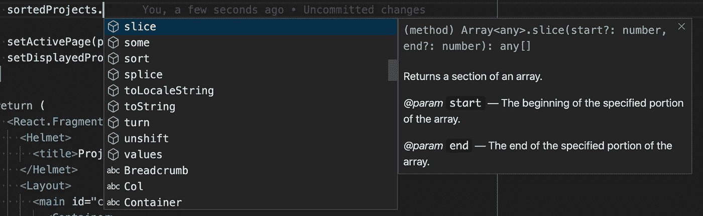
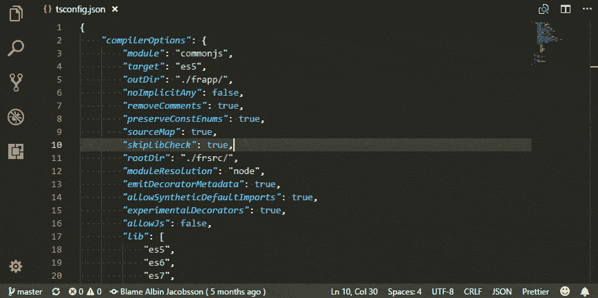
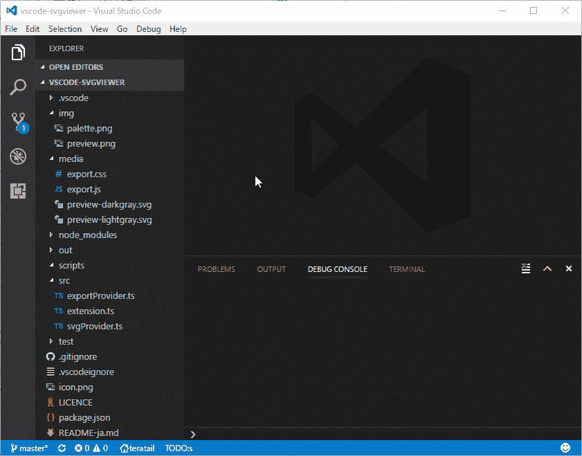

# 对程序员非常有帮助的 10 个 Visual Studio 代码插件

> 原文：<https://betterprogramming.pub/10-extremely-helpful-visual-studio-code-plugins-for-programmers-c8520a3dc4b8>

## 让你的程序员生活变得更容易的插件列表

托德·夸肯布什在 [Unsplash](https://unsplash.com?utm_source=medium&utm_medium=referral) 上的照片

无论您是经验丰富的开发人员还是刚刚开始第一份工作的初级开发人员，您都希望尽可能轻松地完成开发工作。合适的工具有助于实现这一目标。

如果您使用 Visual Studio 代码作为您的 IDE 选择，您有能力使它适合您的偏好。一种方法是安装正确的插件。为了让您的生活尽可能轻松，您可以添加任意多的内容。

你正在使用的插件对你的生产力和工作方式有很大的影响。这就是为什么我们要查看这个 Visual Studio 代码插件列表的原因。

> “我们改变我们的工具，然后我们的工具改变我们。”—杰夫·贝索斯

*注意，所有这些插件都可以在*[*Visual Studio market place*](https://marketplace.visualstudio.com/)*上免费获得。*

# 1.Visual Studio 智能代码

Visual Studio Intellicode 下载次数超过 3，200，000 次，是下载次数最多的 Visual Studio 插件之一。在我看来，这是你能使用的最有用的插件之一。

这个插件是为帮助开发者提供智能代码完成建议而构建的，它已经为各种编程语言提供了预构建的支持。

Visual Studio Intellicode 使用机器学习技术来观察和查找大量开源 GitHub 项目中使用的模式，并在您编码时给出建议。

# 2.责备

谁干的？！

偶尔，你需要知道是谁写了这段代码。好吧，把责任推给拯救者。Git 责备告诉你谁是最后接触一行代码的人。除此之外，您还可以看到它发生在哪个提交中。

这是非常好的信息，特别是当你处理像特征分支这样的东西时。使用功能分支时，您可以使用您的分支名称来引用票据。因为 Git 责备会告诉您哪一个提交——也就是哪一个分支——一行代码发生了更改，所以您知道是哪一张票导致了这种更改。这有助于你更好地理解变化背后的原因。

[来源](https://marketplace.visualstudio.com/items?itemName=waderyan.gitblame)

# 3.较美丽

对于开发时需要遵循一套良好规则的开发人员来说，Prettier 是最好的插件之一。这是一个引人注目的插件，允许你使用更漂亮的包。它是一个健壮的固执己见的代码格式化程序，允许开发者以结构化的方式格式化他们的代码。

Prettier 与 JavaScript、TypeScript、HTML、CSS、Markdown、GraphQL 和其他现代工具一起工作，并允许您正确格式化代码。

# 4.JavaScript (ES6)代码片段

每个稍微有点新鲜感的 web 开发人员可能都使用过各种 JavaScript 栈中的一种。不管你选择什么样的框架，在不同的项目中输入相同的通用代码应该会减少你的工作流程。

JavaScript (ES6)代码片段是一个方便的插件，它为空闲的开发人员提供了一些非常有用的 JavaScript 代码片段。它将标准的 JavaScript 调用绑定到简单的热键中。一旦你掌握了窍门，它可以大大提高你的工作效率。

# 5.厚颜无耻

你可能已经猜到了，这个插件帮助开发人员处理样式表。一旦您开始为您的应用程序创建样式表，您肯定希望使用 Sass 插件。这个插件支持缩进的 Sass 语法高亮、自动完成和格式化。

谈到样式，您肯定希望在您的工具集中有这个工具。

# 6.路径智能感知

Path Intellisense 是那些为您的开发提供有保证的生产力提升的 Visual Studio 代码之一。如果您同时使用太多不同的技术处理许多项目，那么您肯定希望有一个方便的工具能够为您记住路径名。这个插件将节省你大量的时间，否则你会浪费在寻找正确的目录。

Path Intellisence 最初只是一个自动完成文件名的简单扩展，但后来被证明是大多数开发人员工具集中的一项宝贵资产。

# 7.Chrome 调试器

如果你需要调试 JavaScript，不需要离开你的 Visual Studio 代码。微软发布的 Chrome 调试器可以让你直接在 Visual Studio 代码中调试源文件。

[来源](https://marketplace.visualstudio.com/items?itemName=msjsdiag.debugger-for-chrome)

# 8.埃斯林特

ESLint 插件将 ESLint 集成到 Visual Studio 代码中。如果你不熟悉它，ESLint 是一个静态分析你的代码以快速发现问题的工具。

ESLint 发现的大多数问题都可以自动修复。ESLint 修复是语法感知的，所以你不会遇到传统的查找和替换算法引入的错误。最重要的是，ESLint 是高度可定制的。

# 9.SVG 查看器

SVG 查看器扩展添加了许多在 Visual Studio 代码中使用 SVG 的实用工具。这个插件可以在不离开编辑器的情况下渲染 SVG 文件并查看它们的外观。此外，这个插件也有转换成 PNG 和生成数据 URI 方案的选项。

[来源](https://marketplace.visualstudio.com/items?itemName=cssho.vscode-svgviewer)

# 10.主题

最后但同样重要的是，主题。既然你每天都会看到你的编辑器，为什么不把它弄得尽可能漂亮呢？有大量的定制插件可以改变侧边栏中的配色方案和图标。免费提供的一些流行主题有[一个 Monokai](https://marketplace.visualstudio.com/items?itemName=azemoh.one-monokai) 、[一个黑暗职业](https://marketplace.visualstudio.com/items?itemName=zhuangtongfa.Material-theme)和[材料图标](https://marketplace.visualstudio.com/items?itemName=PKief.material-icon-theme)。