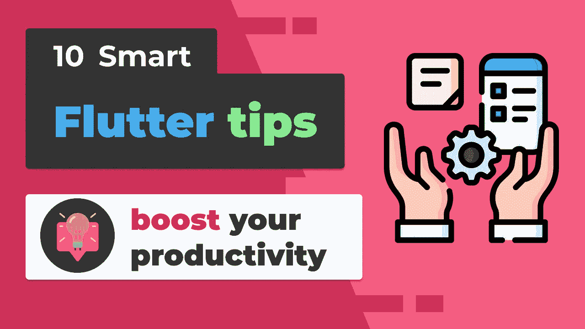

# 我在 3 年的颤振开发后学到的 10 个颤振技巧

> 原文：<https://betterprogramming.pub/10-flutter-tips-i-learned-after-3-years-of-flutter-development-7a7dbb697fe2>

## 有助于提高我工作效率的事情

作者照片。

以下是我在制作 Flutter 应用程序和内容的三年中发现的一些技巧和诀窍。如果你还不了解它们，我确信它们会改善你的工作流程。

# 1.使用许多包

这可能看起来违反直觉，但是对于很多人来说，仅仅完成一个项目是让实际用户测试你的应用程序的第一步。随着时间的推移，当应用程序发布后，您会得到反馈，这时您应该检查一下包，并用您自己的代码替换它们，以获得更多的控制。

> 当然，这里的一个关键部分是知道包是经过测试的，作者和你都知道你可以自己实现它。在这种情况下，你需要使用和应用你自己认为可以依赖的知识。

你可以在 [Pub.dev](https://pub.dev/) 找到所有的包。

# 2.利用片段

不久前，我只使用提供的代码片段做类似`StatelessWidget`的事情，但是当你真正为你反复做的任务定制代码片段时，你将节省大量的时间！我将展示一个片段的例子。这些最初来自于 [FilledStacks](https://github.com/filledstacks) ，从那以后我一直在使用它们！

如果您使用的是 VSCode，您可以点击 F1，搜索“Snippets”，您应该会找到“配置用户代码片段”添加您喜欢的文件和您选择的代码片段。下面是我的测试片段:

# 3.早点用林挺

有很多不同的方法来设置林挺，但是我只推荐设置 [lint](https://pub.dev/packages/lint) 包，这非常简单！

*   将包添加到您的`pubspec.yaml`文件中。
*   创建一个`analysis_options.yaml`文件。
*   添加包中描述的 include 行。
*   利润？

# 4.使用工具

您可能已经这样做了，但是这将使下一个技巧变得更容易。通过使用这个工具，你将会简化你的生活。`Extract Widget`可能是我最喜欢的——理由很充分。

# 5.多个私有小部件

这可能会引起争议，但我保持代码整洁和易于浏览的方法非常简单。假设我们有一个包含许多嵌套的大部件。好吧，继续尝试通过使用`Extract Widget`从其中取出一部分。通过在前缀前加上下划线和一个好名字来使它成为私有的。您现在所做的实际上是将代码移到了该小部件的公共版本之下，一切都变得更加易于阅读和更改。您不需要试图弄清楚那个特定的`Container`是干什么的，因为它现在有一个好名字！

# 6.应用程序图标和闪屏

这两个包为你的项目节省了大量时间: [Flutter launcher 图标](https://pub.dev/packages/flutter_launcher_icons)和 [Flutter Native Splash](https://pub.dev/packages/flutter_native_splash) 。我建议去看看。他们有关于如何开始的很好的文档，节省了大量的时间。

# 7.零感知运算符

有许多不同的空操作符，比如`??`、`??=`等等。学习它们不仅会使你的代码更加简洁和容易，而且当 null 安全在 Flutter 中变得稳定时，它也会简化很多。

# 8.重用 x.of(上下文)

如你所知，当你想在 Flutter 中使用主题化时，你需要写一些类似`Theme.of(context).textTheme.bodyText1`的东西。这很好，但是如果您必须在同一个小部件中多次这样做，我建议将它移到 build 方法的顶部。你可以简单地复制我写的代码行，并把它放入一个变量中，就像这样:`final theme = Theme.of(context).textTheme`。现在每次你需要主题的时候，你只需要在你的小部件中写`theme.bodyText1`。

# 9.调试打印

有时候我们在调试时需要更多的信息——特别是对于网络请求。所以不用普通的`print(myNetworkData)`，可以用`debugPrint(myNetworkData)`。这将为您提供更多的元数据，以备不时之需！

# 10.单一责任小部件

如果你知道坚实的原则，那么这可能听起来很熟悉。嗯，那是因为它是。对于“单一责任”，我们的意思是一个小部件只应该做一件事。

Do *not* 制造能做一堆不同事情的巨型部件。例如，如果您注意到有一个小部件包含了组成您的自定义按钮的其他小部件，那么就把它拿出来！提取它，并使其成为自己独立的小部件。这将使它更易于管理，现在您将知道该特定小部件的唯一规则是服务和处理该按钮。

# 结论

本文中的十个技巧摘自我的 YouTube 视频，我在视频中分享了我在 Flutter 中开发应用程序的经验。

感谢阅读！