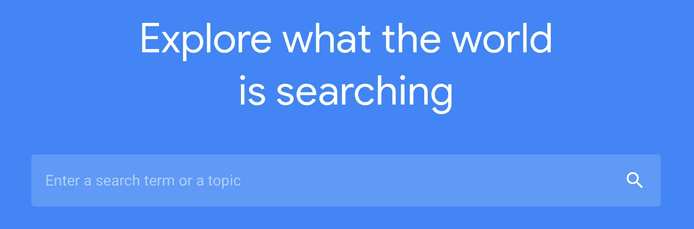
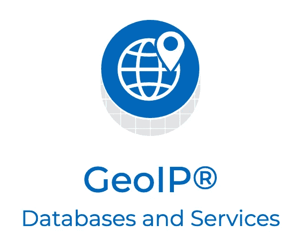
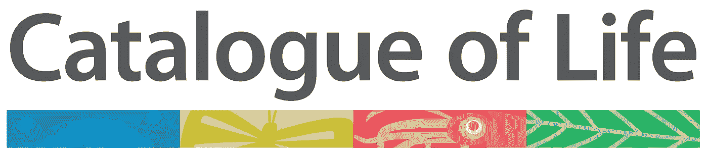
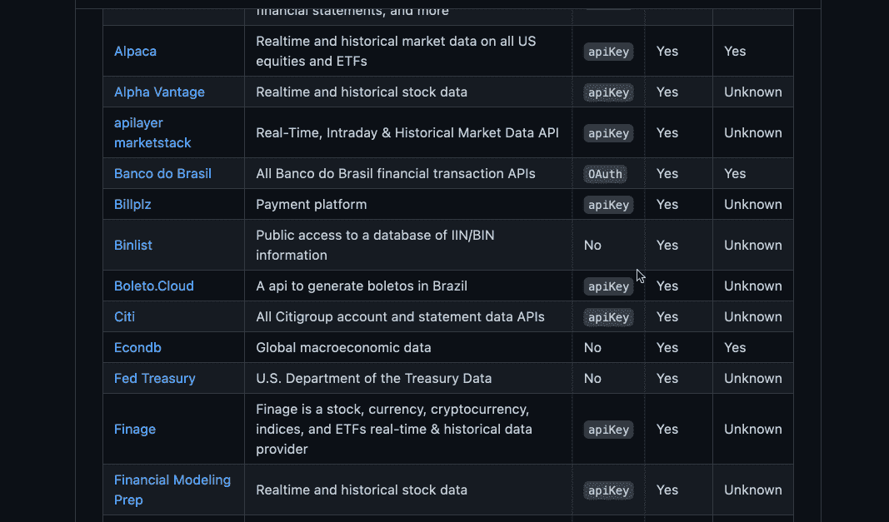

# 9 个你应该尝试的免费公共 API 和数据库

> 原文：<https://betterprogramming.pub/10-free-public-apis-and-databases-you-should-try-acab88bdbfee>

## 所有有趣的信息都在那里等着你的下一个项目

托拜厄斯·菲舍尔在 [Unsplash](https://unsplash.com/s/photos/database?utm_source=unsplash&utm_medium=referral&utm_content=creditCopyText) 上的照片

谁不喜欢免费的东西？免费数据更好。互联网上有许多可公开访问的知识库，提供了令人难以置信的丰富信息。如果你知道去哪里找，从公共健康记录到详细的财务数据，一切都唾手可得。

无论你是在做一个新的副业项目，还是试图在现有项目中增加功能，这些网站都将为你提供精彩的数据。

在本文中，我们将介绍这些优秀的资源，这些资源对各地的开发人员和数据科学家都是免费的。

我们走吧。

# 1.谷歌趋势

[来源](https://trends.google.com/trends/?geo=US)。

首先是最受欢迎的方式之一，利用谷歌对搜索词惊人的洞察力。使用谷歌趋势，你可以很快看到人们在搜索什么，他们从哪里搜索，有多少人在搜索。

谷歌趋势是一个巨大的数据金矿，尽管乍一看似乎很简单，但它可以很容易地与其他数据结合起来，形成现代互联网使用习惯的更全面的画面。

**网址:**[https://trends.google.com/trends/explore](https://trends.google.com/trends/explore)

**API:***[*py trends(非官方)*](https://pypi.org/project/pytrends/)*

# *2.GovInfo(美国)*

**

*[来源](https://www.govinfo.gov/about#logos)。*

*如果你正在寻找任何公开的美国政府文件，你很有可能在 GovInfo 上找到它们。美国 GovInfo 网站提供对大量不同公共数据的 web 和 API 访问。你可以查找任何东西，从发表的美国陆军战报到公共健康记录，甚至是官方的国会议事录。*

*你也可以使用这个数据库查找法律。例如，这里有一个 2021 年 K-12 网络安全法案的链接。该数据库还可以提供多种不同格式的文档，包括 PDF 和原始文本。*

***网址:***[*https://www.govinfo.gov/browse-a-z*](https://www.govinfo.gov/browse-a-z)**

****API:***[*https://api.govinfo.gov*](https://api.govinfo.gov)***

# **3.流行的婴儿名字(美国)**

****

**[来源](https://www.ssa.gov/framework/images/logo.svg)。**

**美国社会安全管理局提供了一个大数据库，里面有从 20 世纪开始流行的婴儿名字。你可以下载排名前 1000 的名字，也可以使用这里的互动排名工具:[https://www.ssa.gov/oact/babynames/index.html](https://www.ssa.gov/oact/babynames/index.html)。**

**这个工具提供了一些有趣的观点，让我们了解历史上名字的流行程度。试着查找你自己的名字，看看它和其他人相比怎么样。**

**【https://www.ssa.gov/oact/babynames/limits.html】网站:**

****API:**没有可用的 API**

# **4.地理知识产权数据库(MaxMind GeoLite2)**

****

**[来源](https://www.maxmind.com/en/home)。**

**MaxMind 公司提供免费的地理知识产权数据库和相当强大的 API。该数据库包含一个 internet IP 地址列表以及它们映射到的相应地理位置。**

**例如，如果我要查找 IP 地址:`88.173.116.30`，我会看到它位于法国的某个地方。**

**这对于进行地理围栏或动态 IP 查找来查看用户流量的来源非常方便。**

****网址:***[*https://dev . maxmind . com/GeoIP/geolite 2-free-geolocation-data*](https://dev.maxmind.com/geoip/geolite2-free-geolocation-data)***

****API:***【https://dev.maxmind.com/geoip/docs/web-services?】[*lang = en # official-API-clients*](https://dev.maxmind.com/geoip/docs/web-services?lang=en#official-api-clients)***

# *5.企业名称(美国)*

**

*[来源](https://www.sec.gov/files/sec-logo.png)。*

*你有没有想过查看某个公司是否已经以某个名字存在？也许你正在构思下一个大的创业点子，想确保你是镇上唯一的一个人。*

*美国证券交易委员会提供了一个庞大的公司文件数据库，你可以在其中搜索关键词，并根据不同的标准进行过滤，如地点或行业。*

***网址:***[*https://www.sec.gov/edgar/searchedgar/companysearch.html*](https://www.sec.gov/edgar/searchedgar/companysearch.html)**

****API:***[*https://www.sec.gov/edgar/sec-api-documentation*](https://www.sec.gov/edgar/sec-api-documentation)***

# **6.生命的目录**

****

**[来源](https://www.catalogueoflife.org/images/col_logo.svg)。**

**所有关于不同种类物种的数据，你都可以用你的虚拟牙齿去研究。生命目录是一个庞大的数据库，包含了世界上所有已知的物种。**

**查找从蘑菇到致命病毒的一切。如果你正在做一个需要植物和动物高度细节的项目，这是一个至关重要的资源。**

****网址:***[*https://www.catalogueoflife.org/*](https://www.catalogueoflife.org/)***

****API:***[*https://www.catalogueoflife.org/about/colusage#col-api*](https://www.catalogueoflife.org/about/colusage#col-api)***

# **7.阿尔法优势**

****

**[来源](https://www.alphavantage.co)。**

**Alpha Vantage 为股票、货币和其他投资工具提供免费的金融数据。我已经在几个涉及股票报价机的项目中使用了这个 API，它运行得非常好，而且非常容易上手。**

****网址:***[*https://www.alphavantage.co/*](https://www.alphavantage.co/)***

****API:***[*https://www.alphavantage.co/documentation/*](https://www.alphavantage.co/documentation/)***

# **8.航空数据**

****

**[来源](https://opensky-network.org/about/about-us)。**

**OpenSky 是最好的免费航空数据提供商之一。他们有一个没有废话的方法，并提供了一个坚如磐石的航班信息数据库。你可能以前用过他们的交互式飞行跟踪器。他们已经存在了很长一段时间，并且享有很高的声誉。**

****网址:***[*https://opensky-network.org/*](https://opensky-network.org/)***

****API:***[*https://openskynetwork.github.io/opensky-api/*](https://openskynetwork.github.io/opensky-api/)***

# **9.公共 API 的数据库**

****

**在 public-apis GitHub 中找到了大量的公共 API。**

**最后，对于我们的最后一个数据库，我们有一个项目，旨在实际编目一系列公开可用的 API。它就像一个数据库的数据库。public-API 项目提供了详细的 API 信息和分类，以及优秀的项目文档。**

**该项目还列出了每个 API 的连接细节，比如它们是否需要认证等。**

****网址:***[【https://github.com/public-apis/public-apis】T21](https://github.com/public-apis/public-apis)***

*****API:***[*https://api.publicapis.org/*](https://api.publicapis.org/)****

**感谢您花时间阅读我的文章。如果你喜欢这篇文章，可以看看我的其他作品:**

*   **[*【6 个搞笑 GitHub 转贴快速提神*](/6-funny-github-repos-for-a-quick-pick-me-up-1cf346cace65)**
*   **[*5 种晦涩难懂的 Python 语法你应该试试*](/obscure-python-syntax-you-should-try-831dbc96777e)**