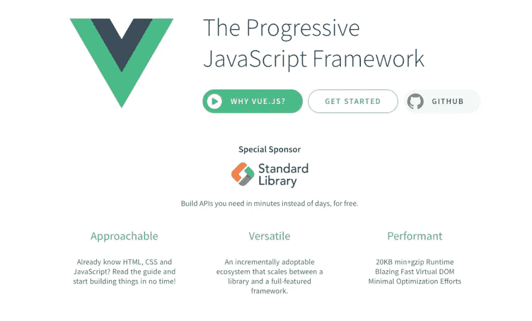
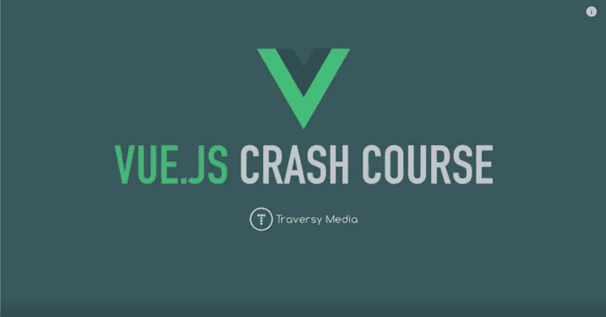
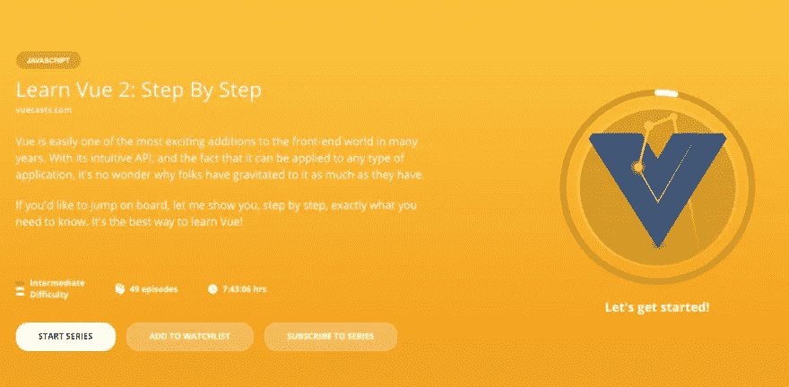
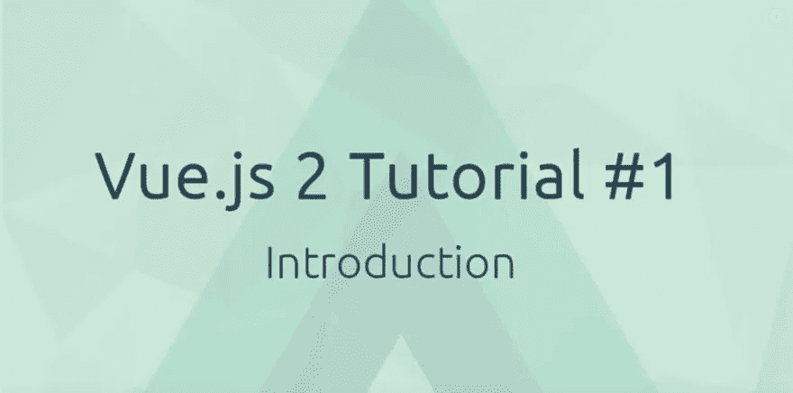
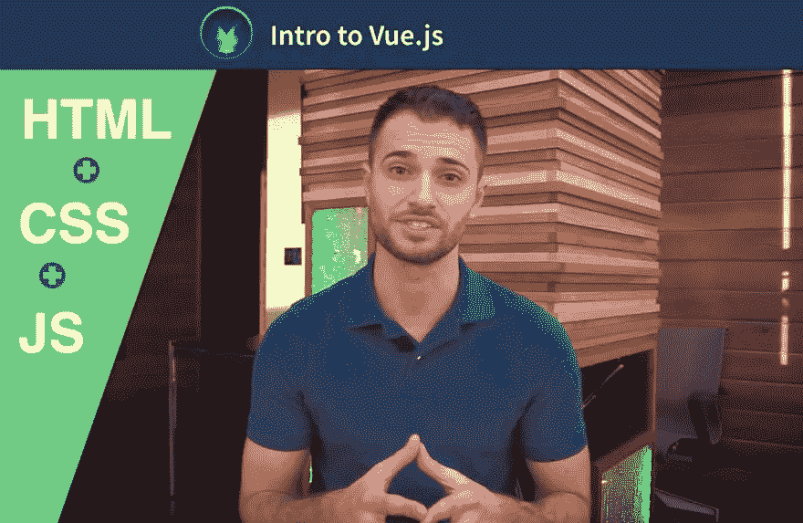
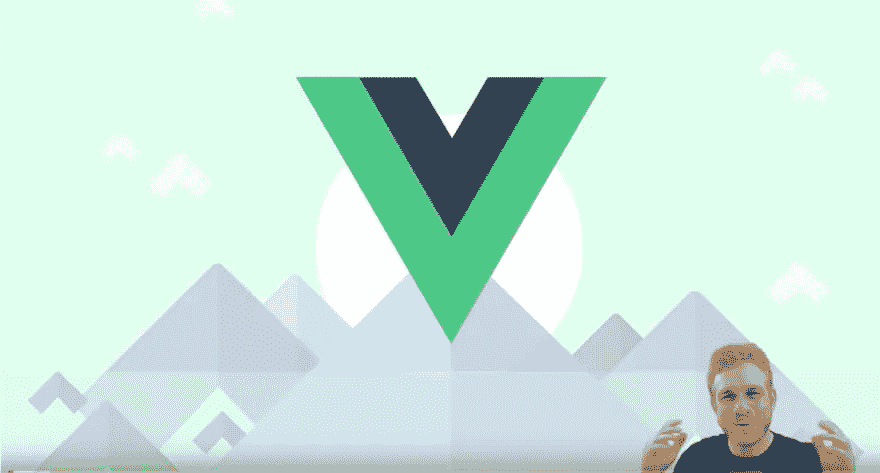
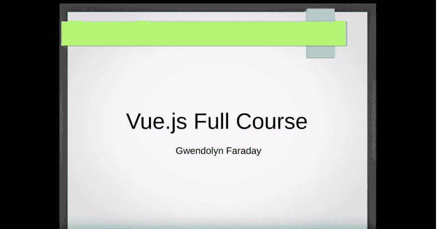
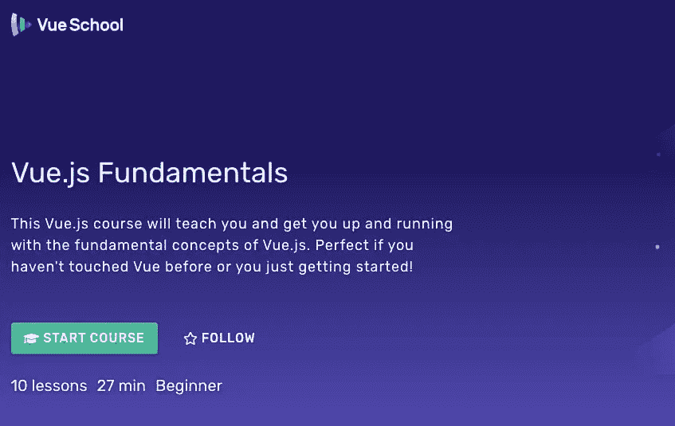
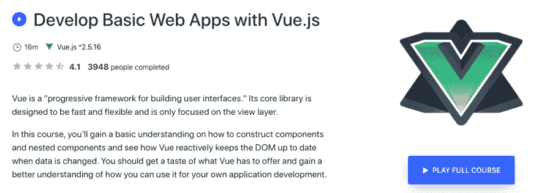

# 开始学习 Vue 的 10 个免费 Vue.js 资源

> 原文：<https://betterprogramming.pub/10-free-vue-js-resources-to-kickoff-learning-vue-a0e216dbbdd1>

## 如果你对学习 Vue.js 感兴趣——别再犹豫了！

[法托斯 Bytyqi](https://unsplash.com/@fatosi?utm_source=medium&utm_medium=referral) 在 [Unsplash](https://unsplash.com?utm_source=medium&utm_medium=referral) 上的照片

这篇文章最初发表在智能编码器的[上。](https://thesmartcoder.dev/10-free-resources-to-kickoff-your-career-as-a-vue-developer/)

# 介绍

众所周知，Vue.js 是最受欢迎的 JavaScript 库之一(目前有 150，000 个 Github Stars，比 React 还多)。所以只能推荐给有志于以前端 web 开发人员为职业的人。但是你可能会问，从哪里开始呢？我也认为理解基本的 JavaScript 概念总是有帮助的。然而，Vue.js 是对初学者友好的，所以我建议你根据你是什么样的人，你在编程方面有什么经验，以及你觉得有足够的乐趣可以坚持下去，来决定先学什么。

但是，如果你对学习 Vue.js 感到好奇，我可以在这里为你提供一些很好的资源来开始学习。

# 查看 Vue 官方文档

当学习一门新的语言、库或框架时，通读文档总是一个好主意。仅从文档的状态，您就可以获得一些见解。这些非常好，非常全面，所以一定要检查一下:[官方 Vue.js 文档](https://vuejs.org/v2/guide/)

# Vue JS 速成班-2019 年由 Brad Traversy

Brad Traversy 前段时间在 youtube 上制作了这个很棒的课程，但也为 2019 年更新了它。不管你喜不喜欢布拉德的教学风格，这都是一个非常棒的资源，值得一看:[在 youtube 上观看](https://www.youtube.com/watch?v=Wy9q22isx3U)

# 学习 Vue 2:一步一步地学习 laracasts

帮助你一步一步掌握 Vue.js 的一系列短视频，发布在 laracasts 上。有 30 多门免费课程，但最后一门课，你需要订阅。不管怎样，它们值得一看。[在 laracasts 上查看](https://laracasts.com/series/learn-vue-2-step-by-step)

# 网络忍者的 Vue JS 2 教程

网络忍者在 youtube 上发布了一系列很棒的课程(45 个视频)来教你 Vue.js 的基础知识。它们很全面，教得很好，所以你肯定想看看这些。[在 youtube 上看这个](https://www.youtube.com/playlist?list=PL4cUxeGkcC9gQcYgjhBoeQH7wiAyZNrYa)。

# VueMastery 上的 Vue.js 简介

这更多的是对 Vue 的介绍，而不是完整的课程，但是 VueMastery 是一个很好的地方，所以检查一下，自己决定是否值得坚持使用它们。[在 VueMastery 上查看](https://www.vuemastery.com/courses/intro-to-vue-js/vue-instance)

# vue . js 2—Academind 入门

academind——又名 Maximilian Schwarzüller——因其在 Udemy 上的课程而闻名，这些课程吸引了许多人并获得了很高的评分。这是对 Vue 的免费介绍，你可以用它来获得一个很好的概述，也可以了解 Max 的教学风格。[在 youtube 上看这个](https://www.youtube.com/playlist?list=PL55RiY5tL51p-YU-Uw90qQH419BM4Iz07)。

# 在 freeCodeCamp 上学习 vue . js-初学者的完整课程-2019

这是一个很棒的课程(总共三个小时)，发布在 freeCodeCamp 上，是为刚接触 Vue 的初学者设计的。如果你喜欢 freeCodeCamp 并想了解 Vue.js，这就是你想要的！[在 youtube 上看这个](https://www.youtube.com/watch?v=4deVCNJq3qc)。

# vue . js vue school 基础

这是对 Vue 的一个相当简短的介绍，只能给你一个快速的概述，但它是免费的，所以如果你想尝试一下，自己决定吧。在 VueSchool 上查看一下。

# 在 Scrimba 上免费学习 Vue.js

> “本教程通过九个互动截屏，教你如何构建 Vue 应用。您将学习基本的 Vue.js 概念，并参与构建两个超级有趣的应用程序:薛定谔 Div 和表情符号颜色选择器！”

从他们的网站上。这是免费的，所以试试这个吧！[在 Scrimba 上查看](https://scrimba.com/g/glearnvue)

# 在 Eggheadio 上用 Vue.js 开发基本的 Web 应用

这是对 Vue 的一个快速介绍，没有真正的课程。但是 Egghead 是一个很棒的地方，有很多有用的资源和很棒的老师。用这个来感受一下 egghead 提供了什么！[在 Egghead 上检查一下](https://egghead.io/courses/develop-basic-web-apps-with-vue-js)

# 结论

在本文中，我向您展示了十个免费资源，帮助您了解精彩的 Vue.js 库。我希望它们能帮助你提高技能或开始成为一名前端 web 开发人员！