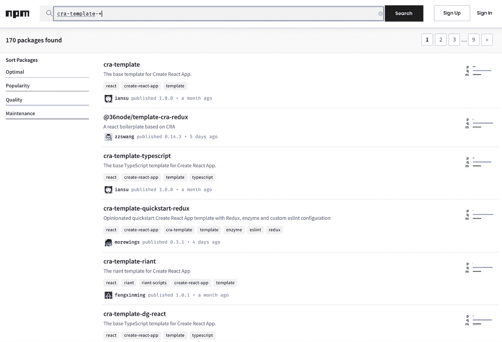
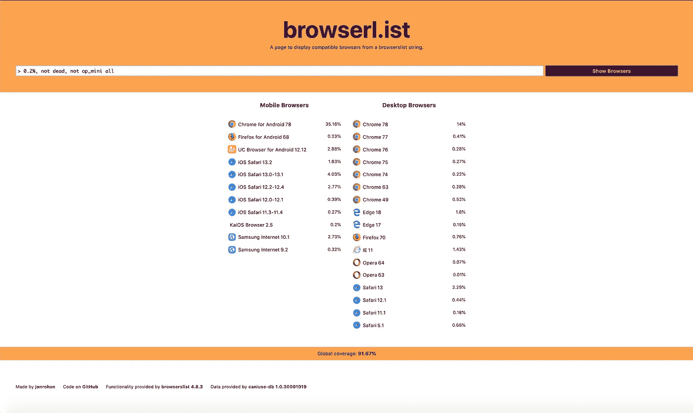
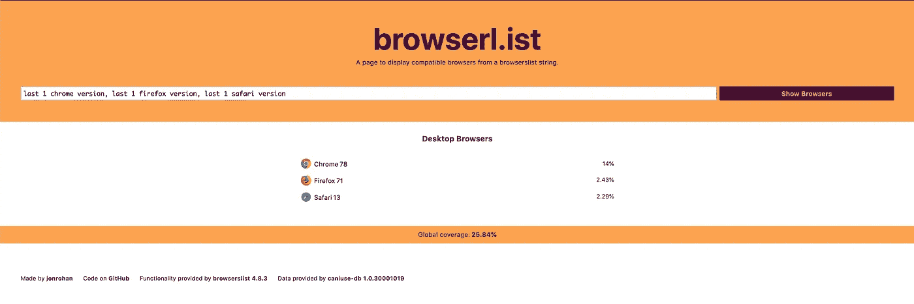
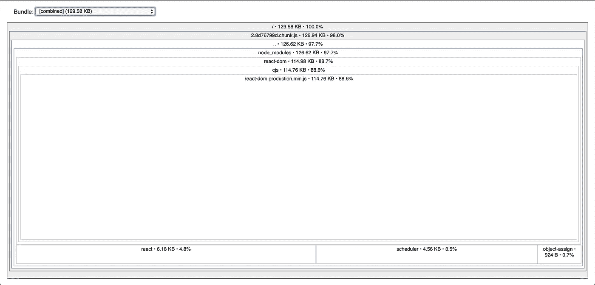

# 关于创建 React 应用程序的 10 个有趣事实

> 原文：<https://betterprogramming.pub/10-fun-facts-about-create-react-app-eb7124aa3785>

## 有些事情你知道，有些事情你可能不知道


照片由 [Luca Upper](https://unsplash.com/@lucistan?utm_source=unsplash&utm_medium=referral&utm_content=creditCopyText) 在 [Unsplash](https://unsplash.com/s/photos/fun-facts?utm_source=unsplash&utm_medium=referral&utm_content=creditCopyText) 上拍摄

[React](https://github.com/facebook/react) 是一个用于构建用户界面的 JavaScript 库。它是构建单页面应用程序最流行的库之一。[创建 React 应用](https://github.com/facebook/create-react-app)是搭建 React 项目的快捷方式。这样，你就专注于代码，而不是构建工具。

# 事实#1:你可以用一个命令创建一个成熟的项目

可以通过以下三种方式之一调用这个神奇的命令:

```
npx create-react-app my-app
npm init react-app my-app
yarn create react-app my-app
```

脸书承诺它的所有基础部分——Webpack、Babel、ESLint、Jest 等——可以无缝协作。

开箱即用，设置了以下脚本:

```
**npm start**: Runs the app in development mode, and open [http://localhost:3000](http://localhost:3000) to view it in the browser.**npm run build**: Builds the app for production to the build folder.
The build is minified and ready to be deployed.**npm test**: Runs the test watcher in an interactive mode. It runs tests related to files changed since the last commit.
```

# 事实 2: React 项目可以从一个特定的模板开始

可以使用特定的模板自定义前面的命令:

```
npx create-react-app my-app --template [template-name]
npm init react-app my-app --template [template-name]
yarn create react-app my-app --template [template-name]
```

如果您想用 TypeScript 启动 React 项目，只需使用模板`cra-template-typescript`。默认模板是`cra-template`。

如果你想利用社区资源，试试这个网站。目前有 170 个模板可用。



# 事实#3:一个依赖是 Create React App 的首要理念，这个构建依赖不在 devDependencies 部分

*一个依赖*是三个 Create React App 理念中的第一个。你能在下面的`package.json`中找到这个构建依赖吗？

```
{
  "name": "my-react-app",
  "dependencies": {
    "react": "^16.12.0",
    "react-dom": "^16.12.0",
    "react-scripts": "3.2.0"
  },
  "scripts": {
    "start": "react-scripts start",
    "build": "react-scripts build",
    "test": "react-scripts test",
    "eject": "react-scripts eject"
  },
```

在`package.json`中，我们看到三个`dependencies`，没有`devDependencies`。这*一依赖*在哪里？

是`react-scripts`！

根据 [NPM 依赖项定义](https://medium.com/@jenniferfubook/package-jsons-dependencies-in-depth-a1f0637a3129)，构建依赖项`react-scripts`应该是`devDependency`。但是，它与`react`和`react-dom`一起位于依赖项部分。

事实上，`react-scripts`是一个`devDependency`。出于某些实际原因，脸书从 react-scripts 1.0.8 开始就把它变成了一个依赖项。

# 事实#4:不需要配置是 Create React App 的第二个理念——但它不是零配置

Create React App 已经为开发和生产构建设置了相当好的配置。开发人员可以专注于编写代码。有可能什么都不配置。

以下是开箱即用的源代码树。我们实际上找到了一个配置文件，`.gitignore`，用于 github 的源代码版本控制。

```
my-react-app/
  node_modules/
  public/
    favicon.ico
    index.html 
    logo192.png
    logo512.png
    manifest.json
    robots.txt
  src/
    App.css
    App.js
    App.test.js
    index.css
    index.js
    logo.svg
    serviceWorker.js
  .gitignore
  package-lock.json
  package.json
  README.md
```

# 事实#5:不锁定是 Create React App 的第三个理念——你不必退出一个项目来定制一个设置

*无锁定*与*有依赖*相反。它允许您弹出预配置的设置进行自定义。运行一个命令`react-scripts eject`，所有的配置和构建依赖项将被直接转移到项目中。这个项目不再是*一个人的依赖*。现在，你只能靠自己了。

听起来可怕吗？

嗯，`react-app-rewired`来救援。可以重新连接项目以进行自定义，而无需将其推出。

这可以通过三个步骤实现:

1.  将`react-app-rewired`安装为`devDependency` : `npm install react-app-rewired *--*save-dev`:

```
"devDependencies": {
  "react-app-rewired": "^2.1.5"
}
```

2.在根目录下创建一个`config-overrides.js`文件:

```
module.exports = (config, env) => {
 //do stuff with the webpack config…
 return config;
}
```

3.将`package.json`中已有的调用从`react-scripts`翻转到`react-app-rewired`(除了`eject`):

```
{
  "scripts": {
    "start": "***react-app-rewired*** start",
    "build": "***react-app-rewired*** build",
    "test": "***react-app-rewired*** test",
    "eject": "react-scripts eject"
  },
}
```

现在你可以自由地为 Webpack、Babel、ESLint、Jest 等配置设置。

# 事实 6:“React-App-Rewired”通过配置“Config-overrides.js”增加了更多功能

在我们的 React 项目开发过程中，我们充分利用了`react-app-rewired`配置功能。

以下是一些如何使用`config-overrides.js`的例子:

**例 1** :解决我的另一篇文章中提到的，在同一个应用程序中有多个 React 副本的问题。

我们使用 monorepo lerna 来构建微前端的多包库。我们的应用程序最终拥有自己的 React 依赖项，以及依赖项的 React `devDependency`。通常，当有多个包副本时，应用程序仍然可以工作。然而，当包含两次时，即使版本相同，React 也会中断。下面的例子使用了一个别名来解析应用程序自身副本的所有 React 链接。

```
const path = require('path');
module.exports = {
  webpack: (config, env) => {
    if (env === 'development') {
      config.resolve.alias = {
        react: path.resolve('node_modules/react'),
        'react-dom': path.resolve('node_modules/react-dom'),
      };
    }
    return config;
  },
};
```

**例 2** :解决“如何使用 webpack 加载库源码图？”问题，在[中提到的解决方案之一](https://stackoverflow.com/a/58964565/1773256)。

在类似的 monorepo 微前端环境中，会生成一个库源映射，但它不会在开发调试器会话期间加载。使用附加包 [source-map-loader](https://github.com/webpack-contrib/source-map-loader) ，下面的代码通过将`sourceMaps`选项设置为`true`解决了这个问题。

**示例 3** :通过避免对应用程序进行代码拆分来解决动态加载问题。

从`react-scripts 2.0.0`开始，默认启用代码拆分。应用程序不再被编译成单个文件。相反，它被分成几个可以独立加载到页面上的块。这种加载优化导致安装和卸载微前端的问题。[react-app-rewire-micro-frontends](https://github.com/camjackson/react-app-rewire-micro-frontends/blob/master/config-overrides.js)提供了以下方法来禁用代码拆分。

在`react-app-rewired`之外，还有许多 react-scripts 重新连线器: [customize-cra](https://github.com/arackaf/customize-cra) 、 [rescripts](https://github.com/rescripts/rescripts) 、 [react-scripts-rewired](https://github.com/marcopeg/create-react-app/blob/master/packages/react-scripts/README.md) 和 [craco](https://github.com/sharegate/craco) (创建 React App 配置覆盖)。

# 事实 7: Jest 可以使用绝对路径

Jest 是 Create React 应用程序的默认测试运行程序。默认情况下，Jest 运行`.js files in __tests__ folders`、`.test.js files`或`.spec.js files`中的所有测试用例。

这是 Create React App 的`App.test.js`。这个测试用例使用了一个相对路径:

如果您将`App`改为使用绝对路径，如下所示，这个测试用例将会中断:

您可以通过添加`modulePaths`选项来修复它:

如果使用`react-app-rewired`，也可以通过配置`config-overrides.js`来修复:

# 事实 8:创建 React 应用程序可以处理 CORS(跨源资源共享)错误

你遇到过以下错误吗？：

```
Fetch API cannot load http://myhost.com:4000/api/todos. No 'Access-Control-Allow-Origin' header is present on the requested resource. Origin 'http://localhost:3000' is therefore not allowed access. If an opaque response serves your needs, set the request's mode to 'no-cors' to fetch the resource with CORS disabled.
```

当 API 使用不同于 web 服务器的主机或端口时，此错误将阻止您的应用程序工作。

[Create React App 通过在`package.json`中添加一个代理条目提供了一种解决此问题的方法](https://create-react-app.dev/docs/proxying-api-requests-in-development):

```
{
  “proxy”: “http://myhost.com:4000",
}
```

此代理选项支持 HTTP、HTTPS 和 WebSocket 连接。

如果有不止一个 API 服务器呢？

替代方案需要安装`http-proxy-middleware`:

```
npm install --save http-proxy-middleware
```

另外，在根目录下创建并配置`src/setProxy.js`。下面是一个`src/setProxy.js`的例子。打给`/api1/x`的电话将被转接到`http://myhost1:4000/api1/x`，打给`/api2/y`的电话将被转接到`[http://myhost2:5000/api1/y](http://myhost2:5000/api1/y.)` [。](http://myhost2:5000/api1/y.)

# 事实 9:创建 React 应用程序可以配置支持哪些浏览器

开箱后可以在`package.json`中看到下面的`browserslist`。

```
"browserslist": {
    "production": [
      ">0.2%",
      "not dead",
      "not op_mini all"
    ],
    "development": [
      "last 1 chrome version",
      "last 1 firefox version",
      "last 1 safari version"
    ]
  }
```

这种配置控制着 Babel 如何将 JavaScript 转换成与特定的浏览器兼容，用于生产和开发。查看 [https://browserl.ist](https://browserl.ist) 了解如何配置`browserslist`。

对于 Create React 应用程序的默认`browserslist`配置，生产代码针对 92%的浏览器:



对于 Create React App 的默认`browserslist`配置，生产代码针对 26%的浏览器:



# 事实#10:生成的包可以被分析

创建 React App 隐藏了很多细节和复杂情况。在生成最终包之后，您有兴趣分析它的空间使用情况吗？

`[source-map-explorer](https://github.com/danvk/source-map-explorer)`让您能够通过源地图分析和调试空间使用情况。安装`source-map-explorer`:

```
npm install --save source-map-explorer
```

添加分析脚本:

```
{
  "scripts": {
    ***"analyze": "source-map-explorer 'build/static/js/*.js'",***
    "start": "react-scripts start",
    "build": "react-scriptsd build",
    "test": "react-scripts test",
    "eject": "react-scripts eject"
  },
}
```

构建并运行分析命令:

```
npm run build
npm run analyze
```

然后，该包的用法将显示在您的默认浏览器上:



用 Create React App 玩得开心吗？参见詹妮弗·傅的其他媒体出版物[此处](https://medium.com/@jenniferfubook/jennifer-fus-web-development-publications-1a887e4454af)。