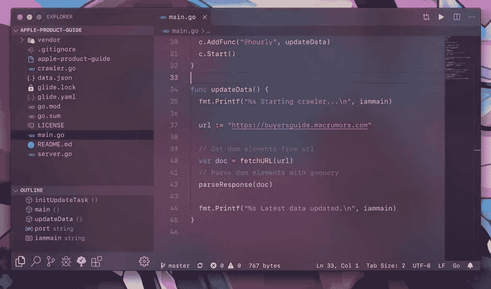
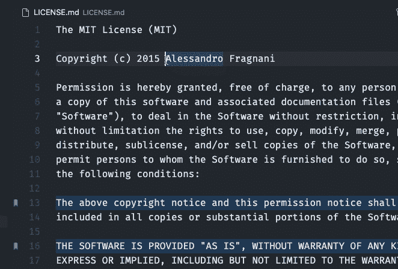
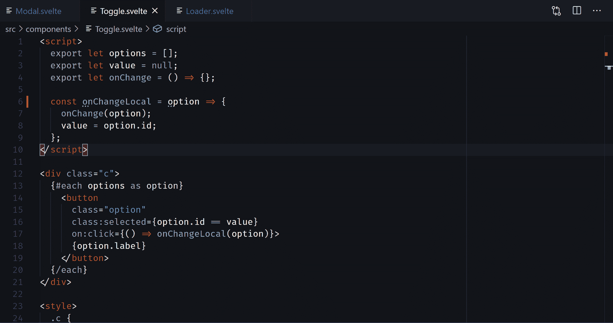
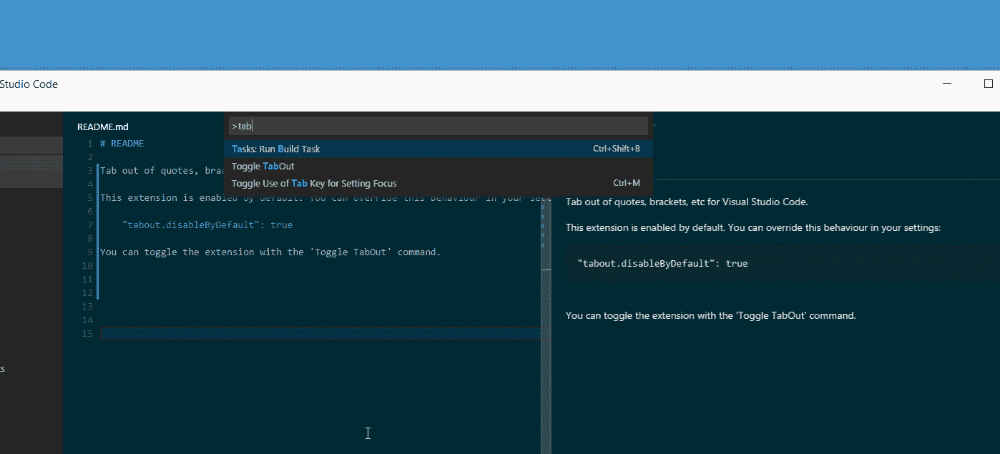
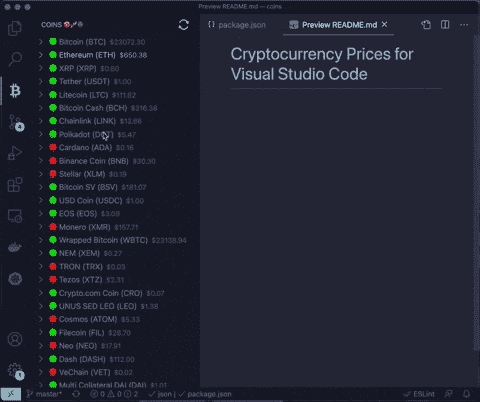
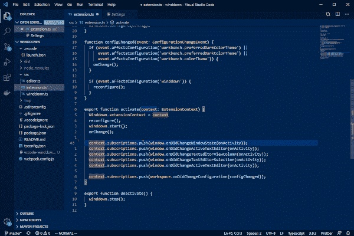
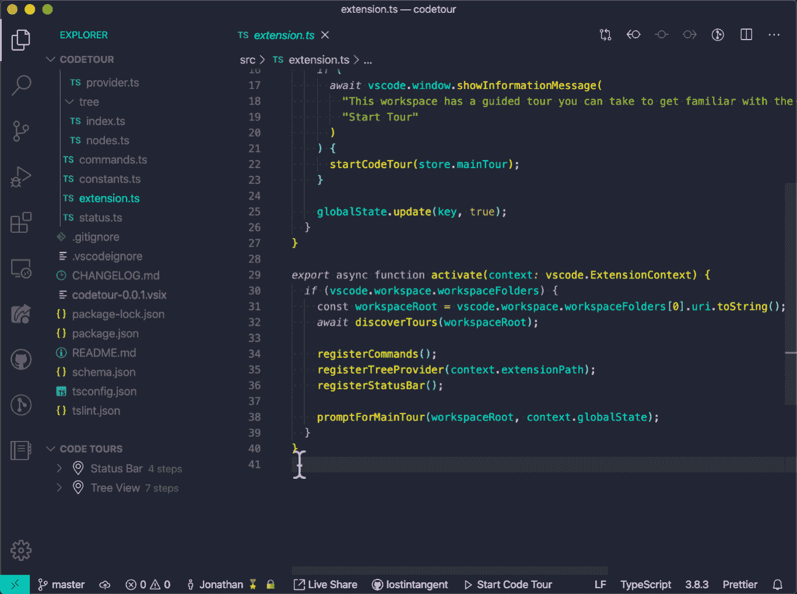
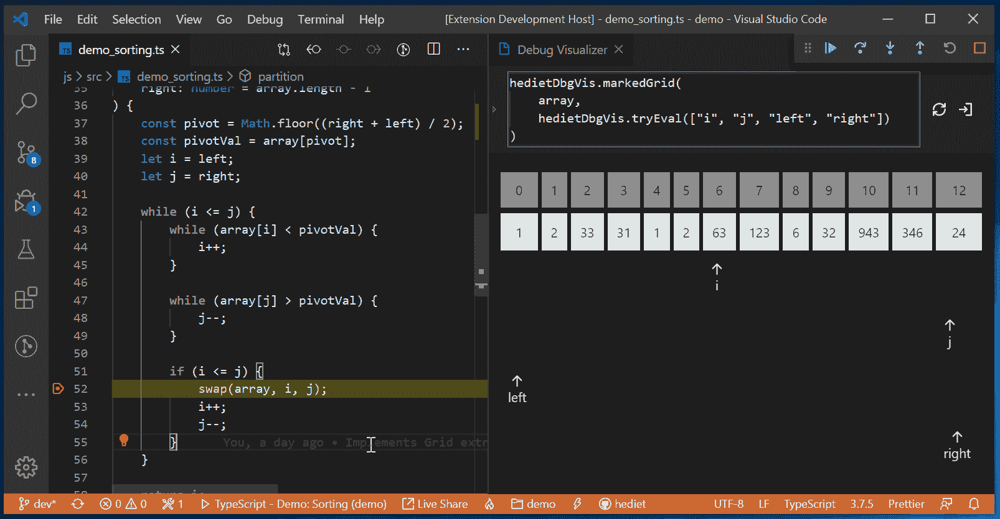
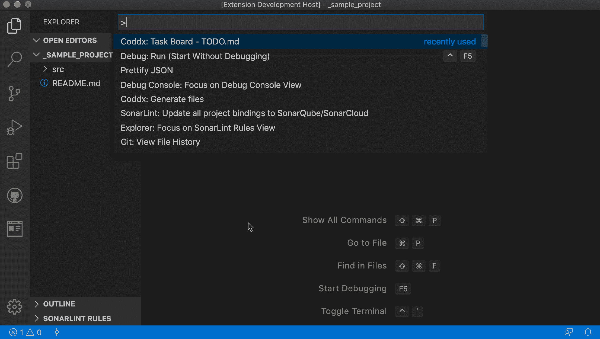
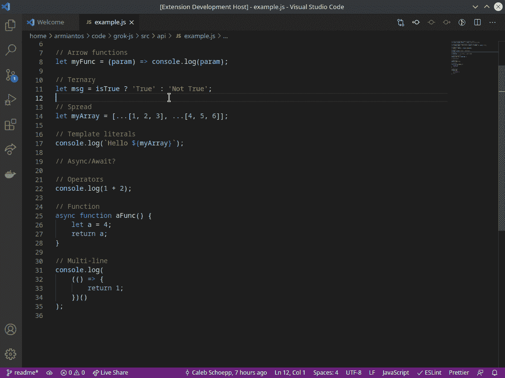

# 10 个有趣的代码扩展，让开发人员享受编码的乐趣

> 原文：<https://betterprogramming.pub/10-fun-vs-code-extensions-to-enjoy-coding-as-a-developer-c8754af65fd8>

## 从可视化数据到学习 JavaScript，有太多东西等着你

Avinash Murugappan 在 [Unsplash](https://unsplash.com?utm_source=medium&utm_medium=referral) 上拍摄的照片

Visual Studio Code 是微软制作的源代码编辑器。它允许开发者运行几乎任何编程语言的代码，而不仅仅是 JavaScript。甚至 Python 和 Flutter 开发者也会爱上这个 IDE。它为开发人员提供了对交互式运动场、调试、版本控制和其他工具的大量支持。

然而，正是他们允许用户定制编码编辑器的能力使得使用起来如此有趣。有一个巨大的市场，提供各种各样的扩展，只需点击几下鼠标就可以集成到 IDE 中。

无论您是 VS 代码老手还是刚刚入门，您都应该听说过一些必备的扩展。 [Live Server](https://marketplace.visualstudio.com/items?itemName=ritwickdey.LiveServer) 、 [Git Lens](https://marketplace.visualstudio.com/items?itemName=eamodio.gitlens) 、 [Auto-Close Tag](https://marketplace.visualstudio.com/items?itemName=formulahendry.auto-close-tag) 、 [Better Comments](https://marketplace.visualstudio.com/items?itemName=aaron-bond.better-comments) 和 [Bracket Pair Colorizer](https://marketplace.visualstudio.com/items?itemName=CoenraadS.bracket-pair-colorizer) 只是大多数开发者工具箱中的几个扩展。

然而，还有数不清的其他扩展很容易被忽略。在本文中，我们不会深入研究特定于编程的扩展，而是会浏览一些有趣的扩展，它们不仅会提高您的工作效率，还会让编码变得更加有趣。

# 1.振动

首先，我们有一个 [VS 代码扩展](https://marketplace.visualstudio.com/items?itemName=eyhn.vscode-vibrancy)，它给你的编辑器一个惊艳的外观。

通过集成它，你可以给你的编辑器的背景带来一种半透明的、模糊的感觉，这样人们就可以看到后面的内容。所以，如果你在编码的时候阅读一些文档，就和窗口切换说再见吧。

Vibrancy 提供了对主题、不透明度的定制，并允许我们启用或禁用玻璃效果。

[来源](https://github.com/EYHN/vscode-vibrancy)

# 2.书签

在单个文件中浏览数千行代码可能是一项令人生畏的任务——尤其是当您需要跨越代码块时。很高兴，我们有了[书签](https://marketplace.visualstudio.com/items?itemName=alefragnani.Bookmarks)，一个有用的 VS 代码扩展来拯救我们。

就像你在浏览器上标记链接一样，这个扩展允许你在文件中标记某些代码片段。这样做，你可以很容易地跳过它们或者把它们分别列出来。

如果您的代码库中有太多的日志语句，书签扩展会非常有用。它还可以作为剪贴板方便地复制粘贴代码片段。

[来源](https://github.com/alefragnani/vscode-bookmarks)

# 3.脚步

如果书签像标签，足迹就像实时版本历史。这个 VS 代码扩展在你编辑它们的时候高亮显示它们，在你离开的时候淡化它们——因此保留了你的代码变化的痕迹。

在调试代码时，足迹为我们提供了方便的视觉提示，并让我们通过几个键盘快捷命令无缝切换先前修改的代码。

以下是您可以对足迹做的一些事情:

*   您可以使用`ctrl+alt+left`和`ctrl+alt+right`在行间跳转。
*   设置高亮代码、保存的历史记录的限制，并自定义高亮颜色。

[来源](https://github.com/wattenberger/footsteps-vscode)

# 4.Tabout

如果你从 IntelliJ Idea 或 Visual Studio 转向 VS 代码，你会发现后者在默认情况下不会跳出括号或引号。一个人需要时不时地按下右箭头。

现在，我不会在制表符和箭头键的争论中选边站。但通常情况下，我们应该可以选择使用其中任何一种。

在这种情况下，Tabout 就是你需要的 VS 代码扩展。一旦你填好了内容，它可以让你快速的跳出引号或者括号。此外，如果您喜欢使用箭头键，也可以快速切换扩展。

[来源](https://github.com/albertromkes/tabout)

# 5.硬币

加密货币和 NFT 最近成了热门话题。很多人热切地期待着它们。同样，在编程时，上下文切换会中断开发流程。

幸运的是，我们有 [Coins](https://marketplace.visualstudio.com/items?itemName=iganbold.coins) ，这是一个 VS 代码扩展，可以显示当前的加密货币价格、过去 24 小时的变化以及其他指标，以便您不会错过宣传。

[来源](https://github.com/iganbold/vscode-coins)

# 6.逐渐减少

我们程序员习惯于在屏幕上呆上几个小时。通常，它会导致压力，而且不健康。

偶尔休息一下是个好主意。就我个人而言，我尝试过各种技术，比如番茄 30 分钟计时器。可悲的是，这就像打瞌睡的警报，我结束了工作，尽管提醒。

这里有一个创造性的扩展，我发现在这种情况下很有用。 [Winddown](https://marketplace.visualstudio.com/items?itemName=winddown.vscode-winddown) 通过微妙地淡出你的 IDE 中的颜色，直到你停止输入，起到了一个很好的提醒作用(没有被打断)。这是一个很好的方式来缓解工作压力并重新加入。

“渐弱”允许您设置周期时间，并设置控制褪色速度的帧速率。

[来源](https://github.com/schneefux/vscode-winddown)

# 7.Codetour

在新开发人员入职或移交工作期间，最大的痛点之一是坐着和其他人一起浏览整个代码库。这在远程工作中变得更加棘手，因为人们只能求助于文档。

文档可能会很无聊。 [Codetour](https://marketplace.visualstudio.com/items?itemName=vsls-contrib.codetour) ，一个新的 VS 代码扩展，通过让你以一步一步的引导式教程的形式记录和回放代码库，努力让整个穿越过程具有互动性。

在导出整个流程之前，您可以用注释注释各个步骤，甚至重新安排步骤。

[来源](https://github.com/microsoft/codetour#navigating-tours)

# 8.调试可视化器

对于初学者来说，调试通常很难，掌握数据结构就更难了。

开发人员在开始时，很容易对整个链表迭代过程感到困惑。这里我们有 [VSCode 调试可视化器](https://marketplace.visualstudio.com/items?itemName=hediet.debug-visualizer)，一个 VSCode 扩展，它在编辑器中可视化数据结构。

它打开一个新的 visualizer 视图，并允许您通过观察图表中迭代的值来调试数据结构。此外，这个扩展对于在表中可视化 JSON 或者从数据点绘制直方图和图形也很方便。

[来源](https://github.com/hediet/vscode-debug-visualizer)

# 9.Coddx

我们都使用过 markdown 文件来记录进度、问题和待办事项。但是通常简单的任务列表并不能保证快速的发布周期。

看板是一种通过可视化不同阶段来改善工作管理的方法。

[codx](https://marketplace.visualstudio.com/items?itemName=coddx.coddx-alpha)通过引入一系列工具来让你创建交互式电路板并保存到 markdown 文件中，从而带来了两个世界的最佳效果。

[来源](https://github.com/coddx-hq/coddx-alpha)

# 10.格罗克斯

虽然 JavaScript 是一种广泛流行的语言，但起步并不容易。它的语法并不简单——特别是当你来自另一种语言，比如 Java。

GrokJS 是一个新的 VS 代码扩展，帮助你从 Visual Studio 代码中动态学习 JavaScript。你所要做的就是突出显示这段代码，它会显示一些小文档和相关链接。

阅读代码通常是学习任何编程语言的最佳方式。GrokJS 确保你不会谷歌每一个新事物。

[来源](https://github.com/cyrusdiego/grok-js)

# 结论

虽然这些是我赖以生存的一些 VS 代码扩展，但我希望它也能启发你将它们集成到你的工具包中。

这一次到此为止。感谢阅读。