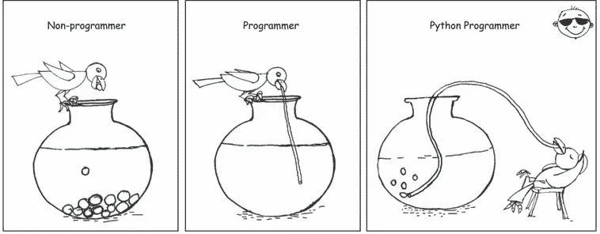
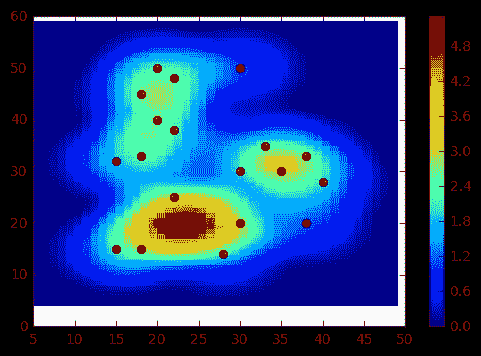

# 9 篇关于 Python 编程的精彩文章

> 原文：<https://betterprogramming.pub/10-great-articles-on-python-development-6f54dd38437f>

## 去年我们最喜欢的作品集

Python 世界正在发生很多事情。对 Python 2 的支持正在结束，越来越多的公司在工作描述中引用 Python，因为它继续获得新的库和更多的支持。

由于变化如此之快，我们收集了一些我们最喜欢的作品。我们希望它们能帮助您开始 Python 编程之旅！

# 加入我们的时事通讯

在继续滚动之前，为什么不加入我们团队的时事通讯，了解数据科学、数据工程和技术的最新动态！[在此了解更多信息](https://seattledataguy.substack.com/)。

# Python 2 EOL:如何熬过 Python 2 的终结

作者[塞尔达尔·耶古拉普](https://www.infoworld.com/author/Serdar-Yegulalp/)

2020 年 1 月 1 日， [Python 编程语言](https://www.infoworld.com/article/3204016/what-is-python.html)的 2.x 分支将不再得到其创造者 Python 软件基金会的支持。

如果你在一个正在迅速变成 Python 3 的世界中被 Python 2 所困，你可以做以下事情。

[点击此处阅读更多内容](https://www.infoworld.com/article/3365221/python-2-end-of-life-how-to-survive-the-end-of-python-2.html)

# 2019 年企业对 Python Devs 有什么期待？

作者:安德鲁·斯特琴科

2019 年作为 Python 开发者需要具备哪些成功的技能？

我们的团队从 StackOverflow、AngelList、LinkedIn 和全球一些快速发展的科技公司中挑选了 300 份 Python 开发人员的工作规范。

[在此阅读更多内容](https://hackernoon.com/what-do-companies-expect-from-python-devs-in-2019-f8b585a1ddf)

# Python 中的异步编程:演练

由[大卫博尔顿](https://insights.dice.com/author/dhbolton/)

当我们谈论程序执行时，“异步”意味着程序不等待特定的进程完成，而是不管不顾地继续执行。

[点击此处阅读更多内容](https://insights.dice.com/2019/04/23/asynchronous-programming-python-walkthrough/)

# 错误的 Python 代码:Python 开发人员最常犯的 10 个错误

马丁·奇基利安

Python 简单易学的语法会误导 [Python 开发者](https://www.toptal.com/python/job-description)，尤其是那些语言新手，让他们忽略了一些微妙之处，低估了[多样的 Python 语言](https://www.toptal.com/python/why-are-there-so-many-pythons)的威力。

[点击此处了解更多](https://www.toptal.com/python/top-10-mistakes-that-python-programmers-make)

# **用 Python 从头开始创建热图**

热图常用于可视化事件发生或密度。有一些 Python 库或 GIS 软件/工具可用于创建热图，如 QGIS、ArcGIS 和 [Google Table Fusion](http://www.geodose.com/2017/05/how-to-create-earthquake-heatmap.html) 。不幸的是，这篇文章并没有讨论如何使用这些软件/工具创建一个热图，但是除此之外，我们将从头开始用 Python 3 编写我们自己的代码来创建一个热图。

将用于在 Python 中创建热图的算法是核密度估计(KDE)。请参考[使用 KDE 解释的 QGIS 热图](http://www.geodose.com/2017/11/qgis-heatmap-using-kernel-density.html)了解更多关于 KDE 的解释，以及[热图计算教程](http://www.geodose.com/2018/01/heatmap-with-kernel-density-estimation-example.html)给出了如何使用 KDE 从参考点计算一个点的强度的示例。

[点击此处阅读更多内容](https://www.geodose.com/2018/01/creating-heatmap-in-python-from-scratch.html)

# 如何用 Python 从零开始构建自己的神经网络

作者:詹姆斯·洛伊

大多数介绍神经网络的文章在描述它们时都会提到大脑类比。在不深究大脑类比的情况下，我发现简单地将神经网络描述为将给定输入映射到期望输出的数学函数更容易。

[在此阅读更多内容](https://towardsdatascience.com/how-to-build-your-own-neural-network-from-scratch-in-python-68998a08e4f6)

# 用 Python 到底能做什么？以下是 Python 的 3 个主要应用

作者 YK·杉

*“我到底能用 Python 做什么？”*

这个问题很难回答，因为 Python 有很多应用。

[在此阅读更多内容](https://medium.freecodecamp.org/what-can-you-do-with-python-the-3-main-applications-518db9a68a78)

# Python 编程语言从最新的 PyPy 解释器中获得速度提升

由[尼克希斯](https://www.techrepublic.com/meet-the-team/uk/nick-heath/)

这对 Python 开发者来说是个好消息，这要归功于已经很快的 PyPy 解释器的新版本，它有望成为迄今为止最快的版本。

如果您使用 Python 编程，一个重要的选择是使用主要的 CPython 解释器还是 PyPy 之类的替代解释器来运行您的代码，每个选项都有优缺点。

[点击此处了解更多](https://www.techrepublic.com/article/python-programming-language-gets-speed-boost-from-latest-pypy-interpreter/)

# 如何收集、定制和集中 Python 日志

艾米莉·张和尼尔斯·本吉

日志模块包含在 [Python 的标准库](https://docs.python.org/3/library/)中，这意味着你不用安装任何东西就可以开始使用它。日志模块的 [basicConfig()](https://docs.python.org/3.7/library/logging.html#logging.basicConfig) 方法是配置日志记录器所需行为的最快方法。

[在此阅读更多内容](https://www.datadoghq.com/blog/python-logging-best-practices/)

[原贴于此](https://www.coriers.com/10-great-articles-on-python-programming-machine-learning-and-its-future/)

# 在此阅读/观看更多内容

感谢阅读！如果您想了解更多关于数据咨询、大数据和数据科学的信息，请点击下面的链接。

[成为数据工程师的现实](https://www.youtube.com/watch?v=6RiA_Qur2yo&t=1s)

[转行成为数据工程师|成为数据工程师的途径](https://www.youtube.com/watch?v=f9ngBz7wCGE&t=2s)

[为小型企业和初创企业制定数据分析战略](https://www.theseattledataguy.com/developing-a-data-analytics-strategy-for-small-businesses-and-start-ups/)

[在下一次数据科学或数据工程面试前你需要知道的 5 个 SQL 概念](https://www.youtube.com/watch?v=X6-VNKe3XVM&t=6s)

[如何改进您的数据驱动战略](https://www.theseattledataguy.com/17-questions-you-need-to-ask-about-your-data-strategy/)

[什么是数据仓库，为什么使用它](https://youtu.be/VjlzuUzYJYM)

[正在毁掉你的数据驱动战略的错误](https://logitanalytics.com/5-mistakes-that-are-ruining-your-data-driven-strategy-and-costing-you/)

[用 Python 管理大数据的 5 大图书馆](https://www.theseattledataguy.com/5-great-libraries-manage-big-data-with-python/)

[什么是数据工程师](https://www.youtube.com/watch?v=D1V6t--9tt8&t=7s)