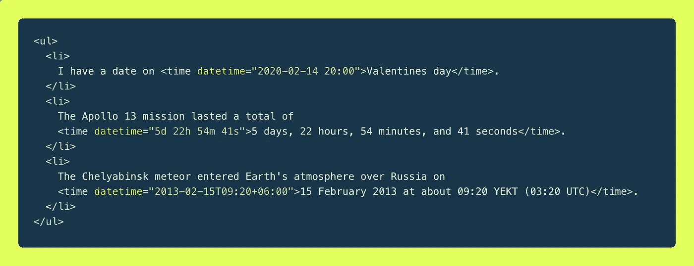
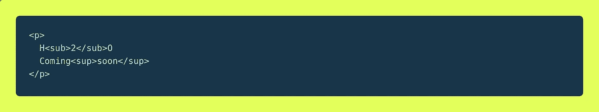
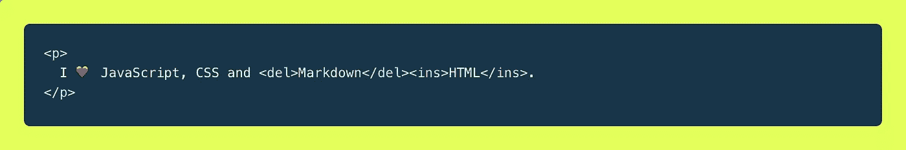
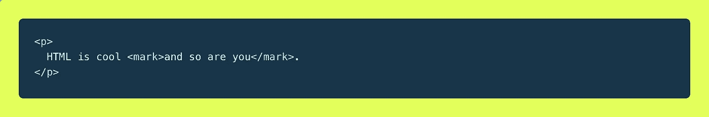
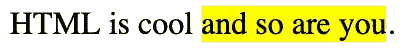
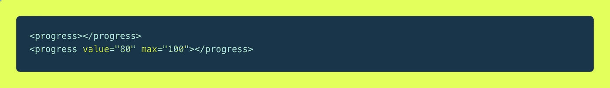
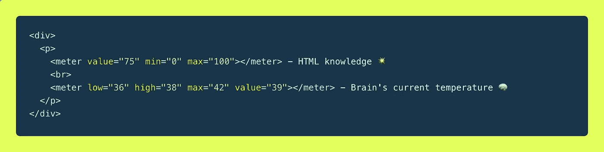
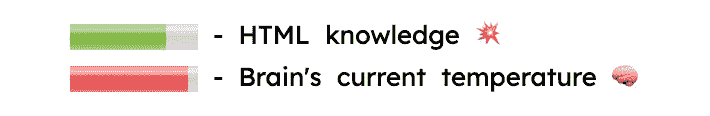

# 我会经常使用的 10 个方便的 HTML 标签…

> 原文：<https://betterprogramming.pub/10-handy-html-tags-ill-use-more-often-914a97efc3fb>

HTML 是一种相当简单的语言，由[元素](https://developer.mozilla.org/en-US/docs/Glossary/Element)组成。它的主要工作之一是赋予文本意义，以便您的浏览器知道如何正确显示它，以及帮助搜索引擎理解页面的结构和内容。

你和我一样，可能每天都在编写 HTML，我们可能知道绝大多数 HTML 标签。但是他们中的一些人没有其他人出名。

这里有 10 个你可能不知道的 HTML 标签…

@ vincentvanzalinge—unsplash.com

时间 HTML 标记脚本示例

标签定义了机器可读的日期、时间或持续时间。基本上，你可以在开始和结束标签之间放置任何东西——这是人类可读的部分。

然后，与`datetime`属性一起使用，它可能会帮助搜索引擎生成更智能的结果，并帮助浏览器识别日期，这可能会用于特殊功能，如向日历添加事件等。

这些例子可以在 [CSS-Tricks](https://css-tricks.com/time-element/) 和 [W3School](https://www.w3schools.com/tags/tag_time.asp) 上找到。访问这些页面，了解更多关于可接受的格式！

# ^和

下标和上标示例

我们并不是每天都需要编写包含 ***上标*** 和 ***下标*的文本。但是当我们这样做时，最好把事情简单化！**

``和``标签使文本比正常行高或低半个字符，有时以较小的字体呈现。

而**上标**和**下标**的文字可以用来做脚注或者写疯狂的化学式像 C₆H₆N₁₂O₁₂(👨‍🔬 💥)，它们可以用来做有趣的，或多或少有用的东西，就像这些整洁的例子:
[笔由 CSSCallum](https://codepen.io/csscallum/pen/Awqki) & [笔由 Jh3y](https://codepen.io/jh3y/pen/mLgmwo)

# ~~和~~

`<del>`标签简单地定义了从文档中删除的文本，而`<ins>`定义了插入的文本。根据你的需要，你几乎不需要设计它。在下面找到我的[代码笔示例](https://codepen.io/thmsgbrt/pen/jONMeQm):

[代码打开示例](https://codepen.io/thmsgbrt/pen/jONMeQm)

删除和插入标签输出示例

标记文本标签示例

**HTML5 标记文本元素**用于标记具有相关性的内容。您可以使用它在搜索中强调内容或突出显示搜索词

提供上下文的结果页。

标记文本标签输出示例

图片标签 HTML 示例

这个很容易使用，而且功能非常强大。
使用`<picture>`标签，您可以为给定的媒体查询提供特定的图像。这绝对让你的响应式设计令人印象深刻。

您可以使用`<source>`元素添加任意数量的图像，并使用媒体查询填充`media`属性(就像使用 CSS 一样)。

为了决定加载哪个 URL，浏览器会检查每个`<source>`，并选择一个与页面当前布局最匹配的兼容图像。它具有以下属性:

`srcset` —链接到资源
`media`—有效的 CSS 媒体查询
`type`—指示资源格式的 MIME 类型。如果不支持该类型，浏览器将跳过`<source>`。

总是指定一个``元素作为`<picture>`元素的最后一个子元素。它由不支持`<picture>`元素的浏览器使用(Internet Explorer，我们看见你🙄)，或者如果没有一个`<source>`标签匹配。

关于这个元素还有更多需要了解的；查看 Pearl Chen 的文章[内置浏览器对响应图像的支持](https://www.html5rocks.com/en/tutorials/responsive/picture-element/)。

要查看它的运行，请打开这个 [**演示**](https://googlechrome.github.io/samples/picture-element/) **并调整您的浏览器大小！**

进度 HTML 标签示例

它在没有任何样式的 Mac 上的外观

HTML `<progress>` 元素显示一个指示器，显示任务的完成进度，通常显示为一个进度条。
它可以带 2 个属性:

`value` —如果省略了`max`属性，则必须设置在 0 或 1 之间，否则在 0 和`max`
`max` 之间，您猜对了，最大值

查看这篇 [CSS-Tricks](https://css-tricks.com/html5-progress-element/) 文章，学习如何设计`<progress>`标签的样式！

仪表 HTML 标签示例

[我的 CodePen 仪表标签示例](https://codepen.io/thmsgbrt/pen/rNBWaeN)

不要和`<progress>`混淆！使用它来定义已知范围内的标量测量或分数值。

它接受以下属性:

`value` —如果省略了`max`属性，则必须设置在 0 或 1 之间，否则设置在 0 和`max`
`min`—最小值
`max`—最大值
`low`—测量范围低端的数值上限。
`high`—测量范围高端的数值下限。
`optimum`—表示最佳数值。

查看 [MDN 文档](https://developer.mozilla.org/en-US/docs/Web/HTML/Element/meter)了解更多详细信息。

## 觉得这篇文章有用？下面是我最受欢迎的文章…

*   [帮助你成为更好的开发者的日常活动](https://medium.com/better-programming/everyday-activities-to-become-a-better-developer-3d00ec8d14a5)
*   [构建 React 组件库并发布到 GitHub 包注册表](https://medium.com/better-programming/build-your-very-own-react-component-library-and-publish-it-to-github-package-registry-192a688a51fd)
*   [使用 React 和 TypeScript 创建一个 Chrome 扩展](https://medium.com/better-programming/create-a-chrome-extension-using-react-and-typescript-50e94e14320c)