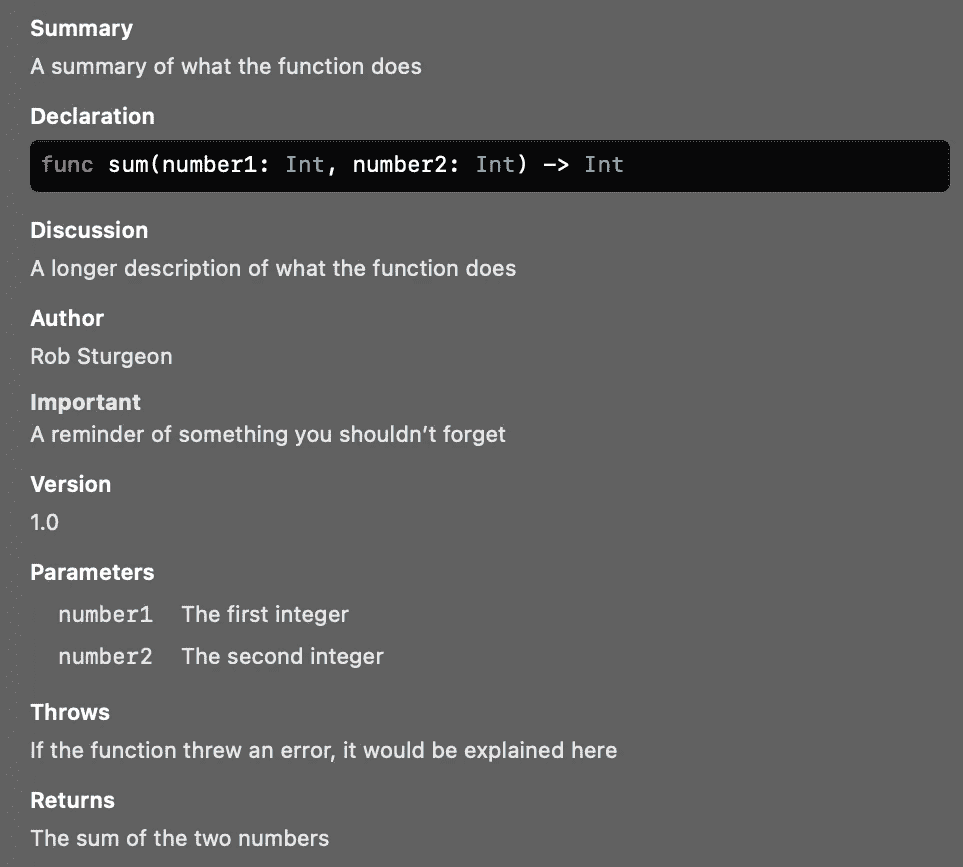

# 编写更简洁代码的 10 个 SwiftUI 和 Swift 编码技巧

> 原文：<https://betterprogramming.pub/10-helpful-tips-for-writing-cleaner-swift-and-swiftui-code-5a84e5407269>

## 编写有意义的代码，更快地发布应用


图片来自 [Pixabay](https://pixabay.com/?utm_source=link-attribution&utm_medium=referral&utm_campaign=image&utm_content=5665770) 的 [mohamed ramzee](https://pixabay.com/users/dark_shutterz-12874543/?utm_source=link-attribution&utm_medium=referral&utm_campaign=image&utm_content=5665770) 。

# 1.在 SwiftUI 中设置 TextField 键盘焦点

我们要做一个定制版的`TextField`，可以控制键盘是否处于活动状态。换句话说，我们要控制第一反应者是谁。首先，我们需要一个有助于响应与`UITextView`相关的事件的`Coordinator`类。由于结构只能符合协议，不能从类继承，我们为此使用了一个类:

现在，我倾向于使用所提供的系统类型的扩展，这给了我简化创建的便利初始化器。

我还包含了一个函数，用于有条件地设置第一个响应者，因为`UITextField`对这两者都使用了 void 方法，并且不能只将一个布尔值作为参数发送:

最后，我们需要创建我们的`UIViewRepresentable`。如你所见，`UITextField`是用我们方便的初始化器创建的，它将委托设置为我们的`CustomTextFieldCoordinator`类。当`UIView`更新时，我们确保我们的本地绑定仍然是最新的，包括设置第一响应者:

要将焦点放在代码中的键盘上，只需更改`isResponder`绑定的值。

# 2.向 SwiftUI 添加摄像头馈送

如果你想看到相机看到的东西，你需要获得用户的许可才能使用相机。这就需要你有一个站得住脚的理由，你的应用如果听起来不好听就会被 App Store 拒绝。右键单击 Xcode 项目中的`Info.plist`文件，并选择 Open As > Source code。这是将以下内容复制粘贴到结束标签`</dict>`和`</plist>`之前的最简单方法:

```
<key>NSCameraUsageDescription</key>
<string>The camera is needed in order to see what is around you</string>
```

这不是一个很好的解释为什么我们需要摄像头，因为我不知道你的应用程序会做什么，但它仍然阻止了应用程序崩溃。

现在`Info.plist`已经不碍事了，我们需要创建一个`UIView`来显示我们的摄像机画面:

SwiftUI 不包括相机功能，所以我们依赖于旧的做事方式。这个过程相对简单，因为我们正在创建一个包含一个`AVCaptureVideoPreviewLayer`的`UIView`，我们的摄像机画面将在这个`AVCaptureVideoPreviewLayer`上绘制。我还为`AVCaptureSession`添加了一个方便的初始化器，它将完成从我们稍后选择的相机获取信息的工作。

最后，让我们将其转换为 SwiftUI，以便将其添加到我们的应用程序中:

我们正在请求访问摄像机，如果我们被允许，用我们之前做的便利初始化器创建一个`AVCaptureSession`。

现在可以在 SwiftUI 中的任何地方使用，只需将其创建为`CameraView()`。

# 3.文档注释

当你按住 option (⌥)键并点击任何苹果系统类、函数或属性时，你会得到一个弹出窗口，告诉你更多的信息。查看此信息的另一种方式是使用右侧面板，它的顶部有一个问号选项卡，用于快速帮助。您可以按下 option (⌥)、command (⌘)和 3 的组合，在右侧面板中调出快速帮助，显示当前键入光标所在的位置。



图片由作者提供。

显而易见，本文档被分成许多部分。声明是自动生成的，因此总是包含在内。其他一切都可以添加到您的自定义函数、类和属性中。可以在任何东西上面添加一个以`/**`开头的注释块，第一行是简短的总结，第二行是更详细的描述。我已经包含了 Xcode 可以识别并放在标题下的所有内容，包括解释参数和返回类型的能力:

您不需要添加所有这些字段，但是添加与您的代码所做的事情相关的任何内容都会有所帮助。阅读您的代码的其他人可以访问快速帮助并获得更多信息，即使那个人是您，而您已经过了很长时间，并且已经忘记了为什么要这样做。这在创建类、调用函数或分配属性时特别有用。

在这些情况下使用快速帮助允许您访问文档注释——即使您不在编写注释的文件附近。

# 4.将 SwiftUI backgroundColor 设置为与 foregroundColor 相同的方式

SwiftUI 有一个名为`.background()`的修饰符很有用，这样你就可以在当前视图后面添加任何类型的视图。不再局限于颜色，你的背景可以是一幅图像或者更复杂的形状。但是当我使用`.foregroundColor()`修饰符时，我利用了这样一个事实，即通过给一个像`.blue`这样的参数，一个`Color`是被期望的。你不能对`.background()`做同样的事情，因为背景可以是任何一种景色。

这个扩展使得给视图添加背景颜色变得更加容易。

我发现自己更经常添加颜色作为背景，所以这对我很有用。如果你想有一个更复杂的视图作为背景，我会建议使用一个`ZStack`。这给了你更多的灵活性，允许多层，而不是一个主视图和背景。`.overlay()`修饰符也有类似的目的，让您能够在现有视图的前面添加一个视图。

我对这个修改器的建议是一样的，因为我认为`ZStack`在我能想到的任何情况下都更加灵活。

# 5.像 SwiftUI 的路径一样容易地创建 UIBezierPath 和 CGPath

`Path`提供了一种使用 SwiftUI 构建形状的简单方法。我们用来构造它的闭包传递到一个实例中，然后我们向该实例添加直线和四次曲线。

`UIBezierPath`可用于创建`SKShapeNode`，由`SpriteKit`用于创建自定义形状。实际上，这个初始化器使用了一个`CGPath`，但是可以使用一个`UIBezierPath.`的`cgPath`属性来访问它

通过首先构造一个`UIBezierPath`来构造一个`CGPath`的主要原因是`CGPath`本身没有允许你添加直线和曲线的方法。

这个扩展允许像构造 SwiftUI `Path`一样构造`UIBezierPath`。我还添加了`addQuadCurve`方法。

SwiftUI 中的`Path`调用第二个参数`control`——而不是`controlPoint`——所以我包含了一个`addQuadCurve`方法来保证两者的一致性。

# 6.在一个范围内扩展到与箝位值相当

您可能需要确保某个值在某个范围内，并且条件逻辑包含人为错误的危险。例如，我们想使用`<`操作符还是`<=`操作符？有一种简单的方法在所有情况下重复这个过程是有帮助的，这样它就能如我们期望的那样一致地工作，并减少我们需要编写的代码量。有许多数字类型，如`Int`、`Float`和`Double`，以及这些不同大小的版本。不出所料，`Int8`是 8 位大小，而`Float16`是 16 位，而不是通常的 32 位大小。

我们如何一次为所有这些添加功能？

通过扩展他们共有的协议！

当数组中的项目符合`[Comparable](https://developer.apple.com/documentation/swift/comparable)`协议时，`[min()](https://developer.apple.com/documentation/swift/array/1687893-min)`和`[max()](https://developer.apple.com/documentation/swift/array/1688806-max)`方法可用。这为我们提供了一个可选值，取决于数组中是否有值。空数组返回`nil`，但是重复相同数字的数组将返回该数字作为最小值和最大值。在我的例子中，我用两个值硬编码我的数组，所以答案永远不会是`nil`。尽管如此，我还是使用了`??``nil`-合并操作符来设置它。

在许多情况下，使用这个操作符比使用不安全的调用操作符`!`进行强制解包要好得多。

# 7.扩展枚举以在事例之间安全循环

虽然枚举不是一个数组，但有时需要迭代它包含的事例。在我的枚举中，我有三个水果的名字:`apple`、`banana`、`pear`。我的 enum 符合`CaseIterable`协议，这允许我访问我的案例数组。

如果我想从当前案例转换到下一个案例，该怎么办？

选择数组中下一个事例的问题是，我不知道我当前事例的索引是什么。

这就是我的计算属性`index`所做的。数组可以访问方法`firstIndex(of:)`，该方法将为我们提供任何想要的值的索引。在任何其他数组中，都有可能找不到该数组。如果没有找到值，我使用`nil`-合并操作符`??`给出`endIndex`。`endIndex`实际上是在一个数组的最后一个有效索引之后，所以它相当于没有找到有效索引。

但是，在这种情况下，我们正在搜索的数组是当前事例所属的枚举的事例数组。

因此，`endIndex`永远不会被返回，只是为了说明如何解决返回的索引为`nil`的情况:

其余的扩展属性以各种方式使用我的`index`属性。

我们有`previousCase`和`nextCase`作为计算属性，以及其中每一个的循环变体。如果没有循环，`previousCase`属性将在第一个案例处停止，并继续返回，而不会移出范围。

类似地，`nextCase`属性将到达最后一个案例，而不会试图超越它。

正如你可能已经猜到的，循环种类将从最后到第一或从第一到最后直接进行，这取决于方向。

您可能会注意到，我使用了`indices`集合来检查索引是否有效。

这可以避免很多错误，我推荐你在试图偏移数组索引时使用这种检查。

# 8.使用协议简化 SwiftUI

面向协议的编程允许我们更直接地处理值类型，如结构，而不是引用类型，如类。结构不能从超类型继承，因此它们不从祖先继承任何属性。SwiftUI 依赖于与`View`协议的一致性，该协议为特定目的指定属性。我们的`View`结构不能从超类继承，但是我们仍然可以通过将它分解成协议和扩展来分离关注点:

这是最简单的例子，但是它展示了一种新的构造 SwiftUI 的方法，这种方法将`body`属性从结构的其余部分中分离出来。我们的协议`TextDisplayable`符合`View`协议本身，导致了传递到`TextView`结构的一致性链。这仍然是一致性，而不是继承！这就是为什么我可以使用`TextView`的扩展来提供`body`属性，而不用指定一致性。如果我从`TextDisplayable`协议中移除一致性，我将需要在`TextView`声明或包含主体的扩展中指定它。

以这种方式使用协议允许我们的结构只包含它需要的`text`属性。扩展的唯一限制是它们不能包含存储属性，计算属性除外，就像`body`的情况一样。如果您决定对 SwiftUI 使用这种方法，请尽可能精确地指定您的协议的目的。

协议名称的标准后缀是- `ible`、- `able`和- `ing`，尽管在大多数情况下，它们中的一个足以持续使用。

# 9.为 UserDefaults 使用静态字符串常量

`UserDefaults`给我们提供了一种存储数据的简单方法，但它有其局限性。

正如阿克塞尔·基的网站所说:

> 使用 iExplorer 之类的应用程序，用户可以访问他们 iPhone 的 Library/Preferences 文件夹，并轻松读取/修改 UserDefaults plist 数据

结构化数据属于`CoreData`，而敏感数据属于 keychain。

然而，当存储简单的数据时，比如在我的例子中的用户的姓名和年龄，`UserDefaults`工作得相当好。

原始字符串是一件危险的事情。如果您犯了拼写错误，编译器不会帮助您，因为字符串可以有任何拼写。对于`UserDefaults`来说尤其如此，它依靠字符串来保存和加载值到它的属性列表中。显而易见，保存时拼错一个键会导致一个值在键的多种拼写下被存储多次，尝试从拼错的键加载会给人一种没有设置值的错觉。

使用`String`的扩展允许我们容易地分配静态常数。虽然我用`UserDefaults`作为例子，但是这些可以用在任何以`String`作为参数的函数或初始化器中。在 SwiftUI 中，我使用 iOS 14 中新增的`[@AppStorage](https://www.hackingwithswift.com/quick-start/swiftui/what-is-the-appstorage-property-wrapper)` [属性包装器](https://www.hackingwithswift.com/quick-start/swiftui/what-is-the-appstorage-property-wrapper)从`UserDefaults`加载。这个属性包装器需要一个`String`作为键，所以我给它一个`nameKey`常量。

在 SwiftUI 之外的任何环境中，都有必要以传统的方式做事。

我使用`UserDefaults.standard`和我的`ageKey`常量作为键来加载我的年龄属性。

不言而喻，你不能在你的常量中犯拼写错误，但是这比每次你需要使用它们时的失败点要少得多。

# 使用枚举而不是原始字符串安全地构造 URL

以下是如何安全地创建 URL，尽可能减少对原始字符串的依赖。

这可能看起来很多，但是我们基本上是将 enums 与一个原始类型的`String`和`URLComponents`组合在一起。该结构提供了一种单独添加方案、主机和路径组件的方法，而不是传递可能失败的原始字符串。

我们不是依靠硬编码的字符串来获得 URL 中正确的点和斜线的数量，而是依靠`URLComponents`结构来完成这项工作。

所以我们添加的组件都不会有斜杠或者点，除了子域和域名之间的点(比如`maps.google.com`中)。

我提供了三个初始化器运行的例子。苹果网址带你到`apple.com/accessibility`，以`accessibility`作为路径组件。如果我想添加更多的路径组件，比如`apple.com/accessibility/vision`，`accessibility`和`vision`将是我传递的数组中的独立字符串。

同样，不需要斜线，因为这是由`URLComponents`结构自动完成的。

Google URL 是用于地图的，所以它使用可选的子域`maps`。

我还添加了英国的 Google 网站，主要是为了展示对这种字符串使用枚举的局限性。因为枚举的案例名称中不能有点，所以我必须指定`case couk = “co.uk”`。

只要有可能，尽量让枚举事例反映作为其基础原始值的字符串。

这样，Swift 为我们处理原始值，我们不必像我在这种情况下所做的那样明确地陈述它。

感谢阅读！