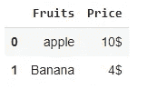
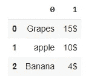

# 在 Python 中使用嵌套列表的 10 个重要技巧

> 原文：<https://betterprogramming.pub/10-important-tips-for-using-nested-lists-in-python-38ceca68be35>

## 反转、展平、转换成字典等等


照片由[玛格达·埃勒斯](https://www.pexels.com/@magda-ehlers-pexels?utm_content=attributionCopyText&utm_medium=referral&utm_source=pexels)从[佩克斯](https://www.pexels.com/photo/animal-figurines-on-a-staircase-made-of-toy-blocks-1329321/?utm_content=attributionCopyText&utm_medium=referral&utm_source=pexels)拍摄

Python 列表是最重要的数据结构之一。Python 列表本身也可以包含子列表。这就是所谓的嵌套列表。

在使用 python 嵌套列表时，我遇到了一些场景。我在这篇文章中分享了这些。比如如何访问元素、替换元素、计算嵌套列表中元素的出现次数等等。

# 1.如何检查嵌套列表中是否存在某个元素？

## 使用 any()函数

```
any(elem in sub_list for sub_list in nested_list)
```

*   如果嵌套列表中的元素返回 True，否则返回 False。

# 2.如何反转嵌套列表？

## 使用索引

如果我们想反转嵌套列表中的元素(`sub_list`)，可以使用索引方法。

`my_list[::-1]` —它将反转嵌套列表中的元素。它将创建嵌套列表的副本。它不会修改原始列表。

## 使用`reverse()`

`my_list.reverse()` — `reverse()`函数还会反转嵌套列表中的元素，并修改原始列表本身。

## 如何反转子列表中的元素？

假设，如果我们想要反转`sub_list`中的元素，那么我们必须遍历`nested_list`中的`sub_list`，并对那个`sub_list`应用反转函数。

# 3.如何展平嵌套列表？

通过使用列表理解，我们可以展平嵌套列表。这是做这件事的一种方法。

```
[element for element in sub_list for sub_list in nested_list]
```

*   首先，遍历嵌套列表，然后遍历`sub_list`并获取每个元素。

# 4.在 Python 嵌套列表中查找一个项目的所有匹配项的索引？

## 使用`index()`方法

首先，遍历嵌套列表中的子列表，然后检查该特定元素是否存在于那个`sub_list`中。如果存在，找到`sub_list`的索引和`sub_list`中元素的索引。

## 使用列表理解

```
[(index1,index2) for (index1,sub_list) in enumerate(nested_list) 
for (index2,element) in enumerate(sub_list) if element==’X’]
```

*   它将返回包含特定元素索引的元组列表。

```
for (index1,sub_list) in enumerate(nested_list)
```

`enumerate` 函数将迭代 iterable 并返回迭代 iterable 得到的索引和值。

# 5.如何计算嵌套列表中一个元素的出现次数？

在列表中，我们可以使用`count()`方法找到一个元素的出现次数。

```
l1.count()
```

在`nested_list`中，我们遍历`sub_list`，然后找到每个`sub_list`中特定元素的计数，然后使用`sum()`函数将计数相加。

# 6.如何从嵌套列表中移除元素？

## **使用 remove()方法**

首先，遍历`nested _list`，然后遍历`sub_list`中的元素，检查该特定元素是否存在。如果是，使用`remove()`方法移除该元素。

它将从嵌套列表中移除该特定元素的所有出现。

## **利用列表理解**

遍历嵌套列表，然后遍历`sub_list`，只保留与要删除的元素不匹配的元素。

# 7.如何在嵌套列表中的特定索引处插入元素？

如果我们想在特定的索引处插入一个元素，我们可以通过使用`insert()`方法来实现。

遍历`nested_list`中的`sub_list`，如果`sub_list`的索引匹配，则使用以下命令插入元素:

```
sub_list.insert(index,element_to_inserted)
```

# 8.如何替换嵌套列表中所有出现的元素？

获取需要替换的元素的索引，然后通过提及索引来分配新元素:

```
my_list[index1][index2]=’X’
```

我们可以使用`enumerate()`函数从`sub_list`中获取`sub_list`的索引和特定元素的索引。

# 9.如何将嵌套列表转换成字典？

## **例 1**

在给定的嵌套列表示例中，每个 sub_list 中的第一个元素是一个键，第二个元素是相应的值。

首先，我们可以遍历嵌套列表，然后将第一个元素指定为键，将第二个元素指定为值。

```
d[key]=value 
d[sub_list[0]]=sub_list[1]
```

## **例二**

在给定的嵌套列表示例中，每个`sub_list`中的第一个元素是一个键，其余元素是相应的值。

```
d[sub_list[0]]=sub_list[1:]
```

`sub_list[1:]` —它将从第一个索引中取出所有元素。

# 10.如何将嵌套列表转换成熊猫数据框架？

## **例 1**

在下面的例子中，第一个`sub_list`包含`column_names`，剩余的`sub_list`包含相应的值。

输出:



## **例二**

在下面的例子中，所有的`sub_list`都包含这些值。`sub_list`中没有列名。

输出:



# 结论

在本文中，我介绍了一些关于如何在 Python 中使用嵌套列表的重要技巧。与常规 Python 列表相比，嵌套列表上的操作执行起来略有不同。

我希望你们都喜欢。感谢阅读。