# 高效重构的 10 个 IntelliJ 捷径

> 原文：<https://betterprogramming.pub/10-intellij-shortcuts-for-efficient-refactoring-79151e8082c4>

## *节省时间，避免错误*

在 [Unsplash](https://unsplash.com?utm_source=medium&utm_medium=referral) 上戴着红帽的[女孩的照片](https://unsplash.com/@girlwithredhat?utm_source=medium&utm_medium=referral)

在日常工作中，很少有工程师会从头开始编写代码，即使你有幸参与了一个激动人心的新项目，你也不可能一次就得到完美的实现。

我想说的是，重构总是有用的，经常是必须的，并且应该始终如一地进行。我总是致力于让我接触的代码更好一点。

然而，重构的危险在于，如果匆忙完成或者没有完整的测试覆盖作为温暖的安全毯，你可能会引入一个讨厌的 bug。这就是为什么在可能的情况下，我总是尝试使用 IDE 的协助，IntelliJ 提供了很多。所以，这里是我日常使用的快捷方式/功能，我觉得非常有用。

# 1.将选择提取到局部变量

## (Ctrl + Alt + V / Cmd + Opt + V)

IntelliJ 会建议一个名字，有时很切题，有时不太切题，但它是在编辑模式下。如果您愿意，您还可以选择提取多次出现的选择，或者只提取当前的选择。

你可以选择的另一件事是在声明的顶部弹出一个气泡——是否使变量不可变(在这个例子中是 Kotlin var 或 val ),以及可能的其他语言特定的选项，如下面 Kotlin 的截图——是否指定类型。

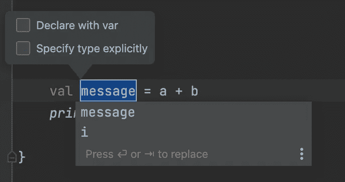

# 2.将选择提取到字段/属性

## (Ctrl + Alt + F / Cmd + Opt + F)

在下面的截图中，IntelliJ 提供的选项是语言相关的——是为类还是文件定义它。一旦选中，你仍然可以选择提取局部变量。

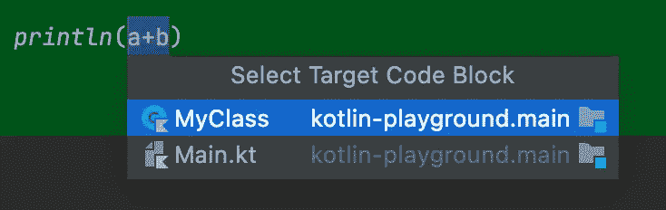

# 3.将选择提取到方法

## (Ctrl + Alt + M / Cmd + Opt + M)

在窗口中，你会看到一旦你点击快捷键组合，你可以控制参数的可见性、顺序和名称，当然，还有新方法的名称。

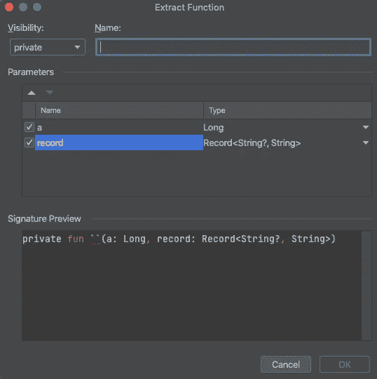

# 4.内嵌函数

## (Ctrl + Alt + N / Cmd + Opt + N)

这与上面的 3 个相反——将变量、字段或方法放回它们被使用的地方。同样，您有一些选项，比如内嵌单个或多个事件。

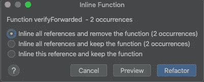

# 5.移动到下一个或上一个光标位置

## (Ctl + Alt + ← or → / Cmd + Opt + ← or →)

这是快速浏览您最近编辑的几个位置的好方法。

# 6.代码生成

## (Alt + Insert / Cmd + N)

同样，假设结果是一个* *context** 菜单，它依赖于上下文，但通常你会用它来生成一些无聊的东西，如`equals()`、`hashCode()`、getters 和 setters 或 constructors、实现接口方法等等。

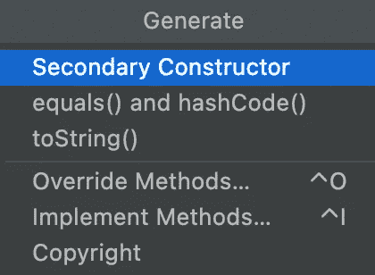

# 7.重命名变量、方法、类等

## (Ctrl + Alt + R / Shift + F6)

这可能是所有人都非常熟悉的选项，而且绝对是救命稻草。如果你仅仅依靠复制粘贴来重命名一个可能已经隐藏在代码中某处的变量，你可能会以一个 bug 而告终。

有趣的是，您还可以只重命名特定的事件，或者查找所有的用法。当重命名一个包时，你可以只重命名目录或者包，所以要小心选择。

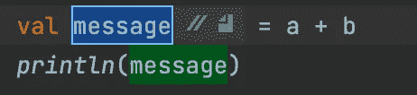

# 8.重构这个

## (Ctrl+Alt+Shift+T / Ctrl + T)

这是一条包罗万象的捷径。如果你不想一下子全部记住，只要先记住这一点，其余的会及时想起的。这个组合显示了所有可供选择的重构。所有以前的快捷方式都在这里，所以你可以用它作为一个起点。

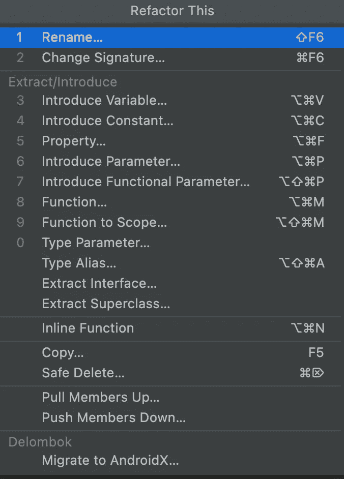

更重要的是，让我提醒您注意一些不常用的重构:

*   **向上拉成员** —将选定的成员(字段或方法)移动到父类
*   **下推成员** —将选定的成员(字段或方法)移动到子类

例如，如果您正在开发一个 API，那么在处理一个更复杂的层次结构时，这是非常棒的。

*   **提取超类**
*   **提取接口**

启动流程后，您可以在弹出窗口中设置所有其他详细信息。

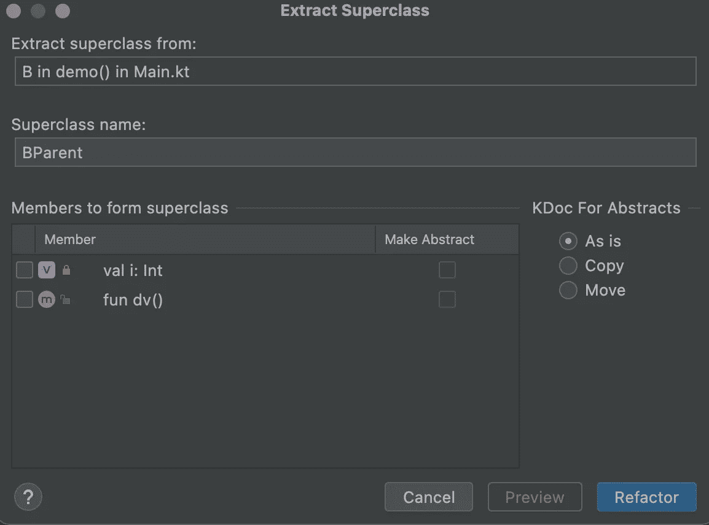

# 9.检查代码

这不是一条捷径，但却是保持代码整洁的好方法。它在代码 M **enu** - > Inspect Code 下…您可以通过将分析范围限制到一个文件、模块、包或整个项目来选择分析范围。

然后它会给你一个按语言/框架和类型分组的问题和潜在问题的列表。

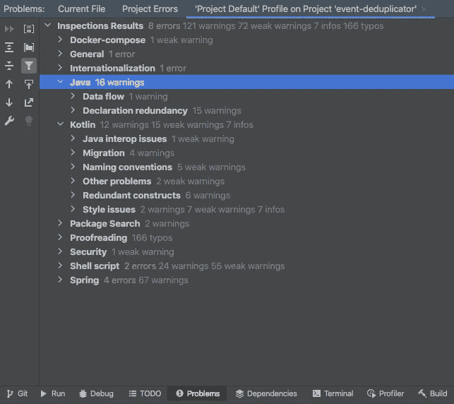

对于一些简单的警告，您也许可以通过右键单击并选择建议的解决方法来解决，对于其他的警告，您必须自己来做。

# 10.转到声明或用法

*   转到一个成员的声明 **(Ctrl + Alt + B / Cmd + Opt + B)**
*   转到成员的用法**(Ctrl+Alt+B/Cmd+Opt+B)**—如果您有该成员的多个用法，您将看到一个弹出的上下文菜单，允许您选择具体的位置

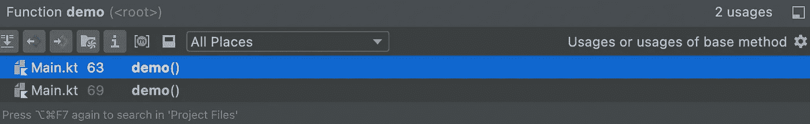

# 11.附加快捷方式—打开层次结构

## (Ctrl + H / Cmd + H)

当你使用一个新的库，需要正确看待事物，或者当你开始了解一段需要接管和编辑的新代码时，这是非常有用的。

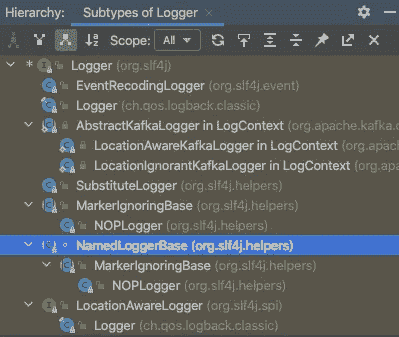

希望这对其他人有用，如果是新的，继续练习使用它。一开始可能会觉得奇怪，但是一旦你习惯了，你就离不开它了。

快乐编码。