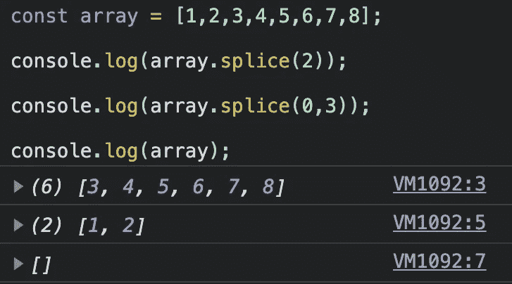
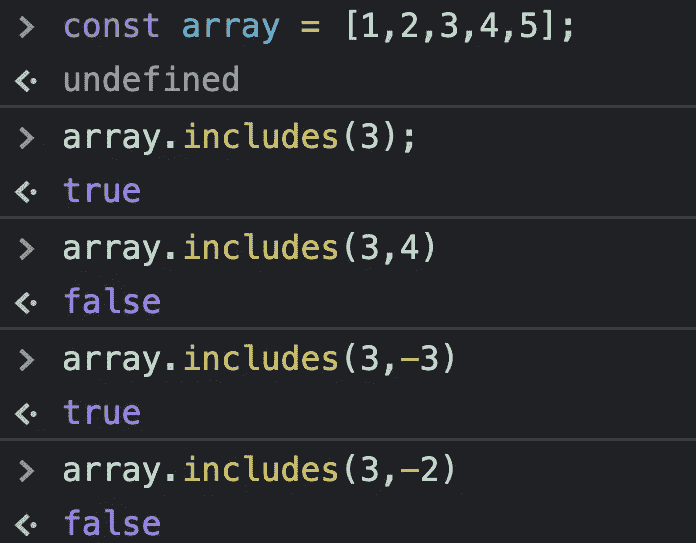

# 提高代码性能的 10 种 JavaScript 数组方法

> 原文：<https://betterprogramming.pub/10-javascript-array-methods-to-boost-your-code-performance-acb57b455189>

## Every、some、includes 和其他数组方法


阿诺德·弗朗西斯卡在 [Unsplash](https://unsplash.com?utm_source=medium&utm_medium=referral) 上拍摄的照片

拥有大量实例方法的 Array API 是 JavaScript 中最大的 API 之一。起初，它可能是压倒性的。花些时间熟悉它是很重要的。像`map()`和`forEach()`这样的方法被广泛滥用。相反，通过使用正确的接口，你可以使你的代码更快、更有效、更易读。

使用数组方法时需要考虑一些事情:有些是不可变的，有些是可变的。知道你正在使用哪种方法是至关重要的。误用会导致讨厌的错误。

在本文中，我们将看看 JavaScript 数组对象的十个更有用的实例方法，以及它们的亮点。

# 1.薄片

如果你想通过开始和结束索引复制一个数组，你可能想使用`slice()`。这个方法是一个纯函数，所以它不会有任何副作用，也不会改变目标数组。

> "`slice()`方法将数组的一部分的浅表副本返回到从`start`到`end`(不包括`end`)中选择的新数组对象中，其中`start`和`end`表示该数组中项目的索引。原始数组不会被修改。— [MDN](https://developer.mozilla.org/en-US/docs/Web/JavaScript/Reference/Global_Objects/Array/slice)

这两个参数都是可选的。如果不带任何参数调用，它将复制整个对象。如果你只用一个正参数调用它，它会给你一个长度=1 的数组。您可以使用负偏移量来获取数组的最后一个元素。


作者使用不同参数执行方法切片的屏幕截图

当您需要在一个数组上构建子集并且不希望目标数组发生变化时，这种方法很有用。

# 2.接合

这个方法类似于前一个方法，但是有一个很大的不同:它将改变你的目标数组。当您处理一个大数组，并且需要部分使用它的子集时，这很有用。

> "`splice()`方法通过移除或替换现有元素和/或在适当的位置添加新元素来改变数组的内容。"— [MDN](https://developer.mozilla.org/en-US/docs/Web/JavaScript/Reference/Global_Objects/Array/splice)

让我们执行前面的例子，但是使用`splice()`方法:



由具有不同参数的方法拼接执行的作者制作的屏幕截图

我们可以观察到目标数组是如何变异的，以及在两次执行`splice()`方法后它是如何空白的。

# 3.包含

`includes()`方法是检查数组中是否存在某个元素的工具。它返回`true`或`false`。

它不接受任何等式函数，所以如果对象/原语包含在对象中，它将匹配。对于性能调优，可以将起始索引作为第二个参数传递。该指数可以是负数，也可以是正数。如果为负，它将检查最后一个`x`数字。



作者截图

一旦找到一个项目，它将停止遍历剩余的项目，从而获得比遍历整个数组更好的性能。

这比构建如下所示的自定义模板更有效:

# 4.一些

`some()`方法类似于`includes()`方法。它也不会改变数组。不同之处在于`some()`提供了一个等式回调，而`includes()`依赖于匹配的原语/对象。另一个区别是，它不允许您自定义起始索引。

让我们看看语法:

```
arr.some(callback(element[, index[, array]])[, thisArg])
```

假设我们有一个数组，我们想检查是否有任何项大于`10`。我们不能在这种情况下使用`includes()`方法。让我们看看用`some()`方法做这件事有多直观。

# 5.每个

该方法的工作原理与`some()`相似。然而，只有当所有元素都符合标准时，它才会返回`true`。标准由回调函数给出，就像前面的方法一样。

> `every()`方法测试数组中的所有元素是否通过了由提供的函数实现的测试。它返回一个布尔值。— [MDN](https://developer.mozilla.org/en-US/docs/Web/JavaScript/Reference/Global_Objects/Array/every)

语法与`some()`相同:

```
arr.every(callback(element[, index[, array]])[, thisArg])
```

让我们用前面的例子。假设我们希望确保所有项目都大于`10`。由于接口参数相似，我们可以使用之前声明的`greaterThan10`函数。

# 6.发现

如果你想寻找一个精确的元素,`find()`界面是很有用的。当您可以使用内置时，人们通常会忘记它的存在，而使用一些强制性的查找方法。

同样，语法与前两种方法几乎相同:

```
arr.find(callback(element[, index[, array]])[, thisArg])
```

这将返回符合条件的第一个项目，如果没有符合条件的项目，则返回`undefined`。当有多个项目符合回调标准时，请注意。

我们可以再次使用前面的例子。运行我们的`greaterThan10`结合`find()`将返回大于`10`的第一个元素。

如果你只对元素的数组位置感兴趣，最好使用`findIndex()`方法。

# 7.变化

`shift()`方法简单直观。它只是从数组中移除第一项，然后将它返回。小心，因为它会改变你的数组对象。

这与`pop()`有什么不同？接口`pop()`将移除并返回数组的最后一个元素，而`shift()`将移除并返回第一个元素。两者都确实改变了阵列。

这是 FIFO 实现的理想选择。您可以在一个数组中排列您的项目，并使用`shift()`从队列中取出下一个项目。

# 8.松开打字机或键盘的字型变换键

这种方法与我们以前看到的完全相反。它不是移除一个项，而是将它添加到数组的开头。

`unshift()`和`push()`的方法与`shift()`和`pop()`的方法相同。`unshift()`将在开头添加元素，而`push()`将在结尾添加元素。两者都会改变阵列。

# 9.平面地图

在直接跳入`flatMap()`之前，我们先了解一下`flat()`的方法。

> "`flat()`方法创建了一个新数组，所有子数组元素递归地连接到其中，直到指定的深度。"— [MDN](https://developer.mozilla.org/en-US/docs/Web/JavaScript/Reference/Global_Objects/Array/flat)

当您需要展平数组时，这是最佳选择。它接受一个深度参数，您希望在该深度内展平数组。默认为`1`。

让我们来看一个例子，看看通过使用正确的方法，我们的代码是如何变得更加易读和简洁的。

我们现在准备开始`flatMap()`了。这种方法就像是`map()`和`flat()`组合的简写。

> `flatMap()`方法返回一个新的数组，该数组是通过对数组的每个元素应用给定的回调函数，然后将结果平坦化一级而形成的。这与深度为 1 的`[map()](https://developer.mozilla.org/en-US/docs/Web/JavaScript/Reference/Global_Objects/Array/map)`后跟一个`[flat()](https://developer.mozilla.org/en-US/docs/Web/JavaScript/Reference/Global_Objects/Array/flat)`是一样的，但是比分别调用这两个方法要稍微有效一些。— [MDN](https://developer.mozilla.org/en-US/docs/Web/JavaScript/Reference/Global_Objects/Array/flatMap)

让我们看一个例子:

我们能够在一个函数中表达更多内容，而不会有任何性能损失。

# 10.减少

`reduce()`方法是一种强大而灵活的方法。这个概念是 redux 管理库中的核心部分。

> `reduce()`方法对数组的每个元素执行一个 reducer 函数(您提供的),产生一个输出值— [MDN](https://developer.mozilla.org/en-US/docs/Web/JavaScript/Reference/Global_Objects/Array/Reduce)

您可以使用`reduce()`来模拟许多数组接口。您可以这样做并不意味着您必须这样做，因为内置的方法可读性更强，效率更高。

为了好玩，让我们使用`reduce()`创建一个`map()`等价物。

# 最后的想法

JavaScript 的数组 API 中有大量的数组方法。对它们中的每一个都有深刻的理解是很重要的。

总之，在使用数组时，您需要问自己:

*   这是最适合我的特定场景的方法吗？
*   我想让我的对象变异吗？

使用错误的方法可能会导致性能或内存下降。在小范围内，好处不太明显，但是一旦您的应用程序数据增长，您将开始看到性能提升。

作为软件工程师，我们有责任关注性能，而不仅仅是以一种野蛮的方式让事情运转起来。

干杯！

# 有关系的

[](/5-common-javascript-memory-mistakes-c8553972e4c2) [## 5 个常见的 JavaScript 内存错误

### 避免应用程序内存泄漏的技巧

better 编程. pub](/5-common-javascript-memory-mistakes-c8553972e4c2)