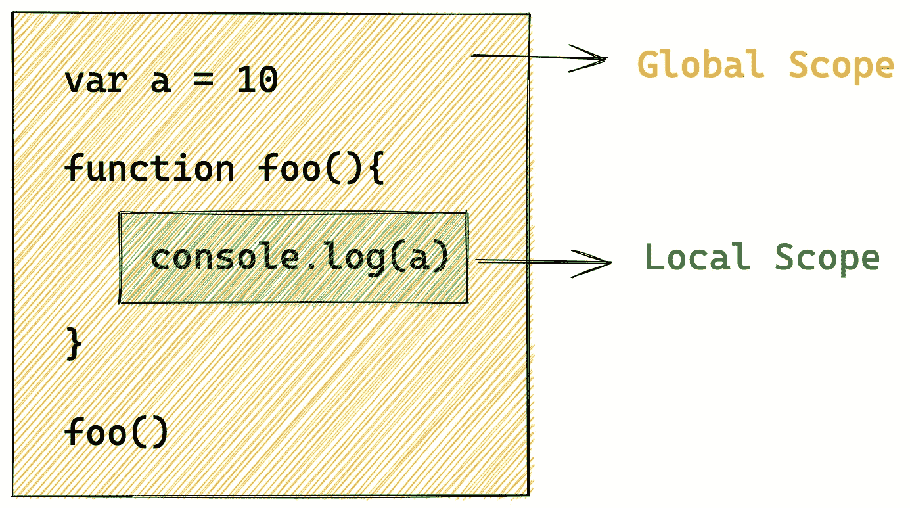
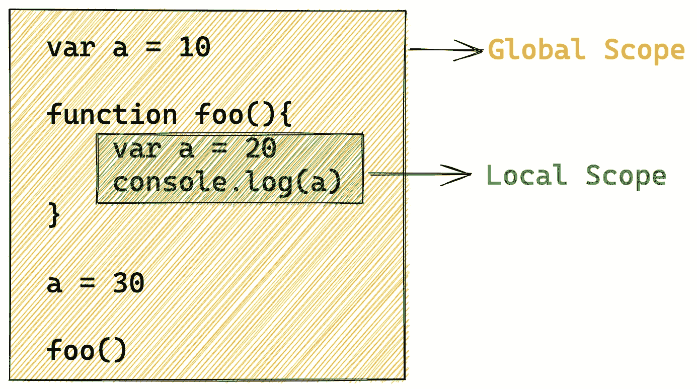
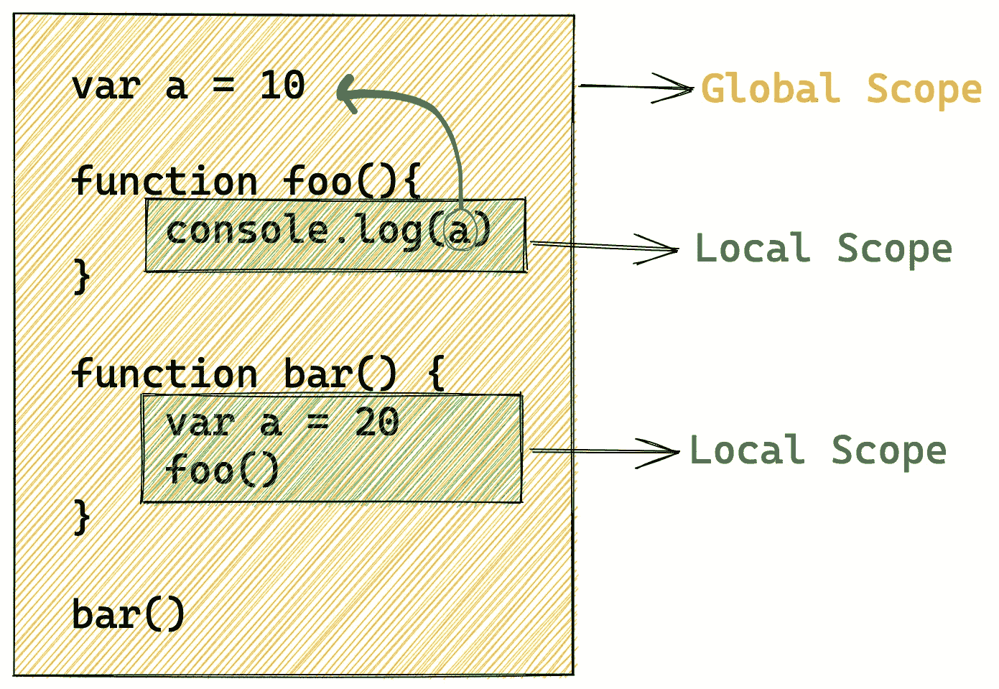
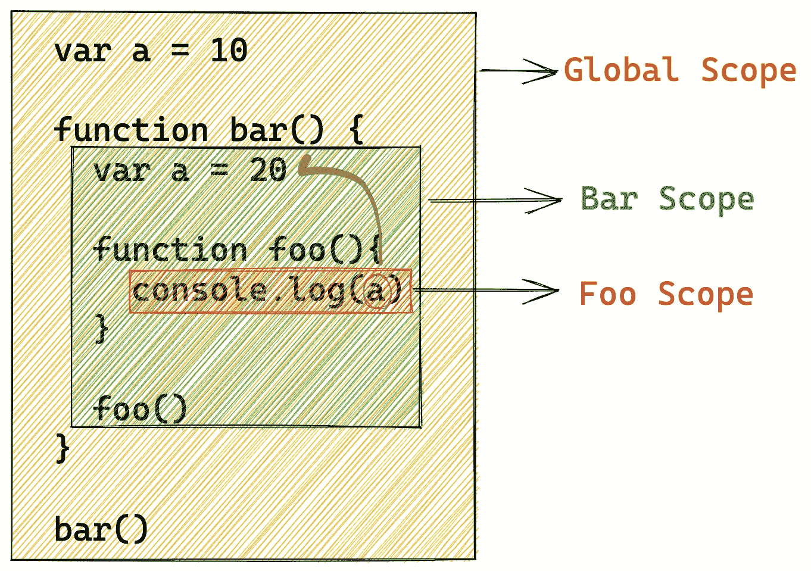
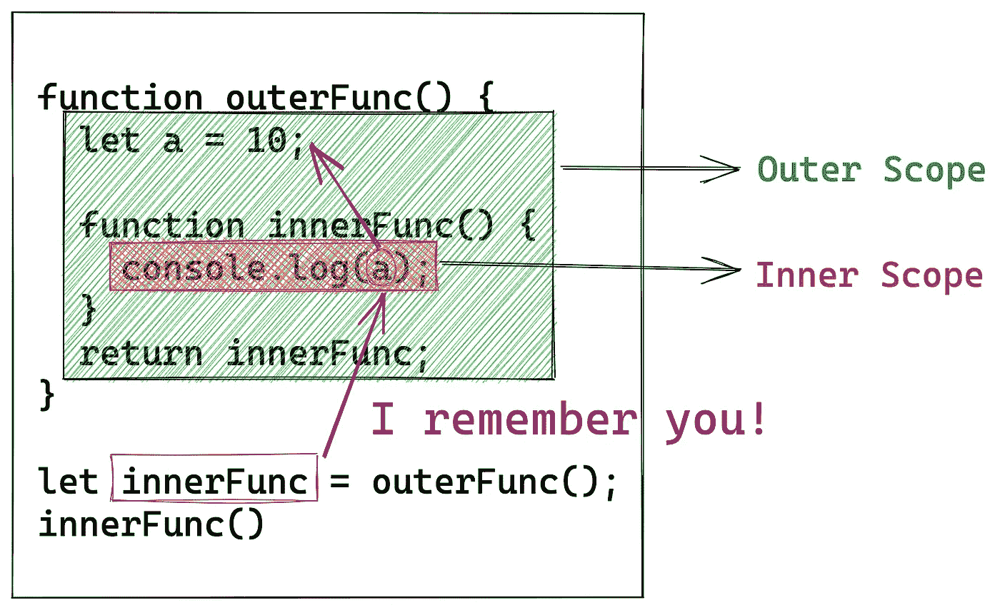
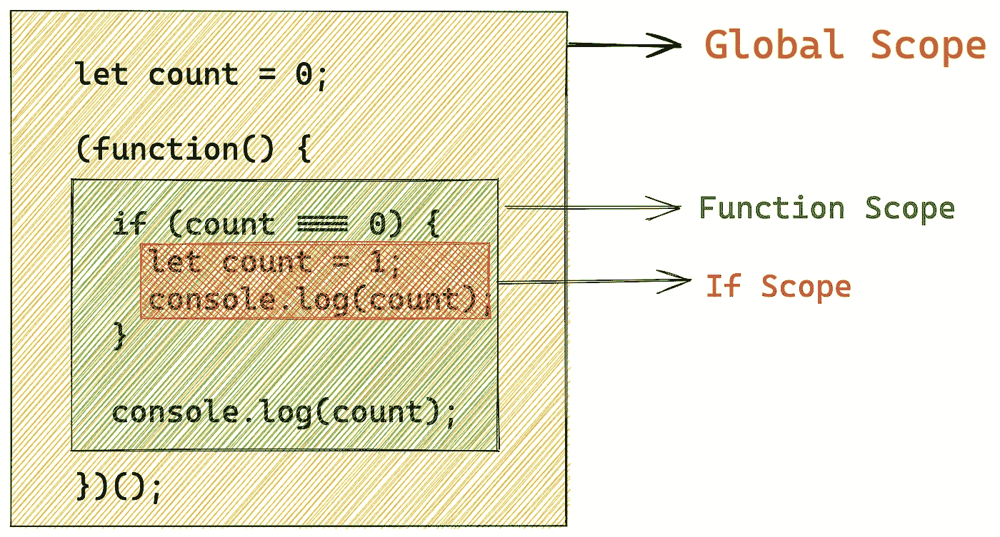
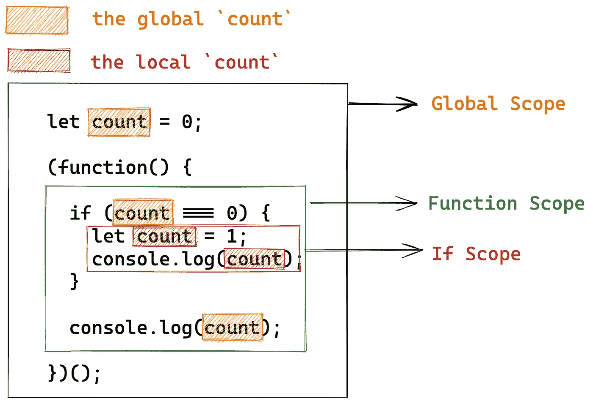
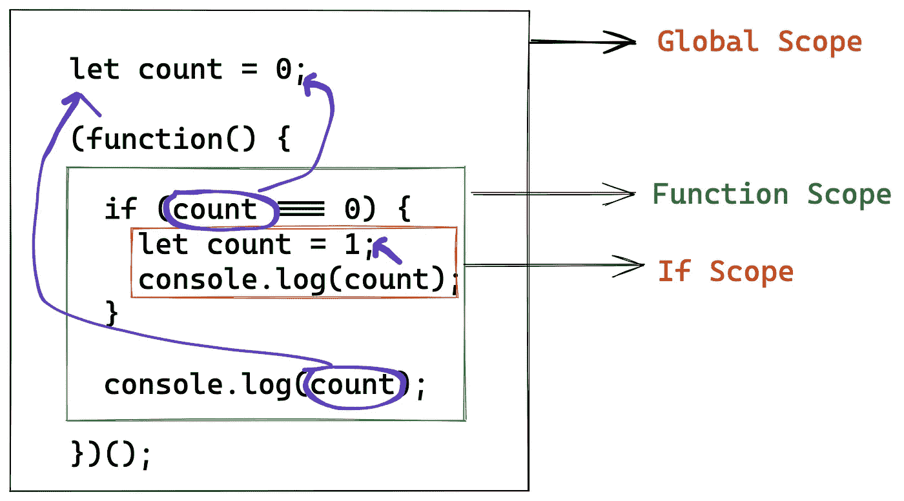
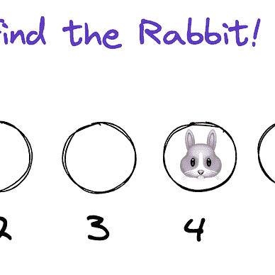

# 用图表解释 10 个 JavaScript 闭包挑战

> 原文：<https://betterprogramming.pub/10-javascript-closure-challenges-explained-with-diagrams-c964110805e7>

## 破解面试问题


闭包是函数式编程的核心概念之一，是每个 JavaScript 开发人员必备的知识。在这里，我准备了 10 个结束挑战，其中许多是在面试中经常被问到的。

准备好了吗，挑战者？享受这次旅程吧！

每个挑战都是一段代码，你需要说出这段代码的输出是什么。

# 1.范围

在谈论闭包之前，我们必须了解作用域的概念，这是理解闭包的基石。

这段代码的输出是什么？

这很简单。相信所有挑战者都知道输出结果是`10`。

*   默认情况下，有一个全局范围。
*   局部作用域是由函数或代码块创建的。



当执行`console.log(a)`时，JavaScript 引擎将首先在由函数`foo`创建的本地范围内寻找`a`。当 JavaScript 引擎找不到`a`时，它会尝试在它的外部作用域，也就是全局作用域中寻找`a`。然后发现`a`的值是 10。

# 2.本地范围

在这段代码中，变量`a`也存在于`foo`的范围内。所以当执行`console.log(a)`时，JavaScript 引擎可以直接从本地范围获取`a`的值。



所以输出是`20`。

记住:当 JavaScript 引擎需要查询一个变量的值时，它会先在局部范围内查找，如果没有找到该变量，它会继续在上层范围内查找。

# 3.词法范围

这个问题容易出错，也是面试中经常出现的问题。你可以考虑一下。

简单地说，JavaScript 实现了一个名为*词法作用域*的作用域机制(或者静态作用域)。之所以称之为*词法*(或*静态*)是因为引擎仅仅通过查看 JavaScript 源代码来确定作用域的嵌套，而不管它在哪里被调用。



所以输出是`10`:

# 4.修改的词法范围

如果我们将代码片段更改为:

产量是多少？

`foo`作用域成为`bar`作用域的子作用域:



当 JavaScript 引擎在`Foo`作用域中没有找到`a`时，它会先从`Foo`作用域的父作用域，也就是`Bar`作用域中寻找`a`，它确实找到了`a`。

所以输出是`20`:

好了，以上是关于 scope 的一些基础挑战，相信你能顺利通过。现在我们开始进入收尾部分。

# 5.关闭

产量是多少？这段代码会抛出异常吗？

有了词法范围，`innerFunc`仍然可以访问`a`，即使是在其词法范围之外执行。

换句话说，`innerFunc` **从其词法范围记忆(或关闭)**变量`a`。

换句话说，`innerFunc`是一个**闭包**，因为它从词法范围封闭了变量 a。



所以这段代码不是抛出异常，而是输出 10。

# 6.生活

这个代码片段使用 JavaScript 即时调用函数表达式(IIFE)。

您可以简单地将这段代码翻译成这样:

所以输出是`0`。

闭包的一个经典应用是隐藏变量。

比如你现在想写一个计数器，基本的写法是这样的:

可以这样写，但是全局范围内会多一个变量`i`，不好。

这时候我们可以用闭包来隐藏这个变量。

这样变量`i`隐藏在局部范围内，不会污染全局环境。

# 7.多重声明和用法

在这段代码中，有两个`count`的声明和三个`count`的用法。这是一个难题，你应该仔细考虑一下。

首先我们要知道`if`代码块也创建了一个局部作用域，上面的作用域大致是这样的。



*   函数作用域没有声明自己的`count`，所以我们在这个作用域中使用的`count`就是全局作用域的`count`。
*   If 作用域声明了自己的`count`，所以我们在这个作用域中使用的`count`就是当前作用域的`count`。



或者在这个图表中:



所以输出是`1`，`0`:

# 8.调用多个闭包

这里需要注意的是，`increase1`和`increase2`是由对`createCounter`的不同函数调用创建的，它们不共享内存，它们的`i`是独立的不同的。

所以输出是`1`、`2`、`1`、`2`。

# 9.返回函数

这段代码很好理解，但是有一个陷阱:`message`其实是一个静态字符串，它的值固定为`Count is 0`，在我们调用`increase`或者`log`的时候不会改变。

所以每次调用`log`函数，输出结果总是`Count is 0`。

如果想让`log`功能及时检查`count`的值，将`message`移入`log`:

# 10.异步闭包

产量是多少？

上面的代码相当于:

```
var i = 0;
setTimeout(function(){
  console.log(i);
},0)i = 1;
setTimeout(function(){
  console.log(i);
},0)i = 2;
setTimeout(function(){
  console.log(i);
},0)i = 3;
setTimeout(function(){
  console.log(i);
},0)i = 4;
setTimeout(function(){
  console.log(i);
},0)i = 5
```

而且我们知道 JavaScript 会先执行同步代码，再执行异步代码。所以每次执行`console.log(i)`的时候，`i`的值就已经变成 5 了。

所以输出是`5`、`5`、`5`、`5`、`5`。

如果我们想要代码输出`0`、`1`、`2`、`3`、`4`，我们该怎么做？

使用闭包的解决方案是这样的:

上面的代码相当于:

我们通过 JavaScript 直接调用函数表达式来创建函数作用域。并通过闭包保存`i`的值。

恭喜你，聪明的挑战者！

您已成功完成挑战。相信在代码面试的时候，闭包相关的问题不会再困扰你了。


[字节鱼](https://bytefish.medium.com/?source=post_page-----c964110805e7--------------------------------)

## 代码挑战

[View list](https://bytefish.medium.com/list/code-chanllenge-0b76b6b40281?source=post_page-----c964110805e7--------------------------------)6 stories