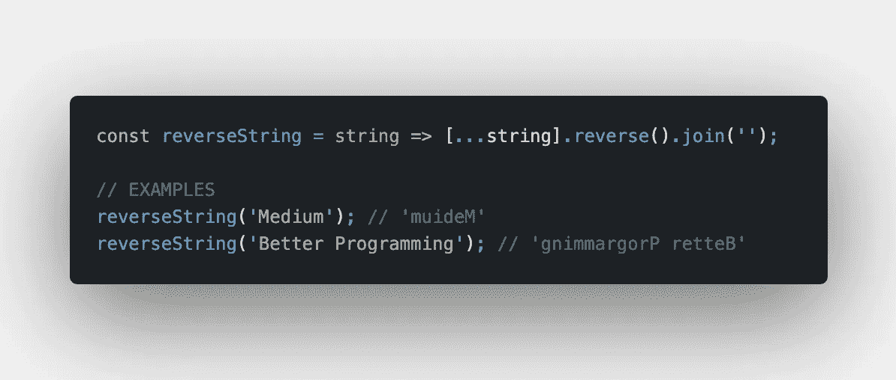
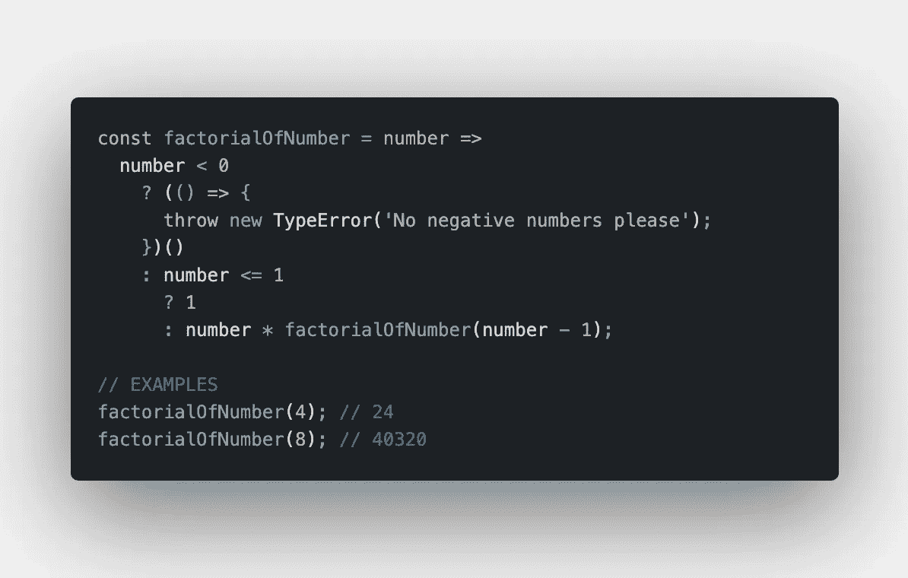
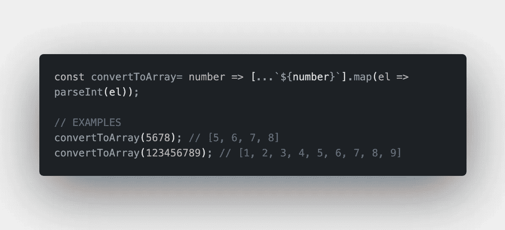
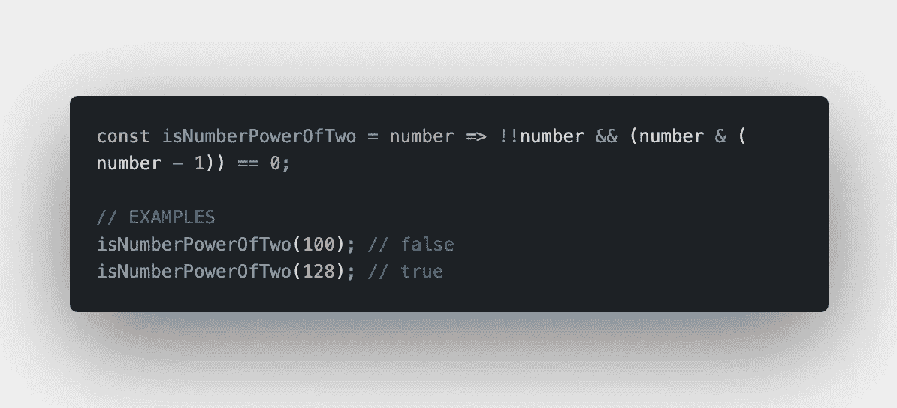
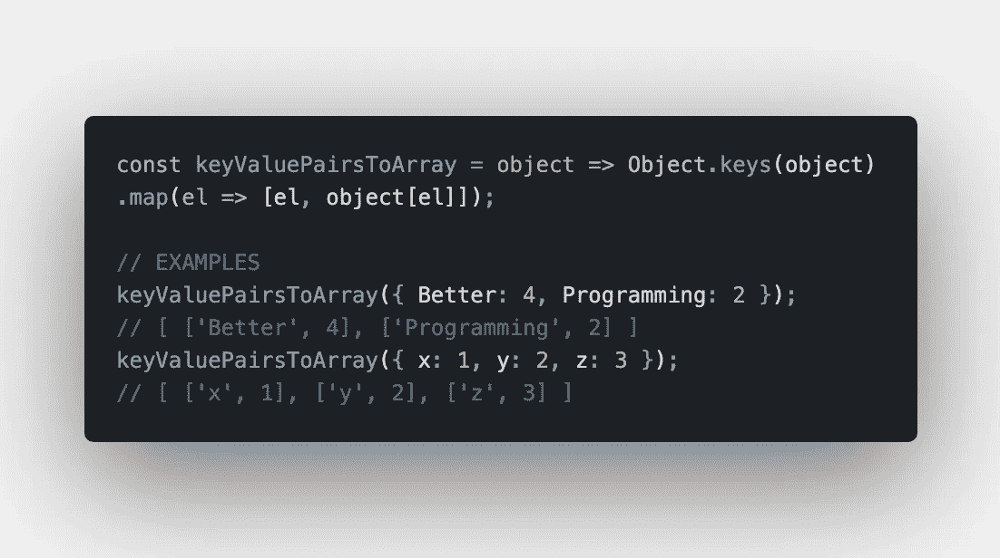
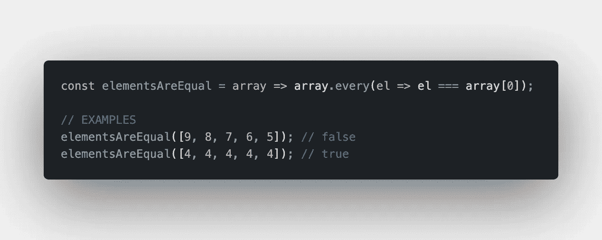
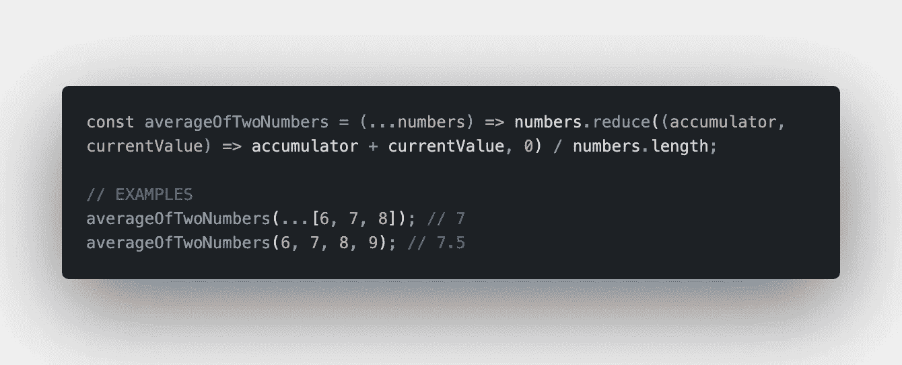
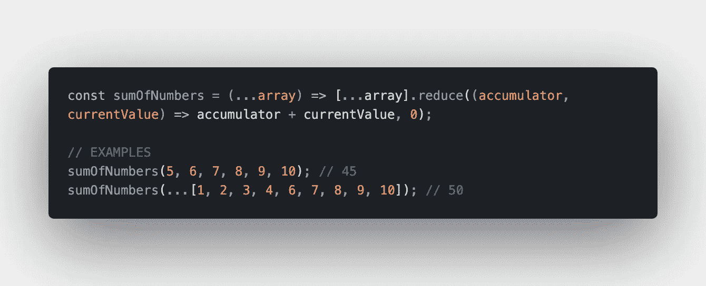
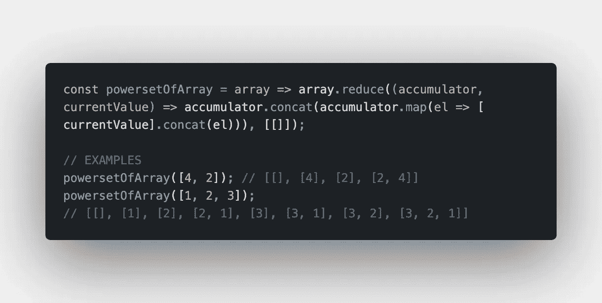

# 你现在可以使用的 10 个 JavaScript 代码片段

> 原文：<https://betterprogramming.pub/10-javascript-code-snippets-you-can-use-right-now-e1bb7c7ec35e>

## 将这些放到您的代码库中，然后开始吧

约书亚·阿拉贡在 [Unsplash](https://unsplash.com?utm_source=medium&utm_medium=referral) 上拍摄的照片。

这篇文章最初发表在智能编码器上。

毫无疑问，JavaScript 是 web 开发中最流行的编程语言之一。无论你使用 React、Vue 还是 Angular，都是 JavaScript。围绕 JS 已经形成了一个广泛而重要的生态系统，提供了大量的框架和库来帮助您更快地开发应用程序。

但是有时候退一步，试着理解没有库怎么做事也是好的。看看下面的代码片段，它们以优雅的方式解决了简单的问题，并在日常项目中使用这些知识，或者为编码面试做准备。

# 1.反转一根绳子

在这个例子中，我们使用了 spread 操作符(`…`)、Array 中的 reverse 方法和 String 中的 join 方法来反转给定的字符串。

# 2.计算数字的阶乘

为了计算给定数字的阶乘，我们使用了箭头函数和嵌套的三元运算符。

# 3.将数字转换为数字数组

在这个例子中，我们使用了 spread 运算符(`…`)、数组的 map 方法和`parseInt` 函数将一个给定的数字转换为一个单位数的数组。

# 4.检查一个数是否是 2 的幂

这个很简单。我们检查`number`不是 falsy，并使用按位 and 运算符( `&`)来确定`number`是否是 2 的幂。

# 5.从一个对象创建一个键值对数组

在这个例子中，我们使用 Object 中的 keys 方法和 Array 中的 map 方法来映射`Object`的键，并创建一个键值对数组。

# 6.从数组中返回[Number]个最大元素

为了从一个数组中返回最大元素数，我们使用了一个 arrow 函数，它接受我们的数组和我们希望函数返回的元素数。我们使用 spread 运算符(`…`)和 Array 中的 sort 和 slice 方法。注意，如果我们不提供第二个参数，`number`将获得默认值`1`，因此只返回一个最大值元素。

# 7.检查数组中的所有元素是否相等

在这个简短的示例中，我们使用 array 中的 every 方法检查数组中的所有元素是否相等。我们主要检查每个元素是否都等于数组中的第一个元素。

# 8.返回两个数字的平均值

在这个示例中，我们使用 spread 运算符(`…`)和 reduce 方法 from Array 来返回两个给定数字或一个数组的平均值。

# 9.返回两个或多个数字的和

为了返回两个或多个给定数字的和或一个数组，我们再次使用 spread 运算符(`…` ) 和 reduce 方法from Array。

# 10.返回数字数组的幂集

在最后一个例子中，我们希望返回一个数字数组的幂集。因此，我们使用 Array 中的 reduce、map 和 concat 方法。

正如您所看到的，用 JavaScript 和一些 ES6 魔法解决这些任务并不困难。