# 在 Three.js 中操作纹理的 10 种 JavaScript 代码技术

> 原文：<https://betterprogramming.pub/10-javascript-code-techniques-to-manipulate-textures-in-three-js-f73131f8321b>

## 探索 Three.js 材料中的 envMap


作者图片

我们已经写过 [three.js 基础](/working-with-three-js-the-popular-3d-javascript-library-bd2e9b03c95a)、 [3D 建模](/working-with-3d-model-in-three-js-e228621141af)和[纹理](/working-with-texture-in-three-js-40ce5e8b96c4)。在视觉艺术中，纹理是艺术作品的感知表面质量。它是 2D 和 3D 设计的一个元素，通过其感知的视觉和物理属性来区分。

在 [three.js](https://github.com/mrdoob/three.js/) 中，纹理是通过将图像应用于表面，或者作为反射或折射贴图来创建的。纹理映射是一种在计算机生成的 2D 图形或 3D 模型上定义高频细节、表面纹理或颜色信息的方法。

Three 的材质有一个道具`map`，它在一个表面上映射一个纹理图像。

它还有一个道具`envMap`，代表环境贴图。`envMap`用一组图像构建一个环境。

`THREE.CubeTextureLoader`可用于为一个假想的周围立方体创建一个立方体贴图。它加载六幅图像，每幅图像都附着在立方体的一个内表面上。3D 对象通过反射或折射揭示纹理环境。

我们在上一篇文章中重用了[Create React App 工作环境，安装了以下包:](/working-with-texture-in-three-js-40ce5e8b96c4)

*   three.js ( `three`):是一个 3D JavaScript 库，在网页上渲染 3D 内容。它旨在创建一个易于使用、轻量级、跨浏览器、通用的 3D 库。
*   [react-three-fiber](https://github.com/pmndrs/react-three-fiber) ( `@react-three/fiber`):是 three.js 的 react 渲染器，它允许我们使用 JSX 编写 three.js，更具声明性。React 包装器还在幕后处理很多事情，比如调整画布大小和处理卸载的对象。
*   `[@react-three/drei](https://github.com/pmndrs/drei)`:是渲染 react-three-fiber 的有用助手集合。它使得使用多种类型的对象变得更加容易，例如相机、控件、图像、形状、3D 模型、环境等。

本文探讨了 10 个不同的场景:

*   [一个线框立方体](#46fe)
*   [一个空心立方体](#30cb)
*   [木质纹理立方体](#ebd2)
*   [城堡里的立方体](#b9c3)
*   [通过夜视镜看东西](#9ff9)
*   [城堡内的球体](#a377)
*   [折射的球体](#02a2)
*   [为立方体贴图创建一个图像](#127b)
*   [为立方体贴图创建六个图像](#599d)
*   [抽象的现代艺术](#4247)

# 线框立方体

线框绘图将对象投影到屏幕空间，并通过线条渲染边缘和表面。术语“线框”来自那些使用金属线来表示固体物体的 3D 形状的设计师。

我们用`boxBufferGeometry`画一个立方体，下面是下划线三的定义:

```
BoxGeometry(width, height, depth, widthSegments, heightSegments, depthSegments);
```

*   `width`:立方体沿 x 轴的宽度。默认值为 1。
*   `height`:它是立方体沿 y 轴的高度。默认值为 1。
*   `depth`:立方体沿 z 轴的深度。默认值为 1。
*   `widthSegments`:沿宽度方向分割的面数。默认值为 1。
*   `heightSegments`:沿高度方向分割的面数。默认值为 1。
*   `depthSegments`:沿深度方向分割的面。默认值为 1。

这里是`src/App.js`:

我们已经[详细解释了](/working-with-three-js-the-popular-3d-javascript-library-bd2e9b03c95a)什么是 three.js 以及它在 React 中是如何工作的。网格是一种基于三角形多边形网格的对象。骨骼构成了三维物体的外形。它由几何体(形状)、材质(表面)和场景(位置)定义。

在上面的代码中，`Box`组件(第 4–18 行)调用`useFrame`来执行旋转(第 6–11 行)。它定义了一个`mesh`(第 13-16 行)，其中包括一个盒子/立方体(第 14 行)，其`width`、`height`和`depth`被定义为`[0.2, 0.2, 0.2]`。此外，沿每条边的分割面被定义为`[10, 10, 10]`。

物料(第 15 行)配置`wireframe`为`true`，配置`color`为`blue`。`MeshBasicMaterial`是绘制几何图形的材料。这种材质不受灯光影响。

`Box`显示在`Canvas`(第 22-27 行)上，呈现三的组件。`Canvas`将`camera`的道具设置为`{ fov: 70, near: 0.01, far: 100, position: [0, 0, 2] }`(第 23 行)，并以`black`的背景占据整个视口(第 24 行)。

执行`npm start`。我们看到一个蓝色的线框立方体，它没有纹理。

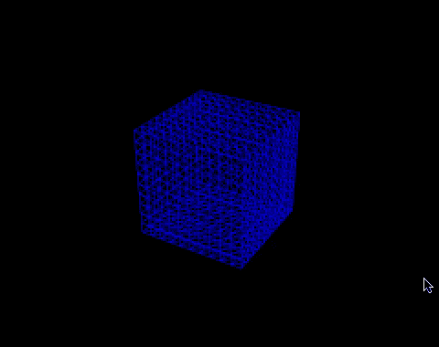

作者图片

# 空心立方体

严格来说，线框立方体是一个空心立方体。但是这里我们指的是`MeshBasicMaterial`带有一个彩色贴图，上面有一些洞(透明像素)，我们可以透过它看到。

我们已经从[https://opengameart.org/node/10505](https://opengameart.org/node/10505)下载了图片，并把它放在了`public/textures`文件夹下。

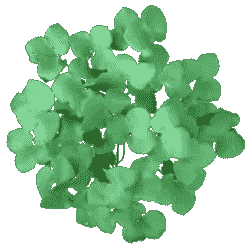

Lauris Kaplinski 制作的 Alnus incana 模型按照[知识共享署名-非商业性-类似共享 4.0 国际许可](http://creativecommons.org/licenses/by-nc-sa/4.0/)获得许可。

这里是`src/App.js`:

*   在第 7 行，为纹理加载图像贴图，设置为`meshBasicMaterial`的`map`道具(第 18 行)。
*   在第 17 行，定义了盒子的大小。与前面的例子相比，不需要分割的面部。
*   在第 18 行，除了颜色贴图，`MeshBasicMaterial`将`alphaTest`设置为`0.5`，这定义了材质的透明度。0 是不透明的(默认)，1 具有最大的透明度。为了看到立方体的内部纹理，材质设置为双面(`THREE.DoubleSide`)。
*   执行`npm start`，我们看到一个空心立方体。


图片由作者提供，纹理 Alnus incana 模型由 [Lauris Kaplinski](http://khayyam.kaplinski.com/2015/01/alnus-incana.html) 根据[知识共享署名-非商业性使用-类似共享 4.0 国际许可](http://creativecommons.org/licenses/by-nc-sa/4.0/)授权。

# 木质纹理立方体

为了显示一些“真实”的纹理，我们需要让彩色贴图看起来像纹理，比如我们从[https://opengameart.org/node/21050](https://opengameart.org/node/21050)下载的木质表面。它放在`public/textures`文件夹下。

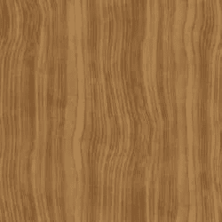

图像是由 [*向日葵*](https://opengameart.org/users/sunflower) 在[https://opengameart.org/node/21050](https://opengameart.org/node/21050)创造的

这里是`src/App.js`:

在第 6 行，为纹理加载图像贴图，设置为`meshBasicMaterial`的`map`道具(第 17 行)。

执行`npm start`，我们看到一个木质纹理立方体。

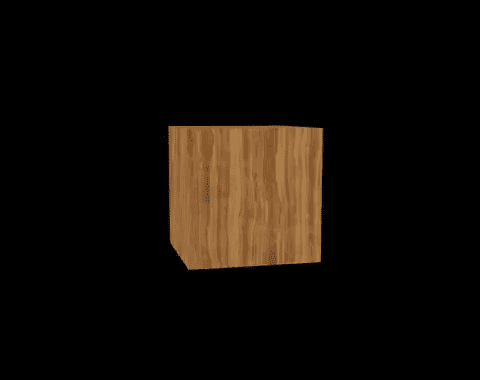

图片由作者制作，纹理图片由 [*向日葵*](https://opengameart.org/users/sunflower) 在[https://opengameart.org/node/21050](https://opengameart.org/node/21050)创建

# 城堡里的立方体

`envMap`定义 3D 对象所处的环境。`THREE.CubeTextureLoader`用于加载六幅图像来构建假想环境。图像按以下顺序指定:`pos-x`、`neg-x`、`pos-y`、`neg-y`、`pos-z`和`neg-z`。

将[瑞典皇家城堡图片](https://github.com/mrdoob/three.js/tree/master/examples/textures/cube/SwedishRoyalCastle)下载到`public/textures`文件夹。

*   侧视图 1 ( `textures/px.jpg`):

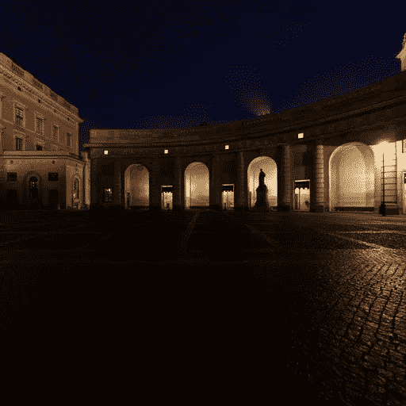

瑞典皇家城堡是埃米尔·佩尔松的作品，又名腐殖质，[http://www . hum um . name](http://www.humus.name)，hum um @ com hem . se

*   侧视图 2 ( `textures/nx.jpg`):

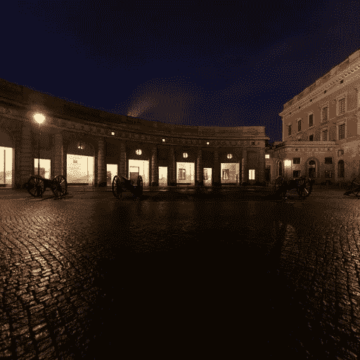

瑞典皇家城堡是埃米尔·佩尔松的作品，又名腐殖质，[http://www . hum um . name](http://www.humus.name)，hum um @ com hem . se

*   俯视图(`textures/py.jpg`):

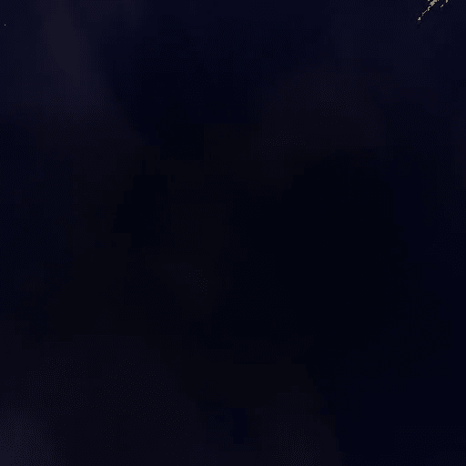

瑞典皇家城堡是埃米尔·佩尔松的作品，又名腐殖质，[http://www . hum um . name](http://www.humus.name)，hum um @ com hem . se

*   仰视(`textures/ny.jpg`):

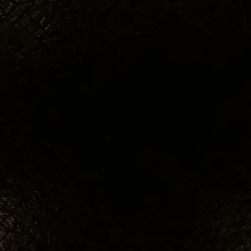

瑞典皇家城堡是埃米尔·佩尔松的作品，又名腐殖质，[http://www . hum um . name](http://www.humus.name)，hum um @ com hem . se

*   侧视图 3 ( `textures/pz.jpg`):

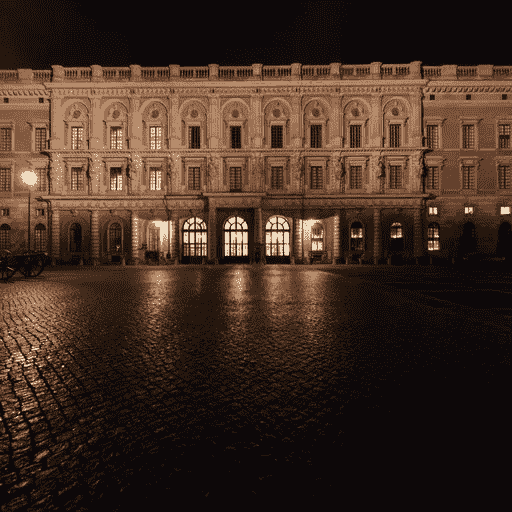

瑞典皇家城堡是埃米尔·佩尔松的作品，又名腐殖质，[http://www . hum um . name](http://www.humus.name)，hum um @ com hem . se

*   侧视图 4 ( `textures/nz.jpg`):

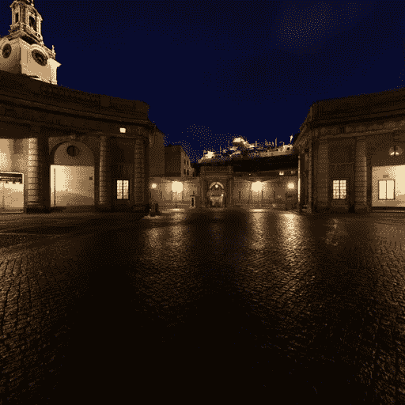

瑞典皇家城堡是埃米尔·佩尔松的作品，又名腐殖质，[http://www . hum um . name](http://www.humus.name)，hum um @ com hem . se

这里是`src/App.js`:

*   在第 7 行，`THREE.CubeTextureLoader`被实例化。
*   在第 8 行，立方体贴图被加载。
*   在第 27 行，摄像机稍微降低到`[0, -0.2, 1]`。
*   在第 33 行，来自`@react-three/drei`的`OrbitControls`被添加到`Canvas`元素中。它以`2.`的速度自动旋转
*   执行`npm start`。旋转的立方体反映了瑞典皇家城堡。

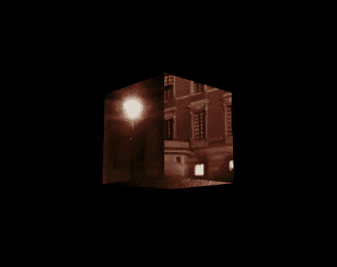

图片作者——瑞典皇家城堡是埃米尔·佩尔松(Emil Persson)的作品，又名腐殖质，[http://www . hum um . name](http://www.humus.name)，hum um @ com hem . se

# 通过夜视镜看东西

在许多动作电影中，我们都曾通过夜视镜观看过绿色的场景。我们可以很容易地模拟效果。

这里是`src/App.js`:

*   在第 19 行，物料将`color`设置为`green`，将`reflectivity`设置为`0.7`。`reflectivity`在 0(无反射)和 1(全反射)之间，默认值为 1。
*   执行`npm start`。我们通过夜视镜看到瑞典皇家城堡的倒影。

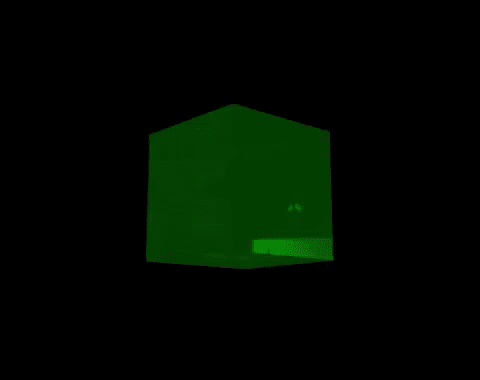

图片作者——瑞典皇家城堡是埃米尔·佩尔松(Emil Persson)的作品，又名腐殖质，[http://www . hum um . name](http://www.humus.name)，hum um @ com hem . se

# 城堡内的球体

我们已经看到了反映瑞典皇家城堡的旋转立方体。事实上，任何东西都可以放入城堡环境中。我们可以放一个球体，而不是盒子。

`sphereBufferGeometry`用于绘制球体，以下是下划线三的定义:

```
SphereGeometry(radius, widthSegments, heightSegments, phiStart, phiLength, thetaStart, thetaLength);
```

*   `radius`:是球体的半径。默认值为 1。
*   `widthSegments`:水平分段数。最小值为 3，默认值为 32。
*   `heightSegments`:垂直段数。最小值为 2，默认值为 16。
*   `phiStart`:指定水平起始角度。默认值为 0。
*   `phiLength`:指定水平扫描角度大小。默认值为`Math.PI * 2`。
*   `thetaStart`:指定垂直起始角度。默认值为 0。
*   `thetaLength:`指定垂直扫描角度大小。默认值为`Math.PI`。

这里是`src/App.js`:

*   在第 18 行，`sphereBufferGeometry`将`radius`设置为`0.2`。
*   执行`npm start`。旋转的球体反映了瑞典皇家城堡。

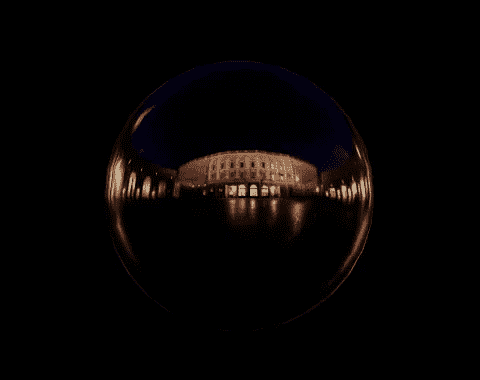

图片作者——瑞典皇家城堡是埃米尔·佩尔松(Emil Persson)的作品，又名腐殖质，[http://www . hum um . name](http://www.humus.name)，hum um @ com hem . se

# **折射的球体**

我们使用了`THREE.CubeTextureLoader`，它有一个属性`mapping`，定义了映射模式。默认映射模式为`THREE.CubeReflectionMapping`。

道具`mapping`，可以定义为`THREE.CubeRefractionMapping`使 3D 物体折射环境。

这里是`src/App.js`:

*   在第 16 行，`mapping`被设置为`THREE.CubeRefractionMapping`。
*   在第 19 行，球体`radius`被设置为`0.5`比之前的例子大。`widthSegments`和`heightSegments`增加到 64 和 32 以显示更平滑的边缘。
*   在第 29 行，`backgroundColor`被设置为`pink`以获得更多的颜色对比度。
*   执行`npm start`。旋转的球体折射出瑞典皇家城堡。

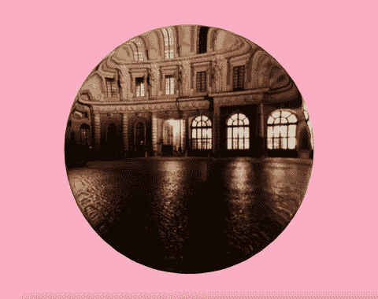

图片作者——瑞典皇家城堡是埃米尔·佩尔松(Emil Persson)的作品，又名腐殖质，[http://www . hum um . name](http://www.humus.name)，hum um @ com hem . se

# 为立方体贴图创建一个图像

我们使用了许多下载的图像。让我们试着创建我们自己的图像，从一个图像开始。

`THREE.CubeTextureLoader`要求每张图片的宽度和高度相等，我们拍一张正方形大小的图片。在`public/textures`文件夹下将其命名为`cloud.jpg`。

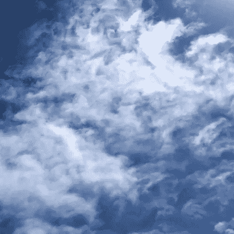

作者图片

这里是`src/App.js`:

*   在第 8 行，立方体贴图加载了云图像。
*   执行`npm start`。云反射看起来不错。

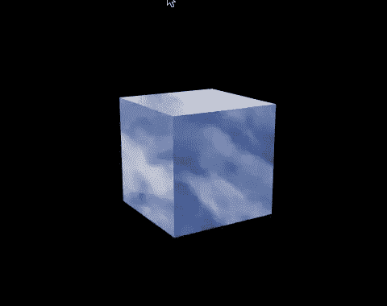

作者图片

# 为立方体贴图创建六个图像

立方体贴图用六张图片怎么样？

如果没有专业工具，这似乎是一项艰巨的任务。

但是，试试也无妨。

看看芥菜田的图像。

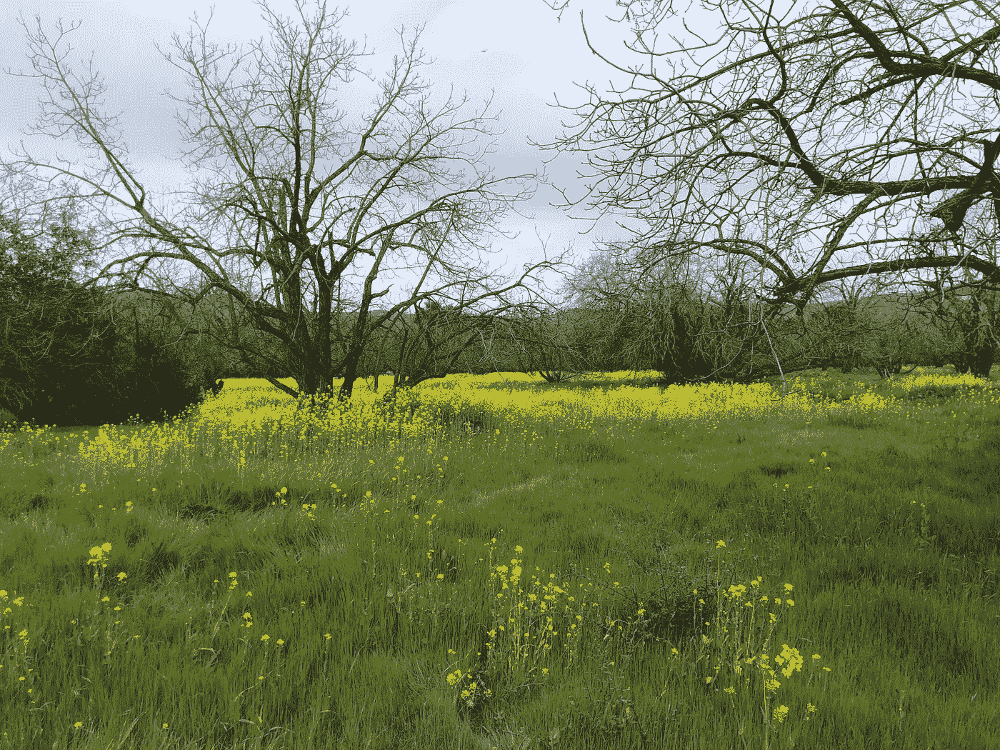

作者图片

我们可以把它分成四个文件，分别命名为`mustard1.jpg`、`mustard2.jpg`、`mustard3.jpg`和`mustard4.jpg`。把它们放在`public/textures`文件夹下。

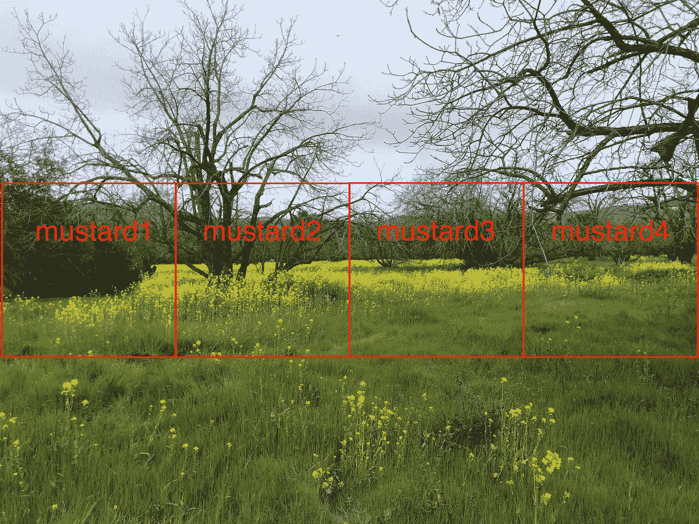

作者图片

可以分别拍摄天空和地面的照片。但是，在本例中不需要它们，因为它们对于球体折射是不可见的。

这里是`src/App.js`:

*   在第 8-13 行，四个芥末图像(`textures/mustard*.jpg`)和两个填充图像(`textures/could.jpg`)按照`pos-x`、`neg-x`、`pos-y`、`neg-y`、`pos-z`和`neg-z`的顺序排列。
*   在第 28 行，背景颜色设置为天蓝色。
*   执行`npm start`。旋转的球体折射出芥子场。


作者图片

你怎么想呢?

在`textures/mustard1.jpg`和`textures/mustard4.jpg`之间有一个不平滑的变化。

我们本应该拍出两端尽可能吻合的原图。你明白了，对吧？

# 抽象的现代艺术

我们把物体渲染成立方体和球体。还有一种形状叫 torus knot，其中是一种特殊的纽结，位于 R3 中一个未打结的 torus 的表面。

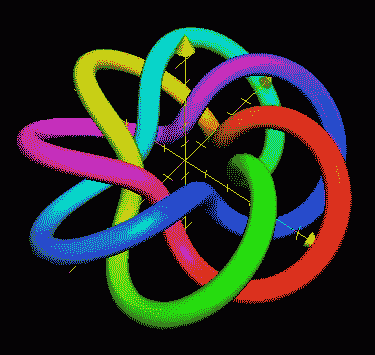

图片来自维基百科——一个由 3 个管状部分和 7 个放射状部分组成的环面结

我们用`sphereBufferGeometry`画一个环面结，下面是下划线三的定义:

```
TorusKnotGeometry(radius: Float, tube: Float, tubularSegments: Integer, radialSegments: Integer, p: Integer, q: Integer);
```

*   `radius`:是圆环体的半径。默认值为 1。
*   `tube`:是管的半径。默认值为 0.4。
*   `tubularSegments`:管段数。默认值为 64。
*   `radialSegments`:径向段数。默认值为 8。
*   `p`:几何图形围绕其旋转对称轴缠绕的次数。默认值为 2。
*   `q`:是几何图形在圆环体内部绕一个圆多少圈。默认值为 3。

这里是`src/App.js`:

*   在第 8 行，立方体贴图加载了云图像。
*   在第 11 行，圆环结的`radius`和`tube`半径被设置为`0.2`。`tubularSegments`和`radialSegments`设置为 5 和 7。
*   在第 12 行，物料将`color`设置为`red`。
*   执行`npm start`。红色旋转环面结反映了云的环境。

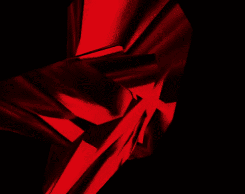

作者图片

由于`tubularSegments`被设置为一个小数值，对象看起来比默认的圆环结更清晰。

更改第 11 行和第 12 行以使用不同的参数。

我们有紫色旋转环面结反映了云的环境。

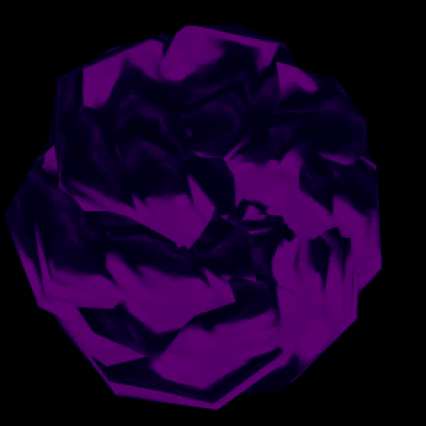

作者图片

抽象的现代艺术使用形状、形式、颜色和线条的视觉语言来创造一种可以在一定程度上独立于世界上的视觉参照物而存在的构图。

有了色彩和意境，three.js 的结局是否类似抽象的现代艺术？

修改可以立即完成。

# 结论

我们已经展示了十个操纵纹理的代码示例，或者直接在表面上，或者通过反射和折射。

Three.js 可以使事物看起来像现实生活中一样真实，也可以使事物像博物馆中展出的抽象现代艺术一样抽象。

在[下一篇文章](https://medium.com/p/36fa514ab6b5)中，我们将在 3D 物体的外部和内部应用纹理，并探索进出 3D 物体的例子。

感谢阅读。我希望这有所帮助。如果你有兴趣，可以看看[我的其他媒体文章](https://jenniferfubook.medium.com/jennifer-fus-web-development-publications-1a887e4454af)。