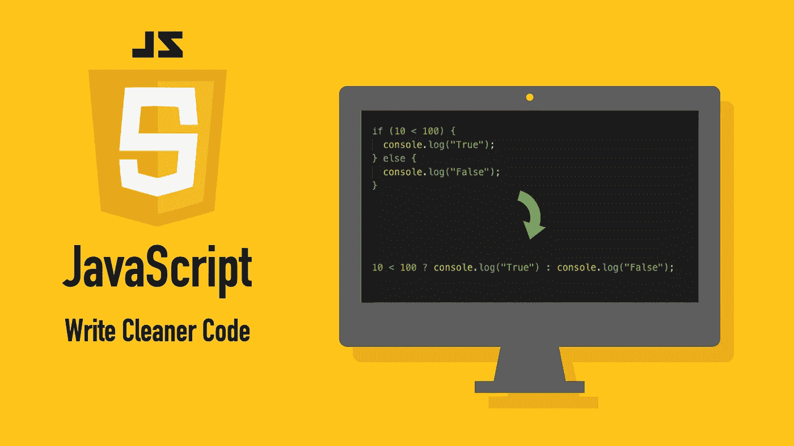

# 10 个 JavaScript 代码片段让代码看起来更整洁

> 原文：<https://betterprogramming.pub/10-javascript-snippets-for-cleaner-looking-code-76f6e2cf6fc4>

## JavaScript 简化使你的代码简洁明了



图片来源:作者

我为所有 JavaScript 程序员收集了一些最酷、最有用的缩写/代码片段。使用这些使你的代码看起来更专业。

# 1.一行 If-Else 语句

你可能熟悉像这样的常规`if-else`语句:

```
**if** (10 < 100) {
  console.log("True");
} **else** {
  console.log("False");
}
```

输出:

```
True
```

但是你知道吗，通过使用所谓的*三元运算符*，你可以用更短更简洁的方式写上面的内容。

```
10 < 100 **?** console.log("True") **:** console.log("False");
```

输出:

```
True
```

通常，三元运算符遵循以下简单模式:

```
condition **?** trueExpression : falseExpression
```

三元运算符也可以链接在一起形成更长的链。然而，这通常会使代码变得相当冗长。明智地使用它们，不要让事情变得更复杂。

# 2.扩展运算符

您可以使用 spread 运算符(`...`)将一个数组中的元素展开到另一个数组中，例如:

```
**const** numbers = [10, 20, 30, 40];**const** allNumbers = [...numbers, 50, 60, 70, 80];console.log(allNumbers);
```

输出:

```
[10, 20, 30, 40, 50, 60, 70, 80]
```

# 3.从数组中删除重复项

```
**const** numbers = [1, 1, 20, 3, 3, 3, 9, 9];
**const** uniqueNumbers = [...**new** Set(numbers)];console.log(uniqueNumbers);
```

输出:

```
[1, 20, 3, 9]
```

# 4.将任何内容转换为布尔值

除了`true`和`false`，JavaScript 将其他类型视为 *truthy* 或 *falsy* 。

*   `0`、`""`、`null`、`undefined`、`NaN`、`false`永远是假的*。*
*   其他一切都是真实的。

因此，在 JavaScript 中，可以用一元运算符(`!`)将任何值转换为`true`和`false`:

```
**const** bool1 = !0;        // true
**const** bool2 = !100;      // false**const** bool3 = !"test";   // false
**const** bool4 = !!"test";  // trueconsole.log(bool1, bool2, bool3, bool4);
```

输出:

```
**true** **false** **false** **true**
```

# 5.交换两个变量而没有第三个变量

```
**let** x = 1;
**let** y = 2;[x, y] = [y, x];console.log(x, y);
```

输出:

```
2 1
```

# 6.将数字转换成字符串

```
**const** num = 1 + "";console.log(**typeof** num);
console.log(num);
```

输出:

```
string
1
```

# 7.将字符串转换为数字

```
**const** numStr = "124";
**const** num = +numStr;console.log(typeof num);
console.log(num);
```

输出:

```
number 
84
```

# 8.类固醇上的弦

通过使用反斜杠(```)将字符串括起来并将变量插入到`${}`之间，将变量整齐地嵌入到字符串之间:

```
**const** age = 41;
**const** sentence = `I'm ${age} years old`;console.log(sentence);
```

输出:

```
I'm *41* years old
```

# 9.将字符串拆分成数组

要将一个字符串拆分成一个数组，可以使用 spread 运算符(`...`):

```
**const** str = "Test"
**const** strAsArr = [...str]console.log(strAsArr)
```

输出:

```
["T", "e", "s", "t"]
```

# 10.可选链接

> “可选链接操作符(`***?.***`)允许读取一个位于连接对象链深处的属性值，而不必明确验证链中的每个引用是否有效。”— [MDN 网络文档](https://developer.mozilla.org/en-US/docs/Web/JavaScript/Reference/Operators/Optional_chaining)

假设你有一个`data`对象，你想安全地访问`data.test.value`。首先，您需要检查:

*   `data`就是定义。
*   `data.test`已定义。

才能调用`data.test.value`因为你明显看不懂`undefined`的属性。

```
**const** data = {test: {value: 1}}**if**(data **&&** data.test){
  console.log(data.test.value);
}
```

输出:

```
1
```

幸运的是，使用一种叫做*可选链接的东西，*你可以简单明了地写出上面的内容:

```
**const** value = data?.test?.value;console.log(value)
```

输出:

```
1
```

现在，您也可以安全地尝试访问一个不存在的属性，而不会出现问题:

```
console.log(data?.this?.does?.not?.exist?.for?.sure)
```

输出:

```
**undefined**
```

# 好处:提高 JSON 的可读性

我相信你以前用过`JSON.stringify()`。不过，有一种方法您可能没有用过，那就是整齐地缩进您的 JSON 数据。

让我们看看你是如何做到这一点的。`JSON.stringify()`方法接受两个可选参数:

*   过滤正在显示的 JSON 的 replacer 函数。在这种情况下，它可以是`null`，因为我们不需要它。
*   一个空格值，可以是所需空格数，也可以是一个字符串。在这种情况下，让我们使用一个制表符(`'\t'`)来缩进 JSON 对象，使它看起来更好:

```
**const** readableJSON = JSON.stringify({ a: 'A', b: 'B' }, null, '\t');console.log(readableJSON);
```

输出:

```
{
      "a": "A",
      "b": "B"
}
```

# 结论

感谢阅读。我希望这些建议对你有用。

编码快乐！

# 进一步阅读

[](https://www.codingem.com/50-buzzwords-of-web-development-and-design-in-2021/) [## 2021 年网络开发和设计的 50 多个流行语

### 学习创业公司使用的网页开发和网页设计语言。这篇文章是关于…的很好的入门读物

www.codingem.com](https://www.codingem.com/50-buzzwords-of-web-development-and-design-in-2021/) 

# 资源

[](https://devdocs.io/javascript/) [## DevDocs

### JavaScript API 文档，包括即时搜索、离线支持、键盘快捷键、移动版本等等。

devdocs.io](https://devdocs.io/javascript/)