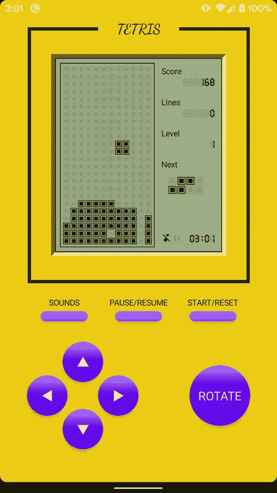
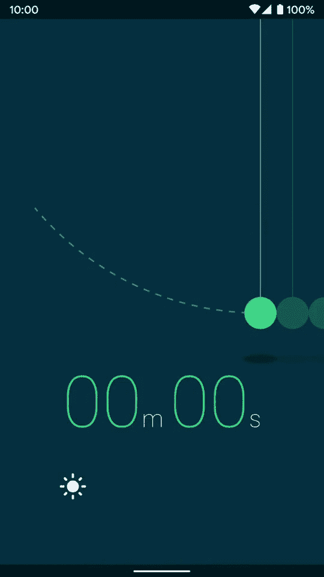
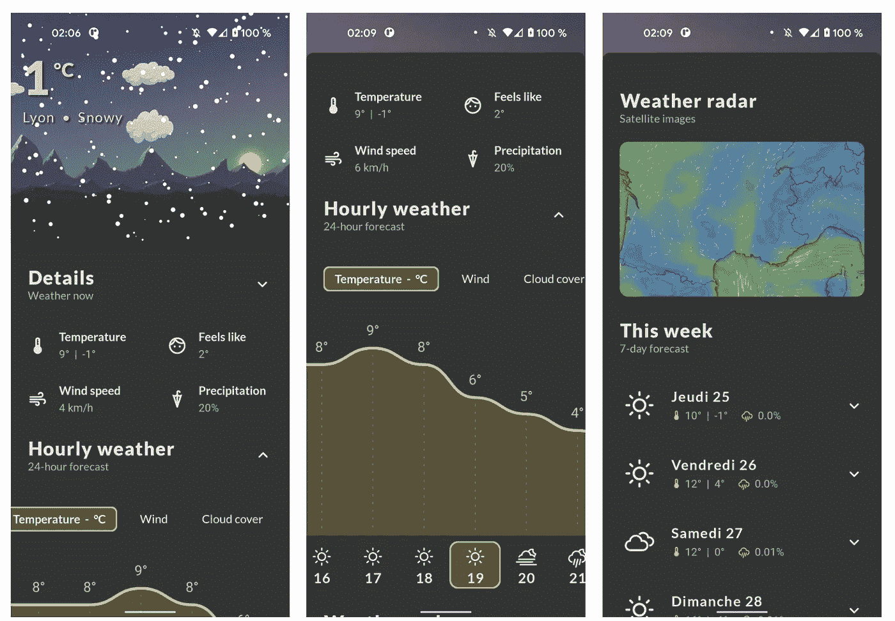
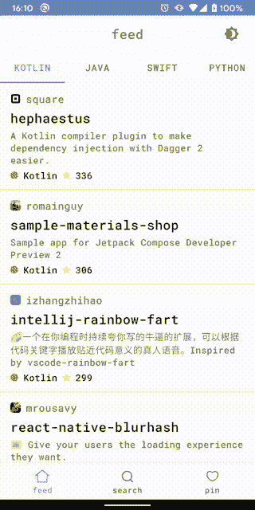

# 激发你灵感的 10 个 Jetpack 组合项目

> 原文：<https://betterprogramming.pub/10-jetpack-compose-projects-to-inspire-you-a04ec01ec881>

## 立即构建一款出色的应用


马文·迈耶在 [Unsplash](https://unsplash.com?utm_source=medium&utm_medium=referral) 上的照片

开源项目是开发者最好的朋友。我相信在文档化之后，开源项目是一个很好的学习资源。Jetpack compose 是该家族的最新成员，也是重要成员之一。今天，我们将看到 Jetpack Compose 的强大功能。

# 1.撰写-样本


也许这是你唯一需要的。因为这是官方的。这个库提供了一个项目集合，可以帮助你学习 Android Compose。每个示例展示了不同的用例、复杂程度和 API。

[](https://github.com/android/compose-samples) [## GitHub - android/compose-samples:官方 Jetpack Compose 示例。

### 这个资源库包含一组独立的 Android Studio 项目，帮助您了解 Android 中的 Compose。每个…

github.com](https://github.com/android/compose-samples) 

# 2.撰写-俄罗斯方块



俄罗斯方块对我来说是一款怀旧游戏——也许对你也是。这个项目几乎所有的 UI 组件都是代码生成的，包括 app 图标，也是 Composable 使用 Preview 生成的。如果你对 MVI 建筑感兴趣，这个项目可能是一个很好的资源。

[](https://github.com/vitaviva/compose-tetris) [## github-vita viva/compose-俄罗斯方块:🧱一款完全使用 Jetpack Compose 构建的俄罗斯方块游戏

### 🧱一款完全使用 Jetpack 构建的俄罗斯方块游戏

github.com](https://github.com/vitaviva/compose-tetris) 

# 3.电影狂热


这是我的最爱。因为这个是我做的。这是一个极简的 Android 应用程序，使用干净的架构和 Jetpack 组件构建(Jetpack Compose，MVVM，Paging 3.0，HILT，ROOM DB，Retrofit，等等)。它是为了跟随最新的 Android 发展趋势而设计的。此应用程序将进一步更新，以适应最新的发展趋势。

[](https://github.com/Farhandroid/AndroidCleanArchitecture) [## github-farhandroid/androidcleanarchitecture:这是一个由洛夫❤️和…

### 一个极简的 Android 应用程序，使用干净的架构和 Jetpack 组件(Jetpack Compose，MVVM，分页…

github.com](https://github.com/Farhandroid/AndroidCleanArchitecture) 

# 4.牛顿计时器



这个项目很有趣。这样做的目的是做一些基本而有趣的东西来展示 Jetpack Compose 的潜力。这个项目是一个一分钟计时器，试图重现牛顿的摇篮。

[](https://github.com/MaciejCiemiega/NewtonsTimer) [## GitHub-MaciejCiemiega/Newton timer

### 简单的计时器应用程序，灵感来自牛顿的摇篮。在 Jetpack Compose 中为#AndroidDevChallenge 创建。目标是…

github.com](https://github.com/MaciejCiemiega/NewtonsTimer) 

# 5.比特币市场


热爱加密货币的人肯定喜欢比特币。这个示例应用程序向您显示当前的比特币市场价格和不同时间间隔的价格图表。这个应用程序使用的顶级技术栈是刀柄，翻新，Moshi，MPAndroidChart，Truth，Mockk 等。

[](https://github.com/mertceyhan/bitcoin-market-android) [## GitHub-mertceyhan/比特币-市场-安卓:比特币市场 app 向你展示当前的比特币市场…

### 比特币市场 app 向您展示当前比特币市场价格以及不同时间区间的价格走势图💰- GitHub …

github.com](https://github.com/mertceyhan/bitcoin-market-android) 

# 6.常春藤钱包


预算管理是财务自由的一个重要方面。这个项目是免费的预算管理和支出跟踪程序，让它简单地跟踪你的个人财务状况。该应用程序为您提供了一个直观、简单的用户界面(UI ),能够在移动中跟踪成本。你也可以从 PlayStore 下载这个应用。

[](https://github.com/ILIYANGERMANOV/ivy-wallet) [## GitHub-ILIYANGERMANOV/Ivy-Wallet:Ivy Wallet 是一款开源的 android 资金管理应用程序，它…

### Ivy Wallet 是一款面向 android 的开源资金管理器应用程序，您可以构建或从 Google Play 下载。…

github.com](https://github.com/ILIYANGERMANOV/ivy-wallet) 

# 7.流量



这是另一个有趣的项目。Flux 是一种动态天气类型，它在整个景观中传输天气，不同的细节取决于当时的时间和天气。这种动态景观遵循日/夜周期，包括根据一天中的时间(夜晚、日出、白天和日落)而变化的各种图层。

[](https://github.com/fidloo/flux) [## GitHub-FID loo/flux:# AndroidDevChallenge

### 通量是一种动态的天气，它传达了整个景观的天气，其细节随时间而变化…

github.com](https://github.com/fidloo/flux) 

# 8.播客应用程序


这个应用程序是用 Jetpack Compose 和 ExoPlayer 制作的。 [Listen Notes API](https://www.listennotes.com/) 用于播客信息。这个应用程序使用的其他顶级技术栈是 Hilt、改进导航、视图模型、数据存储、调色板 API 等。目前，它拥有 206 颗恒星。

[](https://github.com/fabirt/podcast-app) [## GitHub - fabirt/podcast-app:播客应用

### 用 Jetpack Compose 和 ExoPlayer 制作的 Android 播客应用程序。由 Listen Notes API 提供的播客信息。喷气背包…

github.com](https://github.com/fabirt/podcast-app) 

# 9.JetHub



这是一个利用 GitHub API 和 Jetpack 组件的演示应用程序。这个项目的目标是实验新的 Android 技术，看看它们如何在现实世界的应用程序中运行。您还可以从这个项目中了解多模块/动态功能模块和 MVVM。

[](https://github.com/TakuSemba/JetHub) [## GitHub - TakuSemba/JetHub:带有 Jetpack 组件(LiveData，Navigation，ViewModel) +…

### JetHub 是一个使用 Github API 和 Jetpack 组件的示例应用程序。这个项目的目的是尝试新的 Android…

github.com](https://github.com/TakuSemba/JetHub) 

# 10.JetInstagram


相信从名字上你已经明白了，这是用 jetpack compose 制作的 Instagram 的克隆版。虽然这个项目正在开发中，但它已经获得了 509 颗星星。

[](https://github.com/vipulasri/JetInstagram) [## GitHub-vipulasri/jet insta gram:jet insta gram 是一个用 Jetpack 构建的 Instagram UI 克隆应用…

### JetInstagram 是用 Jetpack Compose 构建的 Instagram UI 克隆应用。-GitHub-vipulasri/jet insta gram:jet insta gram…

github.com](https://github.com/vipulasri/JetInstagram) 

今天到此为止。谢谢你坚持到最后。相信这些项目会帮助你学到很多新的东西。如果你知道任何其他漂亮的开源项目，请在评论中分享。直到我们再次见面…干杯！

```
**Want to Connect?**If you want to, you can connect with me on [Twitter](https://twitter.com/FarhanT99598254)
```