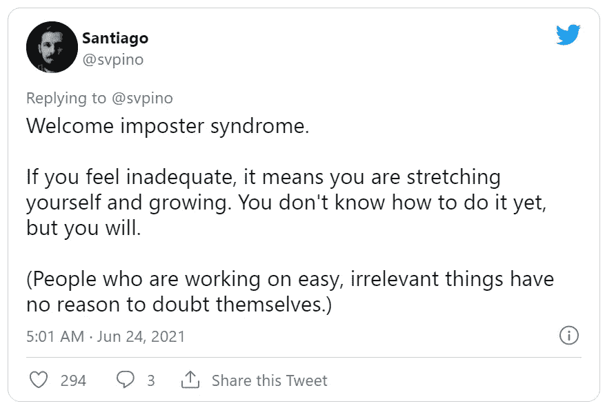

# 帮助你在开发职业中脱颖而出的 10 堂课

> 原文：<https://betterprogramming.pub/10-lessons-to-help-you-excel-in-your-developer-career-a69d2c31a0cc>

## 如何为自己在工程领域的可持续职业生涯做准备——到目前为止，这些课程对我很有帮助

托德·夸肯布什在 [Unsplash](https://unsplash.com?utm_source=medium&utm_medium=referral) 上的照片

2020 年 7 月 15 日，我在[庆祝了我作为一名受雇前端开发人员](https://twitter.com/anniebombanie_/status/1283387495300947968)的一周年纪念日。回想来到这里的漫长过程，我学到了一些我觉得应该记住的重要事情。我在开发者学生俱乐部 GITA 的一次演讲中谈到了这些，我最终将它们写在一篇文章中留给后人！

# 一些背景和背景

我的名字叫 Annie，我主要是从设计和教学背景过渡到 web 开发的。我在这里展示的信息和见解是我在快节奏的机构环境中的经验，在那里我参与了多个项目。

从 2019 年 7 月 15 日到 2020 年 9 月 25 日，我参与了 23 个不同的项目，包括从零开始设计几个网站的整个前端。我现在是 SaaS(软件即服务)初创公司的第二个角色，但我在这里写的经验是基于我在 web 开发训练营和这个代理环境中的具体经历，以及在此期间与其他开发人员的交谈。

事不宜迟，让我们开始吧。

# 十个重要的教训

## 1.你不需要记住所有的事情

当我刚开始学习 JavaScript 时，说它很有压力是一种保守的说法。出于某种原因，我脑海中有了这样的想法，在看过一个函数或方法几次之后，我应该会自动地*知道*它。我不知道我是从哪里得到这个想法的，令我沮丧的是，我如此努力地去理解事物，更不用说记忆它们了。

我后来意识到，我不是一部百科全书。我不需要把各种 JavaScript 函数和方法都记在脑子里。

作为开发人员，我们的工作是解决问题，并了解我们可以使用的工具。这就是为什么我们有文档，堆栈溢出，和谷歌。即使我知道如何使用 flexbox，我还是会时不时地搜索所需的精确语法。利用互联网多年的科学和创新并从中吸取经验并不可耻。

许多有经验的开发者告诉我，他们仍然用谷歌搜索东西。不同之处在于，他们更擅长知道要搜索什么。

这就引出了我的下一课:

## 2.把斗争和失败正常化，作为过程的一部分

学习很难。斗争和失败是这个过程的固有部分。你在某方面并不差，你只是新手。你需要练习。学习和成长发生在你把自己推出舒适区，让自己接触新思想的时候。

在你的舒适区，你对你已经知道的事情很安全。但是“安全”也可能意味着“T2”、“T4”和“过去”。我认为，在处理困难的事情时，那种挣扎的感觉就像你的大脑实际上形成了新的突触连接。

Gif:“老兄，吮吸某物是走向擅长某事的第一步。”

我还记得我第一次参加那个臭名昭著的[泡泡挑战](http://www.compciv.org/guides/python/fundamentals/fizzbuzz-challenge/)。

这可能是我在训练营学习 JavaScript 的第一天或第二天。那天事情开始得很好。但是在某些时候，有太多的新信息呈现出来，以至于我的大脑再也无法接受。当我们必须和一个伙伴一起做练习时，我不明白“剩余”是什么意思。

不幸的是，我的搭档并没有用一种对我来说有意义的方式解释它。所以我只是坐在那里，感觉越来越笨，以为除了我，其他人都明白一切。老实说，我当时慌了。我不得不离开去洗手间，因为我太累了。

是的，我可以毫不夸张地告诉你，JavaScript 确实让我哭过。

几个月后，当我再次回顾基本面时。我设法在五分钟内完成了 FizzBuzz，感觉很容易。(后来我也发现，我并不是班上唯一一个苦苦熬过这一课的人。)

斗争重新连接了你的大脑。所以在困难的时候不要放弃。失败是暂时的，除非你把它变成永久的。失败是你的**F**first**A**t empt**I**n**L**收入(也可能是你的第二、第三、第十……没关系)。

当我挣扎的时候，我喜欢用的一个小技巧是在我内心疑虑的末尾加上“还”这个词。

编程是一种语言，就像学习法语、日语或西班牙语一样，语言的流利来自于不断的使用和重复。这份苦差事可能很辛苦，但为了那些“我明白了”的感觉，坚持下去是值得的。

利用这些有回报的时刻让你继续前进。

## 3.学习行业最佳实践，尽可能避免 hustle 代码

关于学习的话题，我真的提倡努力实现行业最佳实践。您可能必须编写大量糟糕的代码才能成为好代码，但是最佳实践的存在是有原因的——具有一致的模式，如命名约定，可以使更多的代码更具可读性，并帮助其他开发人员。例如，一般当我看到一个函数以“是”、“能”、“将”等开头时。，我通常期望一个布尔值。如`isLoggedIn = true`。或者`canEditDocument = false`。

根据您所做工作的具体情况，可能有许多不同的最佳实践。探索它们，选择最能引起你共鸣的，但也要对你工作场所使用的东西持开放态度。最佳实践有助于保持您的代码更整洁、可读性更好，并减少那些试图阅读您的代码的人的认知压力。

除了最佳实践之外，还有尽可能避免*【拥挤代码】*的想法。

在一家小而快节奏的机构工作，事情总是需要在三周前完成。修复由匆忙、混乱的代码导致的错误会给公司和客户造成经济损失，也会耗费你的时间。

当我建立我的第一个完整的网站时，那是我工作的第五周。我是整个美国大型出版电子商务网站的唯一前端开发人员，我必须从头开始设计和构建这个网站——我只有三次冲刺来完成它。

也就是说，我必须在大约六周半的时间内建立网站。

但是即使有非常紧迫的期限，我也知道糟糕代码的代价。我在开始的时候花了很多时间认真思考如何构建网站、组织目录、合理命名类别……所有这些小事情最终都会累积起来。

我很自豪地说，这个项目，已经转移到每月支持包，在我在那里的时候，很少有任何前端相关的错误。我后来为这位客户做的大部分工作都涉及到构建新功能或微型网站。

我一开始的计划节省了大量的时间和成本。

**如果你很早就养成了坏习惯，那就很难改掉和打破它们。**一开始就培养好习惯并让你已经建立的动力帮助你继续保持好习惯会更容易。

## 4.通过教导和指导他人来分享你的学习成果

研究一次又一次地发现，当你教别人的时候，你必须更加努力地处理和理解材料，更准确地回忆，更有效地应用。

公开分享你学到的东西并指导他人也有助于你在工作中树立权威。尽管我有时觉得我在网上分享的东西是“初级的”，但有人告诉我，我看起来更有经验。这样做也给我带来了很多机会。

有很多方法可以与他人分享你的学习成果——写文章、发表演讲，以及在你选择的平台上创作内容。如果你喜欢少面对公众，像自愿指导那些经验比你少的人、[与其他开发人员结对编程](https://twitter.com/anniebombanie_/status/1302356165288960003?s=20)或者仅仅是帮助你的朋友修复 bug 都是有帮助的。

对其他人的代码进行故障排除会让你接触到不同的做事方式，并拓宽你的整体知识。理解一些东西和能够用技术交流是有区别的，所以教学是帮助你适应这一点的好方法。

**结束这一节，这里有一个我很喜欢思考的想法:**
如果你帮助某人学习和应用新知识，他们会让互联网看起来更好，运行更顺畅，表现更好，更容易访问。他们在为一个更好的网络做贡献。世界因此变得更加美好。你赢了，他们赢了，世界赢了。

## 5.要成为一名优秀的开发人员，你不需要充满激情，每个周末都写代码

流行文化中有一个神话，你必须对你的工作“充满激情”才能得到满足。这个我不太认同，尤其是刚开始的时候。一旦你不再认为你必须充满激情才能开始某件事，那么*开始*就更容易了。我发现，在追求做好你的工作，并最终可能爱上你的工作的过程中，好奇心是一个更有帮助的盟友。

激情就像一团巨大的无所不包的火:你要么拥有它，要么没有。但是，好奇心很小。它是在你跳之前把你的脚趾浸入水中。只是*尝试一个东西*。风险感觉更少，更细致入微。

补充一点，我相信激情可以通过经验和提高你的技能来培养。我现在对 web 开发的热情肯定比开始时高得多。

我采用这种*尝试*的方法来写代码，这样我就不会感到压力，马上就要*正确*。有时候，我的前同事会问:“你认为这会有用吗？”我会说，“我不知道。我们试试？我们总能控制-Z。”

为了做好你的工作，你需要投入时间。但是脑外科医生不做手术，律师休息日也不上法庭。除非你愿意，否则你的工作不必成为你的爱好。为什么有时候，作为开发人员，我们觉得我们的周末必须持续地花在学习和兼职上？

喧嚣文化对你的健康有害。有大量证据表明，它与倦怠、睡眠问题，甚至因过度工作而死亡有关。人们需要休息。休息可以提高你的创造力，让你的大脑有时间在你所学的东西之间建立重要的神经联系。

你有没有注意到，你的一些最好的想法经常是在淋浴或深夜产生的？*你*可能没有工作，但你的大脑仍在后台工作，休息就像一个开关，让这一切发生。

我热爱我的工作，但我不是每天都做。我不需要在生命的最后想，“是的，我有一个坚实的绿色 GitHub 贡献图！我现在可以幸福地死去了。”不，没有这些，你的职业生涯也能蒸蒸日上，而且我认识的最优秀的全面发展的开发人员通常没有坚实的绿色图表。

## 6.为自己辩护，在职业生涯中积极主动

这里有一个严酷的事实:**没有人会像你一样投入自己的事业。**

不让别人知道你，没人找你就别抱怨。如果你不把自己放在那里，分享你的工作，有一个作品集，或者和别人交谈，你怎么期望人们找到你，知道你做的了不起的工作？

也许作为一名科技界女性和有色人种，我发现很难“提升”或“维护”自己。先前存在的偏见依然存在，行业正在努力平衡竞争环境。如果我没有发言权，那么我就没有做任何事情来支持这些努力。自我推销很尴尬，但我会尽可能用对我来说有意义的最真实的方式来做，同时在我的脑海中保留更大的画面。我相信你也会找到自己的路。

如果很难为自己辩护，想想你会如何鼓励朋友，并遵循自己的建议。我曾经参加过的一次聚会上，有人分享了这个伟大的想法:

> 把你所有的成就和成就列成一个清单。每周五，留出一些时间来反思你已经取得的成就，并把它们写下来。到了要求加薪的时候，你会有一个坚实的证据库来支持你的价值。”

值得注意的是，积极主动本质上并不一定要与推进你的职业发展联系在一起——它可以是改善你所处的环境以造福他人。

在我的公司，我们没有办公室小吃，所以我从我的训练营校友网络中研究了小吃预算，并向首席执行官介绍了成本和收益。这是一个简单的是，然后我负责购买每月零食。这太棒了，因为我收到了每个人的订单，这也意味着我可以买到健康的东西，如紫菜、椰子汁、蔬菜片和 90%的黑巧克力！！

## 7.拿自己和别人比较是正常的

我们经常听到这样的建议，“不要拿自己和别人比较！”虽然这是真实的，也是善意的，但我们无法控制自己的本能反应，我们也不应该否认它们。

恐惧、嫉妒和愤怒都是人类天生的反应，旨在让我们活着，并努力变得更好。重要的是我们接下来要做什么。我们可以选择用它们来增强或削弱我们自己。

当你看到某人的工作并感到嫉妒时，承认这种感觉是自然的。因为我们感到缺乏，所以我们感到嫉妒。尽管缺乏，如果我们仍然能够真诚地赞美他人的成就，消极情绪就会消失。久而久之，就越来越容易做到了！

生理上，恐惧和兴奋是一样的。这两种情绪都会引起相同的心率加快、出汗等。，但一个是负的，一个是正的。我有时认为嫉妒和灵感是同一枚硬币的两面。如果你能改变拿自己和别人比较的感觉，让你觉得自己也能有所成就，这比感到渺小和沮丧要好得多。

把现在的自己和过去的自己比一比，生活就轻松多了；而不是你开始走别人的路。其他人可能也有不同的特权和环境，而你却没有。你可以承认这一点，然后想，“好吧，六个月前，我知道什么，我在哪里？好吧，我现在在哪里？我学到了什么？就我的技能、我的人际网络、我的财务和我内心的平静而言，我在哪里？”

如果有时事情似乎在倒退，那也没关系。生活不是一条直线，这个过程的一部分是学会适应低谷。

为了结束这一节，我们不要忘记我们的老朋友:冒名顶替综合症。

当我们看到其他人在做伟大的工作时，很容易想象每个人都比你好。我在工作的前 3-4 个月感觉别人在通过我的手指做工作，我会被“发现”并被解雇。这是最奇怪的灵魂出窍的感觉。

但是，你知道吗？即使是资深开发者也有同样的挣扎。记住，当你把自己和别人比较时，你只看到了他们所展示的工作的表面。实际上，我们都想一起解决这个问题。实际上，冒名顶替综合症是我们成长的一个症状。

## 8.将你的价值感从工作中分离出来

不要感情用事；往往只是生意。能够要求并接受建设性的反馈对你做得更好非常有益。

从我多年的艺术和设计学校教育中获得的最有价值的技能之一是学习如何给予、寻求和接受建设性的反馈。一次又一次，我们做的所有工作都是为了获得反馈。通过这个过程，我们的手艺越来越好。

认识到对你工作的批评不是对你个人的批评。

在我的第一次开发者回顾中，我收到的一个反馈是我没有充分使用 inspector 进行调试。一开始，我很烦；我一直都在用！但后来我想了想，想知道“其实我怎么用才更好呢？嗯……我也可以用它来做 X，Y 和 Z！”采纳这些反馈让我在工作中做得更好。

反馈是给未来自己的礼物。

## 9.理解你试图解决的问题的更大的原因

我们(希望)不是被雇佣来发布代码的。企业有更大的目标和需求，如果你能把自己放在理解它们的位置上，你会变得更有价值。缩小到你试图完成的工作单之外，想想你在这里试图解决什么问题，为什么需要解决它。用户的痛点是什么？

对我个人来说，我的工作也变得更有意义，不仅仅是改变组件的颜色或修复 UI 错误。

> “成功不是交付一个功能；成功就是学习如何解决客户的问题。”—柯达产品与工程副总裁马克·库克

有时候客户并不确定他们想要什么，所以问一些问题来更深入地了解他们真正想要达到的目标总是非常有用的。

举个例子，我曾经得到一张票，客户想要一个新的大按钮在页面的正上方。经过询问，他们发现他们真的只是想要一种简单的方法让客户访问预订系统。利用这些知识，我们能够为他们提供一个稍微好一点的解决方案。

## 10.交流、联系和社区是成长的关键

软技能很重要。我们不存在于为自己设计和建造的真空中。我们和团队中的其他人一起工作，为客户工作。

沟通过度总比沟通不足好。当你陷入困境，花了大量时间试图解决问题时，不要犹豫，寻求帮助，并交流你的尝试。从商业角度来看，你的老板更希望你早点寻求帮助，而不是坐在那里纠结半天。你在浪费他们的钱。

**你的关系和社区很重要。**

众所周知，人们经常通过他们认识的人找到工作。我一次又一次地听说开发人员跳过面试过程的某些部分，仅仅是因为他们知道有人可以为他们担保，并为他们说好话。随着你职业生涯的进展，这是一种非常真实可行的找工作方式。

我训练营的运营和财务总监曾经告诉我一件我永远不会忘记的事情:

> “我见过的最成功的开发者都围绕自己建立了一个社区和支持系统。”

拥有这些意味着他们可以在需要的时候向人寻求建议。对你的职业生涯来说，你能做的最好的事情之一就是参与进来，成为一个与你有着相同目标的更大的社区的一部分:那些鼓舞你、支持你、理解你的奋斗的人，所以你并不孤独。

我选择训练营而不是自学的很大一部分原因是因为它所带来的社区和网络。我通过一个叫做“工业日”的活动找到了我的第一份工作，在这个活动中，我们学校邀请潜在的公司和招聘伙伴来见我们，参观我们的工作。我之前工作的机构没有招聘广告。否则，作为一名开发人员，我永远也不会第一次涉足技术领域。

如果你正在做类似的事情而没有利用这一点，你就失去了一个巨大的好处。

# 包扎

好了，现在你知道了——帮助我走到现在这一步的十条经验。它们通常说起来容易做起来难，我不得不定期提醒自己，但我希望它们对你前进和思考职业生涯有所帮助。

感觉社交？可以在 Twitter 上找到我，在那里我积极地分享资源、技巧和我的编码之旅！