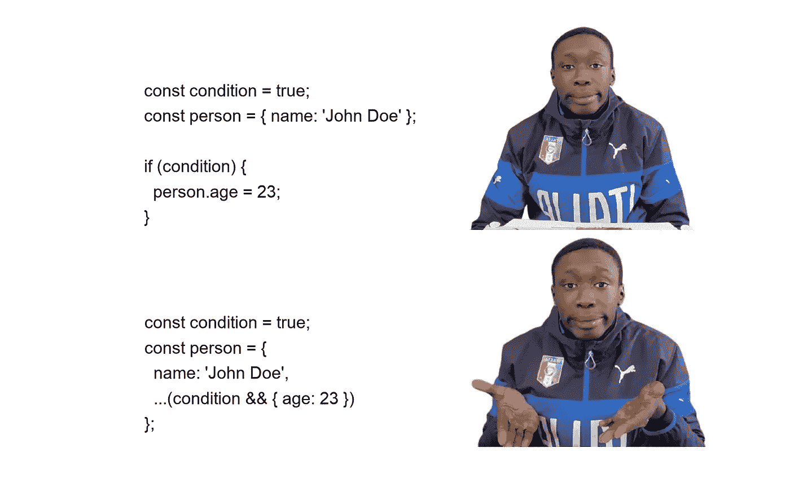

# 每个开发人员都应该使用的 10 个现代 JavaScript 技巧

> 原文：<https://betterprogramming.pub/10-modern-javascript-tricks-every-developer-should-use-377857311d79>

## 编写简短、简洁、干净的 JavaScript 代码的技巧



你一定见过上图中的那个人[。他简化了日常事务——这正是我们在本文中要用 JavaScript 做的事情。](https://www.instagram.com/khaby00/?hl=en)

JavaScript 有很多初级和中级开发人员不知道的很酷的特性。我挑选了 10 个我在日常 JavaScript 项目中使用的技巧。

# 1.有条件地向对象添加属性

我们可以使用 spread 操作符`...`，有条件地快速向 JavaScript 对象添加属性。

```
const condition = true;const person = {
  id: 1,
  name: 'John Doe',
  ...(condition && { age: 16 }),
};
```

如果每个操作数的计算结果都是`true`，那么`&&`操作符将返回最后一个计算的表达式。所以一个对象`{ age: 16 }`被返回，然后被扩展为`person`对象的一部分。

如果`condtion`是`false`，那么 JavaScript 会这样做:

```
const person = {
  id: 1,
  name: 'John Doe',
  ...(false), // evaluates to false
};// spreading false has no effect on the object
console.log(person); // { id: 1, name: 'John Doe' }
```

# 2.检查对象中是否存在属性

你知道我们可以使用`in`关键字来检查 JavaScript 对象中是否存在一个属性吗？

```
const person = { name: 'John Doe', salary: 1000 };console.log('salary' in person); // returns true
console.log('age' in person); // returns false
```

# 3.对象中的动态属性名

用动态键设置对象属性很简单。只需使用`['key_name']`符号来添加属性:

```
const dynamic = 'flavour';var item = {
  name: 'Biscuit',
  [dynamic]: 'Chocolate'
}console.log(item); // { name: 'Biscuit', flavour: 'Chocolate' }
```

同样的技巧也可以用来引用带有动态键的对象属性:

```
const keyName = 'name';console.log(item[keyName]); // returns 'Biscuit'
```

# 4.用动态键析构对象

所以你知道你可以析构一个变量，然后马上用`:`符号重命名它。但是你知道吗，当你不知道键名或者键名是动态的时候，你也可以析构一个对象的属性。

首先，让我们看看如何在析构时重命名变量(用别名析构)。

```
const person = { id: 1, name: 'John Doe' };const { name: personName } = person;console.log(personName); // returns 'John Doe'
```

现在，让我们用一个动态键来析构属性:

```
const templates = {
  'hello': 'Hello there',
  'bye': 'Good bye'
};const templateName = 'bye';const { [templateName]: template } = templates;console.log(template) // returns 'Good bye'
```

# 5.无效合并，`??`运算符

当您想要检查变量是`null`还是`undefined`时，`??`操作符非常有用。当左侧操作数为`null`或`undefined`时，返回右侧操作数，否则返回左侧操作数。

```
const foo = null ?? 'Hello';
console.log(foo); // returns 'Hello'const bar = 'Not null' ?? 'Hello';
console.log(bar); // returns 'Not null'const baz = 0 ?? 'Hello';
console.log(baz); // returns 0
```

在第三个例子中，`0`被返回，因为即使`0`在 JavaScript 中被认为是 falsy，它也不是`null`或`undefined`。你可能认为我们可以在这里使用`||`操作符，但是这两者是有区别的:

```
const cannotBeZero = 0 || 5;
console.log(cannotBeZero); // returns 5const canBeZero = 0 ?? 5;
console.log(canBeZero); // returns 0
```

# 6.可选链接(`?.`)

你是不是也很讨厌`TypeError: Cannot read property ‘foo’ of null` *这样的错误。对于每一个 JavaSript 开发者来说，这都是一件令人头疼的事情。引入可选链接就是为了解决这个问题。让我们来看看:*

```
const book = { id:1, title: 'Title', author: null };// normally, you would do this
console.log(book.author.age) // throws error
console.log(book.author && book.author.age); // returns null (no error)// with optional chaining
console.log(book.author?.age); // returns undefined// or deep optional chaining
console.log(book.author?.address?.city); // returns undefined
```

您还可以对函数使用可选链接，如下所示:

```
const person = {
  firstName: 'Haseeb',
  lastName: 'Anwar',
  printName: function () {
    return `${this.firstName} ${this.lastName}`;
  },
};console.log(person.printName()); // returns 'Haseeb Anwar'
console.log(persone.doesNotExist?.()); // returns undefined
```

# 7.使用`!!`运算符的布尔转换

`!!`运算符可用于将表达式的结果快速转换为布尔运算`true`或`false`。方法如下:

```
const greeting = 'Hello there!';
console.log(!!greeting) // returns trueconst noGreeting = '';
console.log(!!noGreeting); // returns false
```

# 8.字符串和整数转换

使用`+`运算符快速将字符串转换为数字，如下所示:

```
const stringNumer = '123';console.log(+stringNumer); // returns integer 123
console.log(typeof +stringNumer); // returns 'number'
```

要快速将数字转换为字符串，请使用`+`运算符，后跟一个空字符串`""`:

```
const myString = 25 + '';console.log(myString); // returns '25'
console.log(typeof myString); // returns 'string'
```

这些类型转换非常方便，但是它们不够清晰，代码可读性差。因此，在生产中使用它们之前，您可能需要考虑一下。但是，不要犹豫在 code golf 中使用它们。

# 9.检查数组中的错误值

您必须熟悉`filter`、`some`和`every`数组方法。但是你也应该知道你可以用`Boolean`方法来测试真值:

```
const myArray = [null, false, 'Hello', undefined, 0];*// filter falsy values*
const filtered = myArray.filter(Boolean);
console.log(filtered); // returns ['Hello']*// check if at least one value is truthy*
const anyTruthy = myArray.some(Boolean);
console.log(anyTruthy); // returns true*// check if all values are truthy*
const allTruthy = myArray.every(Boolean);
console.log(allTruthy); // returns false
```

它是这样工作的。因为我们知道这些数组方法采用回调函数，所以我们将`Boolean`作为回调函数传递。Boolean 本身接受一个参数，并根据参数的真实性返回`true`或`false`。所以我们可以这样说:

```
myArray.filter(val => Boolean(val));
```

和这个是一样的:

```
myArray.filter(Boolean);
```

# 10.展平数组的数组

原型`Array`上有一个方法`flat`，可以让你从数组的数组中生成一个数组:

```
const myArray = [{ id: 1 }, [{ id: 2 }], [{ id: 3 }]];const flattedArray = myArray.flat(); 
// returns [ { id: 1 }, { id: 2 }, { id: 3 } ]
```

还可以定义深度级别，指定嵌套数组结构应展平的深度。例如:

```
const arr = [0, 1, 2, [[[3, 4]]]];console.log(arr.flat(2)); // returns [0, 1, 2, [3,4]]
```

感谢阅读到最后。我希望这些技巧对你有用。为了我和其他人，请随意在评论中添加任何你自己的 JavaScript 技巧！

# 更多 5 个惊人的 JavaScript 技巧

[](/5-cool-modern-javascript-features-most-developers-dont-know-6baf19b532da) [## 大多数开发人员不知道的 5 个很酷的现代 JavaScript 特性

### 用 JavaScript 写得更少，做得更多

better 编程. pub](/5-cool-modern-javascript-features-most-developers-dont-know-6baf19b532da) 

# 多看我的文章

[](https://haseeb-anwar.medium.com/react-router-6-features-upgradation-guide-886b9bc2fb71) [## React 路由器 6 功能和升级指南

### 迄今为止最强大的 React 客户端路由器

haseeb-anwar.medium.com](https://haseeb-anwar.medium.com/react-router-6-features-upgradation-guide-886b9bc2fb71) [](/the-complete-guide-to-oauth-2-0-and-openid-connect-protocols-35ebc1cbc11a) [## OAuth 2.0 和 OpenID 连接协议完全指南

### 了解最广泛使用的身份验证和授权协议是如何工作的

better 编程. pub](/the-complete-guide-to-oauth-2-0-and-openid-connect-protocols-35ebc1cbc11a)