# 10 必须为前端开发人员提供 Chrome 扩展

> 原文：<https://betterprogramming.pub/10-must-have-chrome-extensions-for-front-end-developers-8f841034506e>

## 清除缓存、JSONView 等

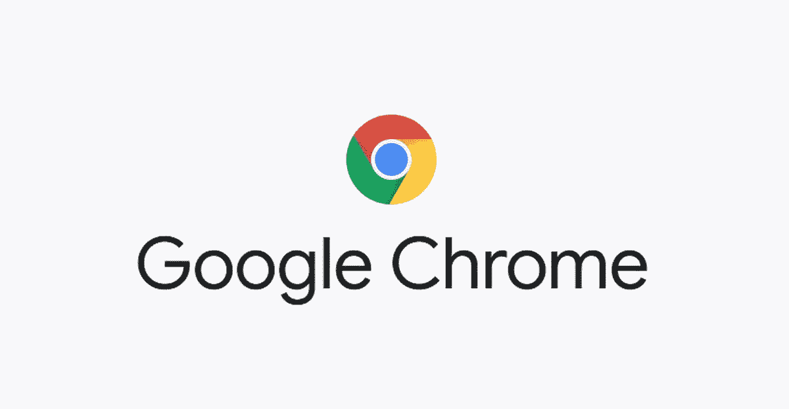

谷歌 Chrome 标志

大多数 Web 开发人员使用 Chrome 进行开发。据[维基百科](https://en.wikipedia.org/wiki/Usage_share_of_web_browsers)报道，大约 65%的世界人口似乎都在使用 Chrome，这也是开发者选择 Chrome 来测试他们开发的应用的原因之一。因此，如果你是一个经常使用 Chrome 的开发人员，这里有一些 Chrome 扩展，会让你的生活变得更加轻松。

# 1.色彩奇拉

Colorzilla 基本上提供了一个颜色选择器小部件以及许多其他功能。它有一个渐变生成器，网页代码分析器，以及你处理网页颜色所需的一切。它在 Firefox 中也是可用的。

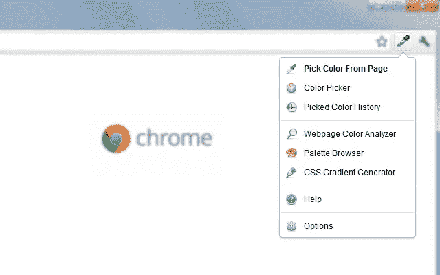

正在使用 Colorzilla 扩展

 [## 色彩奇拉

### 先进的滴管，颜色选择器，梯度发生器和其他丰富多彩的好东西

chrome.google.com](https://chrome.google.com/webstore/detail/colorzilla/bhlhnicpbhignbdhedgjhgdocnmhomnp) 

# 2.CSS 查看器

这个工具显示了所有与光标所在元素相关的 CSS 属性。它是一个浮动面板，包含所有细节，比如字体、颜色、位置等等。它还可以让你轻松地复制 CSS。

CSSViewer 扩展正在使用中

 [## CSSViewer

### 一个简单的 CSS 属性查看器。

chrome.google.com](https://chrome.google.com/webstore/detail/cssviewer/ggfgijbpiheegefliciemofobhmofgce?hl=en) 

# 3.什么字体

这是找出网页上字体的最简单的方法。正如你从下面的图片中看到的，当选择了扩展，如果你移动鼠标到一个文本上，它会显示文本的字体。

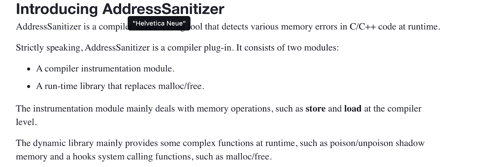

正在使用什么字体扩展

 [## 什么字体

### 识别网页字体的最简单方法。

chrome.google.com](https://chrome.google.com/webstore/detail/whatfont/jabopobgcpjmedljpbcaablpmlmfcogm/related) 

# 4.清除缓存

清除缓存是一个一键式解决方案，用于清除缓存数据和其他浏览器存储的信息。有了这个扩展，你不必再去检查多个弹出窗口和浏览器设置，你只需点击一下就可以清除所有数据。

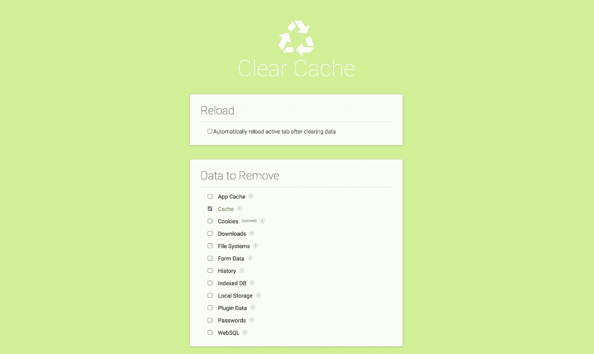

清除正在使用的缓存扩展

 [## 清除缓存

### 只需单击一个按钮，即可清除您的缓存和浏览数据。

chrome.google.com](https://chrome.google.com/webstore/detail/clear-cache/cppjkneekbjaeellbfkmgnhonkkjfpdn/related) 

# 5.JSONView

JSONView pretty 打印类型为`application/json`的响应。任何 JSON，如果不在树视图中查看，都很难阅读和理解。这就是 JSONView 派上用场的地方。

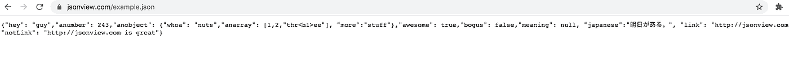

当 JSONView 被禁用时

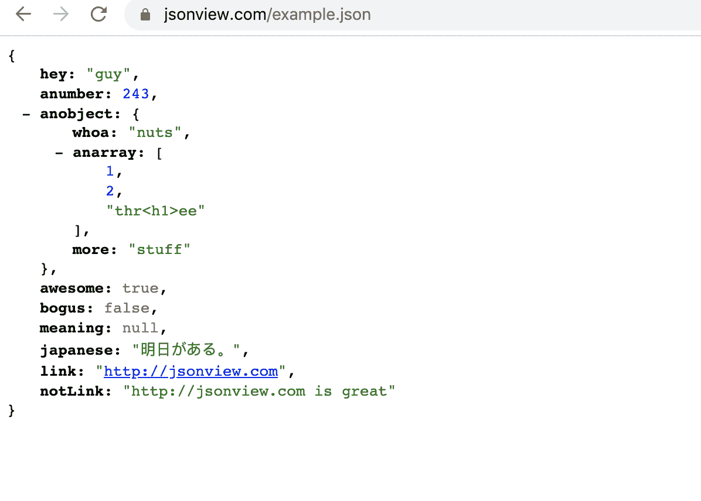

启用 JSONView 时

 [## JSONView

### 验证和查看 JSON 文档

chrome.google.com](https://chrome.google.com/webstore/detail/jsonview/chklaanhfefbnpoihckbnefhakgolnmc?hl=en%20) 

# 6.React 开发人员工具

如果您是 react 开发人员，那么这是一个必备的扩展。它帮助您查看和检查组件层次结构以及与其相关联的属性和状态。如果出于调试的目的需要，它还可以帮助您更改属性或状态。

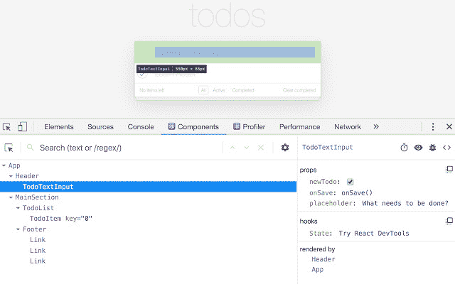

React 开发工具扩展正在使用中

 [## React 开发人员工具

### 将 React 调试工具添加到 Chrome 开发者工具中。根据 2020 年 11 月 12 日的版本 11a2ae3a0d 创建。

chrome.google.com](https://chrome.google.com/webstore/detail/react-developer-tools/fmkadmapgofadopljbjfkapdkoienihi?hl=en) 

# 7.余烬检查员

Ember Inspector 是一个可以用来调试 Ember 应用程序的工具。它显示了 ember 应用程序中的路线、模型、组件和所有其他 Ember 元素。它还加载所有的 ember 存储数据，以便您可以轻松地查看它们。并且，要了解这个扩展做得更好，请查看它。

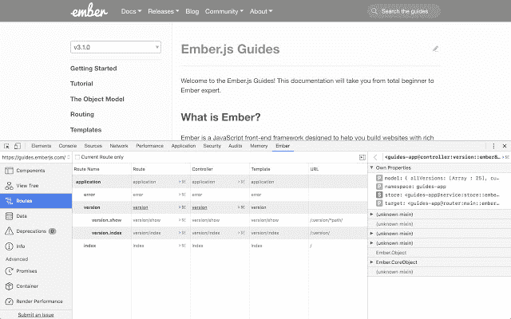

Ember 检查器扩展正在使用中

 [## 余烬检查员

### 调试 Ember 应用程序的工具。

chrome.google.com](https://chrome.google.com/webstore/detail/ember-inspector/bmdblncegkenkacieihfhpjfppoconhi?hl=en) 

# 8.Web 开发人员

Web Developer 通过在浏览器开发工具中提供许多其他需要的功能，使程序员或设计人员的生活变得更加容易。它有助于操作图像、更改页面布局、显示标尺、概述当前元素等。

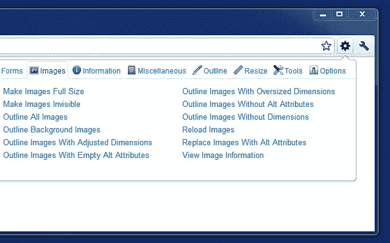

正在使用 Web Developer 扩展

 [## Web 开发人员

### 添加带有各种 web 开发人员工具的工具栏按钮。

chrome.google.com](https://chrome.google.com/webstore/detail/web-developer/bfbameneiokkgbdmiekhjnmfkcnldhhm) 

# 9.jQuery 审计

这个扩展在 Elements 面板中创建了一个侧栏，包含 jQuery 委托事件、内部数据等，作为动态 DOM 节点、函数和对象。它用于审计 jQuery 的委托事件、数据等等。

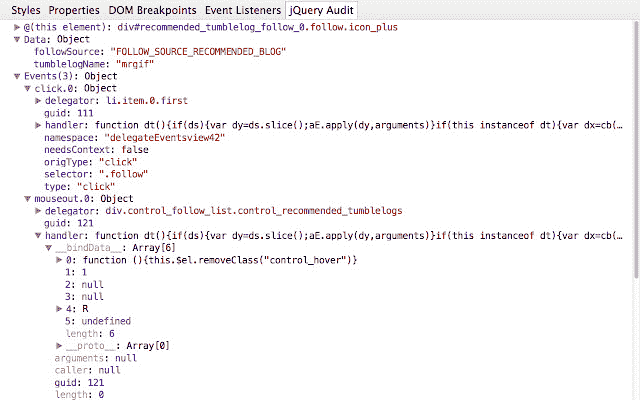

jQuery 审计扩展正在使用中

 [## jQuery 审计

### 审计 jQuery 的委托事件、内部数据等等。

chrome.google.com](https://chrome.google.com/webstore/detail/jquery-audit/dhhnpbajdcgdmbbcoakfhmfgmemlncjg/) 

# 10.元搜索引擎优化检查器

这个扩展用于查找页面中的元数据，这些元数据在浏览时通常是不可用的。元数据不仅仅是通常的 HTML meta 标签，还有 XFN 标签、各种微格式、最近引入的规范属性、非跟随链接等等。它有助于揭示一些有趣的网站属性。

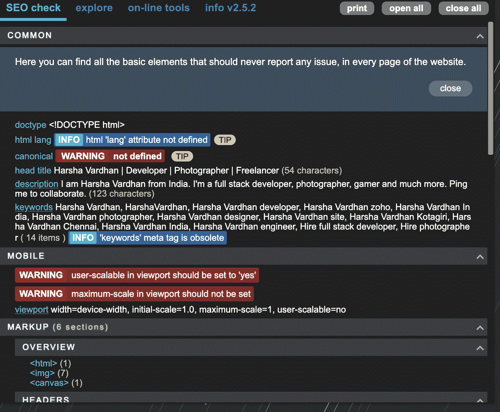

正在使用元 SEO 扩展

 [## 元搜索引擎优化检查器

### 用于检查网页中的元数据，通常在浏览时是看不到的。

chrome.google.com](https://chrome.google.com/webstore/detail/meta-seo-inspector/ibkclpciafdglkjkcibmohobjkcfkaef?hl=en) 

# 结论

上面提到的扩展使我作为前端开发人员的生活更加轻松，这些是我个人最喜欢的。如果有比这更有用的扩展，请发表评论。

感谢阅读！