# 10 个必须知道的 Chrome 开发者工具和技巧

> 原文：<https://betterprogramming.pub/10-must-know-chrome-developer-tools-and-tricks-d03f75d10cc9>

## 更快地工作，让您的用户更快乐

Photo by [童 彤](https://unsplash.com/@liz99?utm_source=medium&utm_medium=referral) on [Unsplash](https://unsplash.com?utm_source=medium&utm_medium=referral)

# 1.慢速网络和慢速设备模拟器

仅仅因为一个网站以每秒 10GB 的下载速度在你巨大的游戏电脑上高速运行，并不意味着它对大多数用户来说也很快。依靠落后连接的老式手机仍然是趋势。

打开 performance 选项卡，单击右上角的齿轮图标，显示慢速网络模拟和 CPU 节流选项。

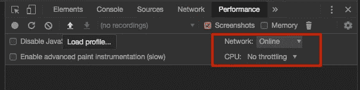

当您有一个 JavaScript 繁重和/或带宽饥渴的页面时，请与这些坏男孩一起玩

# 2.颜色选择器

单击代表颜色的小方块，弹出颜色选择器。

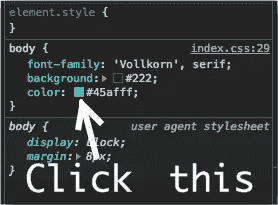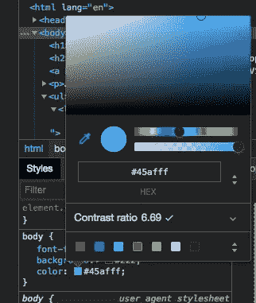

启用颜色选择器时，您可以将鼠标悬停在网页上，使用颜色选择器来获取该像素的颜色！

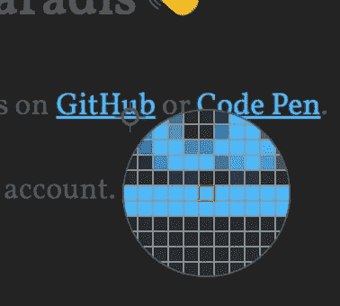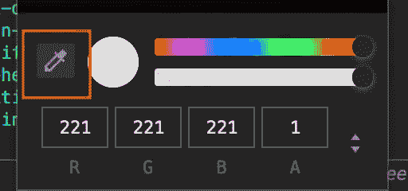

如果您没有看到颜色选择器，请点按“切换颜色选择器”

您单击以弹出颜色选择器的小方块还有另一个锦囊妙计:按住 Shift 键并单击它以更改颜色格式。

我改变你的生活了吗？

# 3.审计

如果你从未花时间通过 Chrome 的内置审计工具来测试你的网站，那你就错过了。在大约一分钟的时间内，您将获得关于性能、SEO、安全性等方面的宝贵见解。**更新:自** [**Chrome 83**](https://developers.google.com/web/updates/2020/03/devtools?utm_source=devtools#lighthouse) **起，“审计”面板现命名为“灯塔”。**

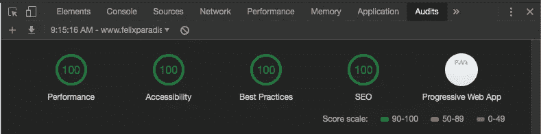

试着打破这个记录，孩子。

# 4.优质打印

想看看缩小的源代码？点击{}按钮！

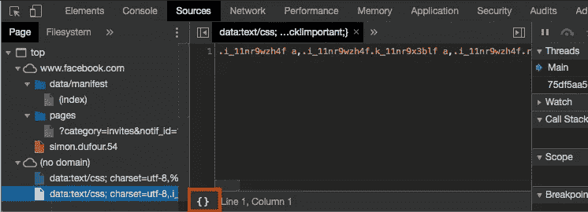

# 5.快速文件切换器

如果您知道文件名，就不必打开“源”标签。

*   只需按 cmd/ctrl + p
*   键入您的文件名
*   按下你的回车键

请注意，添加“>”会将您的快速文件切换器变成一个快速命令菜单(cmd/ctrl + shift + p 也会将您带到那里)。

# 6.响应模式

CSS 会变得棘手，近乎地狱。但是再次强调，全能的开发人员控制台工具非常方便。

用 ctrl/cmd+shift+M 切换设备工具栏，或者您可以…

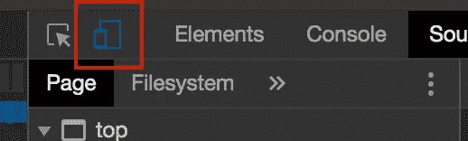

…点击那个。

对于大多数人来说，大多数时候，只需要通过不同的屏幕大小和方向来查看他们的网站。

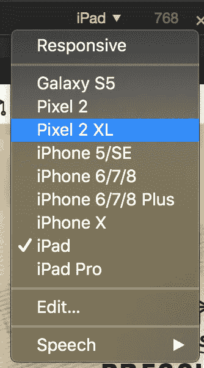

您可以通过点击“编辑…”来添加/删除设备

但是，看看另一个名为“更多选项”的下拉菜单(由三个垂直点表示)，您可以找到您不知道自己需要的工具。

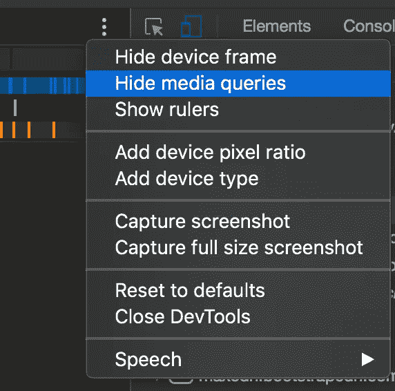

# 7.截屏

注意到最后一张图片中的“截图”了吗？

它真正酷的地方在于，你可以拍摄全尺寸的截图，这意味着整个页面都保存在你的截图中，而不仅仅是现在可见的内容。

你不需要在响应模式下截图。使用快捷命令菜单(shift+cmd/ctrl+p)并键入“屏幕截图”

# 8.扩展ˌ扩张

你可以安装 Chrome 开发者控制台的扩展。很多框架都有自己的扩展来简化技术开发(Vue，Angular，React 等等)。).这里是一个特色 DevTools 扩展的列表。

如果你有五分钟的空闲时间，你甚至可以开始[创建你自己的](https://developer.chrome.com/extensions/devtools)。

# 9.新闻报道

优化客户端代码的一个好方法是减少客户端代码。覆盖率是关于帮助你发现未使用的 CSS 和 JS。

使用命令菜单 ctrl/cmd+shift+p，显示覆盖率打开覆盖率选项卡。

您可以通过记录正在发生的事情来使用 coverage 选项卡。

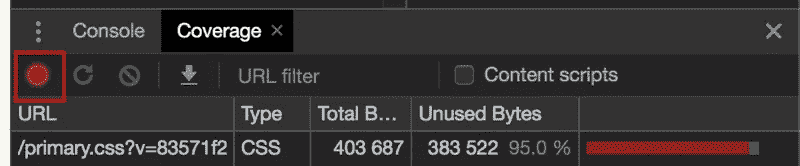

红点表示您正在录制。

记录时重新加载你的页面，你将开始获得洞察力。

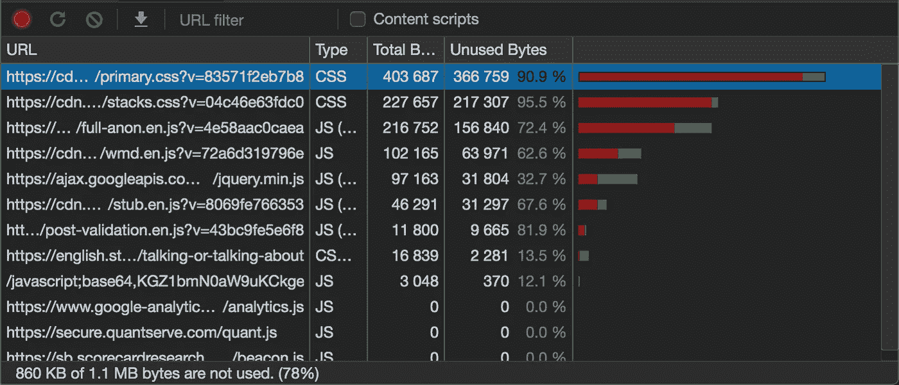

显然，红色表示未使用，绿色表示已使用。如果你点击一个文件，它会以同样的颜色编码逻辑打开。

请注意，页面加载中没有使用的代码不一定是根本没有使用的代码！在录制时使用页面的功能，你很可能会看到更高比例的代码被使用。

# 10.跟上新功能的步伐

Chrome 的开发工具不断更新。令人欣慰的是，谷歌让人们很容易跟上他们的“[dev tools](https://www.youtube.com/watch?v=GLUB2yzk0ZQ&list=PLNYkxOF6rcIBDSojZWBv4QJNoT4GNYzQD)中的新内容”视频系列。每次发布新的主要 Chrome 版本时，都会发布新的视频。我强烈建议在它们出来的时候观看它们——开发者工具应该在它们出来的时候让你知道。

# 奖金

你可能已经注意到我的开发者工具有一个黑暗的主题。黑暗主题是个好主题。通过单击 x ➔首选项➔外观➔主题旁边的三个垂直点来启用它。

或者使用我经常提到的命令菜单！

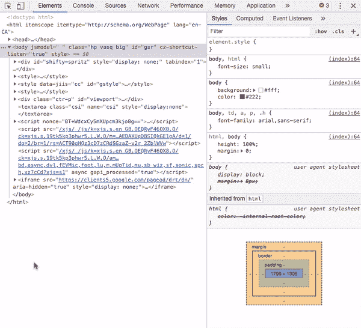

我希望你学到了一些东西！