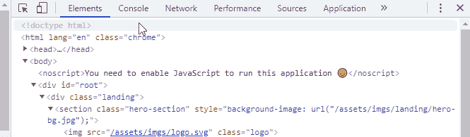
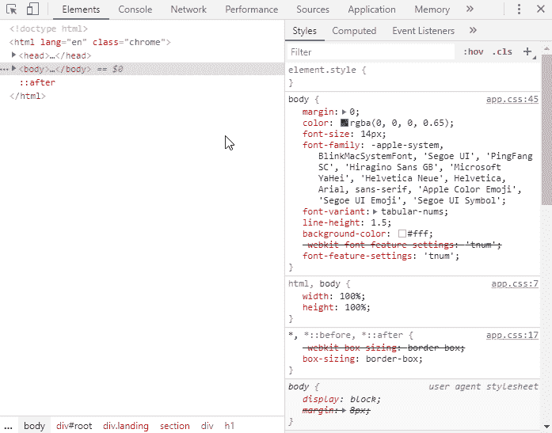
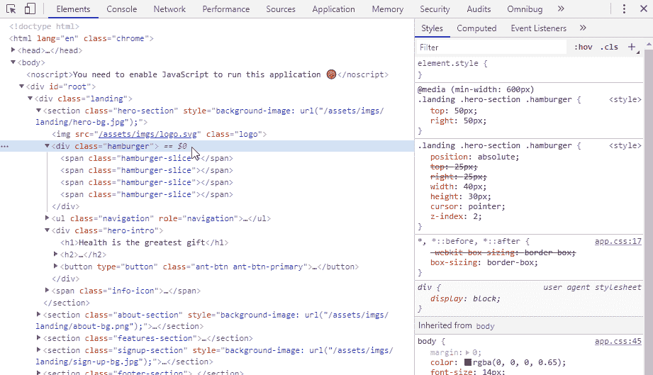
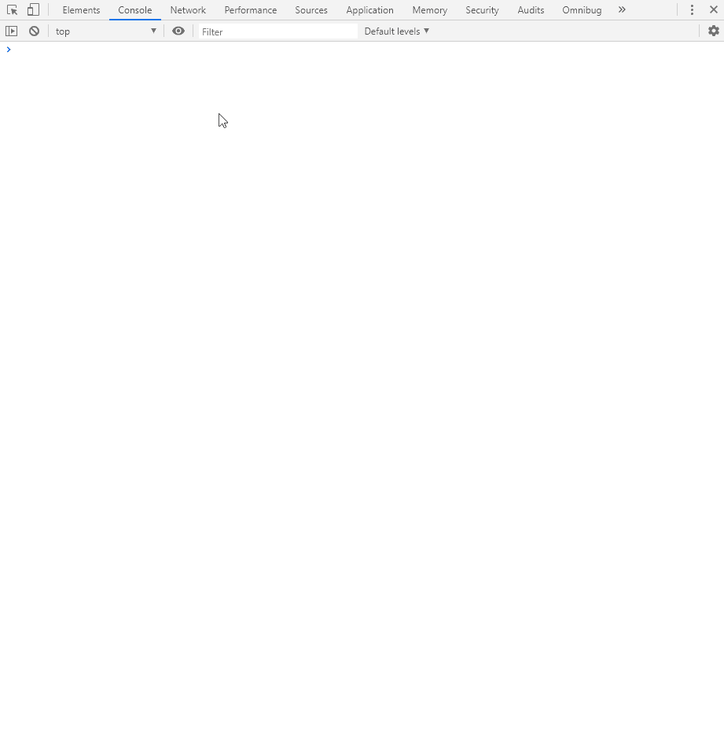
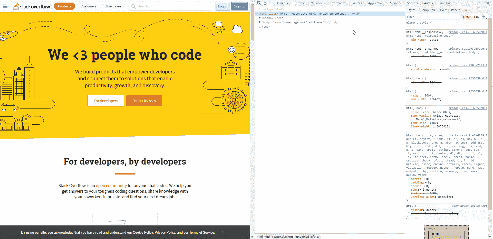
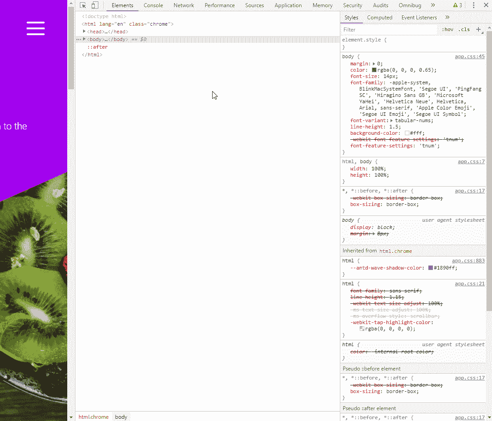
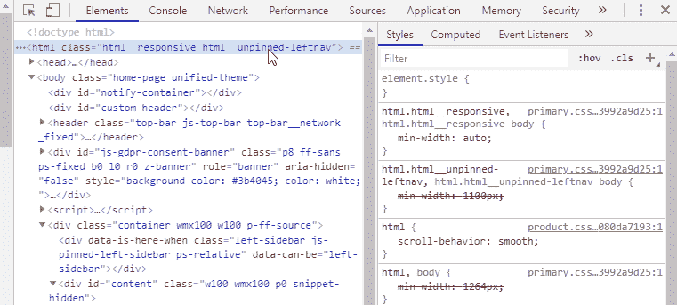
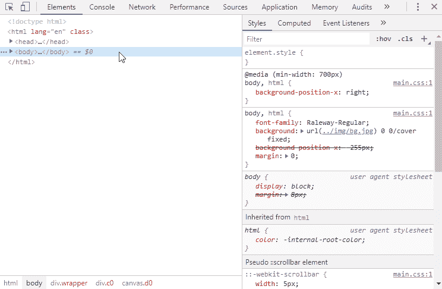
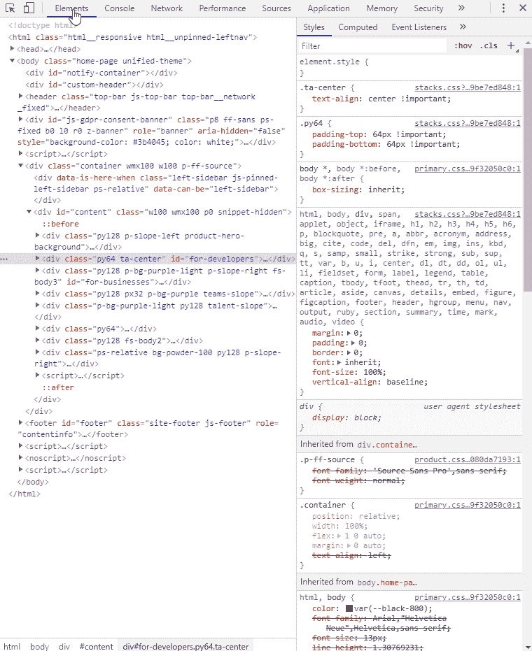

# Chrome DevTools 的 10 个必备特性

> 原文：<https://betterprogramming.pub/10-must-know-features-of-chrome-devtools-94e4a4e530c5>

## 用这些改进你的工作流程和调试技能

照片由[弗朗西斯科·温加罗](https://www.pexels.com/@francesco-ungaro?utm_content=attributionCopyText&utm_medium=referral&utm_source=pexels)从[佩克斯](https://www.pexels.com/photo/abstract-art-blur-circle-96381/?utm_content=attributionCopyText&utm_medium=referral&utm_source=pexels)拍摄

Chrome 有一些调试功能，在对代码进行故障排除时，这些功能真的会派上用场。事实上，有如此多的工具，其中大部分都隐藏起来，等待被发现。

然而，Chrome DevTools 团队在他们的网站上发布了[每月更新](https://developers.google.com/web/updates/capabilities)，你也可以在他们的官方 Twitter 账户上找到分享的伟大技巧。如果你想了解更多 Chrome 提供的工具，我强烈推荐你去看看。

在这篇文章中，我收集了 10 个我经常使用但可能不为他人所知的特性。他们帮助我简化了工作流程，因此我可以在更短的时间内完成更多的工作。

# #1:保留日志

从一个简单的在过去引起很多挫折的事情开始:在控制台中保存日志。假设您在页面重新加载之前或导航发生时遇到了一个问题——您试图登录到控制台，但一切都被清除了。解决方法很简单，但我很久都不知道:

在控制台中保留日志

# #2:事件侦听器的断点

通常，当用户交互发生时，问题就出现了。捕捉这些事件来检查交互在哪里运行以及什么在运行，这可能是一种更安全的生活。幸运的是，我们可以通过转到`Sources`选项卡并选中相关事件的复选框来做到这一点:

为事件侦听器添加断点

# # 3:DOM 操作的断点

对于 DOM 操作也可以做同样的事情。经常发生的情况是，一个节点接收到一个属性改变，例如类的增加。在大型存储库中搜索负责任的代码会非常耗时——相反，您可以简单地为该元素添加一个断点，然后让 DevTools 处理其余部分。

为 DOM 操作添加断点

# #4:代码覆盖率

说到性能优化，我们经常发现自己留下了死代码。在覆盖率工具的帮助下，您可以分析您的资源，并查看哪些行没有被执行。重要的是执行相关的用户交互，以获得更准确的图片。你可以点击`Ctrl` + `Shift` + `P`打开工具面板，点击重新载入图标开始录制。红色显示的所有内容都没有执行。

在 DevTools 中测量代码覆盖率

# #5:显示重画

不必要的重画也会导致性能问题。想象一下，你的页面上有一个倒计时，每次更新都会导致整个页面被重新绘制。您可以通过在`Render`选项卡中启用油漆闪烁来解决这些问题，并查看是哪些元素触发了它们。再次按`Ctrl` + `Shift` + `P`将调出工具栏。

在“渲染”选项卡上启用重画

# #6:检查动画

既然我们在讨论渲染，那就让我们来看看如何调试 CSS 动画。用`Ctrl` + `Shift` + `P`打开工具菜单，输入“*动画*”它将为您打开`Animations`标签，记录您网站上发生的任何动画。您可以回放它们，查看它们的放松，并调整时间或持续时间:

在 DevTools 中检查动画

# #7:截图

我们经常需要互相分享截图来验证修改。如果您必须重复多个步骤，此任务可能会耗费时间:

*   打开第三方应用程序
*   裁剪站点的一部分
*   将其保存为图像并发送

这可以在 DevTools 内部完成。您可以从整个页面、从单个节点*(被选择的节点)*或从视窗创建图像:

在 DevTools 中创建图像

# #8:黑盒

假设您正在调试一个问题，并且您的代码中有几个断点。您可以沿着堆栈跟踪，但大多数都来自核心框架文件，如 React 或 jQuery。为了避免在调试器中包含这些核心文件，您可以将它们黑盒化，这意味着 DevTools 将跳过这些文件，以便您可以专注于自己的代码。

DevTools 中的黑盒脚本

# #9:本地覆盖

本地覆盖是我的最爱之一，我发现自己越来越经常地使用它。这是一个强大的工具，使您能够加载生产文件的本地副本，并使用它们来代替它们的捆绑副本。当问题只发生在给定的环境中并且不能在本地重现时，这尤其有用。

您可以在`Sources`选项卡下启用本地覆盖。如果你没有看到`Overrides`链接，点击`Page`旁边的 v 形图标。您可以将漂亮打印的文件复制到您的包中并扩展它。重写在页面重新加载过程中保持不变。

如果你对本地覆盖感兴趣，[我有一个完整的教程，涵盖了](https://www.webtips.dev/debug-production-code-with-local-overrides)这个主题，你可以通过提供的链接找到它。

覆盖 DevTools 中的文件

# #10:灯塔

最后但同样重要的是，我发现自己一直在使用`Lighthouse`面板。这是为了审计你的网站的不同类别:性能，PWA，可访问性，或搜索引擎优化。您还可以选择在不同的设备上进行审计，以及模拟网络连接。它为您提供了关于哪些方面可以改进以及如何改进的简要信息。你可以在`Audits`标签下到达灯塔。如果您没有看到选项卡，只需点击 v 形图标即可显示隐藏的选项卡。生成报告后，您可以将结果保存为 JSON 文件，并在以后导入它进行比较。

DevTools 中带有 lighthouse 的审计站点

这些是 Chrome 的 DevTools 的 10 个必须知道的功能，它们帮助我简化了工作流程，在更短的时间内完成了更多的工作。

你日常使用的功能是什么？请在评论中告诉我们。

感谢阅读，调试愉快！

