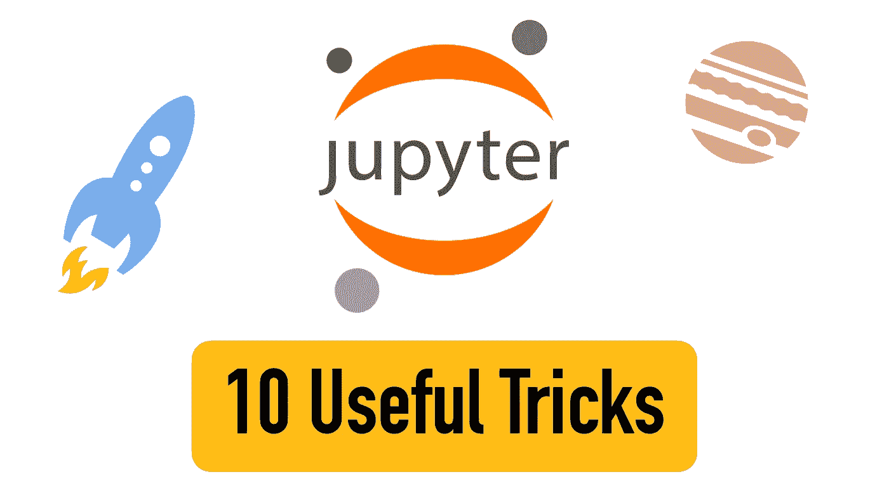
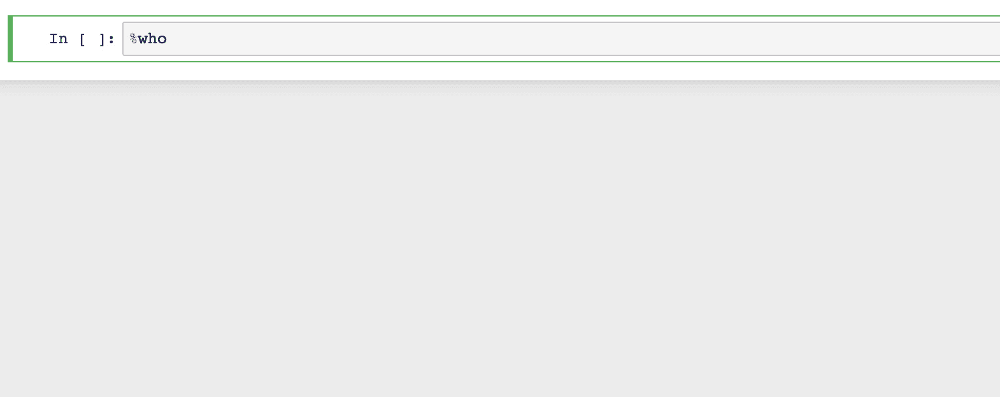
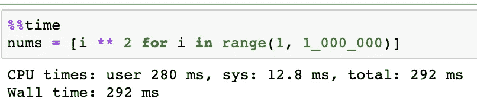
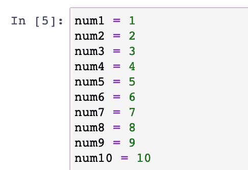
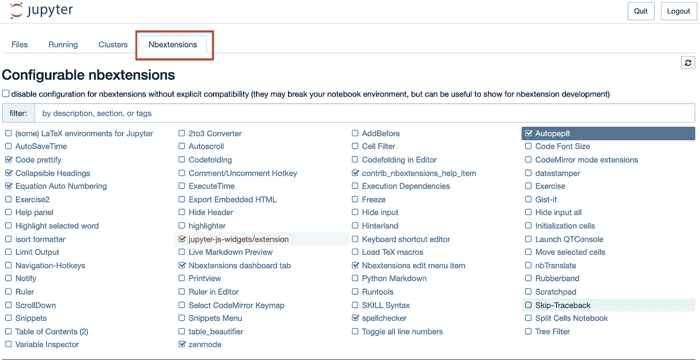
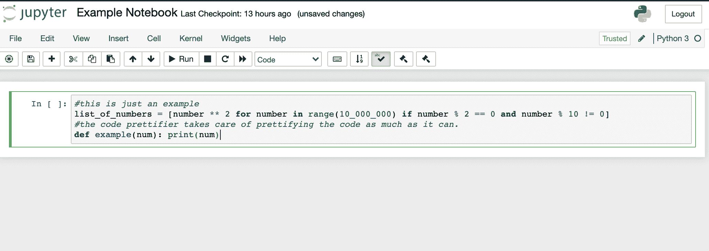
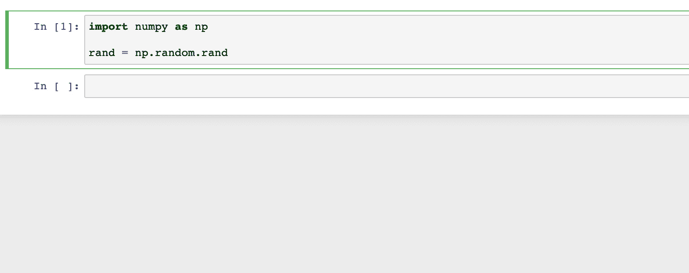
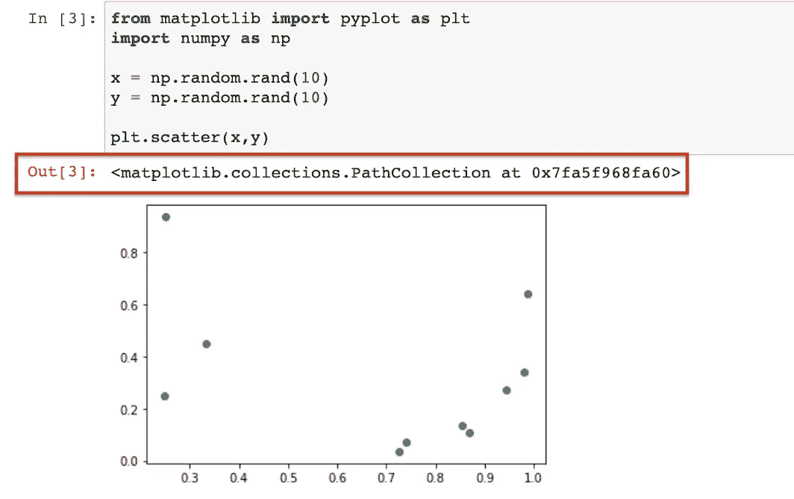
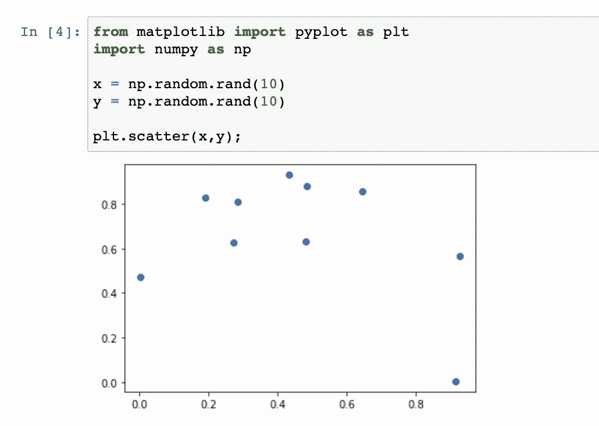

# 10 个必须知道的 Jupyter 笔记本技巧

> 原文：<https://betterprogramming.pub/10-must-know-jupyter-notebook-tricks-51baea31922>

## 节省时间，提高生产力



图片由作者提供。

这里列出了一些有用的 [Jupyter 笔记本](https://jupyter.org/)小技巧。名单没有特定的顺序。

# 1.Shell 命令

您是否退出笔记本来运行 shell 命令？

您可以在 Jupyter 笔记本中运行 shell 命令，方法是在命令前放置一个感叹号。

例如:

```
!pip install Tkinter
```

# 2.查看快捷方式列表

随着时间的推移，学习使用 Jupyter 笔记本的快捷键可以简化您的工作流程。快捷方式的列表非常庞大，没有办法一次记住所有的东西。这就是查看快捷方式列表的方便之处:

1.  打开一本 Jupyter 笔记本。
2.  激活命令模式(按下`Esc`)。
3.  按下`H`键。
4.  查看所有快捷方式的列表。

# 3.魔法命令

在 Jupyter 中，有一堆*魔法命令*让你的生活更轻松。魔术命令是解决常见问题的快捷方式，例如列出当前目录中的所有文件。神奇的命令非常有用，因为它可以直接嵌入到 Python 代码中。一个魔法命令有一个`%`前缀。

以下是一些有用的神奇命令:

## 查看所有神奇的命令

有用的魔法命令有很多。使用以下命令查看所有可用魔术命令的列表:

```
%lsmagic
```

## 魔法命令的帮助

要获得关于特定魔法命令的更多信息，请突出显示该命令并按下`Shift + Tab`:



# 4.测量单元执行时间

使用`%%time`获取运行一个代码单元所用的时间。



# 5.添加多个光标

使用多个游标编辑代码可以节省时间。

*   Windows:按住`alt` +左键拖动光标。
*   Mac:按住`option` +左键拖动光标。



# 6.为程序完成设置警报

当你的程序执行完毕时发出警报。

## Windows 操作系统

在 Windows 上，您可以发出哔哔声警报。例如，让我们设定一秒钟(1000 毫秒)440 赫兹的警报:

```
**import** winsoundduration **=** 1000freq **=** 440winsound.Beep(freq, duration)
```

## 苹果个人计算机

当你的程序完成时，你可以使用内置的`say`命令让你的 Mac 说些什么，而不是发出嘟嘟的警报:

```
**import** os
os.system('say "Your program has now finished"')
```

# 7.Jupyter 笔记本的扩展

Jupyter 笔记本是一个很棒的工具，但是一个光秃秃的笔记本缺乏有用的功能。这就是扩展发挥作用的地方。

1.  在命令行中运行以下命令来安装扩展:

2.然后启动 Jupyter 笔记本，转到“Nbextensions”选项卡:



您可能想要激活的有用扩展

3.通过单击来激活扩展。这些按钮作为按钮添加到笔记本工具栏中:


工具栏中的一些激活的扩展

例如，使用 Code Prettify 扩展，只需单击一个按钮，就可以使代码看起来结构化且美观:



# 8.查看方法的文档

要查看方法的文档，突出显示该方法并按`Shift + Tab`。要进一步展开模态，按右上方的`+`按钮展开模态:



# 9.扩展熊猫中显示的列数和行数

熊猫表只能显示有限数量的行和列。然而，你可以改变这一点。

例如，让我们将最大输出行数和列数设置为`1000`:

```
**import** pandas **as** pdpd.set_option('display.max_rows', 1000)
pd.set_option('display.max_columns', 1000)
```

# 10.隐藏不必要的输出

在语句的末尾使用分号来禁止令人讨厌的输出。例如，当使用 Matplotlib 绘图时，您会在图形前看到有点多余的输出:



要消除这种情况，请在绘图语句后使用分号:

```
plt.scatter(x,y);
```



看起来好多了，不是吗？

# 结论

名单到此为止。我希望我能用这些技巧提高你的效率，节省你的时间。

感谢阅读。编码快乐！

我很想加入你的 LinkedIn 网络。请随意连接[阿图里·贾利](https://www.linkedin.com/in/artturi-jalli-29619413a)。

# 你可能会发现这很有见地

[](https://www.codingem.com/50-python-interview-questions-and-answers/) [## 50 Python 面试问答- Codingem

### 你是在准备工作面试还是准备涉及 Python 知识的考试？还是你想快点走…

www.codingem.com](https://www.codingem.com/50-python-interview-questions-and-answers/)