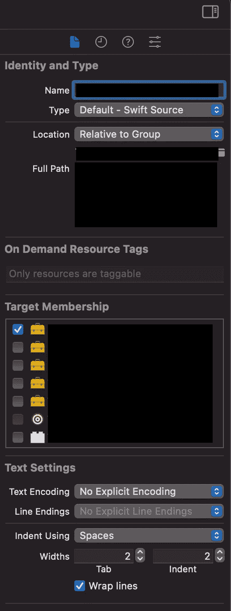
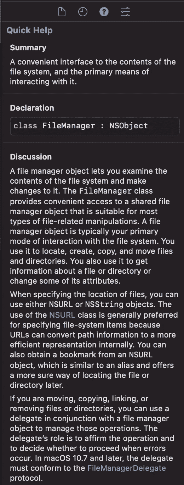
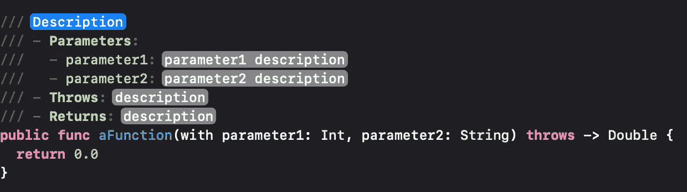
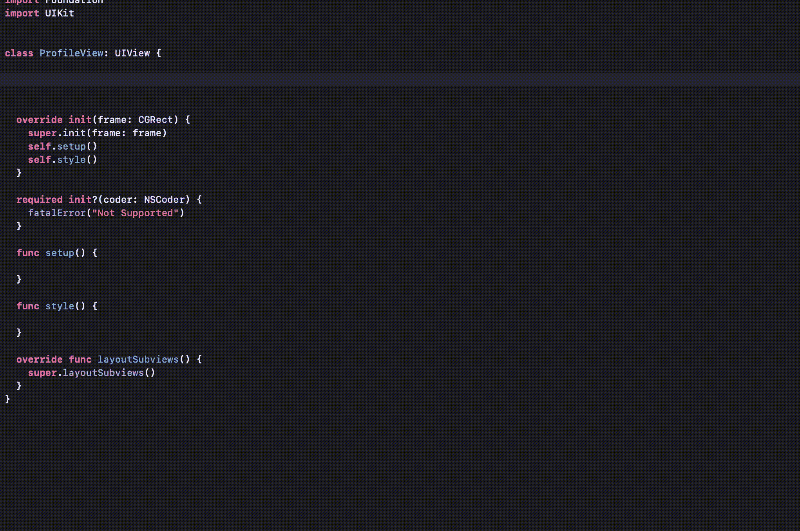

# 10 个必须知道的 Xcode 快捷键

> 原文：<https://betterprogramming.pub/10-must-know-xcode-shortcuts-592bf402a281>

## 加快你的日常编码程序

[威森王](https://unsplash.com/@wesson?utm_source=medium&utm_medium=referral)在 [Unsplash](https://unsplash.com?utm_source=medium&utm_medium=referral) 上拍照。

作为一名软件工程师，我每天大部分时间都在键盘上打字。作为一名 iOS 开发者，我每天使用的 IDE 是 Xcode。通过我作为开发人员的经验，我学到了一些快捷方式，它们帮助我更快地工作，并防止我将手从键盘上移开。

今天，我想和你们分享它们。如果你能从其中至少一个中受益，我会很高兴。

# 1.快速打开导航器

Xcode 中最明显的面板之一是导航面板。这是最左边的面板，它根据您正在做的事情显示不同的信息。例如，当您创建新文件时，它会显示项目的结构。当您运行测试时，它会显示它们的执行情况。当您正在构建时，您可以看到构建日志和类似的信息。

所有这些航海家都可以用⌘加 1-9 之间的任意数字快速召唤出来:

*   ⌘ + 1 打开项目导航器。
*   ⌘ + 2 打开源代码管理导航器。
*   ⌘ + 3 打开符号导航器。
*   ⌘ + 4 打开查找导航器。
*   ⌘会议五周年打开了问题导航器。
*   ⌘ + 6 打开测试导航器。
*   ⌘ + 7 打开调试导航器。
*   ⌘ + 8 打开断点导航器。
*   ⌘ + 9 打开报告导航器。

# 2.快速打开检查器

“检查器”面板位于 Xcode 的右侧，它显示特定于文件或所选元素的其他有用信息。

我们可以用⌥ + ⌘的组合加上一个数字来打开检查器。在这种情况下，它们的范围是 1-4。对我来说最有用的检查器是快速帮助检查器。当我使用某个库或同事写的一段代码时，将文档放在屏幕的右侧会很方便。

*   ⌥ + ⌘ + 1 打开文件检查器(有助于双重检查一些文件的成员)。
*   ⌥ + ⌘ + 2 打开历史检查器。
*   ⌥ + ⌘ + 3 打开快速帮助检查器(对文档非常有用)。
*   ⌥ + ⌘ + 4 打开属性检查器。

文件检查器

快速帮助检查器

# **3。打开文档**

访问苹果文档的另一个有趣的方法是使用⌘ + ⇧ + 0 快捷键。这是一个非常容易记住的快捷方式，它为我节省了很多时间。

# **4。搜索文件**

这里有另一个简单的捷径，可能是一个众所周知的。我经常使用它，如果不包括它，那将是一种耻辱。快捷方式是⌘ + ⇧ + O，它会在 Xcode 中打开一个搜索栏，你可以在里面键入一个文件、一个类，甚至一个函数的名称，Xcode 会在整个项目中搜索，召唤出想要的文件。

# 5.在项目导航器中显示文件

有多少次你跟随一个执行流程，点击不同的函数调用，并且想知道你最终到了哪里？好吧，如果你记得⌘ + ⇧ + J 可以高亮显示你当前在项目导航器中打开的文件，你就再也不会感到失落了。

使用这个快捷方式，您将始终看到当前文件所属的文件夹。

# 6.评论

这是另一个众所周知的捷径——但是有双重结果。通过选择几行代码(按下⇧+↑键或⇧+↓键)，您可以使用⌘ + /快捷键一次性注释几行代码。

如果这些行已经是注释，相同的快捷方式将取消注释。

# 7.证明文件

使用这个快捷方式，您可以创建样板文件来快速编写文档。它还正确地突出了参数、返回类型和错误。

将光标放在您想要记录的函数之前(甚至放在函数本身)，然后按⌥ + ⇧ + /。

# 8.刻痕

通常，当将一段代码从一个地方复制到另一个地方时，或者在重构时，代码的形状可能会改变，并且很难重新创建正确的缩进。

想象一下，您必须从`if`更改为`guard`，或者您正在处理回调。只需按⌘ + A 选择整个文件，然后⌃ + I 缩进你的代码。

# 9.仅生成测试

单元测试是一项基本的实践。仔细检查代码的逻辑是非常有用的，但是当重构一些代码、添加一个新特性或者改变代码组织时，它确实是一个安全网。单元测试让我们验证所有的功能都在按预期继续工作。

然而，单元测试也是代码。它们必须被编译。当执行一个大的重构时，几个测试可能会中断，我们可能不得不修改很多代码来使它再次工作。虽然我们可以用⌘ + U 组合来运行单元测试，但另一个有用的捷径是⌘ + ⇧ + U。这使得 Xcode 无需运行单元测试就能构建单元测试，为您节省了一点时间。

# 10.编辑多行

这是今天的最后一条捷径，也是我最喜欢的一条。我们经常不得不对多行应用相同的更改。例如，我们可能必须改变不同元素的可见性，或者添加一堆`UIViews`作为父视图的子视图。

通过按⇧ + ⌃ + ↑或↓，可以选择多行并保留单独的光标。然后，我们可以键入任何内容，它将在所有行上复制。我们可以复制几行并粘贴到另一个地方，保持它们分开，以便一次对所有行应用更改。

我认为这是一条非常有用的捷径。它节省了我大量的时间，尤其是在处理 UI 代码的时候。

# 结论

在本文中，我们探索了一些快捷方式，它们有助于加快应用程序的开发。有时他们只是让你避免使用鼠标。在其他情况下，他们可以节省你一些互联网搜索。在最好的情况下，他们允许你写样板文件，而不是真的写。