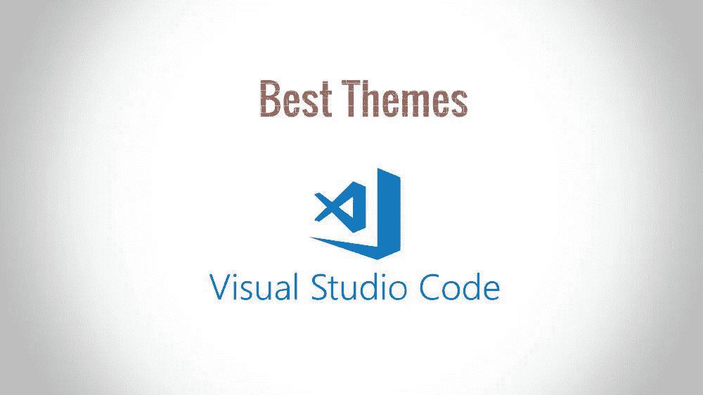
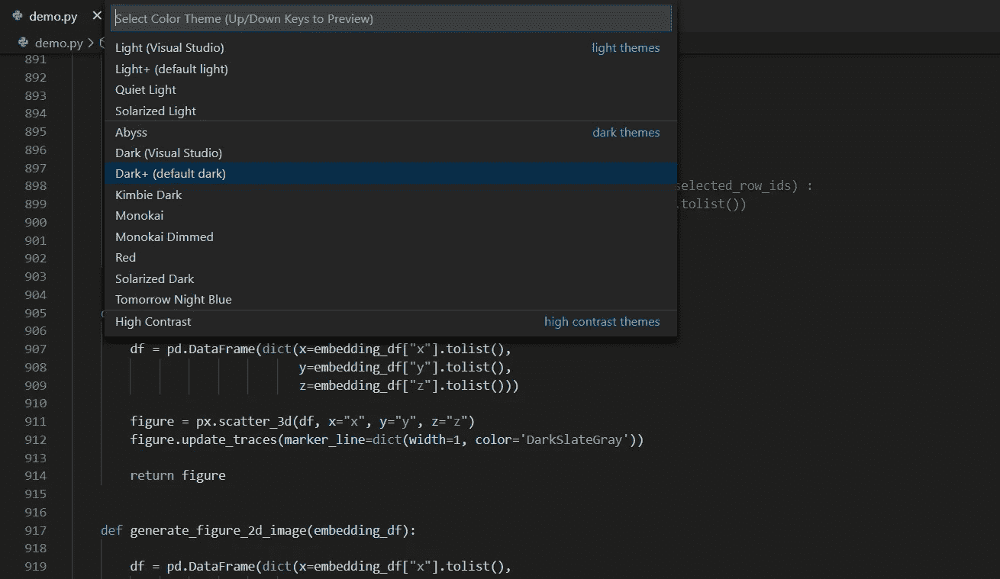
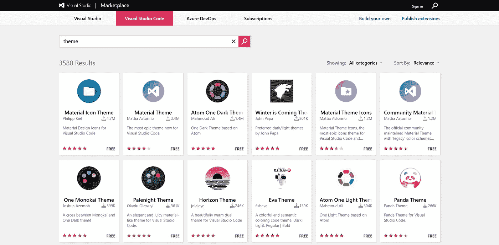
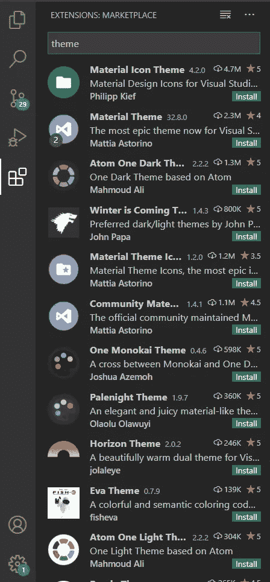
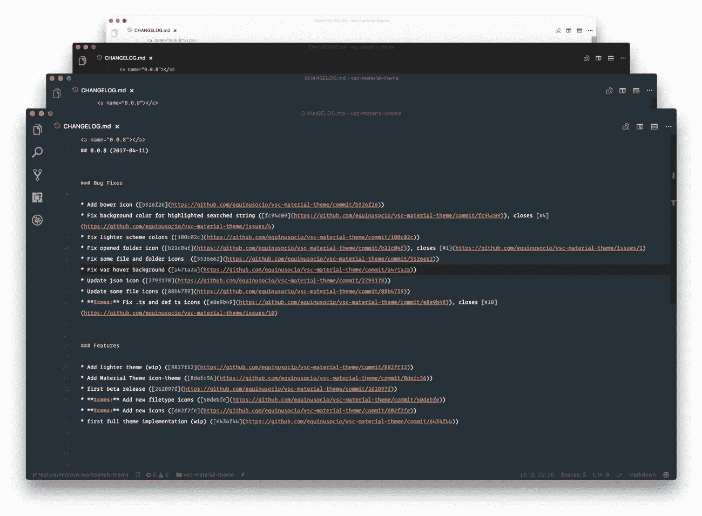
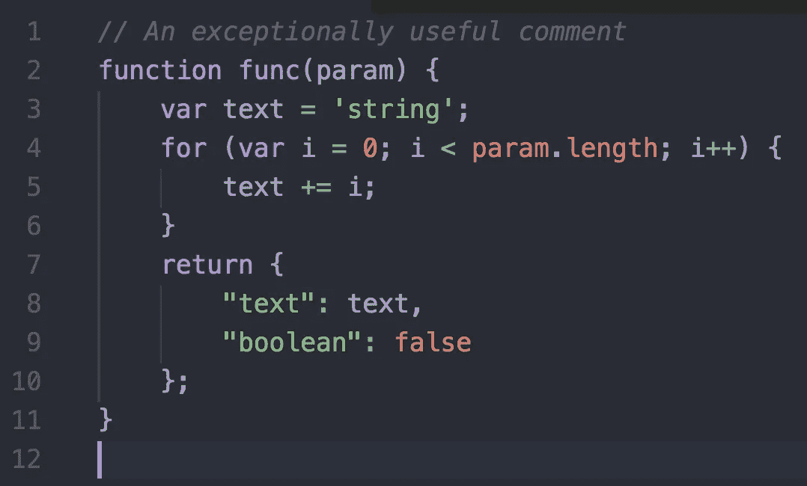
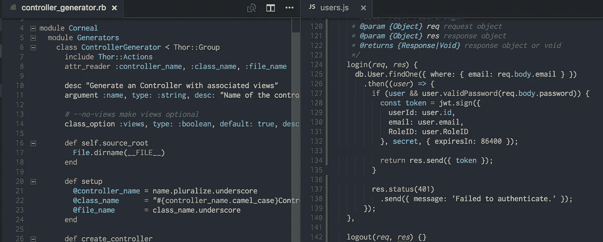
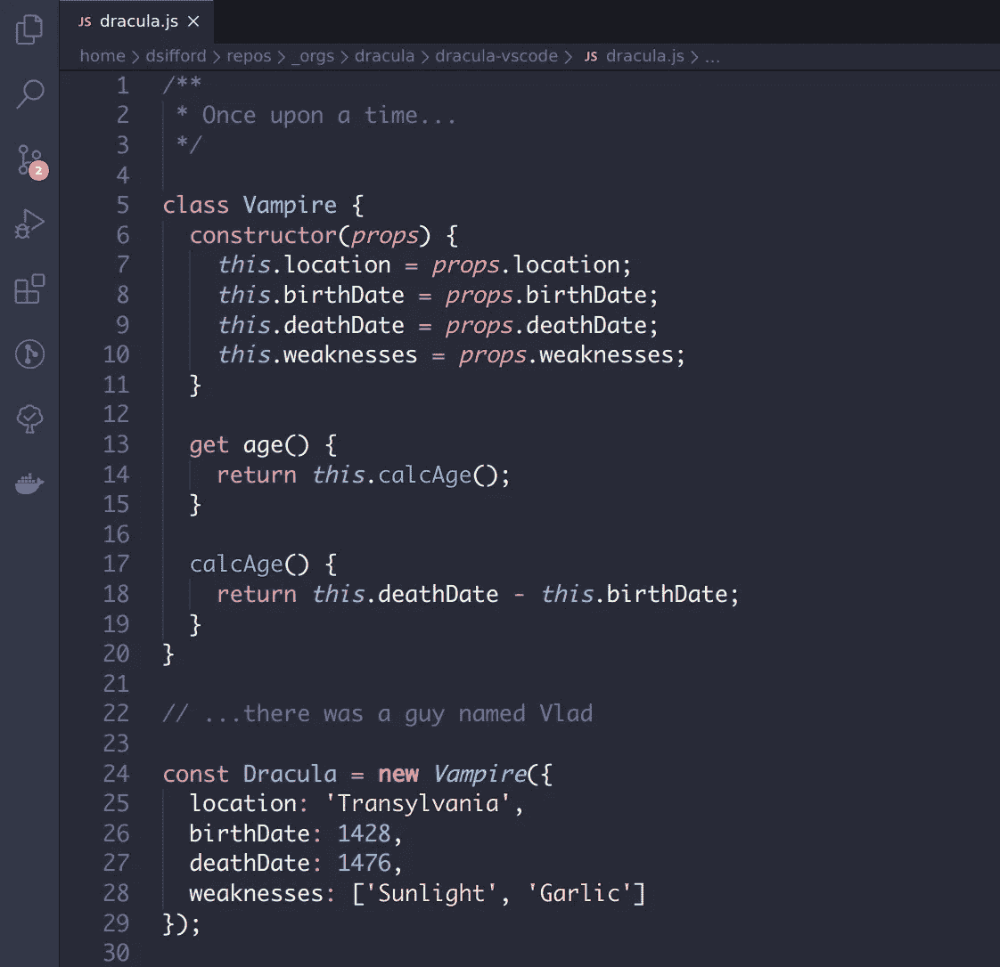
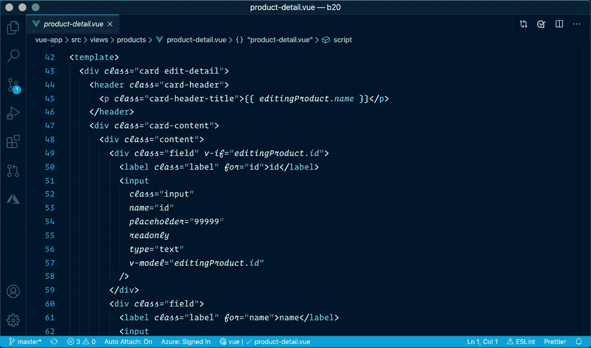

# VS 代码的 5 个最佳主题

> 原文：<https://betterprogramming.pub/10-of-the-best-themes-for-vs-code-e97ad80d2728>

## 让你的编码环境看起来很漂亮

作者照片。

谈到代码编辑器的外观，每个人都有自己的偏好。有些人喜欢他们的文本编辑器轻便多彩，而其他人可能会选择深色，因为明亮的颜色会伤害他们的眼睛。

> “颜色主题允许您修改 VS 代码的背景、文本和语言语法颜色，以适应您的偏好和工作环境。VS 代码支持亮、暗、高对比度主题。”— [VS 代码文档](https://vscode-docs.readthedocs.io/en/latest/customization/themes/)

# 变更与代码主题

1.  使用“文件”>“首选项”>“颜色主题”( macOS 上的“代码”>“首选项”>“颜色主题”)打开颜色主题选择器。
2.  使用光标键预览主题的颜色。
3.  选择你想要的主题，然后按回车键。

文件>首选项>颜色主题

# 从扩展市场获取主题

从社区来说，VS 代码有大量的主题。用户可以通过使用浏览器从 [Visual Studio 代码市场](https://marketplace.visualstudio.com/vscode)获得这些主题。有数百个主题供你选择，从颜色到流行的电视剧都有。

[Visual Studio 代码市场](https://marketplace.visualstudio.com/vscode)

每个主题都有一个等级和一个完整的“开始”指南，让你的生活更轻松。

另一种选择是，您可以通过进入 VS 代码窗口中的“扩展”视图来直接选择和安装主题。如果你找到一个你想用的，只需安装它，重启 VS 代码，新的主题就可以了。

使用 VS 代码扩展安装主题

让我们深入探讨我们的五大主题吧！

# 1.材料主题

这是 Visual Studio 代码最流行的主题之一。你可以通过 Visual Studio 代码市场安装这个很棒的主题。

材料主题

# 2.原子一黑暗主题

下面是一个基于 Atom 的 [One Dark](https://github.com/atom/one-dark-syntax) 主题的 VS 代码主题。市场上评级最高的 One Dark 主题端口具有完整的工作台主题。你可以在 [VS 代码市场](https://marketplace.visualstudio.com/items?itemName=akamud.vscode-theme-onedark)中看到这个主题。

VS 代码的 Atom One 黑暗主题

# 3.一个 Monokai 主题

这个主题是 Monokai 和黑暗主题的结合。Monokai 是一个默认的主题，可以在你的 VS 代码首选项中访问。这也是用户的最爱之一。

一个 Monokai 主题

# 4.德古拉主题

这是官方[德古拉](https://draculatheme.com/visual-studio-code)主题的 VS 代码版本。它也为许多其他应用程序提供了[主题](https://draculatheme.com/)。这是使用最广泛的主题之一。

德古拉主题

# 5.冬天来了主题

Visual Studio 代码的这个扩展添加了标题为“冬天来了”的主题有深色，没有斜体的深色，还有浅色的主题。这是一个运用了色谱中冷色部分的主题，所以有些人可能会觉得这很酷。

冬天来了主题

# 结论

感谢阅读！我希望你对下载最多和最流行的 VS 代码主题有所了解。