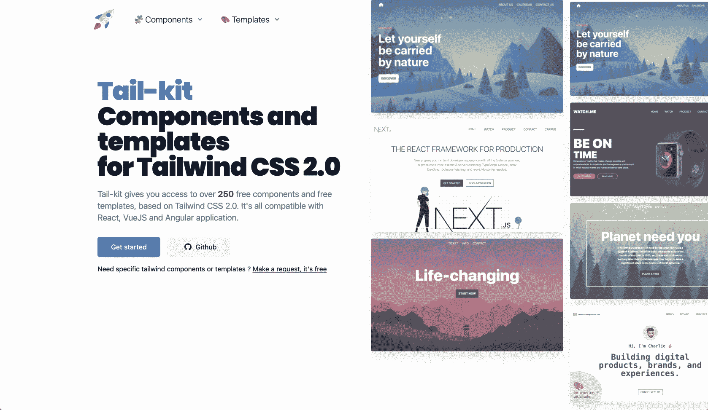
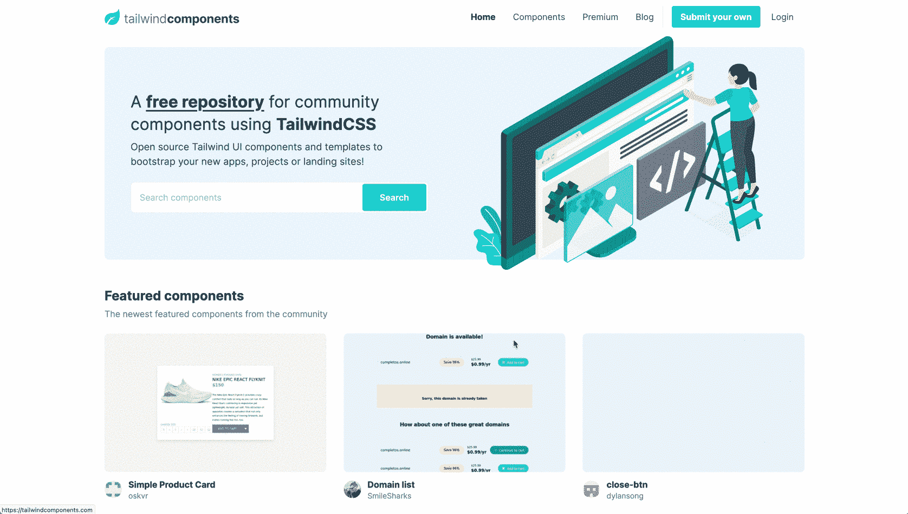
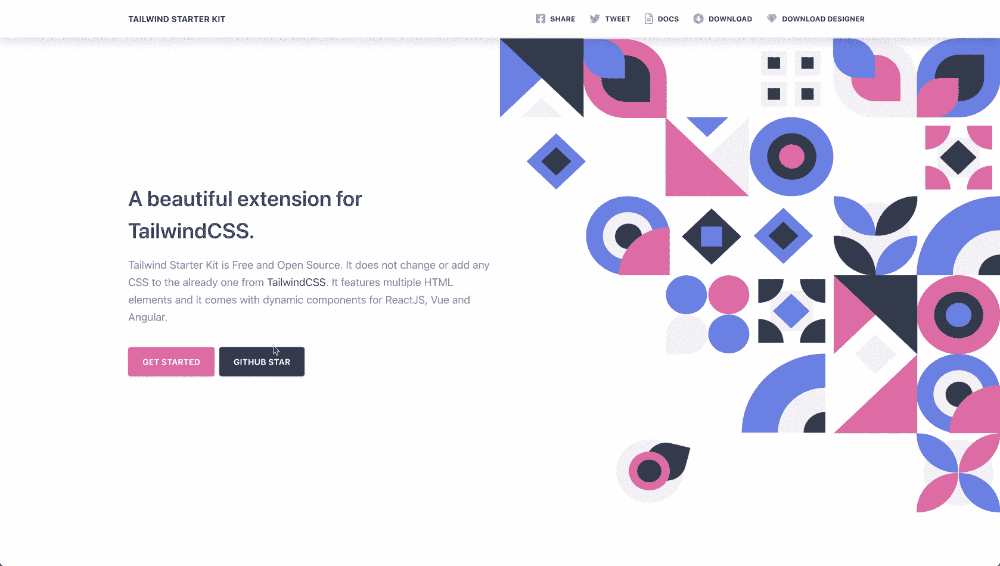
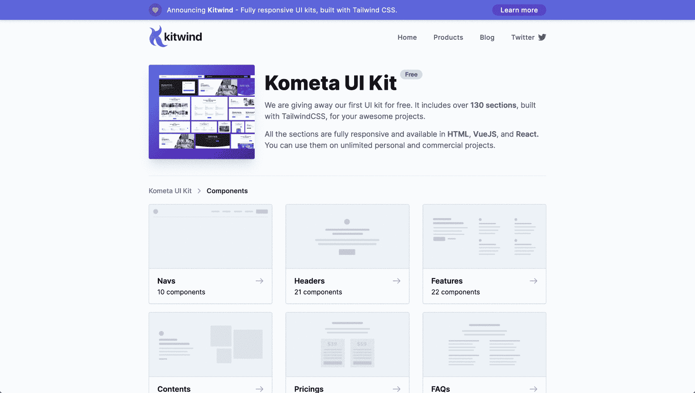
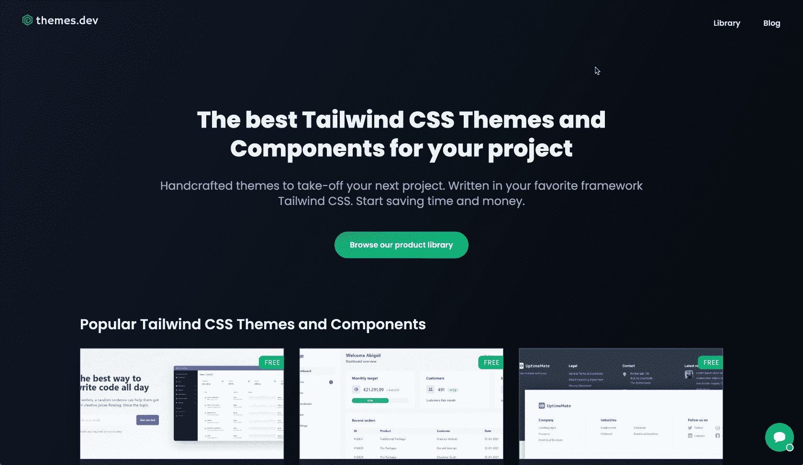
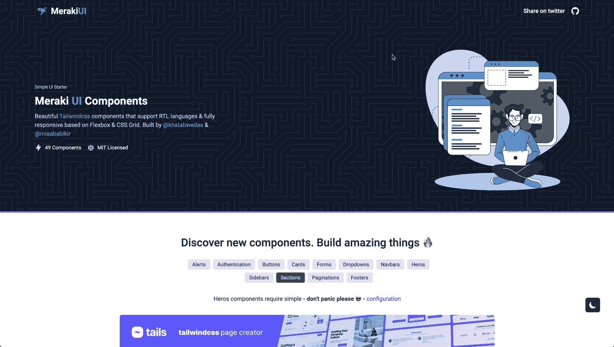
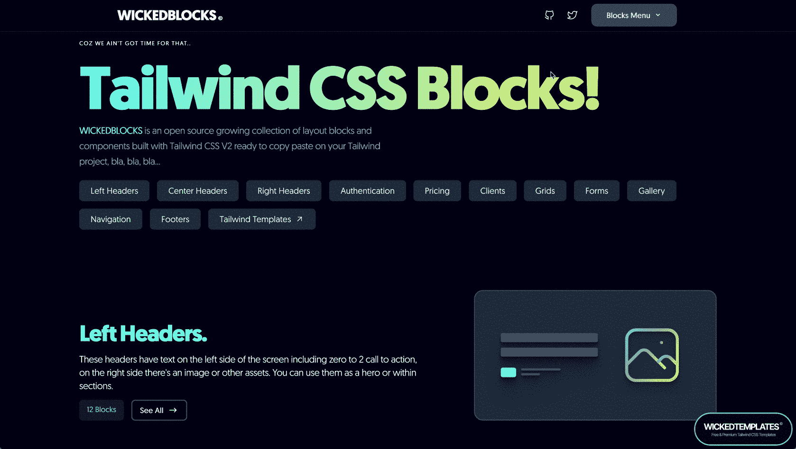
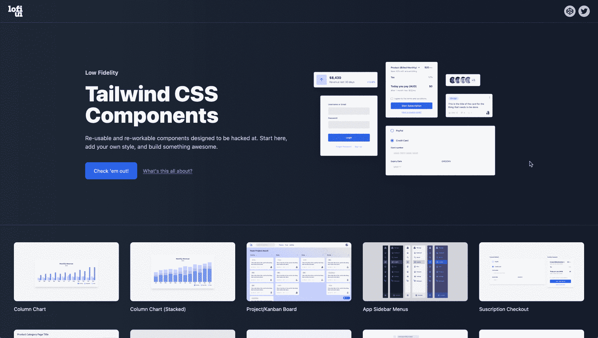
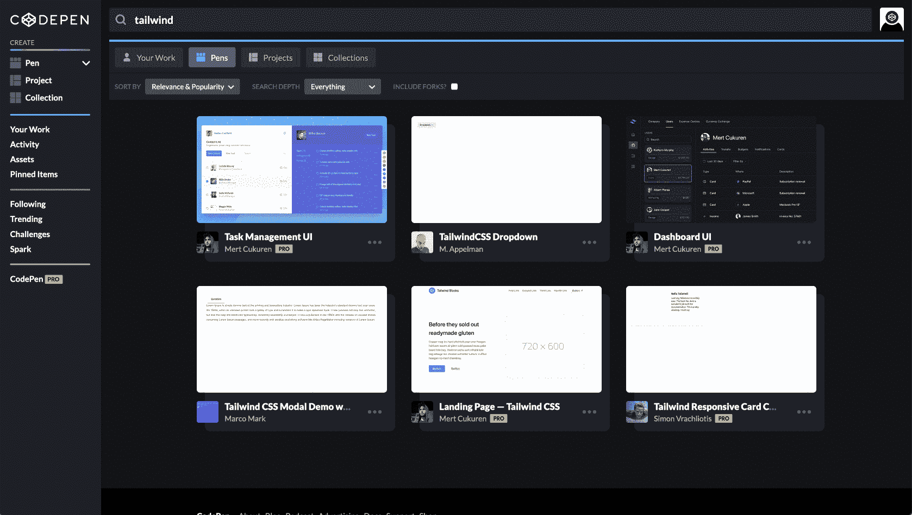

# 顺风 CSS 组件的 10 个开源库

> 原文：<https://betterprogramming.pub/10-open-source-libraries-for-tailwind-css-components-fdbcb692afa9>

## 创建漂亮的网站从未如此简单

保罗·梅尔基在 [Unsplash](https://unsplash.com?utm_source=medium&utm_medium=referral) 上的照片。

[Tailwind CSS](https://tailwindcss.com/) 是一个革命性的设计框架，吸引了铁杆粉丝和评论家。粉丝们喜欢它的速度、简单性和强大的构建能力。批评者讨厌它臃肿的 HTML 设计。不管你站在哪一边，Tailwind 都已经引起了开发者社区的重大转变。

如果您喜欢使用 Tailwind 构建 web 应用程序，那么利用预构建的组件和页面会更好。[顺风 UI](https://tailwindui.com/) 是顺风创始人的(部分付费)大作。然而，如果你正在寻找更多的免费替代品，顺风社区会支持你。下面的组件和模板使您能够轻松地将 HTML 复制并粘贴到您自己的项目中，而没有任何依赖性。

# 1.尾部套件

[超过 250 个免费组件](https://www.tailwind-kit.com/)和免费模板。用于普通 HTML、React、Vue.js 和 Angular web 应用程序。

来源:[尾部套件](https://www.tailwind-kit.com/)

# 2.尾座

通过拖放界面， [Tailblocks](https://tailblocks.cc/) 为漂亮的网页提供了一个独特的开源生成器。超过 60 个 CSS 块可以使用。完全响应黑暗模式支持。

来源:[尾板](https://tailblocks.cc/)

# 3.顺风组件

[您项目的开源组件和模板的集合](https://tailwindcomponents.com/)——从小组件到完整的登录页面。

来源:[顺风组件](https://tailwindcomponents.com/)

# 4.**顺风启动套件**

有据可查和[高质量的组件和页面](https://www.creative-tim.com/learning-lab/tailwind-starter-kit/presentation)。支持 HTML、React、Vue 和 Angular。

来源:[顺风启动套件](https://www.creative-tim.com/learning-lab/tailwind-starter-kit/presentation)

# 5.Kometa UI 套件

[超过 130 个部分](https://kitwind.io/products/kometa/)，完全响应，并提供 HTML、Vue 和 React。您可以在无限的个人和商业项目中使用它们。

来源:[科梅塔 UI 套件](https://kitwind.io/products/kometa)

# 6.主题.开发

[高品质、手工制作的主题](https://www.themes.dev/)。SAAS 公司的登录页面和仪表盘以及[整个顺风调色板](https://www.themes.dev/tailwindcss-colors/)的概述。

来源: [Themes.dev](https://www.themes.dev/)

# 7.Meraki UI 组件

[一系列响应组件](https://merakiui.com/)，以及许多漂亮的卡片。

来源: [Meraki UI 组件](https://merakiui.com/)

# 8.邪恶街区

不断增长的[开源布局块和组件集合](https://blocks.wickedtemplates.com/),随时可以复制粘贴！

来源:[邪恶街区](https://blocks.wickedtemplates.com/)

# 9.Lofi UI

Lofi UI 是一个来自 CodePen 的精选片段集。

来源: [Lofi UI](https://lofiui.co/)

# 10.密码笔

最后但同样重要的是，[搜索 CodePen 自己](https://codepen.io/search/pens?q=tailwind)！

许多个人贡献者在 CodePen 上放置一个组件。这其中就包括 [Adam Wathan](https://codepen.io/adamwathan) ，顺风社的创始人。简单地搜索顺风会发现一些精彩的片段。

感谢阅读！