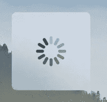
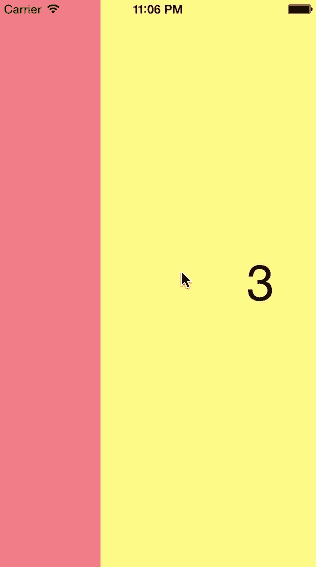
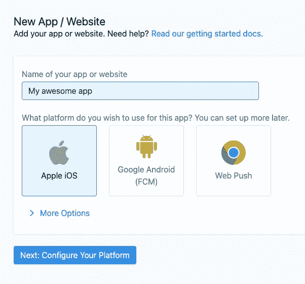
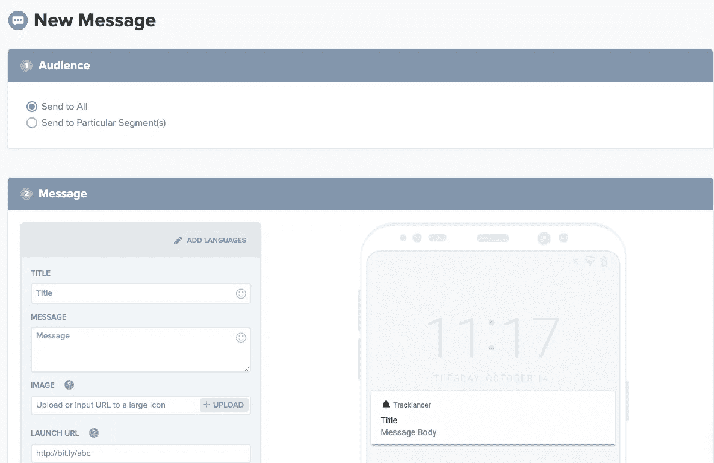
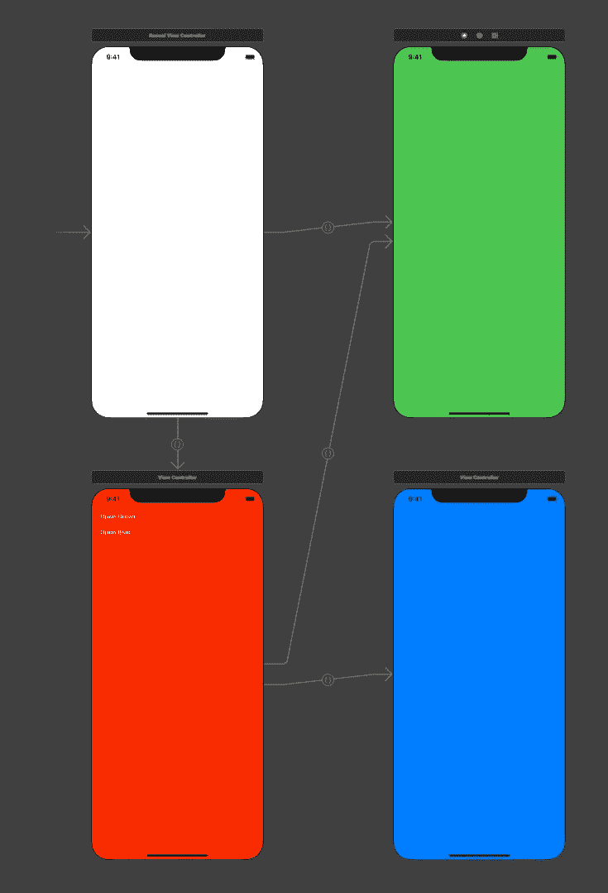
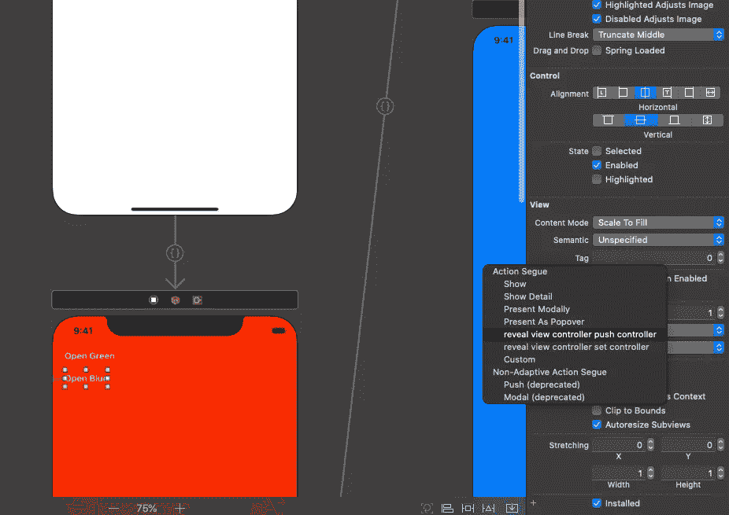
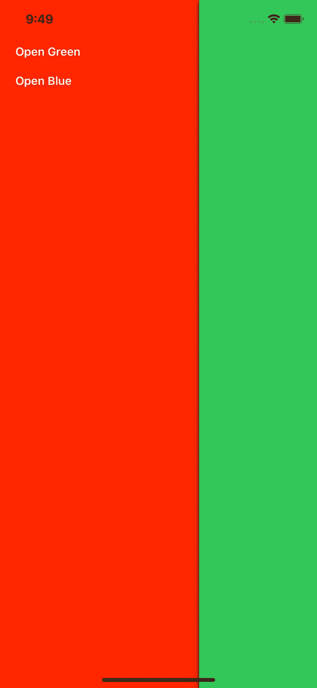

# 在新的 iOS 项目中使用 10 个 pod

> 原文：<https://betterprogramming.pub/10-pods-to-use-in-a-new-ios-project-5ab7180e794a>

## 有用的豆荚开始你的项目


照片由[熊燕](https://unsplash.com/@slothxbear?utm_source=medium&utm_medium=referral)在 [Unsplash](https://unsplash.com?utm_source=medium&utm_medium=referral) 上拍摄

如果你开始开发一个新的 iOS 应用，你可能需要使用几个外部库。即使这将是一个非常简单的任务，您也可能希望收集一些统计数据，发出请求或者显示一个负载指示器。所有这些都可以在没有外部库的情况下完成。毕竟外部库也是代码，代码可以自己写。但是，如果别人已经花了几个月或几年的时间做了一些事情，而且他们准备免费提供给你，你为什么要从头开始做呢？

iOS 最流行的依赖管理器是`Cocoapods`。它下载您需要的库及其依赖项。它非常容易集成，并且拥有最大的 iOS 库集合。事实上，`Cocoapods`是一个标准的依赖管理器。所有流行的开源库都使用它。

在本文中，我将展示当我开始几乎每一个新项目时我使用哪些库，以及为什么。

# 使用椰子恐龙

这是对`Cocoapods`系统的简要概述。如果你熟悉它，跳过这一节。

如果您的系统中仍然没有`Cocoapods`，请打开终端应用程序并键入:

```
sudo gem install cocoapods
```

创建一个新项目，在“终端”中打开包含项目的文件夹，然后键入:

```
pod init
pod install
```

您将获得一个工作空间文件。从这一刻起， *y* 你应该只打开工作空间，而不是一个项目，否则，Xcode 不会看到你的依赖项，你会得到一个不存在的代码的引用。要添加依赖项，请使用`Podfile`。这是一个 Ruby 脚本，但是你不需要知道 Ruby 来编辑它。有几个简单的规则。

首先，让`Cocoapods`了解你的目标系统。比如 iOS。不要忘记指定您的最低 iOS 版本:

```
platform :ios, '10.0'
```

由于外部库中的所有警告都与我无关，所以我通常会添加这一行:

```
inhibit_all_warnings!
```

它将关闭外部库中的所有警告。

如果你使用 Swift，你可能想使用框架。一些 pod 需要这样:

```
use_frameworks!
```

每个目标可以有单独的依赖关系。例如:

```
target 'MyApp' do
  pod 'Alamofire'
  pod 'Kingfisher'
  # ...
end
```

如您所见，您可以使用符号`#`添加注释。

任何目标都可以有无限数量的库。有时您需要指定一个版本或版本范围。在这种情况下，库的网页会给你一些说明，但是一般的语法是这样的:

```
pod 'Kingfisher', '~> 5.4'
```

就是这样！让我们来看看我最常用的十个图书馆。

# 翠鸟或 SDWebImage

这两个库，用于 Swift 的 Kingfisher 和用于 Objective-C 的 SDWebImage，允许您将图像从 URL 直接加载到您的`UIImageView`中。它们支持缓存、转换等等。它们在可回收列表中非常有效，比如`UITableView`和`UICollectionView`。换句话说，如果你想从网上下载图片，这些库中肯定有一个适合你。

将其添加到您的`Podfile`:

```
**pod** 'Kingfisher'
# or
**pod** 'SDWebImage'
```

与 UIKit 一起使用:

```
**let** url = URL(string: "https://example.com/image.png")
imageView.kf.setImage(with: url)
```

SwiftUI 的用法:

```
**import** KingfisherSwiftUI

**var** body: some View {
    KFImage(URL(string: "https://example.com/image.png")!)
}
```

带 Objective-C 的 SDWebImage:

```
#import <SDWebImage/SDWebImage.h>// ...[imageView sd_setImageWithURL:[NSURL URLWithString:@"http://www.domain.com/path/to/image.jpg"]
             placeholderImage:[UIImage imageNamed:@"placeholder.png"]];
```

翠鸟和 SDWebImage 都可以和 Swift 和 Objective-C 一起使用，但是翠鸟是用 Swift 写的，SDWebImage 是用 Objective-C 写的，我更喜欢用同样的方式使用它们。

[](https://github.com/onevcat/Kingfisher) [## onevcat/翠鸟

### 翠鸟是一个强大的，纯粹快速的库，用于从网上下载和缓存图像。它给你提供了一个机会…

github.com](https://github.com/onevcat/Kingfisher) [](https://github.com/SDWebImage/SDWebImage) [## SDWebImage/SDWebImage

### 这个库提供了一个带缓存支持的异步图像下载器。为了方便起见，我们为 UI 添加了类别…

github.com](https://github.com/SDWebImage/SDWebImage) 

# PKHUD

这个图书馆是我最喜欢的图书馆之一。没有它我真的不做项目，哪怕是最简单的。

任何异步过程都需要视觉反馈。可以是数据加载，文件上传，在后台线程处理，没关系。你需要显示一个指示器，它会挡住屏幕，向用户显示正在发生的事情。



PKHUD 进度

这正是 PKHUD 能为你做的。但这不是这个库的唯一用途:它还可以显示一条短消息，或者指示一个过程的成功或失败。视觉上它看起来像是 iOS 的一部分，它有扁平的设计，圆角，小动画，就像原生的 iOS 元素一样。

把它添加到你的`Podfile`:

```
**pod** 'PKHUD'
```

导入它:

```
**import** PKHUD
```

使用它:

```
HUD.show(.progress)// Some async processif success {
    HUD.flash(.success)
} else {
    HUD.flash(.error)
}
```

[](https://github.com/pkluz/PKHUD) [## pkluz/PKHUD

### 基于 Swift 的 Apple HUD 的重新实现(音量、铃声、旋转、...)适用于 iOS 8 及以上版本。iOS 8 官方模糊…

github.com](https://github.com/pkluz/PKHUD) 

# SwipeView

这是一个旧的但相当有用的 UI 库，修改 UIScrollView 以响应滑动手势和改变可见页面。在 Android 中，有一个类似的 UI 组件 ViewPager。



SwipeView。来源:[https://github.com/nicklockwood/SwipeView](https://github.com/nicklockwood/SwipeView)

库中的最后一次修改是在五年前，但它是用 Objective-C 编写的，所以它可以在任何现代 Swift 或 Objective-C 项目中工作。

将它添加到您的`Podfile`:

```
**pod** 'SwipeView'
```

将它添加到您的故事板或用代码创建它。你需要实现两个协议:`SwipeViewDataSource`和`SwipeViewDelegate`。

这个函数返回一个元素的大小。如果你想给一个元素和屏幕一样的大小，用`UIScreen.main.bounds.width`代替`width`。

```
**func** swipeViewItemSize(**_** swipeView: SwipeView!) -> CGSize {
    **return** CGSize(width: 250, height: 250)
}
```

下一个函数返回代表一个项目的`UIView`。它们可以重用，为了良好的内存管理，使用旧的`UIView`而不是创建一个新的很重要。请注意，如果这个函数被调用，并不意味着这个`UIView`将是可见的，它创建了可见的`UIView`的“邻居”来执行页面之间的平滑过渡。例如，如果您需要启动动画，请记住这一点。

```
**func** swipeView(**_** swipeView: SwipeView!, viewForItemAt index: Int, reusing view: UIView!) -> UIView! {
    **let** myView = (view as? MyView) ?? MyView(frame: CGRect(x: 0, y: 0, width: 250, height: 250))
    // ... Set up myView
    **return** myView
}
```

当用户滑动并且当前页面改变时，调用这个函数。此外，如果您以编程方式更改页面，也会调用它。如果您有一个页面指示器，这个回调是有用的:

```
**func** swipeViewCurrentItemIndexDidChange(**_** swipeView: SwipeView!) {
    **let** index = swipeView.currentItemIndex
    // ...
}
```

还有一个更重要的函数返回总页数:

```
**func** numberOfItems(in swipeView: SwipeView!) -> Int {
    items.count
}
```

[](https://github.com/nicklockwood/SwipeView) [## nicklockwood/SwipeView

### SwipeView 是一个类，旨在简化 iOS 上水平分页滚动视图的实现。它是基于…

github.com](https://github.com/nicklockwood/SwipeView) 

# 能达到性

这个库有两个修改，一个是针对 Swift 的，另一个是针对 Objective-C 的。它们几乎是相同的，所以我只以 Swift 版本为例。两个库都会报告您当前的互联网连接状态。您可以只请求一个状态，也可以使用回调来监控更改。

不过先加到`Podfile`:

```
pod 'ReachabilitySwift'
```

此示例显示了如何检查用户是否连接到互联网:

```
**import** Reachability**lazy** **var** reachability: Reachability = **try**! Reachability()**public** **func** isNetworkAvailable() -> Bool {
    reachability.connection != .unavailable
}
```

在他们的官方网站上，他们还提供了一个监控网络状态的例子。

[](https://github.com/ashleymills/Reachability.swift) [## ashleymills/Reachability.swift

### Reachability.swift 是苹果可达性示例的替代品，用闭包重新编写在 swift 中。这是…

github.com](https://github.com/ashleymills/Reachability.swift) [](https://github.com/tonymillion/Reachability) [## 到百万/可达性

### 这是苹果可达性类的直接替代。它是 ARC 兼容的，并使用新的 GCD 方法…

github.com](https://github.com/tonymillion/Reachability) 

# 单一信号

如果你需要向 iOS、Android 或 web 发送远程推送通知，你可能会喜欢 OneSignal 服务。免费帐户允许您向移动设备发送无限量的推送通知。

首先，[创建一个账户](https://app.onesignal.com/signup)或[登录一个已有的账户](https://app.onesignal.com/login)。



创建 OneSignal 应用程序

对于 iOS，您需要上传来自 Apple 的证书。对于 Android，来自 Firebase 的一个键。[本文档](https://documentation.onesignal.com/docs/generate-an-ios-push-certificate)描述了如何生成 iOS 推送证书。

配置过程比较长，这里就不全抄了。相反，如果需要，您可以从官方文档中阅读:

[](https://documentation.onesignal.com/docs/ios-sdk-setup) [## iOS SDK 安装程序

### OneSignalNotificationServiceExtension 允许您的 iOS 应用程序接收带有图像的丰富通知…

documentation.onesignal.com](https://documentation.onesignal.com/docs/ios-sdk-setup) 

可能看起来很复杂，但只是第一次。当整合结束时，使用 OneSignal 将变得快速而简单。

现在，您可以向您的 iOS 设备发送推送通知。别忘了模拟器不接收推送通知。此外，您需要运行应用程序并接受推送通知。



一个信号。发送通知

点击“新推”，享受众多选项。您也可以使用 [OneSignal REST API](https://documentation.onesignal.com/docs/onesignal-api) 发送推送通知。

[](https://onesignal.com/) [## 排名第一的推送服务|发送手机和网络推送通知

### 全球领先的移动推送通知、网络推送和应用内消息服务。受 800，000 家企业的信任，发送 5…

onesignal.com](https://onesignal.com/) 

# SwiftEventBus

这是一个小但非常有用的库。它将消息从代码的一部分发送到另一部分。它可以在后台线程中发送命令，或者跳转到 UI 线程中。

首先更新你的`Podfile`:

```
**pod** 'SwiftEventBus'
```

它使用了发布者和订阅者的概念。您可以使用以下命令从代码的任何部分发布事件:

```
SwiftEventBus.post("eventName")
```

事件名称必须是字符串，为所有事件类型创建常量以避免拼写错误是一个好习惯。您还可以传递带有参数的字典和/或指定发送者:

```
SwiftEventBus.post("eventName", sender: anyObject, userInfo: someDictionary)
```

`Sender`可以是任何对象，包括您自己类型的对象。`UserInfo`是一本字典。如果您收到一个事件，您需要一个订阅者。这不是强制性的，但如果你没有它，信息就无处可去。

```
SwiftEventBus.onMainThread(target, name: "eventName") { result in
    // This code will be executed in main thread
}
```

怎么可能有用？假设您有一个 Firebase 身份验证，并且希望在每次身份验证状态改变时更新 UI。

这可以在 AppDelegate 中完成(在 Firebase 初始化之后):

```
Auth.auth().addStateDidChangeListener { (auth, user) in
  SwiftEventBus.post("authenticationStatusChanged") // Make it a constant ;)
}
```

由于 Firebase Auth 使用 singleton，所以不需要传递任何参数，我们可以从`Auth.auth().currentUser`中获取它们。

更新 UI 是`UIViewController`的责任，所以你可以把订阅功能放在`viewDidAppear`上，把取消订阅功能放在`viewWillDisappear`上。

```
SwiftEventBus.onMainThread(self, name: "authenticationStatusChanged") { result in
    // Update UI
}// ...SwiftEventBus.unregister(self)
```

我一直假设，能出问题就出问题，所以卸载活动前别忘了退订。要么在`viewWillDisappear`要么在`deinit`。

[](https://github.com/cesarferreira/SwiftEventBus) [## cesarferreira/SwiftEventBus

### 允许组件之间进行发布-订阅式的通信，而不需要组件明确知道…

github.com](https://github.com/cesarferreira/SwiftEventBus) 

# `网络浏览器

这个库的名字很容易描述。它是一个单独的视图控制器，带有`WKWebView`。它支持共享、JavaScript 和其他特性。它既可以作为模态打开，也可以用`UINavigationController`推动。

将此添加到您的`Podfile`:

```
**pod** 'WebBrowser'
```

当您需要打开它时，创建一个`WebBrowserViewController`的实例并配置它:

```
**let** webVC = WebBrowserViewController()
webVC.delegate = self// ... other adjustmentswebVC.loadURLString("https://medium.com/")
```

推动它:

```
navigationController?.pushViewController(webVC, animated: true)
```

…或者用情态表达:

```
**let** nav = WebBrowserViewController.rootNavigationWebBrowser(webBrowser: webVC)
present(navigationWebBrowser, animated: true, completion: nil)
```

就是这样！现在，您可以在自己的网站上显示隐私政策、说明或支持聊天，而无需制作原生版本。

[](https://github.com/teambition/WebBrowser) [## 团队定位/网络浏览器

### 使用 WebKit 并用 Swift 为 iOS 应用程序编写的网络浏览器。在你的 Cartfile: github 中指定“WebBrowser”…

github.com](https://github.com/teambition/WebBrowser) 

# SWRevealViewController

另一个古老但非常有用的图书馆。iOS 应用程序中的标准导航方式有:

*   底部的标签栏最多有五个项目
*   带有操作按钮的导航栏

这些动作按钮或者执行某些动作，或者打开警报、动作表或弹出菜单。

另一方面，Android 应用程序经常提供边栏。它们在那里土生土长，你可以更经常地看到它们。使用用 Objective-C 编写的 SWRevealViewController(这意味着它与所有版本的 Swift 兼容)，你可以毫不费力地将这样的边栏添加到你的 iOS 应用程序中。

首先，我们来添加一个 pod:

```
**pod** 'SWRevealViewController'
```

我将展示如何使用故事板来做这件事，但是你可以用纯代码来做。这个库提供了相当好的[文档](https://github.com/John-Lluch/SWRevealViewController)和几个[例子](https://github.com/John-Lluch/SWRevealViewController/tree/master/RevealControllerExample)。

让我们创建四个`UIViewController`(见截图):



屏幕布局

*   根`UIViewController`(白色)应该是`SWRevealViewController`的一个实例。
*   侧边栏(红色)可以是任何一个`UIViewController`，但是在设计它的时候你应该记住它不会完全显示。侧边栏应该用类型为`SWRevealViewControllerSegueSetController`的 segue 连接到根屏幕。这个序列应该有`sw_read`标识符。这很重要。
*   绿屏是两个前屏之一，也是默认的一个。默认屏幕应该用类型为`SWRevealViewControllerSegueSetController`和名称为`sw_front`的 segue 连接到根屏幕。由于它可以从侧边栏打开，我们还添加了一个与`UIButton`的连接。这就好像你想在用户按下 UIButton 时打开屏幕，但是 segue 应该是`SWRevealViewControllerSeguePushController`类型。标识符并不重要，可以为空。
*   蓝屏和绿屏一样，但是没有和根屏连接。出于显而易见的原因，应该只有一个默认的前端控制器。



添加片段

还有一个细节:我们需要添加一个打开侧边栏的方法。有两种标准方式，从左边滑动和使用按钮。将此代码添加到所有前端控制器中:

```
**import** SWRevealViewController//...**override** **func** viewDidLoad() {
    **super**.viewDidLoad()
    **if** **let** gr = revealViewController()?.panGestureRecognizer() {
        **self**.view.addGestureRecognizer(gr)
    }
}
```

这将激活滑动手势。如果你想添加一个按钮打开侧边栏，把这个代码添加到`@IBAction`:

```
revealViewController()?.revealToggle(sender)
```

结果我们得到了什么？启动应用程序后，你会看到一个绿色的屏幕。用手指(模拟器上的鼠标)从屏幕左侧拉动侧边栏，会出现一个侧边栏。



iOS 应用程序中的边栏

边栏上的两个按钮将打开一个绿色和一个蓝色的屏幕。一开始看起来可能很复杂，但是当你掌握它的时候，它不会比，例如，一个标签栏难太多。

前屏幕可以有任何类型。它们可以是简单的`UIViewController`或更复杂的，如`UINavigationController`或`UITabBarController`取决于你的需要。

[](https://github.com/John-Lluch/SWRevealViewController) [## John-Lluch/SWRevealViewController

### 一个 UIViewController 子类，用于显示前控制器后面的后(左和/或右)视图控制器…

github.com](https://github.com/John-Lluch/SWRevealViewController) 

# SwiftyGif

在应用程序中使用 gif 可能是个好主意。它们小巧高效。显示 gif 比显示 MPEG 或 QuickTime 视频要容易得多。库 [SwiftyGif](https://github.com/kirualex/SwiftyGif) 将帮助你添加 Gif 支持，只需几行代码。

将此添加到您的`Podfile`:

```
**pod** 'SwiftyGif'
```

SwiftyGif 直接在`UIImageView`组件中添加 Gif 动画，甚至没有子类化它们。

您可以通过编写以下代码以编程方式创建它:

```
**import** SwiftyGif

**do** {
    **let** gif = **try** UIImage(gifName: "MyImage.gif")
    **let** imageview = UIImageView(gifImage: gif, loopCount: 3) // Will loop 3 times
    imageview.frame = view.bounds
    view.addSubview(imageview)
} **catch** {
    **print**(error)
}
```

将其添加到现有的`UIImageView`:

```
**let** gif = **try** UIImage(gifName: "MyImage.gif")
**self**.myImageView.setGifImage(gif, loopCount: -1) // Will loop forever
```

您也可以从网上下载:

```
**let** url = URL(string: "...")
**let** loader = UIActivityIndicatorView(style: .white)
cell.gifImageView.setGifFromURL(url, customLoader: loader)
```

借用[官网](https://github.com/kirualex/SwiftyGif)的例子。

[](https://github.com/kirualex/SwiftyGif) [## kirualex/SwiftyGif

### 高性能和易于使用的 Gif 引擎源代码' https://github . com/cocoa pods/specs . git ' use _ frameworks！豆荚…

github.com](https://github.com/kirualex/SwiftyGif) 

# RSSelectionMenu

最后要说的 pod 是 [RSSelectionMenu](https://github.com/rushisangani/RSSelectionMenu) 。当你需要给用户一个从列表中选择的方法时，这是一个很好的时间节省。非常典型的情况。你可以使用这个库，而不是用`UITableView`(或`UITableViewController`)创建你自己的`UIViewController`。

再来补充一下`Podfile`:

```
**pod** 'RSSelectionMenu'
```

在源代码中，让我们定义一个选项列表:

```
**let** options = ["New York", "London", "Istanbul", "Moscow", "Berlin", "Paris", "Beijing", "Tokyo"]
```

剩下的取决于你打算如何使用它。您只能选择一个或多个选项。您可以预先选择一些选项。你可以推动它，也可以用情态表达它。

```
**let** selectionMenu = RSSelectionMenu(dataSource: options) { (cell, item, indexPath) in
    // ...
}
```

让我们来推动它(我们需要有一个活跃的`UINavigationController`):

```
selectionMenu.show(style: .push, from: **self**)
```

[](https://github.com/rushisangani/RSSelectionMenu) [## rushisangani/RSSelectionMenu

### 一个优雅的选择列表或下拉菜单，用于 iOS 的单项或多项选择。单项和多项选择。

github.com](https://github.com/rushisangani/RSSelectionMenu) 

# 结论

外部库非常有用。并且`Cocoapods`让你使用它们没有任何头痛。嗯，差不多了。在使用这些框架之前，不要忘记检查您的 Swift 版本(如果库是用 Swift、iOS 目标范围和许可证编写的)。不要害怕寻找新的库。您可以在您的项目中使用数百个精彩的 pod。

编码快乐，下次见！