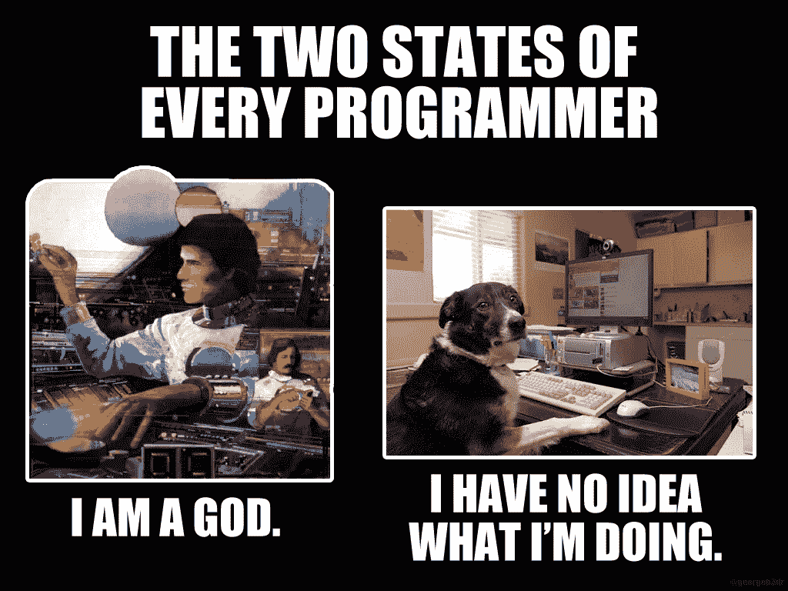
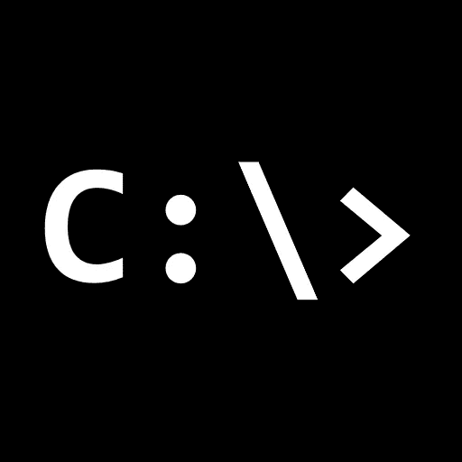
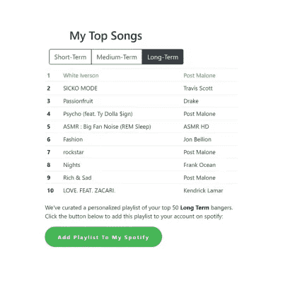

# 2022 年计算机科学新生的 10 个非传统黑客

> 原文：<https://betterprogramming.pub/10-pro-tips-for-incoming-computer-science-students-in-2020-d115945c7584>

## 一个以前犯过所有错误的大学生的建议

图片鸣谢:[http://uobwww . isys . Bristol . AC . uk/study/understand/2021/computer-science/BSC-comp-sci/](http://uobwww.isys.bristol.ac.uk/study/undergraduate/2021/computer-science/bsc-comp-sci/)

随着八月下旬的临近，大学又要开学了。不管你的学校是在线的还是面对面的，我相信你可以做一些事情来让今年成功。本文为计算机科学专业的学生收集了一些建议，帮助他们度过成功的一年。这些信息来自我在大学四年的学习，以及来自其他学生、毕业生和教授的各种建议。

# **1。你还不需要知道如何编程**

*这就是证据！*

相信我，你不需要知道如何编程来获得计算机科学学位。见鬼，如果每个人都应该知道自己在做什么，这个学位就不会存在了。想要证据吗？这是证据 A:

 [## Spencer pauly/排序算法

### 我的第一个排序函数是在 CS1-Spencer pauly/Sorting-Algorithm 中学习了这些之后创建的

github.com](https://github.com/spencerpauly/Sorting-Algorithm/blob/master/main.cpp) 

这是我的第一个个人项目，是我在大一中途做的。这是一个超级简单的排序程序——就像 100 行代码一样简单。但当时我非常自豪，认为我发现了一些令人惊讶的新算法。我分享这个的原因是，我对这个小项目感到足够自豪，并把它放在 Github 上，这一事实应该表明我对我的 CS 学位所知甚少！

现在，仅仅过了三年，我在 app store 上推出了一个移动应用程序，并在过去的两年里做了各种其他中型项目。从冒泡排序到应用商店的道路可能会很艰难，但相信我，这是可以实现的。学校会很好地教你基础知识，所以不要担心你知道多少进入专业。在你学会了基础知识之后，在你毕业之前，你需要获得更多的知识。这些技巧的其余部分旨在帮助你做到这一点。

# **2。驾驭浪潮走向精通**

如果你像我一样，当你踏上旅程时，你会不断地感觉自己处于这两个阵营中的一个。尽管一直感觉自己像上帝一样很棒，但这并不实际，你肯定会一次又一次地陷入困境。

我喜欢把这种范式想象成仅仅是乘风破浪达到精通。你必须经历起起落落，但你会发现，随着你学习更多的东西，总的长期趋势将是一个向上的斜坡。

我在这里的建议是，在学习过程的艰难阶段不要气馁。学习这些技巧需要很长时间，所以放松一下，乘风破浪就好。

# **3。当众学习**

这是我越来越想做的一个概念。它的理念是，无论何时你学习新的东西，你都应该在公共环境中学习。所以，如果你正在开发一个应用程序，就要以一种别人可以跟随你的方式来构建它。你可以通过在 medium 或 dev.to 上发布每周博客，在 Twitter 上发布每日更新，甚至创建 YouTube 频道并在那里分享你的学习成果。

这有两个好处:

1.  雇主们喜欢这个。公司知道没有一个实习生会成为他们领域的大师，这不是他们想要的。公司正在寻找善于学习、善于沟通、对自己的工作充满热情的人。没有比拥有一个你的思想库并说“看，这是我过去一年学到的一切”更好的展示这些品质的方式了
2.  这会让你成为一个更好的学习者。每周有一个固定的时间让你坐下来反思你学到的东西，然后与世界分享，这有助于你巩固知识。看到其他人参与到你正在解决的问题中也是很有动力的——它可以给你继续前进的动力。

# **4。你需要一个个人网站**

这是关键。如果你打算在公共场合学习，制作一个个人网站是个好主意，它可以给人们一个集中的地方来查看你正在做的所有很酷的事情。这也是一个很棒的编程项目，因为你可以把它变得简单或复杂，一旦你完成了它，你就可以很容易地与世界分享。

*额外提示:在建立网站时，不要成为一个完美主义者。我已经在三年内重做了三次我的网站，并计划在不久的将来再次重做。拥有一个网站比拥有一个完美的网站更重要。*

我有一些同学用普通的 HTML 创建了他们的程序，效果很好！我有一些教授的网站是用纯 HTML 制作的。如果你对设计不感兴趣，让它简约和纯粹的功能性是一个很好的选择。

# **5。利用学生津贴！**

利用你所有的学生折扣！你可以享受这些折扣，并且在毕业前可能永远不用支付任何云托管费用。你可以在任何地方找到这些交易，但我最喜欢查看学生津贴的地方是 Github 学生开发包。以下是我最喜欢的一些交易:

*   [云服务的 100 美元 AWS 积分](https://aws.amazon.com/education/awseducate/)
*   [学生时代免费 GitHub Pro](https://education.github.com/pack)
*   [免费一年一个名字便宜。me 域名](https://education.github.com/pack)
*   50 美元的免费数字海洋云托管服务
*   [200 美元的免费 MongoDB Atlas 信用点](https://www.mongodb.com/students)

# **6。了解三种计算机科学课程的区别**

计算机科学专业有三种不同类型的课程。了解这两者之间的区别很重要，因为有些领域你可能不感兴趣，没关系。

## **算法课程**(例如:离散数学、有限自动机、数据结构)

当人们说计算机科学中有很多数学时，这些课程就是他们所谈论的。这些课程类似于数学课，教给你更多关于计算机科学的理论知识。他们会教你如何开发算法，如何写证明，数据结构等等。如果你喜欢这些课程，它们可以成为你进入研究生院、博士学位、教学或研究领域的途径。

## **硬件/低级课程(针对**示例:操作系统、计算机网络、计算机架构)

这些课程教你计算机内部发生了什么。您将学习 CPU 调度、网络、汇编编程、操作系统和权限等内容。如果你喜欢这些课程，这可以引导你从事计算机工程、机器人或操作系统设计的职业。

## **编程课程**(例如:软件分析与设计、软件工程)

这些课程将教你如何编写软件。在这些课程中，你将学习面向对象设计、设计模式、数据库、前端设计、Git、项目管理等等。如果你喜欢这些课程，它们可以引领你进入网页设计、游戏开发、后端工程、软件工程等领域。选项太多，无法一一列举。

所有这些课程都很重要。你会发现一个概念会和另一个联系在一起，所以要注意每一件事。您可能首先在算法类中接触到一个假设的概念(如 big-O 符号)，然后在编程类中看到它的出现(用于确定构建 SQL 查询的最佳方式)。这很典型，也是所有这些类存在的原因。

额外提示:不要在同一个学期安排太多同一类型的课程，否则你可能会被太多相同类型的作业压得喘不过气来。这取决于具体的类，但通常这是一个很好的规则。

# **7。尽早完成项目和实验**

有些课程可能*非常*基于项目。我的每门以编程为重点的课程都有大约八个实验室和五六个不同难度的项目。如果你把它们留到最后几天，这可能会非常有压力，尤其是考虑到你可能不知道自己在做什么。

这有助于形成一种模式。我最终形成了一种模式，试图在项目到期前的周末完成项目——这很有帮助。这让你有能力离开，让你的大脑清醒一下，然后再回来处理一个问题。我今天还是这么做的！

# **8。学习命令行**

掌握 Unix 命令行是你在大学能学到的最实用的技能之一。您应该学习如何创建、编辑和删除文件，导航目录，移动文件，使用 vim 编辑文档，以及 shell 到其他计算机。这在当时可能看起来不是最重要的学习内容，特别是如果你在想“不，但是我不需要 X 的命令行”，但是事实是每个人都需要命令行来使用 Git 库、ssh 到你的生产环境中，等等。这是无法避免的。

# **9。每学期建立一个“顶点工程”**

这是我最喜欢的提高编程技能的方式。每学期结束后，当我在圣诞节或暑假时，我会建立一个“顶点工程”，巩固我所学的一切。这是一个保持编程习惯的好方法，建立你的简历，建立你真正想用的东西！

这些项目中我最喜欢的一个是我的 Spotify web 应用程序，它让我可以查看我最常听的歌曲和艺术家:

我的 Spotify 网络应用

 [## Spotify 统计数据

### 该项目允许您查看您的 spotify 统计数据。目前，这意味着您可以查看您的前 50 首歌曲和…

spotify.spencerpauly.com](https://spotify.spencerpauly.com/spotify/analysis.html) 

做你感兴趣的项目意味着你想完成它。所以我的建议是构建一些你想用的东西。即使它已经存在，也没关系——只需构建您将使用的东西。

# **10。实习是可以获得的**

由于 COVID，工作环境可能会发生变化，但相信我，仍然会有实习机会。关键是要知道在哪里可以找到他们，以及如何在候选人身上找到他们想要的技能。如果你做了清单上的其他项目，比如在公共场合学习，拥有个人网站，建立顶点项目，无论你是哪一年，你都会是一个有吸引力的实习生。

以下是我得到实习机会的其他一些建议:

*   走出你没有为实习做好准备的心态。每个人在大学期间都在学习，所以让公司来判断你是否准备好了——不要替他们做决定。
*   总是有实习机会冒出来。去年 10 月份左右开始申请，11 月份实习。一些学生甚至开始得更早。在那之前的夏天，我在暑假前的最后一周得到了实习机会。新的机会无时无刻不在涌现，所以整个学年都要保持警惕。
*   如果可能的话，利用国家资助的实习委员会。如果你住在明尼苏达州，https://scitechmn.org/是我推荐的一个很好的资源。当地实习委员会的竞争范围较小，给你一个比 Indeed 更个性化的申请过程。

# 感谢阅读！

我希望你觉得这很有价值。如果你有更多的建议，请在评论中分享！