# 提高工作效率的前端开发工具

> 原文：<https://betterprogramming.pub/10-productivity-tools-for-front-end-developers-4021cdef6fcb>

## 作为前端开发人员，这些在线工具可以极大地提高您的 UI/UX 技能。

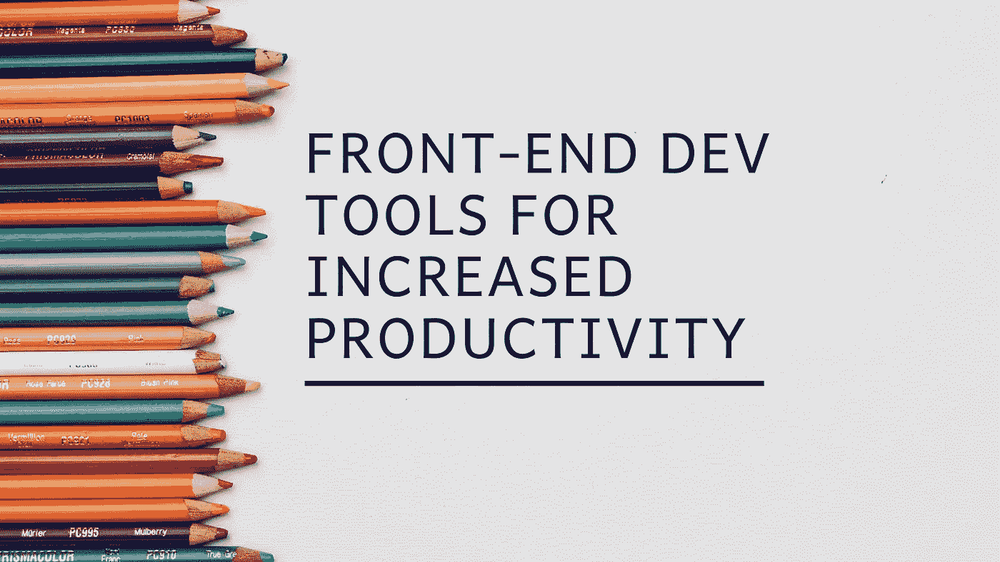

由[凯利·通盖](https://unsplash.com/@kellitungay?utm_source=unsplash&utm_medium=referral&utm_content=creditCopyText)在 [Unsplash](https://unsplash.com/s/photos/pencils?utm_source=unsplash&utm_medium=referral&utm_content=creditCopyText) 拍摄的 BG 图像

十年前，“前端 web 开发”并不是一个非常流行的术语。但是，大多数 web 开发人员过去同时在网站和后端 web 应用上工作的日子已经一去不复返了。

前端开发是开发人员现在最酷的工作之一。在前端运行的现代框架的引入，如 [Angular](https://angular.io/) 、 [React](https://reactjs.org/) 和 [V](https://vuejs.org/) ue，支持许多被认为在浏览器端不可能实现的功能的现代浏览器，以及像 [WebGL](https://get.webgl.org/) 这样的图形引擎，只是前端开发受到更多关注的一些因素。

也就是说，实现复杂的设计和直观的用户界面，在第一次访问时就能吸引任何人的注意力，并不是一件容易的事情。跟上所有即将到来的设计趋势、UI/UX 原则，同时保持性能是一个挑战。

因此，这里有一个在线工具列表，可以帮助您应对各种前端开发挑战，并提高您的工作效率。大部分纯粹跑前端！

# 1.CSS 网格生成器

CSS-grid 是一个基于网格的布局系统，可以仅使用 CSS 和 HTML 进行归档。与 bootstrap 或 flexbox 不同，网格系统是二维的，这使得它具有高度的可定制性，并且可以用更少的代码实现。

`[cssgrid-generator](https://cssgrid-generator.netlify.com/)`允许你用可定制的选项设计你的网格，如行、列甚至它们之间的间隙，并通过点击一个按钮导出网格的代码。

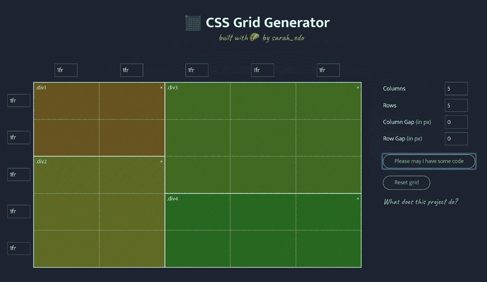

CSS 网格生成器

# 2.方框阴影

如果你曾经想知道如何为你网站上的任何形状实现令人敬畏的多层阴影效果，但发现很难编码，这里有一个超级酷的网站可以帮助你:[**brumm.af/shadows**](https://brumm.af/shadows)**。**

设置您的首选属性，如阴影层，阿尔法，模糊，传播等，它会立即生成阴影效果的 CSS 代码，您可以复制粘贴任何形状。

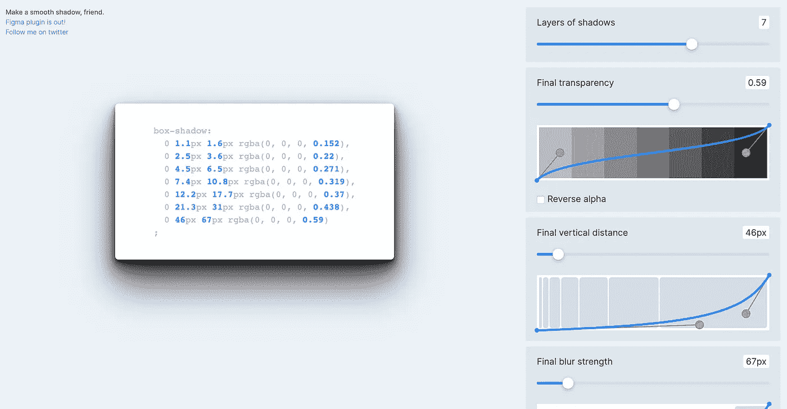

为方框阴影生成 CSS

# 3.Grabient

谁不喜欢他们的设计中有很酷的渐变呢！嗯，也许不是每个人，但无论你是不是渐变的粉丝，定制你的渐变以达到设计的精确匹配需要在编写 CSS 时反复试验。

[**Grabient**](https://www.grabient.com/) 为你做到这一点。只需选择你的颜色，调整你的角度，你很好地去与代码的期望梯度。

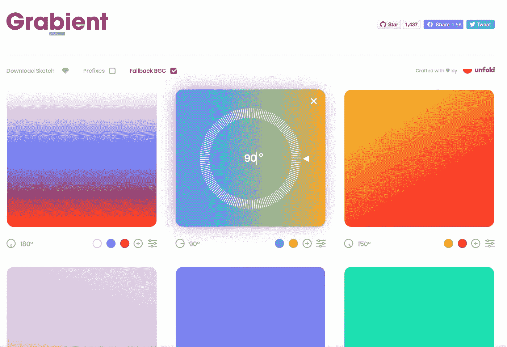

# 4.Mybrowser.fyi

让我们面对现实吧，不管你的网站编码有多好，你都可能在浏览器兼容性、响应性等方面遇到一些问题。在这些情况下，理解浏览器和系统的确切规格是解决具体问题的一个重要方面。

使用`[**mybrowser.fyi**](https://mybrowser.fyi/)` 您需要做的就是在发现问题的相同浏览器条件下打开工具。它会立即生成一份包含所有必要细节的报告，并为您提供一个可共享的报告链接。

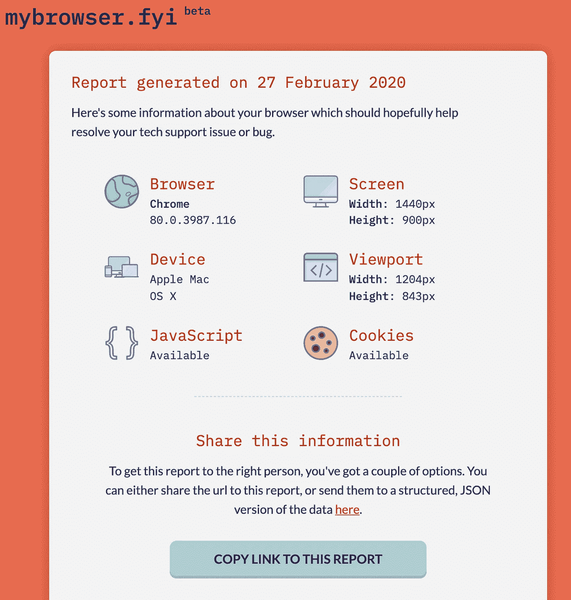

在 mybrowser.fyi 上生成的报告

# 5.季节

如果你在 CSS 中使用过过渡效果，那么你很有可能使用过`transition-timing-function`属性来设置过渡效果的速度，并使用`cubic-bezier()`函数来调整从开始到结束的变速过渡效果。但是传递`cubic-bezier()`的值对于获得准确的速度来说有点棘手，这就是 [**原因**](https://easings.netlify.com/) 为您简化工作的地方。只需从它们的集合`easeInSine`、`easeOutSine`等中选择你想要的效果，它就会给你应该传递给函数的值。您可以看到下面的示例图像:

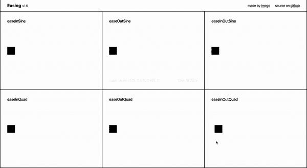

缓和过渡

# 6.iHateRegex

自定义条件包括，用户名应该以字母字符开头，不能包含除 *@、*之外的特殊字符，或者密码应该至少包含一个大写字母和一个特殊字符。根据正则表达式进行验证是前端最常用的技术之一，用于根据像这样的自定义条件进行验证。

但是为这些条件编写精确的正则表达式并不是每个人都喜欢的，尤其是如果您不熟悉 regex 的话。[**iHateRegex**](https://ihateregex.io/)**是一个可以用来查找正则表达式的工具，它可以根据输入来验证正则表达式，并使其可视化以获得更好的清晰度。**

**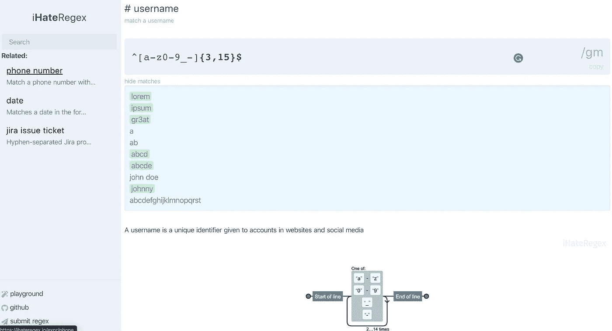**

**iHateRegex 上用户名的正则表达式**

# **7.浏览器插件**

**[browserhacks](http://browserhacks.com/) 是一个简单的工具，它有一个*广泛的列表，列出了来自互联网上的* ***特定于浏览器的*** *CSS 和 JavaScript hacks】。***

**不用说，黑客并不总是问题的完美解决方案，但在你需要快速解决似乎不容易找到解决方案的奇怪问题的情况下，它可以派上用场。但是这个网站包含了几乎所有浏览器以及每个浏览器不同版本的大量黑客攻击。**

**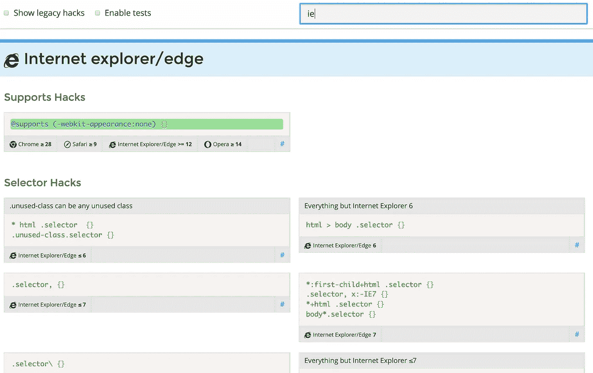**

**browserhacks.com ie 可用的黑客列表**

# **8.泛灵论者**

**回到动画上来， [animista](https://animista.net/) 是最好的网站之一，可以生成和定制各种效果的 CSS 动画代码。你可以从他们收集的各种用例中进行选择，如入口、出口、文本等，并使用众多效果对它们进行定制。如果你探索这个工具，你会惊讶于它提供的选项范围和易用性。**

**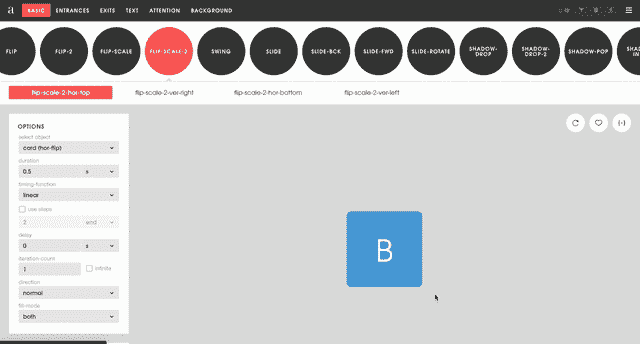**

# **9.酷派**

**定义配色方案是我们在设计网站时首先要做的事情之一。在大多数情况下，我们从一个基色开始，试着在基色周围创建一个调色板。**

**不管你有没有基本色，coolors[是一个在线生成调色板的又酷又直观的工具。它允许你只需按一个键就可以创建调色板，并以多种方法定制它们，如 HSB、RGB、CMYK 或老式的拾色器。您也可以锁定一种颜色或将其拖到不同的位置，然后根据需要在其周围生成其他颜色。你甚至可以调整各种色盲的设置。最好的部分是，他们提供了多种选项来导出像 SCSS，SVG，PDF，网址等。](https://coolors.co/)**

****

**在酷派上生成配色方案**

# **10.Optimizilla**

**前端工作的一个主要挑战是设法使资产尽可能轻，以确保为每个用户提供最高级别的性能。但这并不容易，尤其是当设计师扔进高质量的图像时，这些图像乍一看可能非常清晰和酷，但当你考虑页面加载时间时，其大小总是一个问题。**Optimizilla 是网络上最好的图像优化工具之一，“*使用最佳优化和有损压缩算法的智能组合，将 JPEG 和 PNG 图像缩小到尽可能小的尺寸，同时保持所需的质量水平”。*您还可以在网站上自行调整压缩级别和比较图像。****

****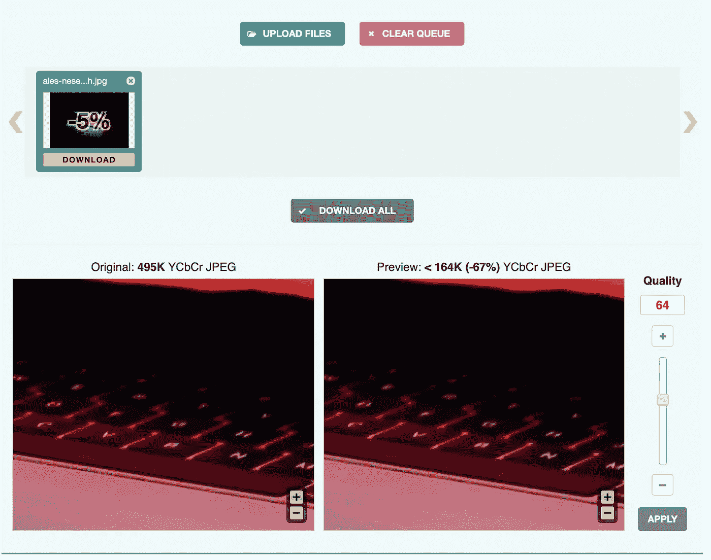****

****Optimizilla 上的图像优化****

****是的，我知道标题上写的是 10 英镑，但这是一个复活节彩蛋，可以让你一路走到这里！这是一个全新的概念，如果你还没有听说过的话，也是一个很酷的工具。****

# ****神经形态****

****Skeuomorphism 是使 UI 中的项目类似于它们在现实世界中的对应物的设计概念。一个最好的例子是苹果 iOS 13 中的编辑器工具。请注意，与旧设计相比，工具栏中的项目具有很好的 3D 效果，看起来很逼真。****

********

****神经形态是一种新的方法，将这种用户界面趋势提升了一个档次。名字基本上是“new”**和“skeuomorphism”的组合。在偏离文章标题之前，这里有一个很棒的工具，可以让你在线创建神经变形效果并立即生成 CSS。******

******在**[neu morphism . io](https://neumorphism.io/)**上，你可以非常容易地创建效果，并通过模糊、形状、强度甚至光照角度等属性来调整设计的外观和感觉。**********

****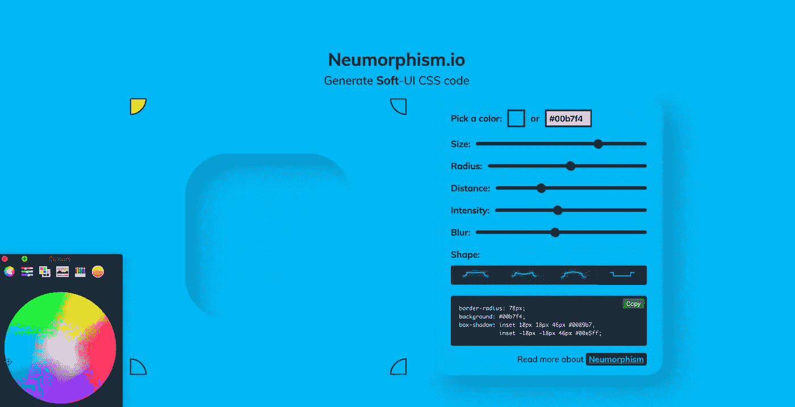****

****创造美丽的变体效果对变体效果. io****

****不再有惊喜！****

****我希望这些对你有用，如果你正在使用一些不在这里的很酷的工具，请在回复中提到它们！****