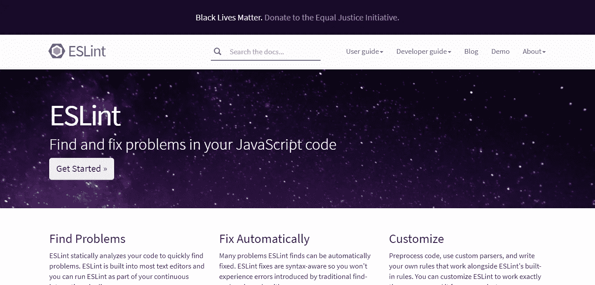
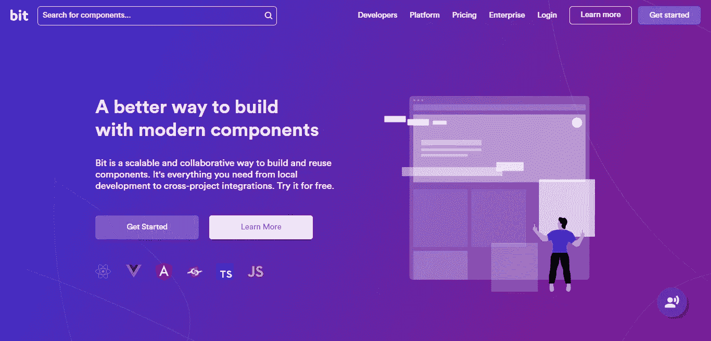
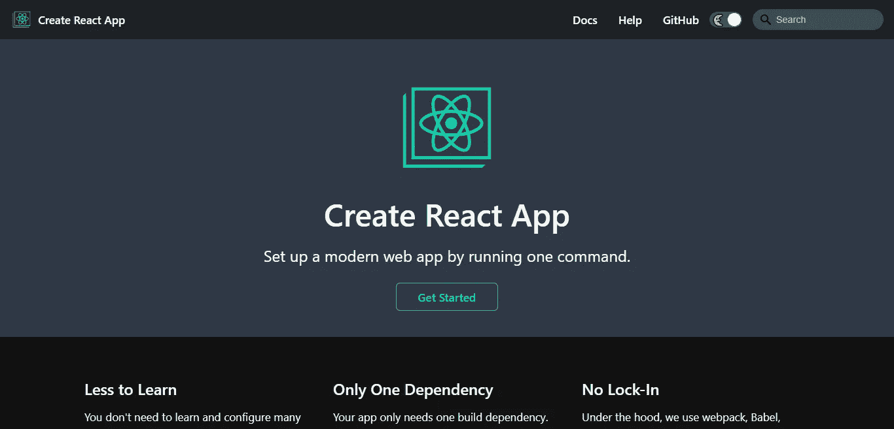
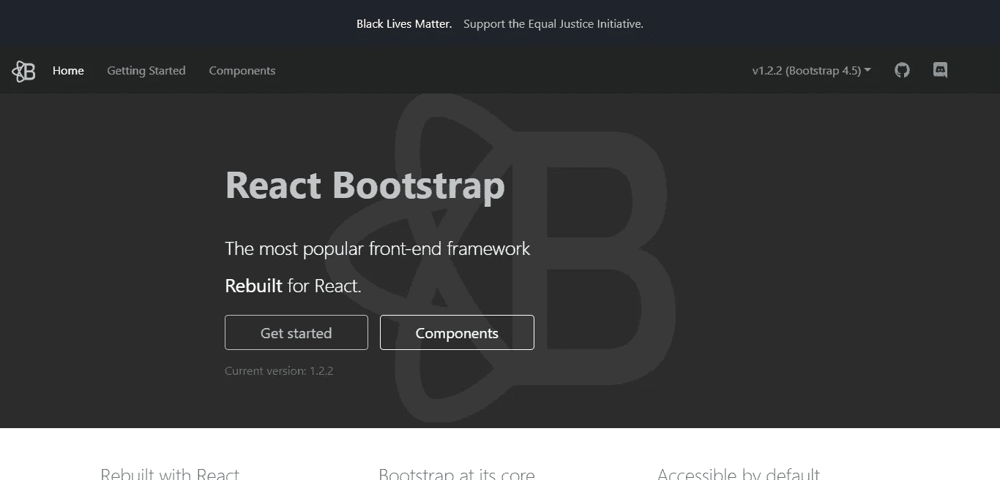
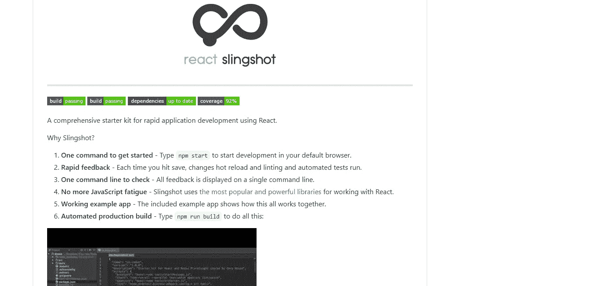
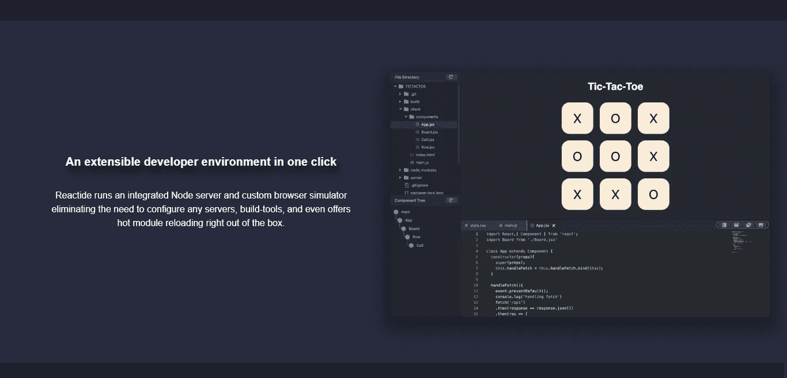
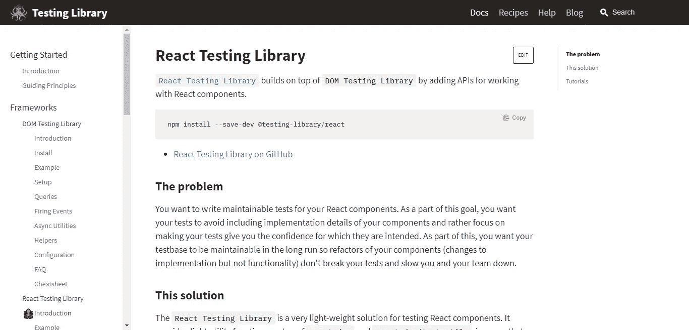
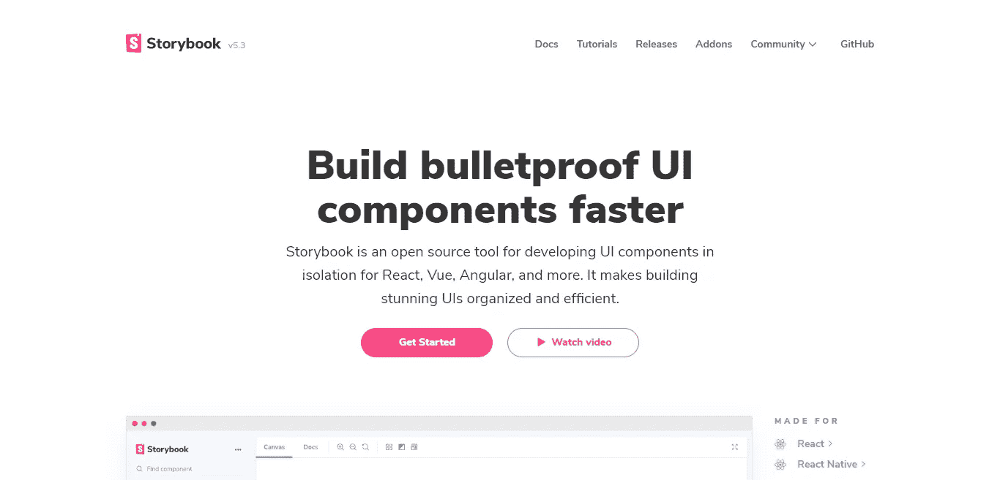

# 2020 年 React 开发人员的 10 个生产力工具

> 原文：<https://betterprogramming.pub/10-productivity-tools-for-react-developers-in-2020-3eca8d0e8caa>

## 借助这 10 款 React 工具，提高您的工作效率和应用质量

费伦茨·阿尔马西在 [Unsplash](https://unsplash.com/s/photos/react?utm_source=unsplash&utm_medium=referral&utm_content=creditCopyText) 上的照片

今天，我们将讨论一些伟大的和有前途的工具，以提高 React 开发人员的生产力，并增强整体开发工作流程。

通常，当我需要开始一个新项目时(至少是个人项目——工作有点不同),我会使用我自己的模板，这些模板带有我喜欢的工具，其中一些就在这个列表中。但我也使用我觉得还可以的工具，比如 Material UI。做了一些研究，并用一些流行的工具构建了一些示例应用程序和小项目，我决定分享我的一些发现。

那么让我们来看看我亲手挑选的 **React 生产力工具**。

# 1.埃斯林特

对于包括 React 爱好者在内的任何 JavaScript 开发者来说，ESLint 都是真正的游戏规则改变者。基本上，它包含了智能算法，可以快速分析您的代码中可能存在的错误。

它甚至让我们能够在不破坏语法的情况下自动修复问题。

首先，我推荐使用 Airbnb 开发人员创建的 [ESLint 配置](https://www.npmjs.com/package/eslint-config-airbnb)。它的一些主要优点包括:

*   对 React 库的内置支持(比如钩子的林挺规则)。
*   关注最佳实践。

这个工具是任何项目的必备工具，Airbnb 的配置是我最喜欢的配置之一——我给它添加了我自己的风格，但 90%都直接来自他们的包。

# 2.少量

Bit 为 React 开发人员引入了一个急需的协作平台，使团队能够在单个组件上协同工作。

它只不过是一个命令行工具，使我们能够编写可重用的代码。Bit 是完全开源的——这是它大受欢迎的主要原因。

它的大部分特性都集中在构建原子组件上，因此可以很容易地与他人共享。您甚至可以通过从项目中单独测试一个组件来验证它是否有任何依赖关系。

# 3.创建 React 应用

作为一名 React 开发人员，您可能已经注意到建立一个新的 React 项目是多么耗时。为了最大限度地减少这个问题，脸书的开发人员想出了一个出色的“ [Create React App](https://github.com/facebook/create-react-app) ”项目。

它就像一个初学者工具包，帮助您专注于编写应用程序，而不是配置 React 实例。你只需要执行`npx create-react-app my-app`就可以了。一个完整配置的应用程序现在可供您构建下一个项目。

如果你作为一名自由职业的 React 开发人员为多个客户工作，这将极大地提高你的效率。

# 4.反应宇宙

[React Cosmos](https://reactcosmos.org/) 是一个开发环境，致力于构建可伸缩的高质量用户界面，允许我们快速原型化、测试和迭代应用程序的每个组件。

它使得单个组件的原型化变得容易。然后，您可以在不破坏任何代码的情况下迭代它。它甚至通过隔离组件简化了问题的调试过程。

它更适合处理企业级的应用程序——因为通过将项目分成小的、可重用的组件，它帮助我们维护高质量的代码

# 5.React 工具箱

当我开始这篇文章的时候，我提到过我的大多数项目都使用材质 UI。这是一个很好的理由——我喜欢[材质设计](https://material.io/)和材质 UI 看起来就像要走的路。

然而，还有其他选择。像 [React 工具箱](http://react-toolbox.io/)，是一个常用组件的集合，全部采用材质设计。它使用 CSS 模块这样的概念来获得更大的灵活性。

在撰写本文时，React Toolbox 包含 28 个组件。其中一些包括“应用程序栏”、“日期选择器”、“开关”和“Snackbar”。

# 6.反应引导

如今，拥有一个手机友好型网站是标准配置。人们希望你的网站可以在任何设备上无缝运行。甚至搜索引擎也更喜欢在结果页面中显示一个有响应的网站。

许多开发人员依靠 Bootstrap 来设计响应迅速、可伸缩、外观专业的网站。问题是 Bootstrap 自带组件，这些组件没有与 React 集成。

为了填补这个空白，我们有一个名为 [React Bootstrap](https://github.com/react-bootstrap/react-bootstrap) 的开源包。它的所有引导组件都已经过重新构建，专门针对 React 开发人员。

# 7.反应弹弓

想要加快 React 应用程序的开发速度吗？看看[的反应弹弓](https://github.com/coryhouse/react-slingshot)。它是由 React、Redux 和 Babel 组成的样板文件。

Slingshot 最重要的特性，也是让它从其他工具中脱颖而出的特性，是快速反馈。基本上，每当你更新你的应用程序时，快速反馈会自动完成林挺、单元测试和热重装的过程。这样，您就可以花更多的时间编写实际的业务逻辑，而不是做无产出的任务。

# 8.反应素

开发人员和他们的编辑一样优秀。也可能不是，但是编辑器确实对我们的日常开发活动有很大帮助。我是 Jetbrains 的忠实粉丝，WebStorm 是我的首选 IDE，但我不时会尝试一些东西——就像我对 VS 代码所做的那样——并且我想看看其他选项。

我发现一个有趣的东西是[React ide](http://reactide.io/)——一个为 React 构建的 IDE。我真的很惊讶地发现了一个为它构建的 IDE——当然，我发现了许多其他 IDE 或文本编辑器的插件，但是一个成熟的 IDE 引起了我的注意。所以我试了一下。

它有一些有趣的特点。例如，您可以在 ide 中可视化项目的组件。它还有一个内置的 Node.js 服务器，集成了一个浏览器模拟器。

虽然很有趣，但我不认为我会改变。但是要记住，这是一个很好的选择，特别是如果您只需要 React，或者如果您想学习 React，但是不想在开始之前麻烦地调整代码编辑器。

# 9.反应测试库

测试第一——这是我一直说的！

拥有合适的测试工具非常重要。React 测试库是一个小库，允许你以一种鼓励最佳实践的方式测试你的 React 代码。它使用简单，并在标准库如`react-dom`和`react-dom/test-utils`的基础上进行扩展。

文档很好，并且提供了一些很好的例子来帮助您入门。

# 10.故事书

[Storybook](https://storybook.js.org/) 提供了一个交互式开发环境，您可以在其中创建新的组件，测试它们，或者从可用的组件库中挑选现有的组件。

它足够灵活，可以与任何主要的 JavaScript 前端框架一起工作。比如可以和 React，Vue.js，Angular，Svelte，Marko，甚至 raw HTML 一起使用。

故事书最好的一点是它有各种插件。我觉得它的一些附加功能很有趣，包括:

*   [谷歌分析](https://github.com/storybookjs/storybook/tree/next/addons/google-analytics)(在组件中添加对谷歌分析的支持)
*   [笑话](https://github.com/storybookjs/storybook/tree/next/addons/jest)(单元测试)
*   [故事镜头](https://github.com/storybookjs/storybook/tree/next/addons/storyshots)(使用快照测试组件)
*   [视口](https://github.com/storybookjs/storybook/tree/next/addons/viewport)(改变响应组件的布局)

故事书的设计很棒，真的很有前途。我希望将来能使用这个库开发更多的应用程序。

# 结论

React 是当今最流行的前端框架之一。因为它的流行，有大量的项目围绕着 React 和用 React 构建应用程序。

当选择新项目要用的工具时，只使用你所知道的就很容易了。但有时是为了探索存在的其他选择。如果你和我一样，你会对高质量工具的数量感到惊讶。

我希望你喜欢这个列表。如果你有任何我没有提到的建议或喜欢的，请让我知道——我很乐意尝试一下。

感谢阅读！