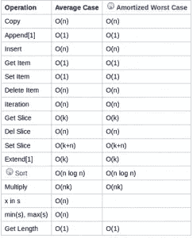

# 竞争性编程的 10 个 Python 技巧

> 原文：<https://betterprogramming.pub/10-python-tips-for-competitive-programming-bae8375dd73b>

## 带着令人惊讶的时间复杂度备忘单


照片由 [**安德里亚·皮亚卡迪奥**](https://www.pexels.com/@olly?utm_content=attributionCopyText&utm_medium=referral&utm_source=pexels) 发自 [**像素**](https://www.pexels.com/photo/woman-lying-on-bed-holding-smartphone-3807535/?utm_content=attributionCopyText&utm_medium=referral&utm_source=pexels)

Python 现在是大多数程序员的首选。主要原因是——Python 容易理解，学习曲线小。我们可以在一周内熟练掌握 Python 编程技能。

虽然很容易理解，但当我们参加竞争性编程时，我们会面临代码运行时间和 Python 程序运行缓慢的问题。我这里有一些技巧，可以帮助你通过使用正确的编程片段来提高 Python 代码的速度。

# 1.检查任何对象的内存使用情况

在做竞技编程的时候，内存和时间是两个主要的约束。如果您想跟踪内存使用情况，可以使用下面的代码片段。

代码片段:

```
import sys
dic = {'a': 3, 'b': 2, 'c': 1, 'd': 1}
print(sys.getsizeof(dic))
```

输出:

```
240
```

# 2.地图功能的使用

单行列表式输入通常出现在竞争性编程中。下面是一行 Python 代码，可以帮助您获得列表类型输入。

代码片段:

```
input_list=list(map(int, input("enter numbers: ").split()))enter numbers: 1 2 3 4 5 6 7 8
```

输出:

```
[1, 2, 3, 4, 5, 6, 7, 8]
```

# 3.按元组值的任何索引对元组列表进行排序

假设您有一个包含一组元组的列表，并且您希望基于元组的任何索引元素对列表进行排序。在下面的例子中，我们根据每个元组的第三个元素对元组列表进行排序。

代码片段:

```
val = [('first', 3, 9), ('second', 4, 6), ('third', 2, 3)]
val.sort(key = lambda x: x[2], reverse=False)
print(val)
```

输出:

```
[('third', 2, 3), ('second', 4, 6), ('first', 3, 9)]
```

# 4.Python 字典理解的明智使用

我们甚至可以将列表理解的输出转换成 Python 字典。使用下面的 Python 代码行可以帮助您获得相同的结果:

代码片段:

```
dic = [(str(i)+" element", i*2) for i in range(5)]
print(dict(dic))
```

输出:

```
{'0 element': 0, '1 element': 2, '2 element': 4, '3 element': 6, '4 element': 8}
```

# 5.滤镜功能的妙用

filter 函数可以根据 lambda 函数下定义的任何条件帮助您消除列表中不需要的元素。

代码片段:

```
print(list(filter(lambda x: x%2, range(15))))
```

输出:

```
[1, 3, 5, 7, 9, 11, 13]
```

# 6.获取您的置换字符串

我们可以利用 Python 中的`itertools`库来获得字符串排列。

代码片段:

```
import itertools
list(itertools.permutations('HAPPY', 2))
```

输出:

```
[('H', 'A'),
 ('H', 'P'),
 ('H', 'P'),
 ('H', 'Y'),
 ('A', 'H'),
 ('A', 'P'),
 ('A', 'P'),
 ('A', 'Y'),
 ('P', 'H'),
 ('P', 'A'),
 ('P', 'P'),
 ('P', 'Y'),
 ('P', 'H'),
 ('P', 'A'),
 ('P', 'P'),
 ('P', 'Y'),
 ('Y', 'H'),
 ('Y', 'A'),
 ('Y', 'P'),
 ('Y', 'P')]
```

# 7.将你的列表转换成一个字符串

Python 中的`join()`函数可以帮助我们使用任何分隔符连接列表中的元素。我们可以在" "中定义分隔符。

代码片段:

```
a = ["This", "is", "a", "list" ,"elements."]print(" ".join(a))
```

输出:

```
This is a list elements.
```

# 8.检查字谜

这是一种简单而有效的检查字谜的方法。

代码片段:

```
def is_anagram(str1, str2):
    return sorted(str1) == sorted(str2)print(is_anagram('HAPPY', 'NoSAD'))
```

输出:

```
False
```

# 9.比较运算符的完美使用

您可以不使用 if-else 条件，而是利用它来提高代码质量。

代码片段:

```
n = 16
result = 15 < n < 20print(result)
```

输出:

```
True
```

# 10.检查时间复杂度

在编写代码之前，最好考虑一下将要执行的任何操作的时间复杂性。这里有一张来自 [Python wiki](https://wiki.python.org/moin/TimeComplexity) 的备忘单，演示了不同 Python 快捷方式的时间复杂度。



[Python 维基](https://wiki.python.org/moin/TimeComplexity)

# 结论

本文到此为止。我们已经讨论了十个精选的 Python 代码片段，它们可以为竞争性编程改进代码运行时。

敬请关注更多精彩文章。

谢谢你的阅读！