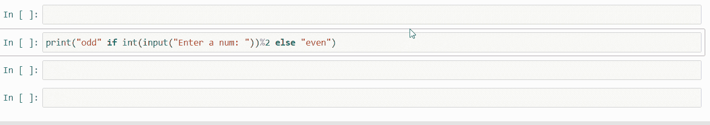
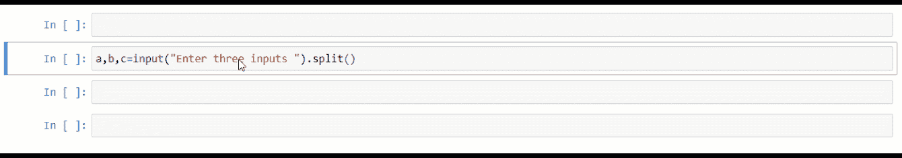
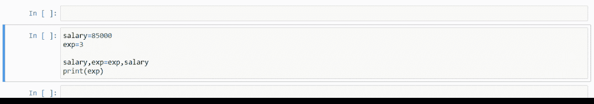
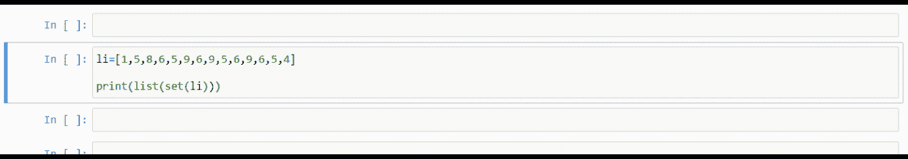
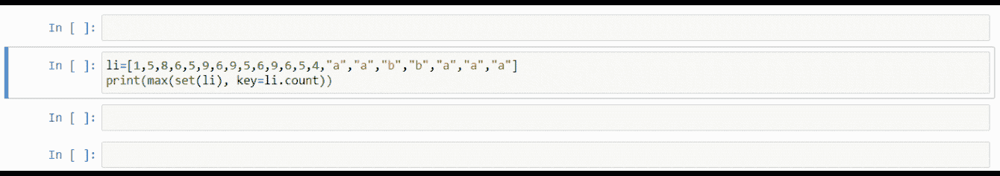
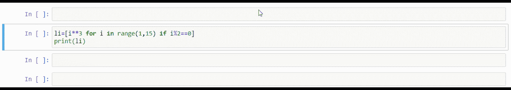
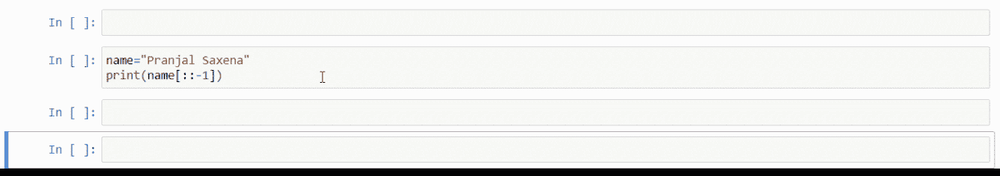

# 让你惊叹的 10 个 Python 技巧

> 原文：<https://betterprogramming.pub/10-python-tricks-that-will-wow-you-de450921d96a>

## 增强 Python 编程技能的便利特性


照片由 [**vjapratama**](https://www.pexels.com/@vijarindo?utm_content=attributionCopyText&utm_medium=referral&utm_source=pexels) 来自 [**像素**](https://www.pexels.com/photo/man-holding-baby-s-breath-flower-in-front-of-woman-standing-near-marble-wall-935789/?utm_content=attributionCopyText&utm_medium=referral&utm_source=pexels)

# 1.打印函数内部的条件

您是否想过可以在`print`函数中编写完整的条件，并根据条件打印输出？以下是实现这一目标的方法:

```
print("odd" if int(input("Enter a num: "))%2 else "even")
```

输出:



由作者记录。

# 2.条件列表—全部

当你不得不动态地添加条件时，这一招非常管用。当条件数量增加，您必须手动编写时，这个技巧甚至可以成为消除压力的方法。

`all`方法可用于匹配所有条件或代替`and`条件。

输出:


# 3.条件列表—任何

我们可以和 Python 中的`any`方法使用同一个条件列表，检查是否有人的条件满足。

输出:


# 4.一次多输入

编写`input()`方法的常见方式需要太多时间来接受输入。以下是完成相同任务的另一种方法:

```
a,b,c=input("Enter three inputs ").split()
```

输出:



# 5.像专业人士一样交换

交换变量的一种方法是使用临时变量。在 Python 中更好的方法如下:

```
salary=85000
exp=3salary,exp=exp,salary
print(exp)
```

输出:



# 6.取出重复的数据

这个技巧在竞争性编程中或者在用 Python 处理数据库数据时非常方便。我们可以结合使用 Python 中的`list`和`set`方法来删除重复数据:

```
li=[1,5,8,6,5,9,6,9,5,6,9,6,5,4]
print(list(set(li)))
```

输出:



> *想* ***敬请关注*** *同更多类似* ***精彩*** *文章上* ***Python &数据科学*** *—做考虑成为中等会员使用我的推荐链接:*[*https://pranjalai.medium.com/membership*](https://pranjalai.medium.com/membership)*。*

# 7.重复次数最多的对象

如果您想检查列表中哪个对象重复的次数最多，我们可以使用下面的代码行。这种方法使用带有`key`属性的`max`函数来查找重复次数最多的元素:

```
li=[1,5,8,6,5,9,6,9,5,6,9,6,5,4,"a","a","b","b","a","a","a"]
print(max(set(li), key=li.count))
```

输出:



# 8.列表理解的魔力

该方法保存大多数代码行，并将它们放在一行中。使用这种方法，我们可以遍历一个列表，同时使用一行代码并行检查任何条件。

```
li=[i**3 for i in range(1,15) if i%2==0]
print(li)
```

输出:



# 9.无限输入参数

当我们不知道输入参数的函数长度时，这个技巧很方便。我们可以在变量名中使用`*`符号，变量名将输入作为一个列表:

输出:


# 10.像专业人士一样倒车

这是一个简单而方便的反转任何字符串的技巧:

```
name="Pranjal Saxena"
print(name[::-1])
```

输出:



# 结论

本文到此为止。我们已经讨论了十个 Python 技巧，它们可以让你“哇！”

如果您利用这些技巧，您可以使您的 Python 代码更加优化和高效。这些技巧在某些时候对竞争性编程也很有帮助。

希望你喜欢这篇文章。更多精彩文章敬请期待。

感谢阅读！

> 在你走之前…

如果你喜欢这篇文章，并且想要**继续关注**更多关于 **Python &数据科学**的**精彩文章**——请点击这里[https://pranjalai.medium.com/membership](https://pranjalai.medium.com/membership)考虑成为一名中级会员。

请考虑使用[我的推荐链接](https://pranjalai.medium.com/membership)注册。通过这种方式，会员费的一部分归我，这激励我写更多关于 Python 和数据科学的令人兴奋的东西。

还有，可以随时订阅我的免费简讯: [**Pranjal 的简讯**](https://pranjalai.medium.com/subscribe) 。