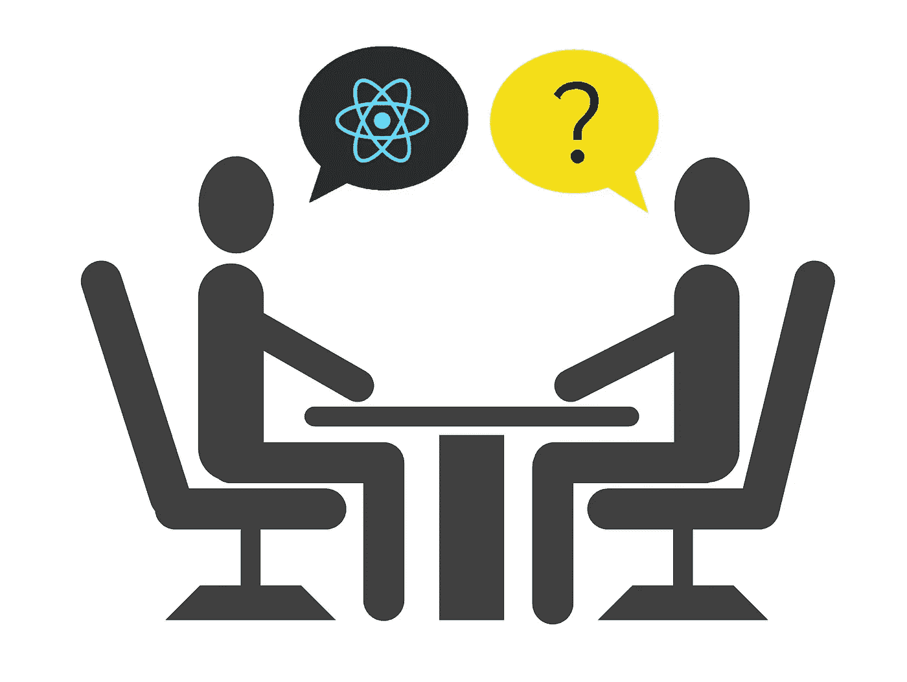
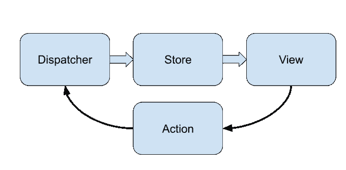

# 2020 年的 10 个 React 面试问题

> 原文：<https://betterprogramming.pub/10-react-interview-questions-for-2020-544f0ce5386b>

## 搞定你的下一次面试



React 是目前使用最多的 UI 库。它为脸书和无数其他公司提供动力。在这篇文章中，我将列出 10 个常见的 React 面试问题，以帮助你确定下一次面试。

# 基于类的组件和功能组件有什么区别？

最明显的区别是语法和定义。函数组件是返回另一个组件的函数。基于类的组件是其渲染函数返回另一个组件的类。但是你应该在什么时候使用哪一个呢？

在 React 16.8 之前，在钩子被引入之前，只有基于类的组件可以保存内部状态和生命周期方法，功能组件只能依赖 props(因此，它们是无状态的)。所以，这很简单:对有状态组件使用类，对无状态组件使用函数。

但是现在，像`useState`和`useEffect`这样的 React 钩子允许在功能组件中拥有状态和生命周期方法。此外，React 团队鼓励每个人远离基于类的组件，因为性能问题和 JavaScript 中糟糕的类实现[。然而，功能组件中仍然缺少一些特性。其中之一是错误边界，所以你不得不使用基于类的组件。](https://medium.com/javascript-in-plain-english/please-stop-using-classes-in-javascript-and-become-a-better-developer-a185c9fbede1)

以下是两种方法的示例。这是同一个组件，在基于类的组件和函数中实现了一个计数器按钮:

# 什么是 JSX？是如何转化成 JS 的？

JSX 代表 JavaScript XML。这是 React 团队想出来的让 React 代码编写更简单的东西。本质上，JSX 是一种定义我们都喜欢的组件的语言。例如，这是 JSX 电码:

```
<SomeComponent someProp={someValue} />
```

当然，这些代码不能被浏览器或节点(或 Deno)理解。为了使它可以运行，使用了像巴贝尔这样的运输工具。在引擎盖下，代码被转换成这样:

```
React.createElement(SomeComponent, {someProp: someValue});
```

这就是为什么你必须把`React`导入到 JSX 使用的每个文件中。代码将被编译成直接调用这个库的东西，即使你看不到它。你可以在这里玩 Babel——试着粘贴你的一些代码，并了解它在运行时的实际样子。

# 什么是道具，如何获取？

Props 是将数据从一个组件传递给其子组件的一种方式。您还可以向下传递回调以反转方向并从子节点获取数据。此外，如果您更改子组件的属性，子组件将重新呈现。你像这样把道具传递给组件:

```
<MyComponent myProp={myValue} />
```

然后，您可以在功能组件中访问此属性:

```
function MyComponent(props) { 
  return <h1>{props.myProp}</h1>;
}
```

在类组件中:

```
class MyComponent extends Component { 
  render() { 
    <h1>{this.props.myProp}</h1>; 
  } 
}
```

# 什么是状态，你如何使用它？

状态是您需要在重新呈现器之间保持的一段数据。它可以是任何东西，从文本框中的值到计时器的时间戳。每次状态改变时，组件都会重新呈现，这就对如何更新组件产生了一定的限制。下面是如何使用`useState`钩子访问功能组件中的状态:

```
const Field = () => { 
  const [text, setText] = useState(''); 
  return <TextField value={text} onChange={setText} />; 
};
```

`useState`接受一个参数——初始状态。它返回两个值—状态值和一个改变它的函数。现在，让我们看看状态是如何在基于类的组件中实现的:

```
class Field extends Component { 
  constructor(props) { 
    super(props); 
    this.state = {text: ''}; 
  }   render() { 
    return ( 
      <TextField 
        value={this.state.text} 
        onChange={(newText) => this.setState({text: newText})} />); 
  } 
}
```

班级里的情况略有不同。首先，在构造函数中定义状态，稍后可以使用`this.state`访问它。注意，与函数不同，类只能有一个状态对象(可以有多个属性)。`setState`函数接受一个全新的状态对象，替换它并重新呈现组件。

# 什么是全球状态，我们为什么需要它？

虽然组件有状态，但这些状态对它们来说是局部的。您不能从另一个组件直接访问一个组件的状态。有时您有一些数据需要显示在许多不同的地方，比如用户名、主题(暗/亮模式)、地区等等。

一种方法是在树中的某个位置定义这种状态，并将其作为道具传递下去。然而，当您拥有超过 20 个以上的组件时，这是不可能的——您的代码将变得一团乱麻。这时你需要存储全局状态。

# 有哪些管理全局状态的方法？

React 应用程序中管理全局状态的两种主要方法是使用 Redux 和 React 上下文。

Redux 是第三方库，不是 React 的一部分。它允许您定义一个全局状态对象，并使用选择器在组件中查询它。另一方面，组件发送动作来修改状态。Redux 对其进行修改，并重新呈现所有关注这一特定变化的组件。

与 Redux 不同，React 上下文是 React 的一部分。上下文还为您提供了一种处理全局状态的方式。与 Redux 不同，您可以拥有多个上下文，并独立地访问它们。然而，当处理大量动作时，上下文可能会有性能问题。从好的方面来看，上下文的开销要小得多。您需要根据您的项目需求和范围来决定使用哪一个。

# 哑组件和智能组件有什么区别？

哑组件和智能组件是 React 中的一种设计模式。本质上，它可以归结为:智能组件处理业务逻辑，而非智能组件直接呈现 UI。因此，智能组件是有状态的，而非智能组件是无状态的，仅仅依赖于 props。

# 受控组件和非受控组件有什么区别？

当我们谈到受控和非受控组件时，我们通常指的是以某种方式处理用户输入的组件。但是“不受控制”不是一个很好的词。每一个部件都是由谁控制的，问题是*由谁控制？*例如，这是我们使用受控组件的方式:

```
const App = () => { 
  const [text, setText] = useState(''); 
  return ( <Input value={text} onChange={setText} /> ); 
}
```

在这种情况下，我们作为开发人员，控制着`Input`组件。当用户输入内容时，会触发`onChange`回调(甚至在用户看到文本之前)。状态被更新，组件用新值重新呈现。这是一个不受控制的组件的例子:

```
const App = () => { 
  return ( <input type='text' /> ); 
}
```

这是一个 HTML 输入组件。用户可以输入文本，它会显示出来。然而，我们不能控制它的价值。谁知道。浏览器引擎。注意，我们很少在 React 中使用不受控制的组件，因为现在很难获得输入的值。

# Flux 架构的基础是什么？



Flux 是一种用于开发大型 React 应用程序的设计模式。这是反应式编程模式的延续，在使用 UI 时特别有用。

Flux 由一个存储组成，它保存应用程序的全局状态。视图是一个获取状态并生成 UI 的函数。理想情况下，视图必须是纯粹的和一致的，即相同的状态会产生相同的 UI，而 UI 不会直接改变状态。相反，它将动作(事件)发送给调度程序。调度程序将接收操作，对状态进行必要的更改，并通知视图它们现在必须重新呈现。最流行的实现 Flux 的库是 Redux 和 RxJS。

# React 中渲染数组时，键的意义是什么？

这与 React 协调算法密切相关。本质上，如果列表中两个重新呈现器之间的组件具有相同的键，React 会将它们视为相同的组件，而不会更新。此外，如果没有键，React 将无法优化，并且您将遭受许多不必要的重新呈现。因此，永远不要使用索引作为键，因为索引可能会改变，如果项目被重新安排，打破一切。此外，不要使用运行时生成的随机字符串作为键，因为你会有许多不必要的重新呈现。我知道有时候你的数据没有唯一的标识符，但是你应该去添加它。

# 结束语

感谢阅读，希望你面试成功！

请继续订阅更多关于 JS、React 以及其他相关内容的文章。

# 资源

*   【2020 年 10 个 JavaScript 面试问题
*   【React 协调算法如何工作